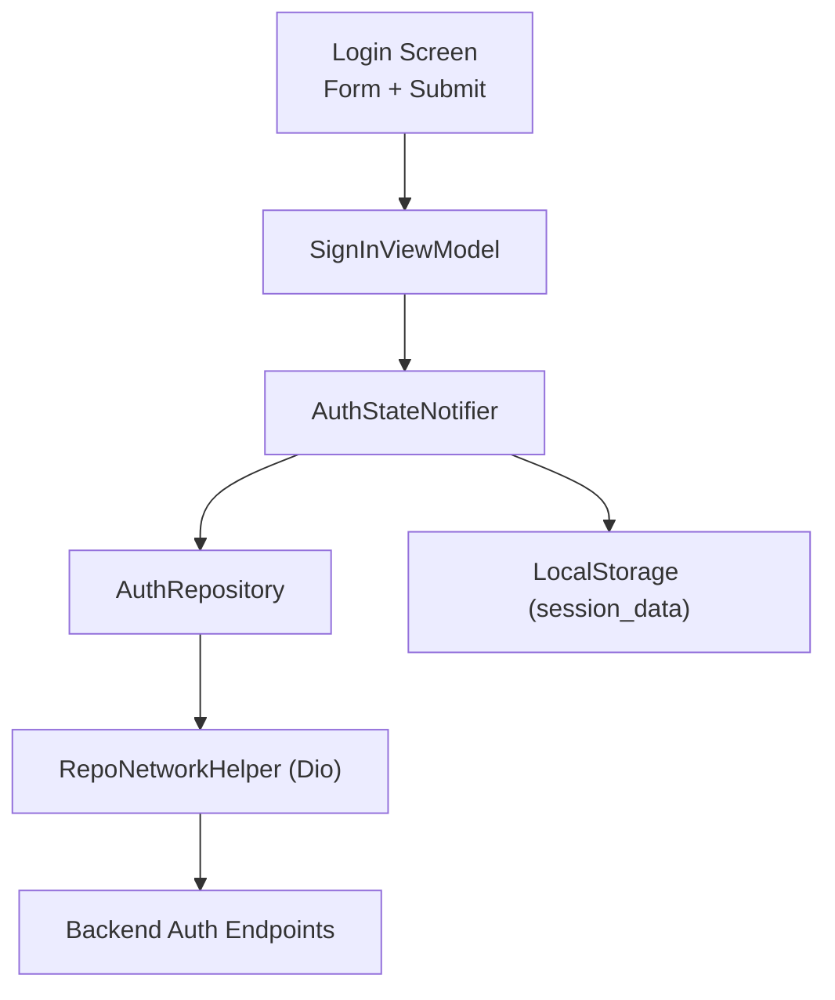
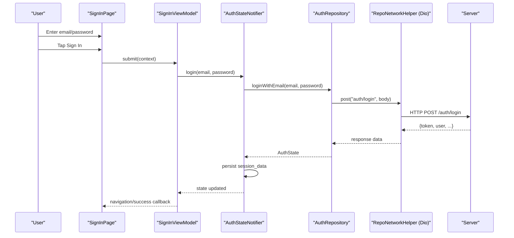
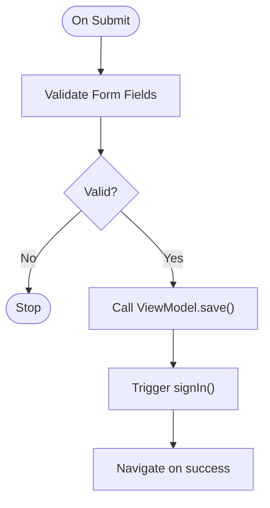
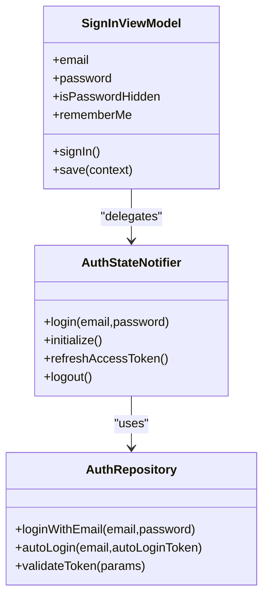
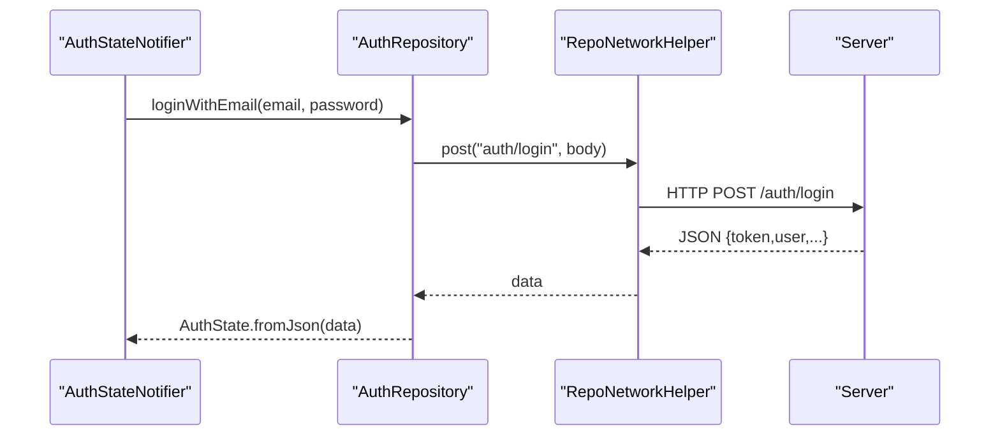
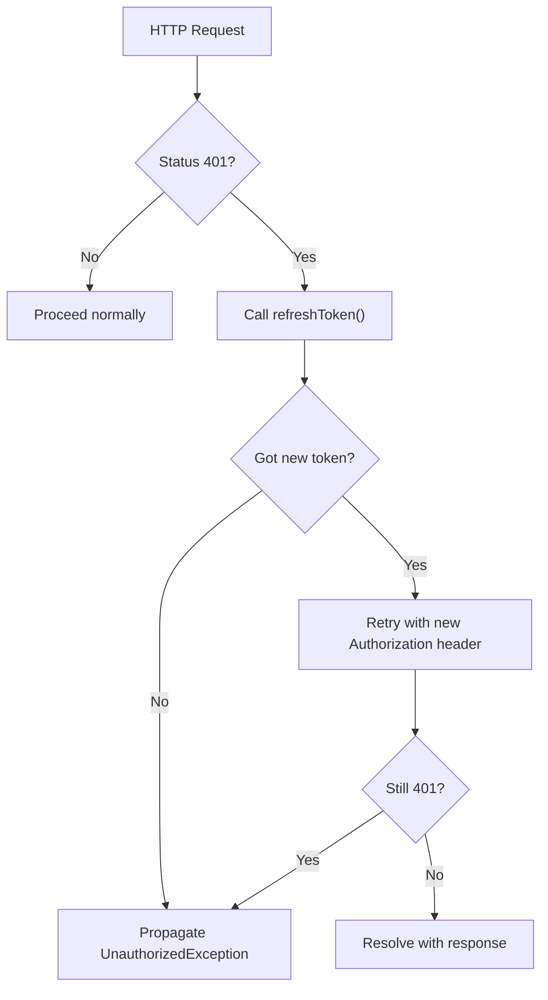
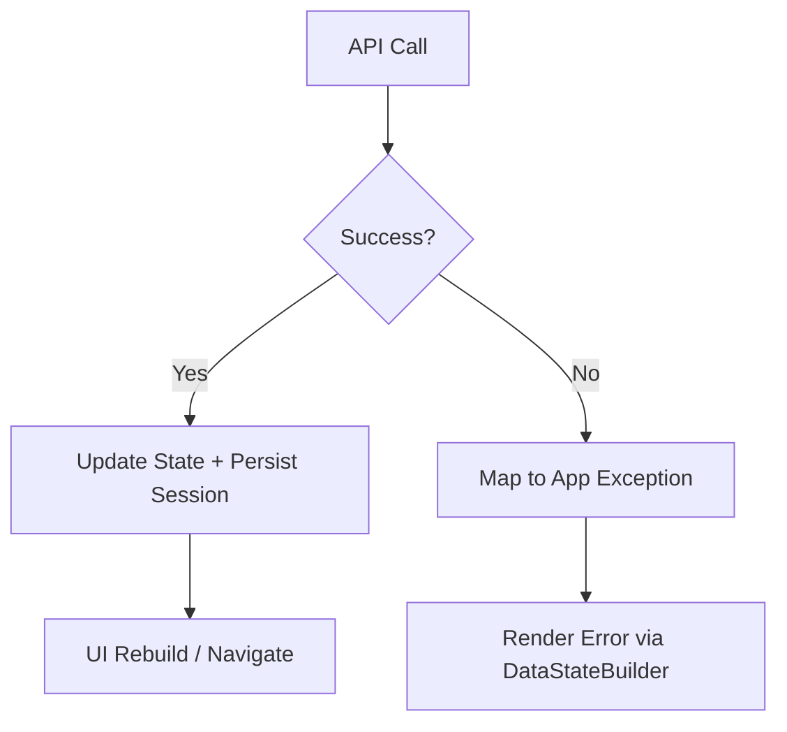
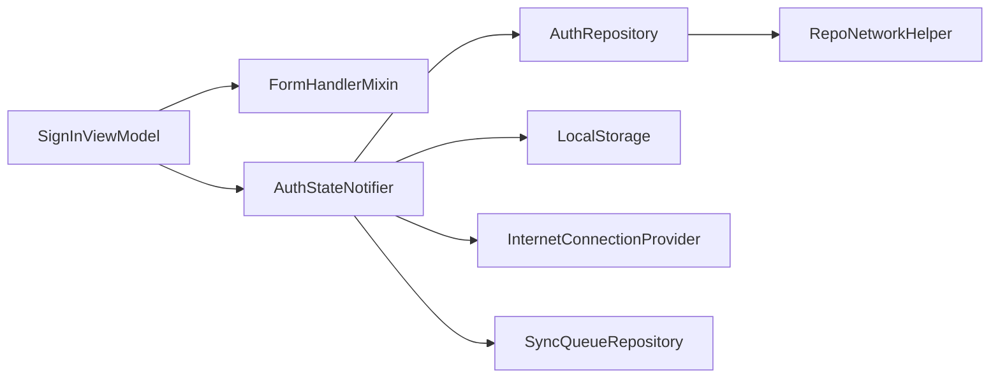

# User Authentication Flow

<cite>
**Referenced Files in This Document**
- [signin_page.dart](file://lib/app/features/authentication/view/signin_page.dart)
- [signin_viewmodel.dart](file://lib/app/features/authentication/viewmodel/signin_viewmodel.dart)
- [auth_state_provider.dart](file://lib/app/features/authentication/app_state/auth_state_provider.dart)
- [auth_repository.dart](file://lib/app/features/authentication/repository/auth_repository.dart)
- [repo_network_helper.dart](file://lib/app/core/logic/repository/repo_network_helper.dart)
- [data_state.dart](file://lib/app/core/logic/data_state/data_state.dart)
- [data_state_builder.dart](file://lib/app/core/views/elements/data_state_builder.dart)
- [form_element_mixin.dart](file://lib/app/core/logic/form/form_element_mixin.dart)
- [error.dart](file://lib/app/core/logic/repository/error.dart)
- [app_exception.dart](file://lib/app/core/logic/repository/app_exception.dart)
</cite>

## Table of Contents
1. [Introduction](#introduction)
2. [Project Structure](#project-structure)
3. [Core Components](#core-components)
4. [Architecture Overview](#architecture-overview)
5. [Detailed Component Analysis](#detailed-component-analysis)
6. [Dependency Analysis](#dependency-analysis)
7. [Performance Considerations](#performance-considerations)
8. [Troubleshooting Guide](#troubleshooting-guide)
9. [Conclusion](#conclusion)

## Introduction
This document explains the end-to-end User Authentication Flow for login, from UI input validation to backend verification and state management. It covers:
- Login form handling and validation
- View model responsibilities (loading, errors, success callbacks)
- Repository layer for API calls and token handling
- Network interceptor behavior for authentication headers and 401 refresh
- Error states and user-facing messages

## Project Structure
The authentication flow spans several layers:
- UI Layer: Login screen with email/password fields and a submit button
- View Model: Encapsulates form logic, delegates authentication to state provider
- State Provider: Manages authenticated session, persistence, and token refresh
- Repository: Performs network requests and maps responses to domain models
- Network Helper: Provides HTTP client, headers, offline handling, and 401 retry via interceptors
- Data State: Centralized loading/error/data states used by UI builders

**Diagram sources**
- [signin_page.dart:34-109](file://lib/app/features/authentication/view/signin_page.dart#L34-L109)
- [signin_viewmodel.dart:11-52](file://lib/app/features/authentication/viewmodel/signin_viewmodel.dart#L11-L52)
- [auth_state_provider.dart:15-69](file://lib/app/features/authentication/app_state/auth_state_provider.dart#L15-L69)
- [auth_repository.dart:7-27](file://lib/app/features/authentication/repository/auth_repository.dart#L7-L27)
- [repo_network_helper.dart:72-126](file://lib/app/core/logic/repository/repo_network_helper.dart#L72-L126)

**Section sources**
- [signin_page.dart:34-109](file://lib/app/features/authentication/view/signin_page.dart#L34-L109)
- [signin_viewmodel.dart:11-52](file://lib/app/features/authentication/viewmodel/signin_viewmodel.dart#L11-L52)
- [auth_state_provider.dart:15-69](file://lib/app/features/authentication/app_state/auth_state_provider.dart#L15-L69)
- [auth_repository.dart:7-27](file://lib/app/features/authentication/repository/auth_repository.dart#L7-L27)
- [repo_network_helper.dart:72-126](file://lib/app/core/logic/repository/repo_network_helper.dart#L72-L126)

## Core Components
- SignInViewModel: Owns email/password controllers, password visibility toggle, and triggers sign-in through AuthStateNotifier. Integrates with FormHandlerMixin for validation and loading control.
- AuthStateNotifier: Handles login, persists session, validates tokens on startup, and refreshes access tokens using auto-login when needed.
- AuthRepository: Calls auth endpoints (login, auto-login, validate token) and maps responses to AuthState.
- RepoNetworkHelper: Configures Dio with base URL, headers (Authorization Bearer), timeouts, offline mode, caching hooks, and an error interceptor that retries once on 401 using a provided refresh callback.
- DataState and DataStateBuilder: Provide consistent loading/error/data rendering across screens.

**Section sources**
- [signin_viewmodel.dart:11-52](file://lib/app/features/authentication/viewmodel/signin_viewmodel.dart#L11-L52)
- [auth_state_provider.dart:15-203](file://lib/app/features/authentication/app_state/auth_state_provider.dart#L15-L203)
- [auth_repository.dart:7-65](file://lib/app/features/authentication/repository/auth_repository.dart#L7-L65)
- [repo_network_helper.dart:31-126](file://lib/app/core/logic/repository/repo_network_helper.dart#L31-L126)
- [data_state.dart:1-22](file://lib/app/core/logic/data_state/data_state.dart#L1-L22)
- [data_state_builder.dart:1-82](file://lib/app/core/views/elements/data_state_builder.dart#L1-L82)

## Architecture Overview
The login sequence flows from UI to repository and back, with state updates and persistence at each step.

**Diagram sources**
- [signin_page.dart:34-109](file://lib/app/features/authentication/view/signin_page.dart#L34-L109)
- [signin_viewmodel.dart:37-45](file://lib/app/features/authentication/viewmodel/signin_viewmodel.dart#L37-L45)
- [auth_state_provider.dart:42-69](file://lib/app/features/authentication/app_state/auth_state_provider.dart#L42-L69)
- [auth_repository.dart:16-27](file://lib/app/features/authentication/repository/auth_repository.dart#L16-L27)
- [repo_network_helper.dart:286-350](file://lib/app/core/logic/repository/repo_network_helper.dart#L286-L350)

## Detailed Component Analysis

### Login UI and Form Handling
- The login screen binds email and password fields to view model controllers and applies validators for email format and minimum password length.
- A “keep me logged in” checkbox toggles a boolean flag in the view model.
- On submit, the form is validated; if valid, the view model’s save method triggers sign-in and returns true to proceed with navigation.

**Diagram sources**
- [signin_page.dart:34-109](file://lib/app/features/authentication/view/signin_page.dart#L34-L109)
- [signin_viewmodel.dart:37-45](file://lib/app/features/authentication/viewmodel/signin_viewmodel.dart#L37-L45)
- [form_element_mixin.dart:18-33](file://lib/app/core/logic/form/form_element_mixin.dart#L18-L33)

**Section sources**
- [signin_page.dart:34-109](file://lib/app/features/authentication/view/signin_page.dart#L34-L109)
- [signin_viewmodel.dart:11-52](file://lib/app/features/authentication/viewmodel/signin_viewmodel.dart#L11-L52)
- [form_element_mixin.dart:5-41](file://lib/app/core/logic/form/form_element_mixin.dart#L5-L41)

### Authentication View Models and State Management
- SignInViewModel holds email/password TextEditingControllers, password visibility state, and a remember-me flag. It delegates authentication to AuthStateNotifier.login.
- AuthStateNotifier manages:
  - Login: calls repository, persists session, updates state
  - Initialization: restores session from storage and validates token online or queues validation when offline
  - Token refresh: uses auto-login token to obtain a fresh access token without re-entering credentials
  - Logout: clears session and sync queue

**Diagram sources**
- [signin_viewmodel.dart:11-52](file://lib/app/features/authentication/viewmodel/signin_viewmodel.dart#L11-L52)
- [auth_state_provider.dart:15-203](file://lib/app/features/authentication/app_state/auth_state_provider.dart#L15-L203)
- [auth_repository.dart:7-65](file://lib/app/features/authentication/repository/auth_repository.dart#L7-L65)

**Section sources**
- [signin_viewmodel.dart:11-52](file://lib/app/features/authentication/viewmodel/signin_viewmodel.dart#L11-L52)
- [auth_state_provider.dart:15-203](file://lib/app/features/authentication/app_state/auth_state_provider.dart#L15-L203)

### Repository Layer and API Calls
- AuthRepository.post calls to:
  - /auth/login for initial sign-in
  - /auth/auto-login for refreshing access tokens
  - /allcourse for validating current token during initialization
- Responses are mapped into AuthState, which includes user, role, token, profile, and groups.

**Diagram sources**
- [auth_repository.dart:16-27](file://lib/app/features/authentication/repository/auth_repository.dart#L16-L27)
- [repo_network_helper.dart:286-350](file://lib/app/core/logic/repository/repo_network_helper.dart#L286-L350)

**Section sources**
- [auth_repository.dart:7-65](file://lib/app/features/authentication/repository/auth_repository.dart#L7-L65)
- [repo_network_helper.dart:286-350](file://lib/app/core/logic/repository/repo_network_helper.dart#L286-L350)

### Network Interceptors and Authentication Headers
- RepoNetworkHelper configures Dio with:
  - Base URL and default headers including Authorization Bearer token when present
  - Timeouts for connect, receive, and send
  - Offline detection and cached request handling
- Interceptor behavior:
  - On 401 Unauthorized, attempts to call the provided refreshToken callback once per request
  - If successful, retries the original request with the new token
  - If refresh fails or second attempt also 401, propagates the error upward

**Diagram sources**
- [repo_network_helper.dart:72-126](file://lib/app/core/logic/repository/repo_network_helper.dart#L72-L126)
- [repo_network_helper.dart:286-350](file://lib/app/core/logic/repository/repo_network_helper.dart#L286-L350)

**Section sources**
- [repo_network_helper.dart:31-126](file://lib/app/core/logic/repository/repo_network_helper.dart#L31-L126)
- [repo_network_helper.dart:286-350](file://lib/app/core/logic/repository/repo_network_helper.dart#L286-L350)

### Error States and Success Callbacks
- Errors are normalized into typed exceptions (e.g., UnauthorizedException, InternetException, InvalidInputException) and surfaced to callers.
- UI components can use DataStateBuilder to render loading, idle, data, or error states consistently.
- Successful login updates AuthStateNotifier state and persists session; downstream navigation occurs after successful submission.

**Diagram sources**
- [data_state.dart:1-22](file://lib/app/core/logic/data_state/data_state.dart#L1-L22)
- [data_state_builder.dart:1-82](file://lib/app/core/views/elements/data_state_builder.dart#L1-L82)
- [error.dart:36-71](file://lib/app/core/logic/repository/error.dart#L36-L71)
- [app_exception.dart:1-54](file://lib/app/core/logic/repository/app_exception.dart#L1-L54)

**Section sources**
- [data_state.dart:1-22](file://lib/app/core/logic/data_state/data_state.dart#L1-L22)
- [data_state_builder.dart:1-82](file://lib/app/core/views/elements/data_state_builder.dart#L1-L82)
- [error.dart:36-71](file://lib/app/core/logic/repository/error.dart#L36-L71)
- [app_exception.dart:1-54](file://lib/app/core/logic/repository/app_exception.dart#L1-L54)

## Dependency Analysis
- SignInViewModel depends on:
  - FormHandlerMixin for validation/loading lifecycle
  - AuthStateNotifier for authentication orchestration
- AuthStateNotifier depends on:
  - AuthRepository for network operations
  - LocalStorage for session persistence
  - InternetConnectionProvider for connectivity checks
  - SyncQueueRepository for clearing queued actions on logout
- AuthRepository depends on RepoNetworkHelper for HTTP operations and configuration
- RepoNetworkHelper depends on Dio and optional RequestCacheProvider

**Diagram sources**
- [signin_viewmodel.dart:11-52](file://lib/app/features/authentication/viewmodel/signin_viewmodel.dart#L11-L52)
- [auth_state_provider.dart:15-203](file://lib/app/features/authentication/app_state/auth_state_provider.dart#L15-L203)
- [auth_repository.dart:7-65](file://lib/app/features/authentication/repository/auth_repository.dart#L7-L65)
- [repo_network_helper.dart:72-126](file://lib/app/core/logic/repository/repo_network_helper.dart#L72-L126)

**Section sources**
- [signin_viewmodel.dart:11-52](file://lib/app/features/authentication/viewmodel/signin_viewmodel.dart#L11-L52)
- [auth_state_provider.dart:15-203](file://lib/app/features/authentication/app_state/auth_state_provider.dart#L15-L203)
- [auth_repository.dart:7-65](file://lib/app/features/authentication/repository/auth_repository.dart#L7-L65)
- [repo_network_helper.dart:72-126](file://lib/app/core/logic/repository/repo_network_helper.dart#L72-L126)

## Performance Considerations
- Use DataStateBuilder to avoid redundant rebuilds and provide clear loading states
- Leverage offline detection to prevent unnecessary network calls
- Token refresh is attempted only once per failed request to avoid loops
- Persist session to minimize re-authentication on app restart

[No sources needed since this section provides general guidance]

## Troubleshooting Guide
Common issues and how they are handled:
- Unauthorized sessions:
  - 401 responses trigger a one-time token refresh via interceptor; if it fails, an UnauthorizedException is thrown and UI surfaces a friendly message
- Network problems:
  - Connectivity checks and offline mode return appropriate exceptions; UI shows connection-related messages
- Validation failures:
  - Form validation prevents invalid submissions; errors are shown inline via field validators

**Section sources**
- [repo_network_helper.dart:72-126](file://lib/app/core/logic/repository/repo_network_helper.dart#L72-L126)
- [data_state_builder.dart:12-47](file://lib/app/core/views/elements/data_state_builder.dart#L12-L47)
- [error.dart:36-71](file://lib/app/core/logic/repository/error.dart#L36-L71)
- [app_exception.dart:35-54](file://lib/app/core/logic/repository/app_exception.dart#L35-L54)

## Conclusion
The authentication flow integrates a clean separation of concerns:
- UI handles input and validation
- View model orchestrates actions and delegates to state
- State manages session, persistence, and token refresh
- Repository encapsulates API calls and mapping
- Network helper standardizes headers, timeouts, offline behavior, and 401 retry

This design ensures robust, maintainable, and user-friendly authentication with clear error handling and consistent state management.

[No sources needed since this section summarizes without analyzing specific files]