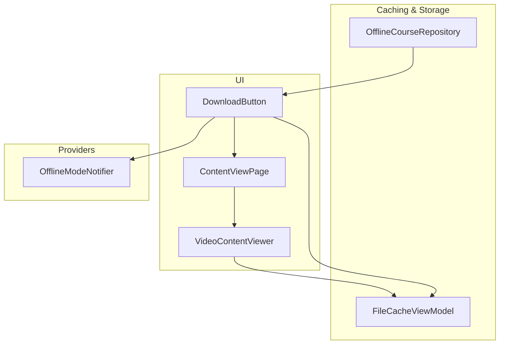
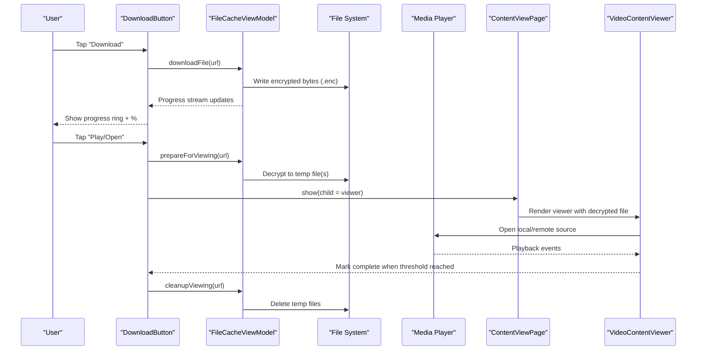
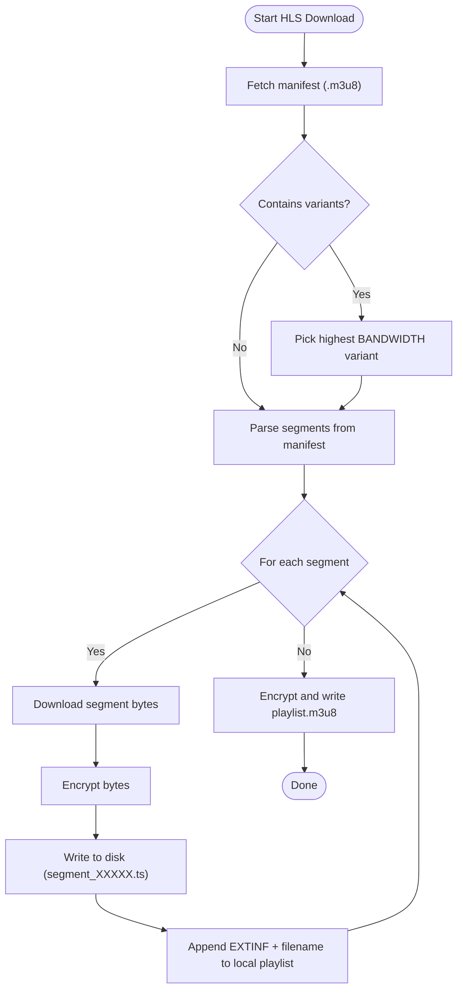
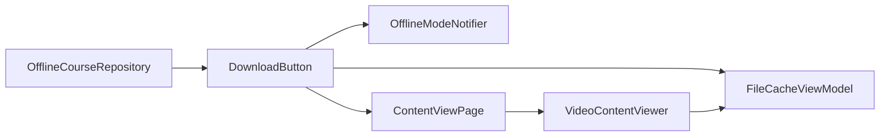

# Content Delivery

<cite>
**Referenced Files in This Document**
- [pubspec.yaml](file://pubspec.yaml)
- [file_cache_view_model.dart](file://lib/app/features/courses/viewmodel/file_cache_view_model.dart)
- [download_button.dart](file://lib/app/features/courses/view/widgets/download_button.dart)
- [content_view_page.dart](file://lib/app/features/courses/view/content_view_page.dart)
- [video_content_viewer.dart](file://lib/app/features/courses/view/content_viewer/video_content_viewer.dart)
- [offline_course_repository.dart](file://lib/app/features/courses/repository/offline_course_repository.dart)
- [offline_mode_provider.dart](file://lib/app/core/provider/offline_mode_provider.dart)
- [course_classes_page.dart](file://lib/app/features/courses/view/course_classes_page.dart)
</cite>

## Table of Contents
1. [Introduction](#introduction)
2. [Project Structure](#project-structure)
3. [Core Components](#core-components)
4. [Architecture Overview](#architecture-overview)
5. [Detailed Component Analysis](#detailed-component-analysis)
6. [Dependency Analysis](#dependency-analysis)
7. [Performance Considerations](#performance-considerations)
8. [Troubleshooting Guide](#troubleshooting-guide)
9. [Conclusion](#conclusion)

## Introduction
This document explains the Content Delivery system used by Course Management to deliver videos, PDFs, and interactive content to learners. It covers offline caching, bandwidth optimization, adaptive streaming for video, file management, download progress tracking, storage optimization, content viewers, format support, accessibility considerations, preloading/background downloads, cache management, integration with progress tracking, versioning, and security measures for protected content.

## Project Structure
The content delivery pipeline spans UI widgets, a caching/view model, repositories for offline course data, and platform-specific media playback:

- UI entry points render per-item actions (download/play) and embed content viewers.
- A central FileCacheViewModel handles downloading, encryption at rest, HLS handling, and temporary decryption for viewing.
- OfflineCourseRepository persists course metadata and class lists for offline access.
- VideoContentViewer uses media_kit to play local or remote video, including HLS manifests.
- OfflineModeNotifier allows users to force offline behavior.

**Diagram sources**
- [download_button.dart:1-388](file://lib/app/features/courses/view/widgets/download_button.dart#L1-L388)
- [content_view_page.dart:1-35](file://lib/app/features/courses/view/content_view_page.dart#L1-L35)
- [video_content_viewer.dart:1-150](file://lib/app/features/courses/view/content_viewer/video_content_viewer.dart#L1-L150)
- [file_cache_view_model.dart:1-462](file://lib/app/features/courses/viewmodel/file_cache_view_model.dart#L1-L462)
- [offline_course_repository.dart:1-209](file://lib/app/features/courses/repository/offline_course_repository.dart#L1-L209)
- [offline_mode_provider.dart:1-37](file://lib/app/core/provider/offline_mode_provider.dart#L1-L37)

**Section sources**
- [pubspec.yaml:78-94](file://pubspec.yaml#L78-L94)
- [download_button.dart:1-388](file://lib/app/features/courses/view/widgets/download_button.dart#L1-L388)
- [file_cache_view_model.dart:1-462](file://lib/app/features/courses/viewmodel/file_cache_view_model.dart#L1-L462)
- [offline_course_repository.dart:1-209](file://lib/app/features/courses/repository/offline_course_repository.dart#L1-L209)
- [offline_mode_provider.dart:1-37](file://lib/app/core/provider/offline_mode_provider.dart#L1-L37)

## Core Components
- FileCacheViewModel: Central orchestrator for downloading, encrypting at rest, HLS manifest/segment handling, temporary decryption for viewing, and cleanup.
- DownloadButton: Per-content widget that drives download, shows progress, opens content via ContentViewPage, and deletes cached files.
- ContentViewPage: Simple navigation wrapper that hosts the content viewer.
- VideoContentViewer: Uses media_kit to play local or remote video; integrates completion tracking against course/class IDs.
- OfflineCourseRepository: Persists course and class lists for offline mode and enriches virtual class recordings for offline availability.
- OfflineModeNotifier: User-controlled offline toggle persisted to storage.

Key responsibilities:
- Secure offline storage via on-disk encryption.
- Adaptive HLS selection (highest bandwidth variant).
- Progress streams for UI feedback.
- Temporary plaintext copies for viewing only.
- Cleanup of temporary files after viewing.

**Section sources**
- [file_cache_view_model.dart:10-113](file://lib/app/features/courses/viewmodel/file_cache_view_model.dart#L10-L113)
- [download_button.dart:20-153](file://lib/app/features/courses/view/widgets/download_button.dart#L20-L153)
- [content_view_page.dart:6-34](file://lib/app/features/courses/view/content_view_page.dart#L6-L34)
- [video_content_viewer.dart:11-34](file://lib/app/features/courses/view/content_viewer/video_content_viewer.dart#L11-L34)
- [offline_course_repository.dart:17-105](file://lib/app/features/courses/repository/offline_course_repository.dart#L17-L105)
- [offline_mode_provider.dart:6-36](file://lib/app/core/provider/offline_mode_provider.dart#L6-L36)

## Architecture Overview
The content delivery flow combines UI-driven actions with secure caching and playback:

**Diagram sources**
- [download_button.dart:47-153](file://lib/app/features/courses/view/widgets/download_button.dart#L47-L153)
- [file_cache_view_model.dart:52-113](file://lib/app/features/courses/viewmodel/file_cache_view_model.dart#L52-L113)
- [content_view_page.dart:17-34](file://lib/app/features/courses/view/content_view_page.dart#L17-L34)
- [video_content_viewer.dart:36-108](file://lib/app/features/courses/view/content_viewer/video_content_viewer.dart#L36-L108)

## Detailed Component Analysis

### FileCacheViewModel
Responsibilities:
- Detects HLS vs regular files and routes to appropriate handlers.
- Downloads regular files with progress callbacks and writes encrypted .enc files to application support directory.
- For HLS: fetches master playlist, selects highest bandwidth variant, parses segments, downloads each segment encrypted, and writes a local encrypted playlist.m3u8 referencing relative filenames.
- On open: decrypts to a throwaway temp location under OS temp directory, preserving extension based on magic header sniffing for reliable demuxer selection.
- Cleans up temporary viewing files and directories on exit or app startup.

Data structures and complexity:
- In-memory state map tracks per-url progress and file references; operations are O(1) lookups.
- HLS parsing is linear over manifest lines; segment download is sequential with per-segment I/O.

Optimization opportunities:
- Parallelize segment downloads with concurrency limits to reduce total download time while respecting device resources.
- Implement resume-aware downloads for large assets.
- Add integrity checks (e.g., checksums) for downloaded segments.

Error handling:
- Ensures progress streams are closed on success/failure.
- Removes partial downloads on error.
- Validates HLS manifest structure before use.

Security:
- All offline content is XOR-encrypted at rest using a fixed key; not cryptographic-grade but prevents casual extraction by other apps.
- Temporary plaintext files are isolated and cleaned up promptly.

**Section sources**
- [file_cache_view_model.dart:23-113](file://lib/app/features/courses/viewmodel/file_cache_view_model.dart#L23-L113)
- [file_cache_view_model.dart:185-264](file://lib/app/features/courses/viewmodel/file_cache_view_model.dart#L185-L264)
- [file_cache_view_model.dart:273-356](file://lib/app/features/courses/viewmodel/file_cache_view_model.dart#L273-L356)
- [file_cache_view_model.dart:360-420](file://lib/app/features/courses/viewmodel/file_cache_view_model.dart#L360-L420)
- [file_cache_view_model.dart:429-451](file://lib/app/features/courses/viewmodel/file_cache_view_model.dart#L429-L451)

#### HLS Download Flow

**Diagram sources**
- [file_cache_view_model.dart:273-356](file://lib/app/features/courses/viewmodel/file_cache_view_model.dart#L273-L356)
- [file_cache_view_model.dart:370-405](file://lib/app/features/courses/viewmodel/file_cache_view_model.dart#L370-L405)

### DownloadButton
Responsibilities:
- Observes connectivity and offline mode to decide available actions.
- Triggers download or saves raw content directly into the same encrypted cache store.
- Shows progress via a stream and notifies user on completion.
- Opens content through ContentViewPage with a decrypted file reference and cleans up afterward.

State transitions:
- Online + not downloaded → Download button.
- Downloading → Progress ring with percentage.
- Downloaded → Play/Open + Delete.
- Offline + not downloaded → Disabled pill indicating unavailability.

Integration points:
- Uses FileCacheViewModel for all caching operations.
- Uses OfflineModeNotifier and connection provider to adapt UI.

**Section sources**
- [download_button.dart:20-153](file://lib/app/features/courses/view/widgets/download_button.dart#L20-L153)
- [download_button.dart:158-200](file://lib/app/features/courses/view/widgets/download_button.dart#L158-L200)
- [download_button.dart:206-255](file://lib/app/features/courses/view/widgets/download_button.dart#L206-L255)
- [download_button.dart:260-355](file://lib/app/features/courses/view/widgets/download_button.dart#L260-L355)
- [download_button.dart:360-385](file://lib/app/features/courses/view/widgets/download_button.dart#L360-L385)

### ContentViewPage
A lightweight page that wraps any content view with a consistent shell and supports pushing a new route with optional context (courseClass) for progress tracking.

**Section sources**
- [content_view_page.dart:6-34](file://lib/app/features/courses/view/content_view_page.dart#L6-L34)

### VideoContentViewer
Responsibilities:
- Plays local or remote video via media_kit/libmpv, supporting multiple formats and HLS.
- Tracks playback position and marks a class complete once a threshold (30%) is reached.
- Handles audio device errors gracefully by retrying muted playback on platforms where audio initialization fails.

Accessibility considerations:
- Provides error messaging for playback issues.
- Supports muted fallback to ensure content remains viewable even if audio cannot be initialized.

Completion integration:
- When courseId and classId are provided, it calls the roaster view model to mark the class as read/completed upon reaching the threshold.

**Section sources**
- [video_content_viewer.dart:11-34](file://lib/app/features/courses/view/content_viewer/video_content_viewer.dart#L11-L34)
- [video_content_viewer.dart:36-108](file://lib/app/features/courses/view/content_viewer/video_content_viewer.dart#L36-L108)
- [video_content_viewer.dart:110-132](file://lib/app/features/courses/view/content_viewer/video_content_viewer.dart#L110-L132)

### OfflineCourseRepository
Responsibilities:
- Persists course JSON and class lists for offline access.
- Enriches virtual class entries with recording URLs so they can be queued for offline download.
- Provides utilities to list, sort, and remove offline courses and their metadata.

Versioning and completeness:
- Stores timestamps for recently-offlined courses to prioritize them in UI.
- Does not delete individual cached files when removing a course; delegates to FileCacheViewModel for asset cleanup.

**Section sources**
- [offline_course_repository.dart:17-105](file://lib/app/features/courses/repository/offline_course_repository.dart#L17-L105)
- [offline_course_repository.dart:107-178](file://lib/app/features/courses/repository/offline_course_repository.dart#L107-L178)
- [offline_course_repository.dart:180-209](file://lib/app/features/courses/repository/offline_course_repository.dart#L180-L209)

### OfflineModeNotifier
Responsibilities:
- Manages a user-controlled offline mode toggle persisted to storage.
- Forces the app to behave as if there is no internet, affecting UI states and network-dependent actions.

**Section sources**
- [offline_mode_provider.dart:6-36](file://lib/app/core/provider/offline_mode_provider.dart#L6-L36)

## Dependency Analysis
High-level dependencies among components:

**Diagram sources**
- [download_button.dart:1-388](file://lib/app/features/courses/view/widgets/download_button.dart#L1-L388)
- [file_cache_view_model.dart:1-462](file://lib/app/features/courses/viewmodel/file_cache_view_model.dart#L1-L462)
- [content_view_page.dart:1-35](file://lib/app/features/courses/view/content_view_page.dart#L1-L35)
- [video_content_viewer.dart:1-150](file://lib/app/features/courses/view/content_viewer/video_content_viewer.dart#L1-L150)
- [offline_course_repository.dart:1-209](file://lib/app/features/courses/repository/offline_course_repository.dart#L1-L209)
- [offline_mode_provider.dart:1-37](file://lib/app/core/provider/offline_mode_provider.dart#L1-L37)

**Section sources**
- [pubspec.yaml:78-94](file://pubspec.yaml#L78-L94)
- [download_button.dart:1-388](file://lib/app/features/courses/view/widgets/download_button.dart#L1-L388)
- [file_cache_view_model.dart:1-462](file://lib/app/features/courses/viewmodel/file_cache_view_model.dart#L1-L462)
- [offline_course_repository.dart:1-209](file://lib/app/features/courses/repository/offline_course_repository.dart#L1-L209)

## Performance Considerations
- Bandwidth optimization:
  - HLS master playlist parsing selects the highest bandwidth variant for offline saving, ensuring best quality within constraints.
  - Sequential segment downloads keep memory usage predictable; consider adding bounded concurrency for faster downloads.
- Storage optimization:
  - Encrypted .enc files prevent accidental reuse by external apps and avoid redundant decoding steps.
  - Temporary viewing files are placed in OS temp directories and cleaned up after viewing to minimize footprint.
- Playback efficiency:
  - media_kit/libmpv provides unified decoding across platforms, reducing platform-specific overhead.
  - Muted fallback avoids blocking playback due to audio device initialization failures.

[No sources needed since this section provides general guidance]

## Troubleshooting Guide
Common issues and resolutions:
- Unable to open content:
  - Ensure the item was successfully downloaded; re-download if necessary.
  - Verify temporary viewing files were created and not left behind from previous sessions.
- HLS playback fails:
  - Check that the manifest starts with expected headers; stale or corrupted local copies are automatically invalidated and removed.
- Audio device errors on certain platforms:
  - The player retries with muted audio to maintain playback continuity.
- Offline mode confusion:
  - Toggle OfflineModeNotifier to simulate offline conditions; verify UI reflects correct states.

**Section sources**
- [download_button.dart:47-71](file://lib/app/features/courses/view/widgets/download_button.dart#L47-L71)
- [file_cache_view_model.dart:150-183](file://lib/app/features/courses/viewmodel/file_cache_view_model.dart#L150-L183)
- [video_content_viewer.dart:110-132](file://lib/app/features/courses/view/content_viewer/video_content_viewer.dart#L110-L132)
- [offline_mode_provider.dart:23-36](file://lib/app/core/provider/offline_mode_provider.dart#L23-L36)

## Conclusion
The Content Delivery system provides a robust, secure, and user-friendly way to deliver course materials offline. It leverages encrypted caching, adaptive HLS handling, and a unified media player to support diverse content types. Progress tracking integrates with course completion logic, while careful cleanup and storage strategies ensure efficient resource usage. Security measures protect offline content from casual extraction, and graceful error handling improves reliability across platforms.

[No sources needed since this section summarizes without analyzing specific files]