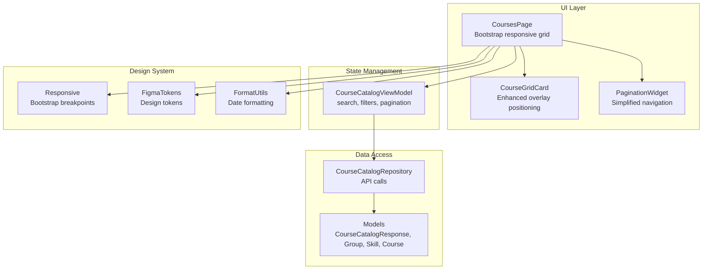
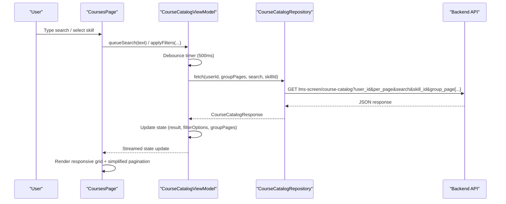
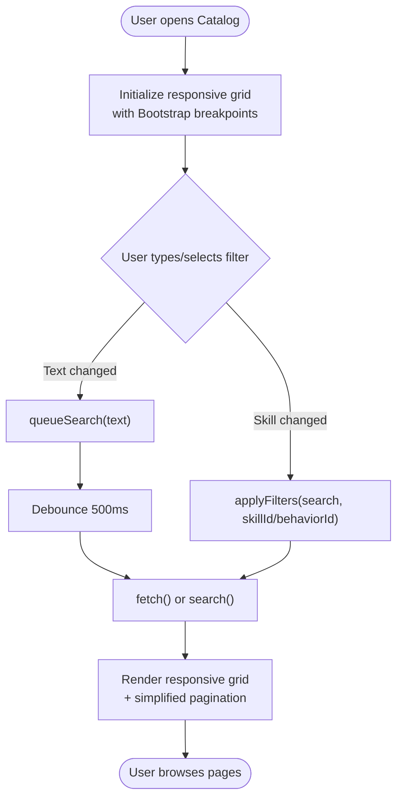
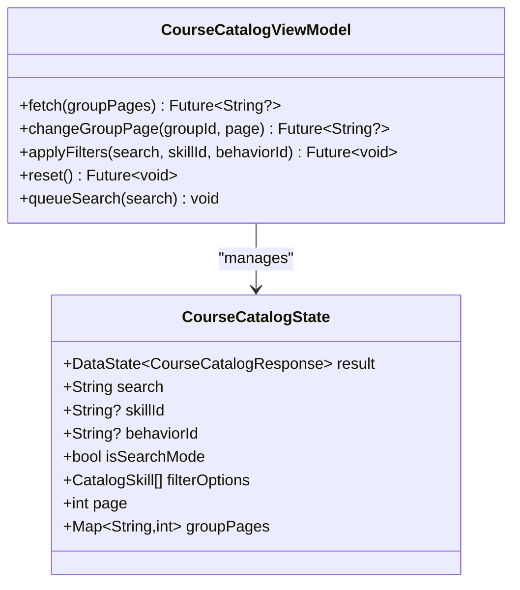
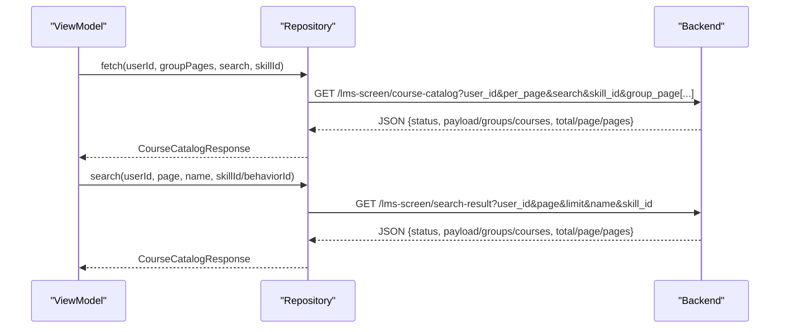
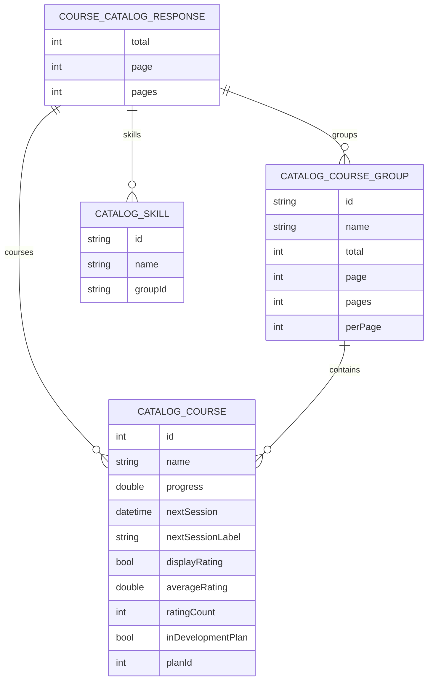
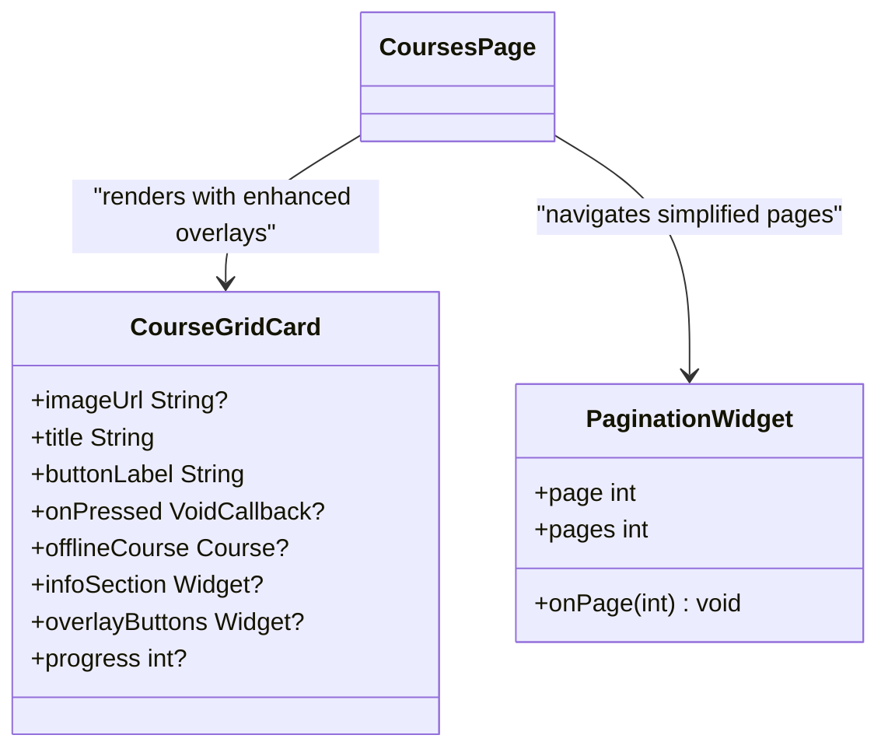
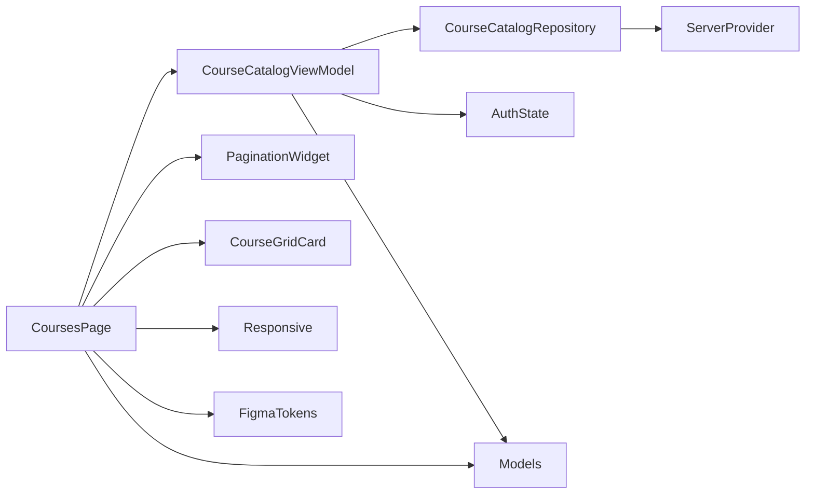

# Course Catalog & Browsing

<cite>
**Referenced Files in This Document**
- [courses_page.dart](file://lib/app/features/courses/view/courses_page.dart)
- [course_catalog_view_model.dart](file://lib/app/features/courses/viewmodel/course_catalog_view_model.dart)
- [course_catalog_repository.dart](file://lib/app/features/courses/repository/course_catalog_repository.dart)
- [course_catalog.dart](file://lib/app/features/courses/model/course_catalog.dart)
- [course_grid_card.dart](file://lib/app/features/courses/view/widgets/course_grid_card.dart)
- [pagination_widget.dart](file://lib/app/core/views/elements/pagination_widget.dart)
- [responsive.dart](file://lib/app/core/design/responsive.dart)
- [figma_tokens.dart](file://lib/app/core/design/figma_tokens.dart)
- [size_utils.dart](file://lib/app/core/utils/size_utils.dart)
- [format_utils.dart](file://lib/app/core/utils/format_utils.dart)
</cite>

## Update Summary
**Changes Made**
- Enhanced responsive grid layout with Bootstrap breakpoints (992px for 4 columns, 768px for 2 columns)
- Simplified pagination by removing per-page badge component
- Improved typography consistency with design system specifications
- Refined card overlay positioning to cover only image area
- Updated date formatting to use abbreviated month names

## Table of Contents
1. [Introduction](#introduction)
2. [Project Structure](#project-structure)
3. [Core Components](#core-components)
4. [Architecture Overview](#architecture-overview)
5. [Detailed Component Analysis](#detailed-component-analysis)
6. [Responsive Design System](#responsive-design-system)
7. [Typography and Date Formatting](#typography-and-date-formatting)
8. [Dependency Analysis](#dependency-analysis)
9. [Performance Considerations](#performance-considerations)
10. [Troubleshooting Guide](#troubleshooting-guide)
11. [Conclusion](#conclusion)

## Introduction
This document explains the Course Catalog and Browsing functionality, focusing on how users discover, search, filter, and browse available courses. It covers the UI components for listing and filtering courses, the data models for course metadata (including categories/skills, ratings, next session dates), pagination handling, and the integration with the backend API to fetch and search courses. The system now features enhanced responsive design with Bootstrap breakpoints, simplified pagination, improved typography consistency, and refined user experience patterns.

## Project Structure
The catalog feature is implemented as a Flutter app module organized by feature:
- View layer: Courses page and reusable widgets for cards and filters
- State management: ViewModel that holds state and orchestrates fetching/searching
- Data access: Repository that calls the backend endpoints and parses responses
- Models: Strongly typed representations of catalog responses, groups, skills, and courses
- Shared UI: Pagination widget and utility helpers with responsive design support



**Diagram sources**
- [courses_page.dart:38-46](file://lib/app/features/courses/view/courses_page.dart#L38-L46)
- [course_grid_card.dart:64-99](file://lib/app/features/courses/view/widgets/course_grid_card.dart#L64-L99)
- [pagination_widget.dart:22-152](file://lib/app/core/views/elements/pagination_widget.dart#L22-L152)
- [responsive.dart:43-54](file://lib/app/core/design/responsive.dart#L43-L54)

**Section sources**
- [courses_page.dart:38-46](file://lib/app/features/courses/view/courses_page.dart#L38-L46)
- [course_grid_card.dart:64-99](file://lib/app/features/courses/view/widgets/course_grid_card.dart#L64-L99)
- [pagination_widget.dart:22-152](file://lib/app/core/views/elements/pagination_widget.dart#L22-L152)
- [responsive.dart:43-54](file://lib/app/core/design/responsive.dart#L43-L54)

## Core Components
- **CoursesPage**: The main screen featuring Bootstrap-responsive grid layout with breakpoints at 992px (4 columns) and 768px (2 columns), integrated offline mode and calendar view navigation
- **CourseCatalogViewModel**: Holds catalog state (search text, selected skill/category, pagination), applies filters, debounces search input, and coordinates repository calls
- **CourseCatalogRepository**: Encapsulates network calls to the catalog and search endpoints, builds query parameters, and maps server responses into typed models
- **Models**: Represent catalog responses including grouped or flat course lists, pagination metadata, skills/categories, and course details such as progress, ratings, and next session information
- **Enhanced UI Widgets**: 
  - CourseGridCard with refined overlay positioning covering only the image area
  - Simplified PaginationWidget without per-page badge component
  - Typography consistent with design system specifications

Key responsibilities:
- **Discoverability**: Search bar with debounced input and skill/category dropdown
- **Filtering**: Apply skill/category filters and reset options
- **Responsive Browsing**: Grid layout adapting to screen sizes using Bootstrap breakpoints
- **Offline support**: Show offline courses when disconnected
- **Enhanced UX**: Improved visual consistency and user experience

**Section sources**
- [courses_page.dart:38-46](file://lib/app/features/courses/view/courses_page.dart#L38-L46)
- [course_grid_card.dart:64-99](file://lib/app/features/courses/view/widgets/course_grid_card.dart#L64-L99)
- [pagination_widget.dart:22-152](file://lib/app/core/views/elements/pagination_widget.dart#L22-L152)

## Architecture Overview
The catalog uses a layered architecture with enhanced responsive design:
- UI triggers actions (search, filter, pagination) with responsive considerations
- ViewModel manages state and debounces user input
- Repository performs HTTP requests and error handling
- Models parse and normalize diverse server payloads
- Design system provides consistent typography and responsive behavior



**Diagram sources**
- [courses_page.dart:87-121](file://lib/app/features/courses/view/courses_page.dart#L87-L121)
- [course_catalog_view_model.dart:167-189](file://lib/app/features/courses/viewmodel/course_catalog_view_model.dart#L167-L189)
- [course_catalog_repository.dart:18-46](file://lib/app/features/courses/repository/course_catalog_repository.dart#L18-L46)

## Detailed Component Analysis

### CoursesPage (Enhanced Responsive UI)
- **Bootstrap-responsive grid**: Implements breakpoints at 992px (4 columns) and 768px (2 columns) for optimal display across devices
- **Search input**: Listens to text changes and queues debounced search via the ViewModel
- **Filters**: Skill/category dropdown integrated with applyFilters; supports inline desktop layout and stacked mobile layout
- **Enhanced grid rendering**: Uses responsive column count based on viewport width with Bootstrap breakpoint alignment
- **Simplified pagination**: Per-group pagination rendered below each group block without per-page badge component
- **Offline mode**: Shows offline courses section when disconnected; disables interactive elements accordingly
- **Calendar view**: Navigation to calendar-based course browsing



**Diagram sources**
- [courses_page.dart:38-46](file://lib/app/features/courses/view/courses_page.dart#L38-L46)
- [courses_page.dart:87-121](file://lib/app/features/courses/view/courses_page.dart#L87-L121)

**Section sources**
- [courses_page.dart:38-46](file://lib/app/features/courses/view/courses_page.dart#L38-L46)
- [courses_page.dart:87-121](file://lib/app/features/courses/view/courses_page.dart#L87-L121)
- [courses_page.dart:366-443](file://lib/app/features/courses/view/courses_page.dart#L366-L443)

### CourseCatalogViewModel (State and Real-Time Search)
- State includes result, search text, selected skill/category, pagination, and per-group page indices
- Debounced search: queueSearch schedules applyFilters after a short delay to avoid excessive requests
- applyFilters: Updates state flags (isSearchMode), resets to first page, clears group pages, then fetches
- fetch: Chooses between catalog fetch or search endpoint based on isSearchMode; preserves existing data during transitions
- Error handling: On failure, keeps previously shown data if present; otherwise sets error state



**Diagram sources**
- [course_catalog_view_model.dart:10-189](file://lib/app/features/courses/viewmodel/course_catalog_view_model.dart#L10-L189)

**Section sources**
- [course_catalog_view_model.dart:10-189](file://lib/app/features/courses/viewmodel/course_catalog_view_model.dart#L10-L189)

### CourseCatalogRepository (API Integration)
- fetch: Calls catalog endpoint with user_id, per_page, optional search and skill_id, and dynamic group_page parameters for multi-group pagination
- search: Calls search endpoint with user_id, page, limit, name, and skill_id/behavior_id
- Response parsing: Validates status and returns typed CourseCatalogResponse
- Error propagation: Throws exceptions on non-success status, surfaced to ViewModel/UI



**Diagram sources**
- [course_catalog_repository.dart:18-77](file://lib/app/features/courses/repository/course_catalog_repository.dart#L18-L77)

**Section sources**
- [course_catalog_repository.dart:18-77](file://lib/app/features/courses/repository/course_catalog_repository.dart#L18-L77)

### Models (Data Structures)
- CourseCatalogResponse: Normalizes different server shapes; supports both grouped and legacy flat course lists; exposes skills, groups, courses, and pagination
- CatalogCourseGroup: Represents a named group of courses with its own pagination
- CatalogPagination: Tracks total, current page, total pages, and per_page
- CatalogSkill: Category/skill used for filtering
- CatalogCourse: Course metadata including id, name, logo, progress, next session date/label, rating visibility and values, and development plan flags



**Diagram sources**
- [course_catalog.dart:3-148](file://lib/app/features/courses/model/course_catalog.dart#L3-L148)
- [course_catalog.dart:150-272](file://lib/app/features/courses/model/course_catalog.dart#L150-L272)

**Section sources**
- [course_catalog.dart:3-148](file://lib/app/features/courses/model/course_catalog.dart#L3-L148)
- [course_catalog.dart:150-272](file://lib/app/features/courses/model/course_catalog.dart#L150-L272)

### Enhanced UI Components (Cards and Pagination)
- **CourseGridCard**: Displays course image, title, info section (next session/rating), and a "View Course" button; supports overlay buttons positioned only over the image area and progress ring
- **Simplified PaginationWidget**: Renders page numbers with ellipsis logic, previous/next navigation, progress bar, and "PAGE X OF Y" indicator without per-page badge component



**Diagram sources**
- [course_grid_card.dart:64-99](file://lib/app/features/courses/view/widgets/course_grid_card.dart#L64-L99)
- [pagination_widget.dart:22-152](file://lib/app/core/views/elements/pagination_widget.dart#L22-L152)

**Section sources**
- [course_grid_card.dart:64-99](file://lib/app/features/courses/view/widgets/course_grid_card.dart#L64-L99)
- [pagination_widget.dart:22-152](file://lib/app/core/views/elements/pagination_widget.dart#L22-L152)

## Responsive Design System
The course catalog implements a comprehensive responsive design system based on Bootstrap breakpoints:

### Breakpoint Implementation
- **Desktop (≥992px)**: 4-column grid layout for optimal content density
- **Tablet (≥768px)**: 2-column grid layout balancing content and readability
- **Mobile (<768px)**: Single-column layout for optimal mobile experience

### Responsive Grid Logic
```dart
int _catalogColumns(double width) {
  if (width >= 992) return 4;
  if (width >= 768) return 2;
  return 1;
}
```

### Design System Integration
- Consistent spacing and sizing across all breakpoints
- Adaptive typography scaling based on screen size
- Optimized touch targets for mobile interactions
- Maintained visual hierarchy across device types

**Section sources**
- [courses_page.dart:38-46](file://lib/app/features/courses/view/courses_page.dart#L38-L46)
- [responsive.dart:43-54](file://lib/app/core/design/responsive.dart#L43-L54)

## Typography and Date Formatting
The system now features improved typography consistency and standardized date formatting:

### Typography Standards
- **Font Family**: Inter font family for consistent typography across the application
- **Font Weights**: Standardized weights (400, 500, 600, 700) for different text hierarchies
- **Color System**: Figma design tokens ensure consistent color usage
- **Line Heights**: Optimized line heights for readability across different text sizes

### Date Formatting Improvements
- **Abbreviated Month Names**: Dates now display abbreviated month names (e.g., "Jan", "Feb", "Mar")
- **Consistent Format**: Standardized date format across all course listings
- **Localized Support**: Proper internationalization support for different locales

### Design Token Usage
- **Primary Colors**: Purple (#693D94) for primary actions and branding
- **Text Colors**: Consistent text colors for titles, body text, and muted text
- **Background Colors**: Unified background colors for cards and containers
- **Border Colors**: Standardized border colors for visual separation

**Section sources**
- [figma_tokens.dart:8-45](file://lib/app/core/design/figma_tokens.dart#L8-L45)
- [size_utils.dart:49-68](file://lib/app/core/utils/size_utils.dart#L49-L68)
- [format_utils.dart:4-8](file://lib/app/core/utils/format_utils.dart#L4-L8)

## Dependency Analysis
- CoursesPage depends on CourseCatalogViewModel for state and actions, and on shared UI components for layout and pagination
- CourseCatalogViewModel depends on CourseCatalogRepository and AuthState to obtain userId and perform fetch/search
- CourseCatalogRepository depends on network helper utilities and ServerProvider configuration
- Models are consumed by ViewModel and UI to render structured data
- Enhanced dependencies on responsive design system and typography components



**Diagram sources**
- [courses_page.dart:38-46](file://lib/app/features/courses/view/courses_page.dart#L38-L46)
- [course_catalog_view_model.dart:59-189](file://lib/app/features/courses/viewmodel/course_catalog_view_model.dart#L59-L189)
- [course_catalog_repository.dart:6-17](file://lib/app/features/courses/repository/course_catalog_repository.dart#L6-L17)

**Section sources**
- [courses_page.dart:38-46](file://lib/app/features/courses/view/courses_page.dart#L38-L46)
- [course_catalog_view_model.dart:59-189](file://lib/app/features/courses/viewmodel/course_catalog_view_model.dart#L59-L189)
- [course_catalog_repository.dart:6-17](file://lib/app/features/courses/repository/course_catalog_repository.dart#L6-L17)

## Performance Considerations
- **Debounced search**: Reduces network calls while typing; improves responsiveness and reduces server load
- **Preserving UI during transitions**: ViewModel avoids full re-renders by keeping existing data visible while loading new pages/filters
- **Efficient pagination**: Per-group pagination prevents unnecessary re-fetching of unrelated groups
- **Responsive optimization**: Bootstrap breakpoints minimize layout thrashing and improve readability across devices
- **Image fallbacks**: Graceful handling of missing images prevents layout shifts
- **Enhanced performance**: Simplified pagination reduces DOM manipulation overhead
- **Typography efficiency**: Centralized design tokens reduce redundant styling calculations

## Troubleshooting Guide
Common issues and resolutions:
- **No results found**: Ensure search term and skill/category filters are correctly set; verify network connectivity and retry
- **Unauthorized errors**: Redirect to login flow automatically; ensure valid session before accessing catalog
- **Pagination not updating**: Confirm groupPages mapping is updated when changing pages; check that per_page aligns with grid columns
- **Responsive layout issues**: Verify viewport width detection and breakpoint thresholds
- **Typography inconsistencies**: Check design token usage and font loading
- **Date formatting problems**: Ensure proper locale settings and date parsing

Error handling paths:
- Repository throws exceptions on non-success status; ViewModel catches and updates state without losing existing data
- UI displays retry options and clear messages for failed states
- Responsive design gracefully handles edge cases across different screen sizes

**Section sources**
- [course_catalog_repository.dart:41-46](file://lib/app/features/courses/repository/course_catalog_repository.dart#L41-L46)
- [course_catalog_repository.dart:69-76](file://lib/app/features/courses/repository/course_catalog_repository.dart#L69-L76)
- [course_catalog_view_model.dart:124-132](file://lib/app/features/courses/viewmodel/course_catalog_view_model.dart#L124-L132)
- [courses_page.dart:299-322](file://lib/app/features/courses/view/courses_page.dart#L299-L322)

## Conclusion
The Course Catalog and Browsing feature provides an enhanced, responsive interface for discovering and navigating courses with significant improvements in user experience. The implementation now features Bootstrap-responsive grid layouts with optimized breakpoints, simplified pagination without per-page badges, improved typography consistency with design system specifications, refined card overlay positioning, and standardized date formatting with abbreviated month names. These enhancements provide better visual consistency, improved performance, and a more polished user experience across all device types while maintaining the robust search, filtering, and pagination capabilities that make the catalog effective for course discovery.