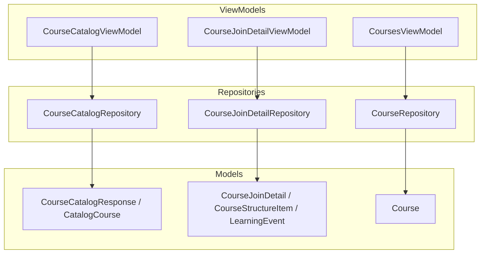
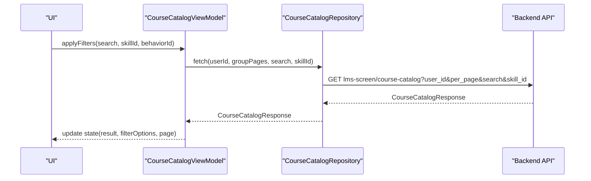
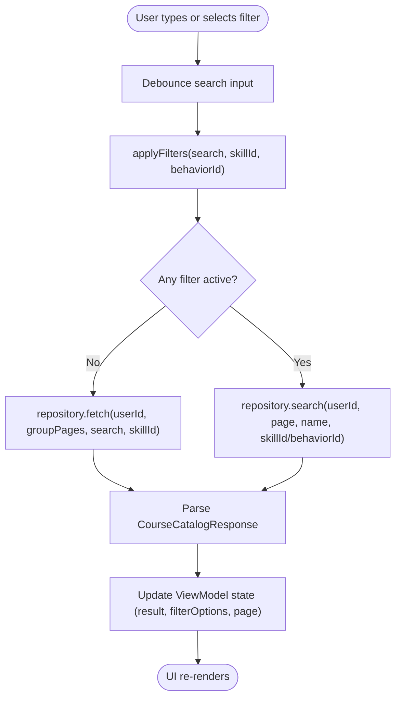
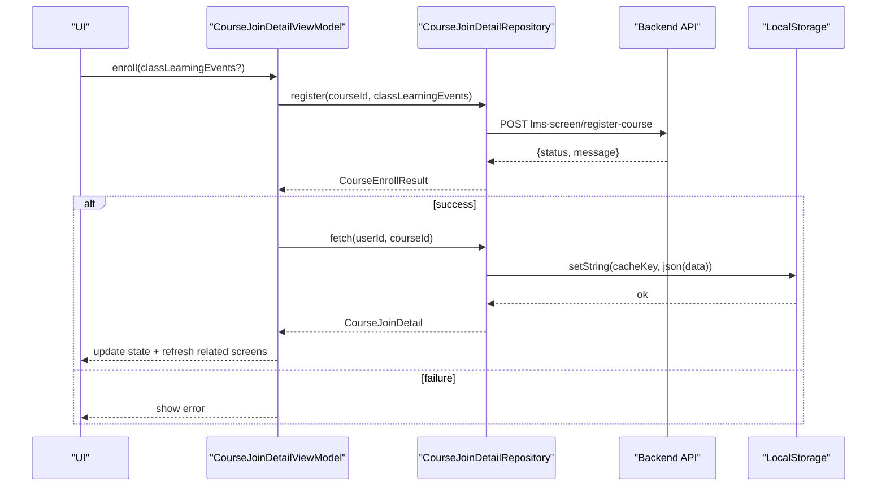
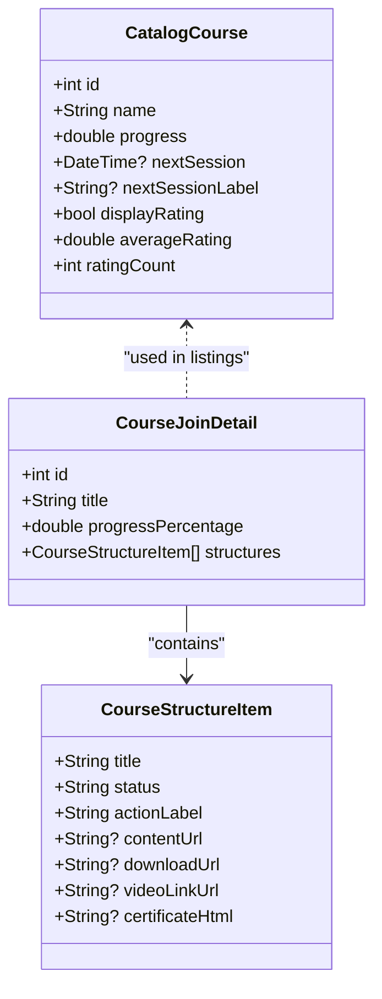
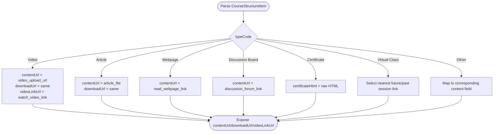
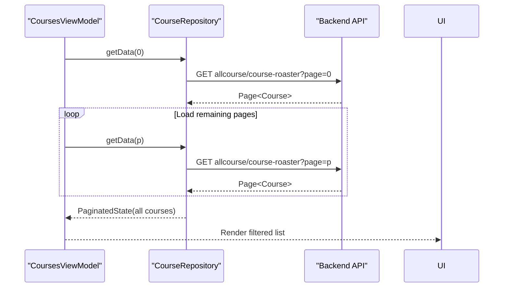
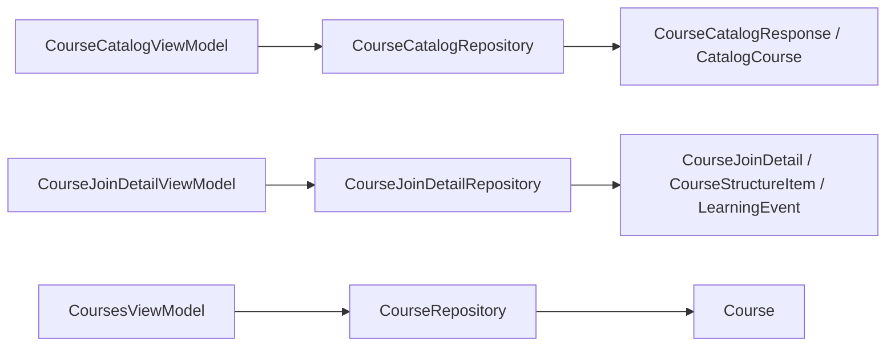

# Course Management

<cite>
**Referenced Files in This Document**
- [course_catalog_view_model.dart](file://lib/app/features/courses/viewmodel/course_catalog_view_model.dart)
- [course_catalog_repository.dart](file://lib/app/features/courses/repository/course_catalog_repository.dart)
- [courses_view_model.dart](file://lib/app/features/courses/viewmodel/courses_view_model.dart)
- [course_repository.dart](file://lib/app/features/courses/repository/course_repository.dart)
- [course_join_detail_view_model.dart](file://lib/app/features/courses/viewmodel/course_join_detail_view_model.dart)
- [course_join_detail_repository.dart](file://lib/app/features/courses/repository/course_join_detail_repository.dart)
- [course_join_detail.dart](file://lib/app/features/courses/model/course_join_detail.dart)
- [course_catalog.dart](file://lib/app/features/courses/model/course_catalog.dart)
- [course.dart](file://lib/app/features/courses/model/course.dart)
</cite>

## Table of Contents
1. [Introduction](#introduction)
2. [Project Structure](#project-structure)
3. [Core Components](#core-components)
4. [Architecture Overview](#architecture-overview)
5. [Detailed Component Analysis](#detailed-component-analysis)
6. [Dependency Analysis](#dependency-analysis)
7. [Performance Considerations](#performance-considerations)
8. [Troubleshooting Guide](#troubleshooting-guide)
9. [Conclusion](#conclusion)

## Introduction
This document explains the Course Management feature module, covering course catalog browsing, enrollment, progress tracking, and content delivery. It details data models, repository implementations, view model state management, enrollment workflows, local/remote synchronization, caching strategy for course content, filtering/searching, bulk operations, and integration with the content delivery system.

## Project Structure
The Course Management feature is organized under lib/app/features/courses with a clear separation:
- Models define the shape of API responses and domain entities (catalog items, course detail structures, learning events).
- Repositories encapsulate network calls and persistence (catalog listing, search, join-detail fetch, enrollment actions, offline cache).
- ViewModels manage UI state, orchestrate repository calls, handle filters, pagination, and side effects like refreshing related screens after enrollment changes.
- Views consume ViewModels to render lists, details, and actions.

**Diagram sources**
- [course_catalog_view_model.dart:59-188](file://lib/app/features/courses/viewmodel/course_catalog_view_model.dart#L59-L188)
- [course_catalog_repository.dart:18-76](file://lib/app/features/courses/repository/course_catalog_repository.dart#L18-L76)
- [course_join_detail_view_model.dart:18-171](file://lib/app/features/courses/viewmodel/course_join_detail_view_model.dart#L18-L171)
- [course_join_detail_repository.dart:16-180](file://lib/app/features/courses/repository/course_join_detail_repository.dart#L16-L180)
- [courses_view_model.dart:10-49](file://lib/app/features/courses/viewmodel/courses_view_model.dart#L10-L49)
- [course_repository.dart:7-21](file://lib/app/features/courses/repository/course_repository.dart#L7-L21)
- [course_catalog.dart:3-64](file://lib/app/features/courses/model/course_catalog.dart#L3-L64)
- [course_join_detail.dart:3-203](file://lib/app/features/courses/model/course_join_detail.dart#L3-L203)
- [course.dart:5-279](file://lib/app/features/courses/model/course.dart#L5-L279)

**Section sources**
- [course_catalog_view_model.dart:59-188](file://lib/app/features/courses/viewmodel/course_catalog_view_model.dart#L59-L188)
- [course_catalog_repository.dart:18-76](file://lib/app/features/courses/repository/course_catalog_repository.dart#L18-L76)
- [course_join_detail_view_model.dart:18-171](file://lib/app/features/courses/viewmodel/course_join_detail_view_model.dart#L18-L171)
- [course_join_detail_repository.dart:16-180](file://lib/app/features/courses/repository/course_join_detail_repository.dart#L16-L180)
- [courses_view_model.dart:10-49](file://lib/app/features/courses/viewmodel/courses_view_model.dart#L10-L49)
- [course_repository.dart:7-21](file://lib/app/features/courses/repository/course_repository.dart#L7-L21)
- [course_catalog.dart:3-64](file://lib/app/features/courses/model/course_catalog.dart#L3-L64)
- [course_join_detail.dart:3-203](file://lib/app/features/courses/model/course_join_detail.dart#L3-L203)
- [course.dart:5-279](file://lib/app/features/courses/model/course.dart#L5-L279)

## Core Components
- Course Catalog Browsing:
  - ViewModel maintains search text, skill/behavior filters, page state, and group-specific pages. It supports debounced search and filter application, then delegates to the catalog repository for fetching or searching.
  - Repository builds query parameters for both general catalog fetch and search endpoints, normalizes per_page to match the UI grid, and parses responses into typed models.

- Enrollment System:
  - Join Detail ViewModel orchestrates enroll, registerClass, and cancelRegistration flows. After successful mutations, it silently refetches the detail and invalidates related screens to keep listings consistent.
  - Repository handles whole-course and single-class registration via form-encoded POSTs, plus cancellation. It also caches join-detail payloads locally for offline access.

- Progress Tracking:
  - Models compute progress percentages from API fields and normalize various field names and formats. Catalog courses include progress, next session info, and ratings; join detail includes overall progress and per-structure status.

- Content Delivery:
  - Join detail models parse structure items by type code to determine content URLs, download links, video links, certificates, and virtual class session links. They also derive “next session” timing from learning events.

**Section sources**
- [course_catalog_view_model.dart:84-181](file://lib/app/features/courses/viewmodel/course_catalog_view_model.dart#L84-L181)
- [course_catalog_repository.dart:18-76](file://lib/app/features/courses/repository/course_catalog_repository.dart#L18-L76)
- [course_join_detail_view_model.dart:67-171](file://lib/app/features/courses/viewmodel/course_join_detail_view_model.dart#L67-L171)
- [course_join_detail_repository.dart:32-180](file://lib/app/features/courses/repository/course_join_detail_repository.dart#L32-L180)
- [course_catalog.dart:150-271](file://lib/app/features/courses/model/course_catalog.dart#L150-L271)
- [course_join_detail.dart:206-496](file://lib/app/features/courses/model/course_join_detail.dart#L206-L496)
- [course.dart:274-279](file://lib/app/features/courses/model/course.dart#L274-L279)

## Architecture Overview
The module follows a layered architecture:
- ViewModels are state holders using Riverpod providers. They coordinate user interactions and repository calls.
- Repositories abstract network requests and local storage, returning typed models.
- Models encapsulate parsing logic and derived properties (e.g., progress, next session, action labels).

**Diagram sources**
- [course_catalog_view_model.dart:140-159](file://lib/app/features/courses/viewmodel/course_catalog_view_model.dart#L140-L159)
- [course_catalog_repository.dart:18-46](file://lib/app/features/courses/repository/course_catalog_repository.dart#L18-L46)

## Detailed Component Analysis

### Course Catalog Browsing
- State and Filtering:
  - The catalog ViewModel holds search text, skill/behavior IDs, pagination, and group-specific pages. Filters are applied with debounced search to avoid excessive requests.
  - When filters change, the ViewModel toggles between catalog fetch and search modes based on whether any filter is active.

- Pagination and Group Pages:
  - Each group can have its own page index, stored in a map and passed to the repository to request specific pages per group.

- Search Functionality:
  - A separate search endpoint is used when any filter is active. Parameters include name, skill/behavior ID, and limit aligned with the UI grid.

- Data Parsing:
  - The catalog response parser supports multiple payload shapes and nested groups, extracting skills, groups, and courses with robust fallbacks.

**Diagram sources**
- [course_catalog_view_model.dart:140-181](file://lib/app/features/courses/viewmodel/course_catalog_view_model.dart#L140-L181)
- [course_catalog_repository.dart:18-76](file://lib/app/features/courses/repository/course_catalog_repository.dart#L18-L76)

**Section sources**
- [course_catalog_view_model.dart:10-188](file://lib/app/features/courses/viewmodel/course_catalog_view_model.dart#L10-L188)
- [course_catalog_repository.dart:18-76](file://lib/app/features/courses/repository/course_catalog_repository.dart#L18-L76)
- [course_catalog.dart:3-64](file://lib/app/features/courses/model/course_catalog.dart#L3-L64)
- [course_catalog.dart:150-271](file://lib/app/features/courses/model/course_catalog.dart#L150-L271)

### Enrollment System
- Enrollment Workflow:
  - Whole-course enrollment sends class session selections for Virtual/In Person classes that require them. Single-class registration allows registering for a specific class/session.
  - After successful enrollment or cancellation, the ViewModel silently refetches the join detail and refreshes related screens to reflect updated enrollment status across the app.

- Session Selection Logic:
  - For classes requiring sessions, the model computes automatic selections: earliest upcoming session if available, otherwise latest past session. This ensures enrollment succeeds even when all sessions have ended.

- Cancellation:
  - Cancelling a whole course removes downloaded content and clears cached detail to prevent stale enrollment states.

**Diagram sources**
- [course_join_detail_view_model.dart:67-123](file://lib/app/features/courses/viewmodel/course_join_detail_view_model.dart#L67-L123)
- [course_join_detail_repository.dart:75-113](file://lib/app/features/courses/repository/course_join_detail_repository.dart#L75-L113)
- [course_join_detail_repository.dart:32-67](file://lib/app/features/courses/repository/course_join_detail_repository.dart#L32-L67)

**Section sources**
- [course_join_detail_view_model.dart:67-171](file://lib/app/features/courses/viewmodel/course_join_detail_view_model.dart#L67-L171)
- [course_join_detail_repository.dart:75-180](file://lib/app/features/courses/repository/course_join_detail_repository.dart#L75-L180)
- [course_join_detail.dart:53-91](file://lib/app/features/courses/model/course_join_detail.dart#L53-L91)

### Progress Tracking
- Catalog Courses:
  - Each catalog course includes progress percentage, next session date/label, rating display flags, and average rating/count.

- Join Detail:
  - Overall progress percentage is parsed from multiple possible fields and normalized to a 0..1 scale. Per-structure items carry their own status and action labels.

- Derived Properties:
  - The Course model provides a computed percentage based on roaster statuses.

**Diagram sources**
- [course_catalog.dart:150-271](file://lib/app/features/courses/model/course_catalog.dart#L150-L271)
- [course_join_detail.dart:3-203](file://lib/app/features/courses/model/course_join_detail.dart#L3-L203)
- [course_join_detail.dart:206-496](file://lib/app/features/courses/model/course_join_detail.dart#L206-L496)
- [course.dart:274-279](file://lib/app/features/courses/model/course.dart#L274-L279)

**Section sources**
- [course_catalog.dart:150-271](file://lib/app/features/courses/model/course_catalog.dart#L150-L271)
- [course_join_detail.dart:3-203](file://lib/app/features/courses/model/course_join_detail.dart#L3-L203)
- [course_join_detail.dart:206-496](file://lib/app/features/courses/model/course_join_detail.dart#L206-L496)
- [course.dart:274-279](file://lib/app/features/courses/model/course.dart#L274-L279)

### Course Content Delivery
- Content Types:
  - Structure items support multiple content types identified by type codes: videos, articles, webpages, discussion boards, certificates, virtual classes, and more.
  - For each type, the model extracts appropriate URLs or HTML (e.g., certificate HTML), recording URLs from learning events, and external video links.

- Virtual Class Sessions:
  - For Virtual Class items, the model selects the nearest future session link or falls back to the nearest past session link when all sessions have ended.

- Download and Launch:
  - Some content types expose download URLs; others provide direct launch links. Certificates are delivered as raw HTML strings rather than file URLs.

**Diagram sources**
- [course_join_detail.dart:257-496](file://lib/app/features/courses/model/course_join_detail.dart#L257-L496)

**Section sources**
- [course_join_detail.dart:257-496](file://lib/app/features/courses/model/course_join_detail.dart#L257-L496)

### My Courses Listing and Bulk Operations
- All-Course Aggregation:
  - The CoursesViewModel loads all pages on initial fetch to enable filtering across enrolled courses beyond the current page’s subset.

- Bulk Operations:
  - While the repository exposes per-item operations, the ViewModel aggregates results to support list-wide filtering and presentation. Bulk actions such as canceling entire course registrations are handled through the join detail flow.

**Diagram sources**
- [courses_view_model.dart:20-49](file://lib/app/features/courses/viewmodel/courses_view_model.dart#L20-L49)
- [course_repository.dart:16-21](file://lib/app/features/courses/repository/course_repository.dart#L16-L21)

**Section sources**
- [courses_view_model.dart:10-49](file://lib/app/features/courses/viewmodel/courses_view_model.dart#L10-L49)
- [course_repository.dart:7-21](file://lib/app/features/courses/repository/course_repository.dart#L7-L21)

## Dependency Analysis
- Coupling:
  - ViewModels depend on repositories for data and actions; repositories depend on network helpers and local storage. Models are consumed by both layers but remain decoupled from infrastructure.
- External Integrations:
  - Network endpoints: catalog listing, search, join-detail fetch, enrollment, cancellation.
  - Local storage: caching of join-detail payloads for offline resilience.
- Cohesion:
  - Each repository focuses on a specific domain area (catalog vs. join detail vs. listing), improving cohesion and testability.

**Diagram sources**
- [course_catalog_view_model.dart:59-188](file://lib/app/features/courses/viewmodel/course_catalog_view_model.dart#L59-L188)
- [course_catalog_repository.dart:18-76](file://lib/app/features/courses/repository/course_catalog_repository.dart#L18-L76)
- [course_join_detail_view_model.dart:18-171](file://lib/app/features/courses/viewmodel/course_join_detail_view_model.dart#L18-L171)
- [course_join_detail_repository.dart:16-180](file://lib/app/features/courses/repository/course_join_detail_repository.dart#L16-L180)
- [courses_view_model.dart:10-49](file://lib/app/features/courses/viewmodel/courses_view_model.dart#L10-L49)
- [course_repository.dart:7-21](file://lib/app/features/courses/repository/course_repository.dart#L7-L21)
- [course_catalog.dart:3-64](file://lib/app/features/courses/model/course_catalog.dart#L3-L64)
- [course_join_detail.dart:3-203](file://lib/app/features/courses/model/course_join_detail.dart#L3-L203)
- [course.dart:5-279](file://lib/app/features/courses/model/course.dart#L5-L279)

**Section sources**
- [course_catalog_view_model.dart:59-188](file://lib/app/features/courses/viewmodel/course_catalog_view_model.dart#L59-L188)
- [course_catalog_repository.dart:18-76](file://lib/app/features/courses/repository/course_catalog_repository.dart#L18-L76)
- [course_join_detail_view_model.dart:18-171](file://lib/app/features/courses/viewmodel/course_join_detail_view_model.dart#L18-L171)
- [course_join_detail_repository.dart:16-180](file://lib/app/features/courses/repository/course_join_detail_repository.dart#L16-L180)
- [courses_view_model.dart:10-49](file://lib/app/features/courses/viewmodel/courses_view_model.dart#L10-L49)
- [course_repository.dart:7-21](file://lib/app/features/courses/repository/course_repository.dart#L7-L21)
- [course_catalog.dart:3-64](file://lib/app/features/courses/model/course_catalog.dart#L3-L64)
- [course_join_detail.dart:3-203](file://lib/app/features/courses/model/course_join_detail.dart#L3-L203)
- [course.dart:5-279](file://lib/app/features/courses/model/course.dart#L5-L279)

## Performance Considerations
- Debounced Search:
  - Catalog search is debounced to reduce network load while typing.
- Pagination Alignment:
  - Catalog fetch uses per_page aligned with the UI grid to avoid partial rows and minimize extra requests.
- Offline Resilience:
  - Join-detail payloads are cached locally; failures fall back to cached data, improving perceived performance and reliability.
- Aggregated Loading:
  - My Courses loads all pages initially to enable efficient client-side filtering without repeated server calls.

[No sources needed since this section provides general guidance]

## Troubleshooting Guide
- Enrollment Errors:
  - Registration and cancellation return explicit success/failure with messages. If the server returns a non-success status, the ViewModel surfaces the message to the UI.
- Not Found Handling:
  - Join detail fetch errors detect 404/not found scenarios and present friendly messages; views can trigger specific toasts for deleted courses.
- Network Issues:
  - Friendly error mapping covers timeouts, unauthorized, socket exceptions, and connectivity issues.
- Cache Invalidation:
  - On full course cancellation, cached detail is cleared to prevent stale enrollment states.

**Section sources**
- [course_join_detail_repository.dart:75-180](file://lib/app/features/courses/repository/course_join_detail_repository.dart#L75-L180)
- [course_join_detail_view_model.dart:178-209](file://lib/app/features/courses/viewmodel/course_join_detail_view_model.dart#L178-L209)

## Conclusion
The Course Management module provides a robust, layered implementation for catalog browsing, enrollment, progress tracking, and content delivery. ViewModels manage state and orchestrate workflows, repositories abstract network and storage concerns, and models encapsulate parsing and derived logic. The design supports filtering/search, pagination, offline resilience, and consistent cross-screen updates after enrollment changes.

[No sources needed since this section summarizes without analyzing specific files]