# Enrollment System

<cite>
**Referenced Files in This Document**
- [course_join_detail.dart](file://lib/app/features/courses/model/course_join_detail.dart)
- [course_join_detail_repository.dart](file://lib/app/features/courses/repository/course_join_detail_repository.dart)
- [course_join_detail_view_model.dart](file://lib/app/features/courses/viewmodel/course_join_detail_view_model.dart)
- [auth_state_provider.dart](file://lib/app/features/authentication/app_state/auth_state_provider.dart)
- [auth_repository.dart](file://lib/app/features/authentication/repository/auth_repository.dart)
- [unauthorized_handler.dart](file://lib/app/core/views/elements/unauthorized_handler.dart)
</cite>

## Table of Contents
1. [Introduction](#introduction)
2. [Project Structure](#project-structure)
3. [Core Components](#core-components)
4. [Architecture Overview](#architecture-overview)
5. [Detailed Component Analysis](#detailed-component-analysis)
6. [Dependency Analysis](#dependency-analysis)
7. [Performance Considerations](#performance-considerations)
8. [Troubleshooting Guide](#troubleshooting-guide)
9. [Conclusion](#conclusion)
10. [Appendices](#appendices)

## Introduction
This document explains the Course Enrollment System end-to-end: how a learner selects a course, validates eligibility and prerequisites, manages capacity via server-side checks, enrolls or cancels registrations, and receives user feedback through loading states and notifications. It covers both whole-course enrollment and single-class/session enrollment, including automatic session selection for Virtual and In-Person classes.

## Project Structure
The enrollment feature is implemented as a layered Flutter module:
- Model layer parses API responses into domain objects and computes enrollment-related flags and selections.
- Repository layer handles network calls (fetch details, enroll, register class, cancel), caching, and error normalization.
- View model coordinates UI state, triggers repository actions, refreshes related screens, and surfaces friendly errors.
- Authentication integration ensures requests are authorized and handles token refresh or session expiry flows.

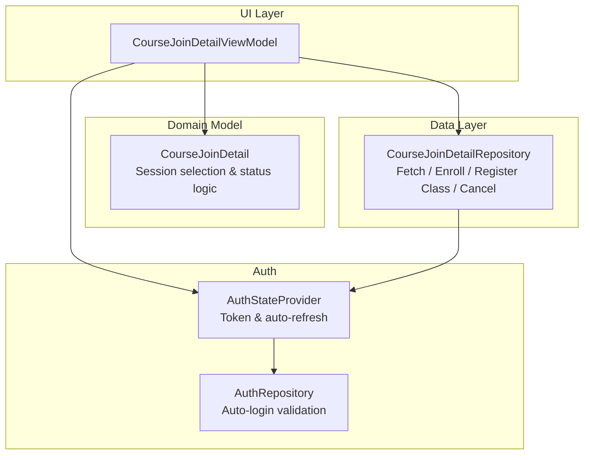

**Diagram sources**
- [course_join_detail_view_model.dart:18-172](file://lib/app/features/courses/viewmodel/course_join_detail_view_model.dart#L18-L172)
- [course_join_detail.dart:93-203](file://lib/app/features/courses/model/course_join_detail.dart#L93-L203)
- [course_join_detail_repository.dart:16-180](file://lib/app/features/courses/repository/course_join_detail_repository.dart#L16-L180)
- [auth_state_provider.dart:114-202](file://lib/app/features/authentication/app_state/auth_state_provider.dart#L114-L202)
- [auth_repository.dart:36-65](file://lib/app/features/authentication/repository/auth_repository.dart#L36-L65)

**Section sources**
- [course_join_detail_view_model.dart:18-172](file://lib/app/features/courses/viewmodel/course_join_detail_view_model.dart#L18-L172)
- [course_join_detail_repository.dart:16-180](file://lib/app/features/courses/repository/course_join_detail_repository.dart#L16-L180)
- [course_join_detail.dart:93-203](file://lib/app/features/courses/model/course_join_detail.dart#L93-L203)
- [auth_state_provider.dart:114-202](file://lib/app/features/authentication/app_state/auth_state_provider.dart#L114-L202)
- [auth_repository.dart:36-65](file://lib/app/features/authentication/repository/auth_repository.dart#L36-L65)

## Core Components
- CourseJoinDetail (Model): Parses API payloads, determines enrollment status, builds per-class structure items, and computes which sessions must be selected for enrollment.
- CourseJoinDetailRepository (Data): Fetches course detail with offline cache fallback; performs enroll, register-class, and cancel operations; normalizes success/failure results.
- CourseJoinDetailViewModel (State): Orchestrates fetch/enroll/register/cancel, updates UI state, refreshes related lists, and provides friendly error messages.
- Auth Integration: Uses current auth token for authenticated requests; supports auto-token refresh on 401 and redirects to login when needed.

Key responsibilities:
- Validation and prerequisite checks are enforced by the server; the client prepares correct payloads (including required session IDs).
- Capacity management is handled server-side; the client reacts to success/failure responses.
- State management uses DataState (loading, data, error) and refetches after mutations to keep UI consistent.

**Section sources**
- [course_join_detail.dart:93-203](file://lib/app/features/courses/model/course_join_detail.dart#L93-L203)
- [course_join_detail_repository.dart:32-113](file://lib/app/features/courses/repository/course_join_detail_repository.dart#L32-L113)
- [course_join_detail_view_model.dart:48-123](file://lib/app/features/courses/viewmodel/course_join_detail_view_model.dart#L48-L123)
- [auth_state_provider.dart:114-202](file://lib/app/features/authentication/app_state/auth_state_provider.dart#L114-L202)

## Architecture Overview
End-to-end enrollment flow from UI to server and back:

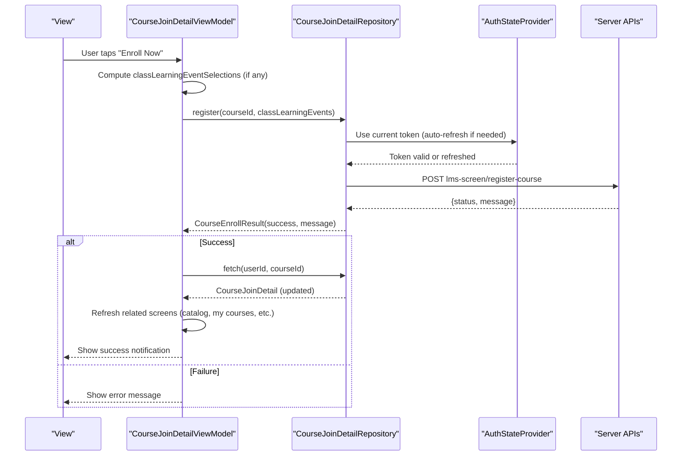

**Diagram sources**
- [course_join_detail_view_model.dart:74-86](file://lib/app/features/courses/viewmodel/course_join_detail_view_model.dart#L74-L86)
- [course_join_detail_repository.dart:75-113](file://lib/app/features/courses/repository/course_join_detail_repository.dart#L75-L113)
- [auth_state_provider.dart:114-202](file://lib/app/features/authentication/app_state/auth_state_provider.dart#L114-L202)

## Detailed Component Analysis

### Enrollment Workflow: From Selection to Confirmation
- Whole-course enrollment:
  - The view model computes required session selections for Virtual/In-Person classes and sends them with the enroll request.
  - On success, it silently refetches course detail and refreshes all related list providers so enrollment status propagates everywhere.
- Single-class enrollment:
  - For a specific class item, the view model calls registerClass with optional learning_event_class_id to select a session.
- Cancellation:
  - Cancels either the entire course or a single class; clears offline content and cached detail when cancelling the whole course.

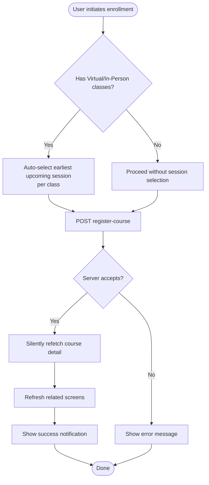

**Diagram sources**
- [course_join_detail.dart:45-79](file://lib/app/features/courses/model/course_join_detail.dart#L45-L79)
- [course_join_detail_view_model.dart:74-123](file://lib/app/features/courses/viewmodel/course_join_detail_view_model.dart#L74-L123)
- [course_join_detail_repository.dart:75-113](file://lib/app/features/courses/repository/course_join_detail_repository.dart#L75-L113)

**Section sources**
- [course_join_detail_view_model.dart:74-123](file://lib/app/features/courses/viewmodel/course_join_detail_view_model.dart#L74-L123)
- [course_join_detail_repository.dart:75-113](file://lib/app/features/courses/repository/course_join_detail_repository.dart#L75-L113)
- [course_join_detail.dart:45-79](file://lib/app/features/courses/model/course_join_detail.dart#L45-L79)

### Enrollment Validation Logic and Prerequisite Checking
- Session requirement enforcement:
  - For Virtual (typeCode '3') and In-Person (typeCode '2') classes that have sessions, the system requires a learning_event_class_id to be included in the request. If omitted, the server rejects with a message indicating session selection is required.
  - The model automatically selects the earliest upcoming session for each such class; if none are upcoming, it falls back to the latest past session to ensure enrollment can still proceed.
- Eligibility and prerequisites:
  - These checks are performed server-side. The client ensures the payload is complete (correct IDs and session selections) to avoid rejection due to missing parameters.

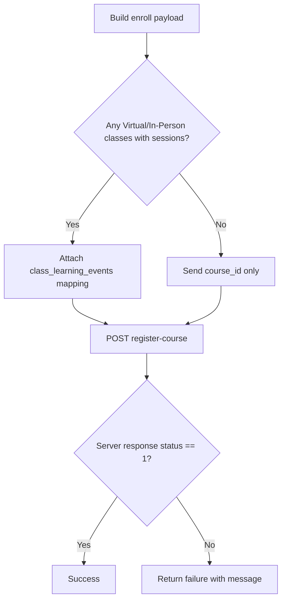

**Diagram sources**
- [course_join_detail_repository.dart:75-113](file://lib/app/features/courses/repository/course_join_detail_repository.dart#L75-L113)
- [course_join_detail.dart:45-79](file://lib/app/features/courses/model/course_join_detail.dart#L45-L79)

**Section sources**
- [course_join_detail_repository.dart:75-113](file://lib/app/features/courses/repository/course_join_detail_repository.dart#L75-L113)
- [course_join_detail.dart:45-79](file://lib/app/features/courses/model/course_join_detail.dart#L45-L79)

### Capacity Management
- Capacity limits and seat availability are enforced by the server during registration.
- The client interprets the server’s response:
  - Success: proceeds to refetch and update UI.
  - Failure: displays the server-provided message (e.g., capacity exceeded).

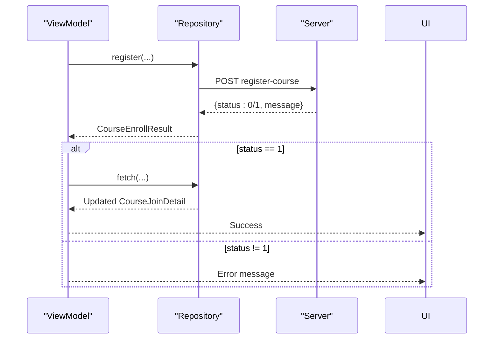

**Diagram sources**
- [course_join_detail_repository.dart:75-113](file://lib/app/features/courses/repository/course_join_detail_repository.dart#L75-L113)
- [course_join_detail_view_model.dart:74-86](file://lib/app/features/courses/viewmodel/course_join_detail_view_model.dart#L74-L86)

**Section sources**
- [course_join_detail_repository.dart:75-113](file://lib/app/features/courses/repository/course_join_detail_repository.dart#L75-L113)
- [course_join_detail_view_model.dart:74-86](file://lib/app/features/courses/viewmodel/course_join_detail_view_model.dart#L74-L86)

### State Management for Enrollment Status
- DataState lifecycle:
  - Loading: shown while fetching or enrolling.
  - Data: populated with CourseJoinDetail, including isEnrolled and primaryAction.
  - Error: friendly messages mapped from underlying exceptions.
- After enrollment or cancellation:
  - Silent refetch keeps the current screen stable while updating state.
  - Related screens (catalog, my courses, enrolled/completed/required, dashboard, development plan, calendar) are invalidated or refetched to reflect new enrollment status.

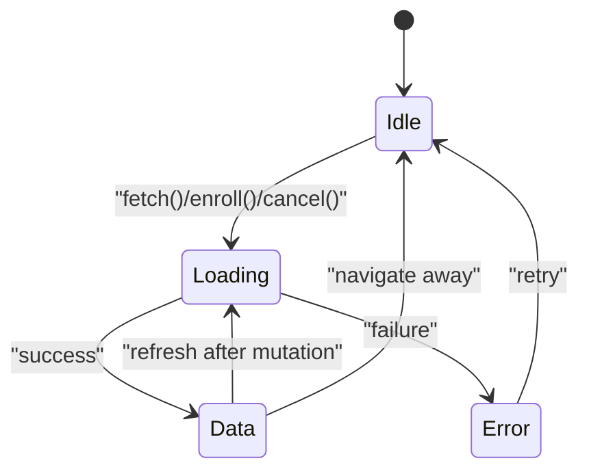

**Diagram sources**
- [course_join_detail_view_model.dart:48-65](file://lib/app/features/courses/viewmodel/course_join_detail_view_model.dart#L48-L65)
- [course_join_detail_view_model.dart:125-172](file://lib/app/features/courses/viewmodel/course_join_detail_view_model.dart#L125-L172)

**Section sources**
- [course_join_detail_view_model.dart:48-65](file://lib/app/features/courses/viewmodel/course_join_detail_view_model.dart#L48-L65)
- [course_join_detail_view_model.dart:125-172](file://lib/app/features/courses/viewmodel/course_join_detail_view_model.dart#L125-L172)

### Error Handling and Retry Mechanisms
- Network and server errors are normalized into friendly messages:
  - Unauthorized (401): prompts re-login or auto-refreshes token.
  - Not found (404): indicates course deleted.
  - Network issues: informs about connectivity problems.
  - Timeouts: suggests retrying later.
- Offline resilience:
  - Course detail is cached locally; on network failure, the cached version is served if available.
- Retry guidance:
  - Views should expose retry actions based on the displayed error state.

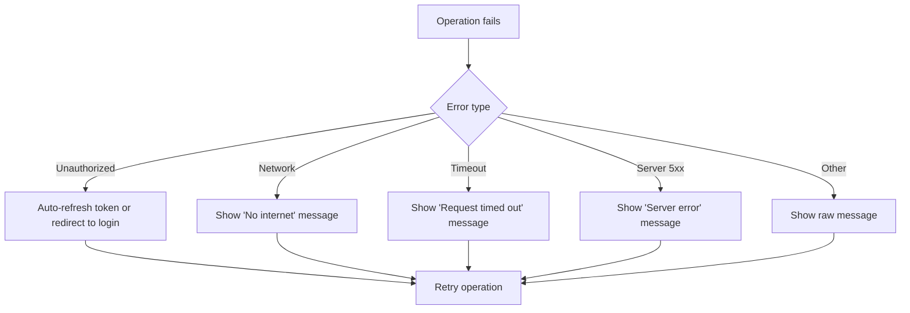

**Diagram sources**
- [course_join_detail_view_model.dart:187-209](file://lib/app/features/courses/viewmodel/course_join_detail_view_model.dart#L187-L209)
- [course_join_detail_repository.dart:32-67](file://lib/app/features/courses/repository/course_join_detail_repository.dart#L32-L67)
- [unauthorized_handler.dart:26-67](file://lib/app/core/views/elements/unauthorized_handler.dart#L26-L67)

**Section sources**
- [course_join_detail_view_model.dart:187-209](file://lib/app/features/courses/viewmodel/course_join_detail_view_model.dart#L187-L209)
- [course_join_detail_repository.dart:32-67](file://lib/app/features/courses/repository/course_join_detail_repository.dart#L32-L67)
- [unauthorized_handler.dart:26-67](file://lib/app/core/views/elements/unauthorized_handler.dart#L26-L67)

### Integration with Authentication System
- Current user ID is derived from authentication state and used for fetching course details.
- Requests are authenticated using the stored token; if unauthorized, the provider attempts an auto-login refresh.
- On persistent unauthorized errors, users are redirected to login with a user-facing message.

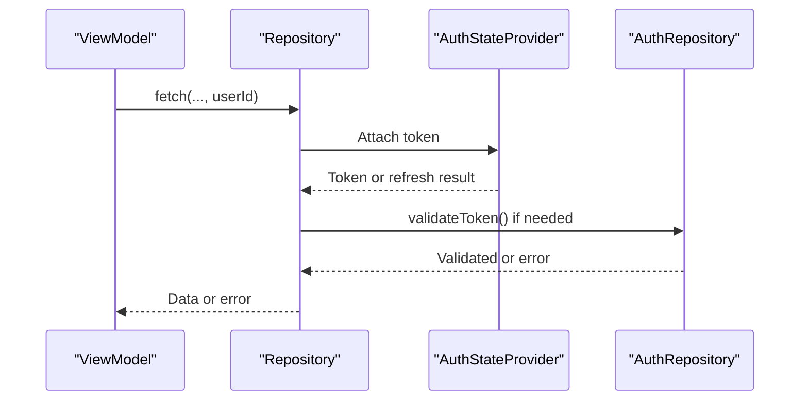

**Diagram sources**
- [course_join_detail_view_model.dart:29-41](file://lib/app/features/courses/viewmodel/course_join_detail_view_model.dart#L29-L41)
- [auth_state_provider.dart:114-202](file://lib/app/features/authentication/app_state/auth_state_provider.dart#L114-L202)
- [auth_repository.dart:36-65](file://lib/app/features/authentication/repository/auth_repository.dart#L36-L65)

**Section sources**
- [course_join_detail_view_model.dart:29-41](file://lib/app/features/courses/viewmodel/course_join_detail_view_model.dart#L29-L41)
- [auth_state_provider.dart:114-202](file://lib/app/features/authentication/app_state/auth_state_provider.dart#L114-L202)
- [auth_repository.dart:36-65](file://lib/app/features/authentication/repository/auth_repository.dart#L36-L65)

### Database Operations and Storage
- Local storage:
  - Course detail JSON is cached under a key per course ID to support offline access.
  - Cached detail is cleared when the whole course is unenrolled to prevent stale enrollment indicators.
- Remote persistence:
  - Enrollment records are created/modified via server endpoints; the client does not directly write to a local database for enrollment state beyond the detail cache.

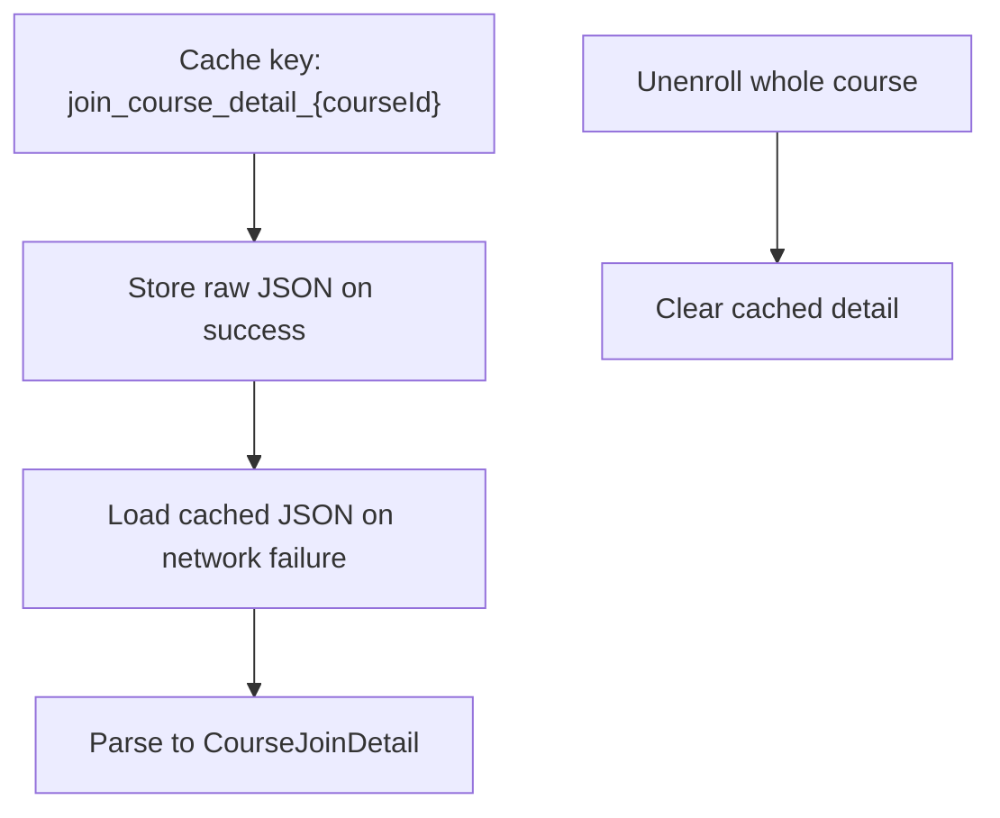

**Diagram sources**
- [course_join_detail_repository.dart:32-73](file://lib/app/features/courses/repository/course_join_detail_repository.dart#L32-L73)
- [course_join_detail_view_model.dart:112-123](file://lib/app/features/courses/viewmodel/course_join_detail_view_model.dart#L112-L123)

**Section sources**
- [course_join_detail_repository.dart:32-73](file://lib/app/features/courses/repository/course_join_detail_repository.dart#L32-L73)
- [course_join_detail_view_model.dart:112-123](file://lib/app/features/courses/viewmodel/course_join_detail_view_model.dart#L112-L123)

### Programmatic Enrollment Examples
- Whole-course enrollment:
  - Call the view model’s enroll method with an optional map of classId -> learningEventClassId for Virtual/In-Person classes. If omitted, the model auto-selects sessions.
- Single-class enrollment:
  - Call registerClass with courseId, classId, and optionally learningEventClassId to target a specific session.
- Cancellation:
  - Call cancelRegistration with courseId and optional classId to cancel the whole course or just one class.

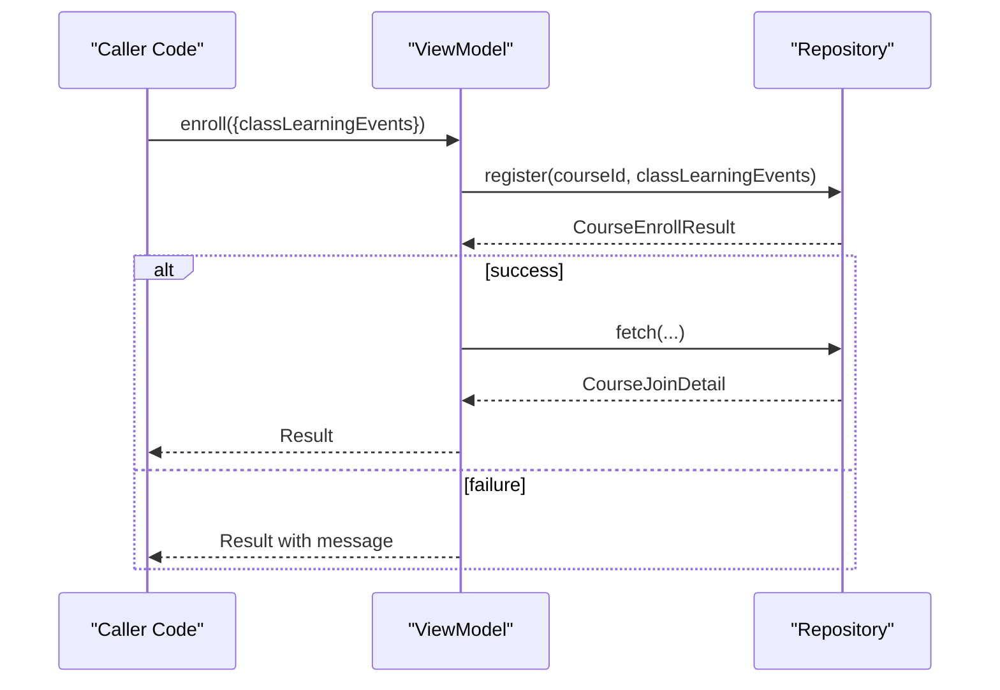

**Diagram sources**
- [course_join_detail_view_model.dart:74-86](file://lib/app/features/courses/viewmodel/course_join_detail_view_model.dart#L74-L86)
- [course_join_detail_repository.dart:75-113](file://lib/app/features/courses/repository/course_join_detail_repository.dart#L75-L113)

**Section sources**
- [course_join_detail_view_model.dart:74-86](file://lib/app/features/courses/viewmodel/course_join_detail_view_model.dart#L74-L86)
- [course_join_detail_repository.dart:75-113](file://lib/app/features/courses/repository/course_join_detail_repository.dart#L75-L113)

### Bulk Enrollment Operations
- The current implementation focuses on single-user enrollment workflows.
- To implement bulk enrollment:
  - Iterate over multiple courseIds and call enroll or registerClass for each.
  - Aggregate results and present a summary to the user.
  - Ensure rate limiting and handle partial failures gracefully.

[No sources needed since this section provides general guidance]

### Enrollment Cancellation Workflows
- Whole-course cancellation:
  - Clears offline content for the course and removes cached detail to avoid stale enrollment state.
- Single-class cancellation:
  - Updates enrollment status for that class only; subsequent refetch reflects the change.

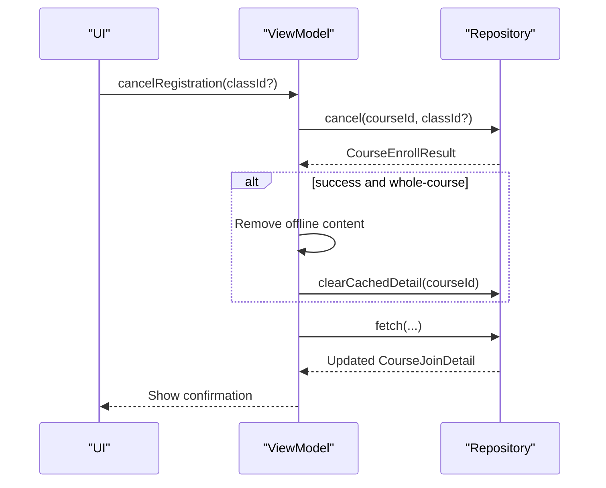

**Diagram sources**
- [course_join_detail_view_model.dart:112-123](file://lib/app/features/courses/viewmodel/course_join_detail_view_model.dart#L112-L123)
- [course_join_detail_repository.dart:151-180](file://lib/app/features/courses/repository/course_join_detail_repository.dart#L151-L180)

**Section sources**
- [course_join_detail_view_model.dart:112-123](file://lib/app/features/courses/viewmodel/course_join_detail_view_model.dart#L112-L123)
- [course_join_detail_repository.dart:151-180](file://lib/app/features/courses/repository/course_join_detail_repository.dart#L151-L180)

### User Feedback, Loading States, and Notifications
- Loading states:
  - The view model sets loading state during fetch and mutation operations.
  - Enrollment buttons typically show their own in-flight state to avoid full-screen spinners.
- Success/error notifications:
  - On success, the UI can display a brief confirmation.
  - On failure, friendly messages are surfaced based on error classification.
- Offline behavior:
  - When online requests fail, the cached course detail is shown if available, preventing blank screens.

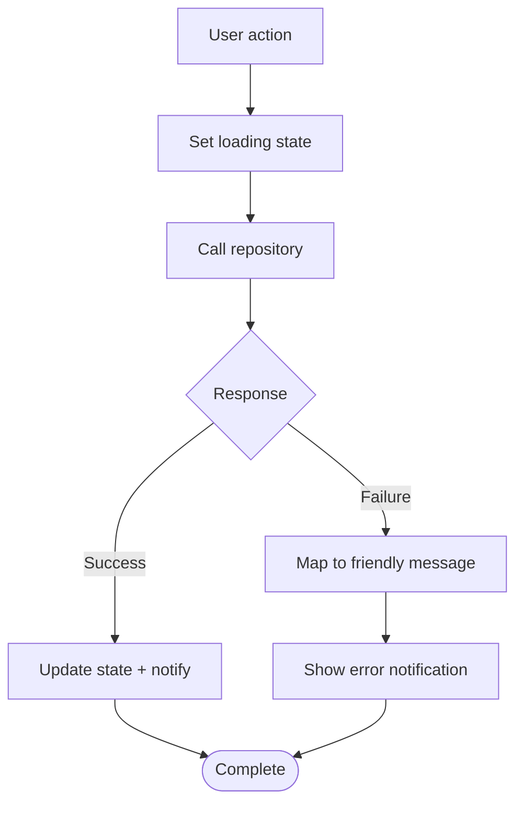

**Diagram sources**
- [course_join_detail_view_model.dart:48-65](file://lib/app/features/courses/viewmodel/course_join_detail_view_model.dart#L48-L65)
- [course_join_detail_view_model.dart:187-209](file://lib/app/features/courses/viewmodel/course_join_detail_view_model.dart#L187-L209)
- [course_join_detail_repository.dart:32-67](file://lib/app/features/courses/repository/course_join_detail_repository.dart#L32-L67)

**Section sources**
- [course_join_detail_view_model.dart:48-65](file://lib/app/features/courses/viewmodel/course_join_detail_view_model.dart#L48-L65)
- [course_join_detail_view_model.dart:187-209](file://lib/app/features/courses/viewmodel/course_join_detail_view_model.dart#L187-L209)
- [course_join_detail_repository.dart:32-67](file://lib/app/features/courses/repository/course_join_detail_repository.dart#L32-L67)

## Dependency Analysis
The enrollment system depends on:
- Authentication state for user identity and token management.
- Repository for network operations and caching.
- Model for parsing and deriving enrollment-related metadata.
- View model for orchestrating flows and refreshing related screens.

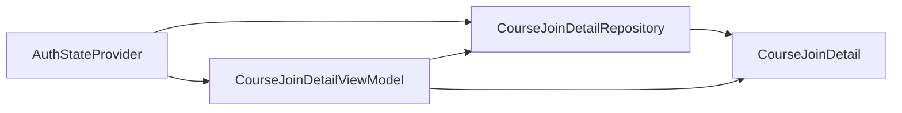

**Diagram sources**
- [course_join_detail_view_model.dart:18-41](file://lib/app/features/courses/viewmodel/course_join_detail_view_model.dart#L18-L41)
- [course_join_detail_repository.dart:16-28](file://lib/app/features/courses/repository/course_join_detail_repository.dart#L16-L28)
- [course_join_detail.dart:93-203](file://lib/app/features/courses/model/course_join_detail.dart#L93-L203)
- [auth_state_provider.dart:114-202](file://lib/app/features/authentication/app_state/auth_state_provider.dart#L114-L202)

**Section sources**
- [course_join_detail_view_model.dart:18-41](file://lib/app/features/courses/viewmodel/course_join_detail_view_model.dart#L18-L41)
- [course_join_detail_repository.dart:16-28](file://lib/app/features/courses/repository/course_join_detail_repository.dart#L16-L28)
- [course_join_detail.dart:93-203](file://lib/app/features/courses/model/course_join_detail.dart#L93-L203)
- [auth_state_provider.dart:114-202](file://lib/app/features/authentication/app_state/auth_state_provider.dart#L114-L202)

## Performance Considerations
- Avoid unnecessary refetches:
  - Use silent refetch after mutations to minimize UI disruption.
- Cache reuse:
  - Serve cached course detail on network failures to improve perceived performance.
- Batch operations:
  - For bulk enrollment, consider batching requests and handling partial failures efficiently.
- Minimize provider invalidations:
  - Only invalidate providers that are currently alive to prevent wasted rebuilds.

[No sources needed since this section provides general guidance]

## Troubleshooting Guide
Common issues and resolutions:
- Unauthorized errors:
  - Trigger auto-token refresh; if it fails, redirect to login with a user-friendly message.
- Network errors:
  - Display connectivity messages; rely on cached data when available.
- Timeouts:
  - Prompt users to retry later.
- Course not found:
  - Surface a clear message indicating the course was removed.

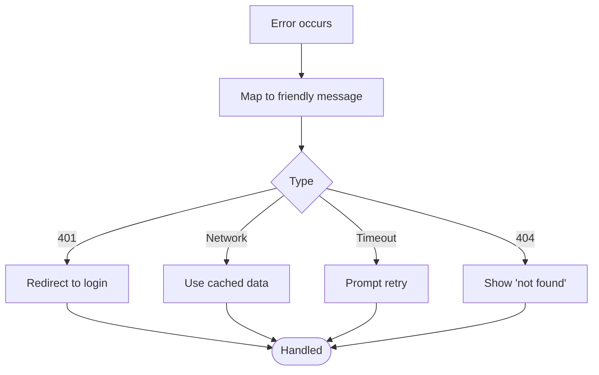

**Diagram sources**
- [course_join_detail_view_model.dart:187-209](file://lib/app/features/courses/viewmodel/course_join_detail_view_model.dart#L187-L209)
- [unauthorized_handler.dart:26-67](file://lib/app/core/views/elements/unauthorized_handler.dart#L26-L67)

**Section sources**
- [course_join_detail_view_model.dart:187-209](file://lib/app/features/courses/viewmodel/course_join_detail_view_model.dart#L187-L209)
- [unauthorized_handler.dart:26-67](file://lib/app/core/views/elements/unauthorized_handler.dart#L26-L67)

## Conclusion
The Enrollment System integrates model-driven session selection, robust repository-based networking with caching, and a responsive view model that maintains consistent UI state across the app. Server-side validation and capacity checks are respected by ensuring correct payloads and reacting to responses. Authentication integration guarantees secure operations and graceful handling of session issues. Users receive clear feedback throughout the process, with offline resilience and informative error messaging.

## Appendices

### Key Data Structures and Relationships
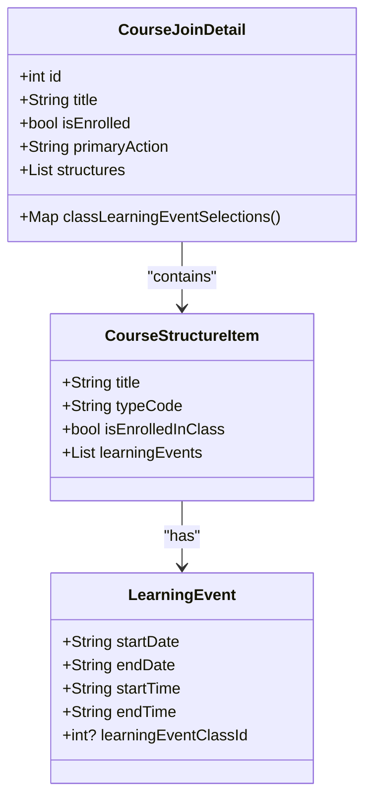

**Diagram sources**
- [course_join_detail.dart:3-43](file://lib/app/features/courses/model/course_join_detail.dart#L3-L43)
- [course_join_detail.dart:206-255](file://lib/app/features/courses/model/course_join_detail.dart#L206-L255)
- [course_join_detail.dart:515-556](file://lib/app/features/courses/model/course_join_detail.dart#L515-L556)

**Section sources**
- [course_join_detail.dart:3-43](file://lib/app/features/courses/model/course_join_detail.dart#L3-L43)
- [course_join_detail.dart:206-255](file://lib/app/features/courses/model/course_join_detail.dart#L206-L255)
- [course_join_detail.dart:515-556](file://lib/app/features/courses/model/course_join_detail.dart#L515-L556)