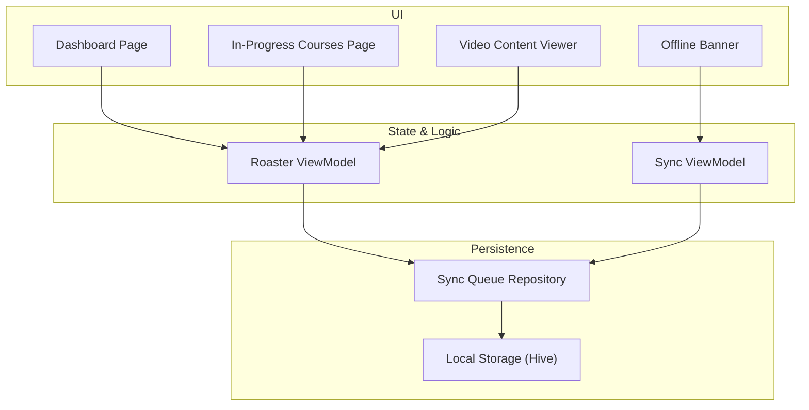
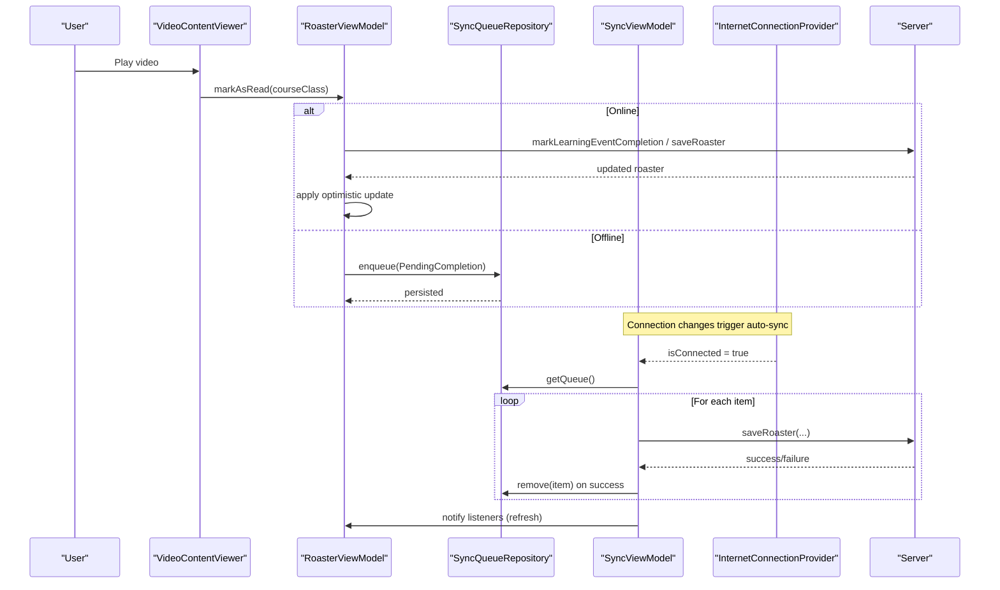
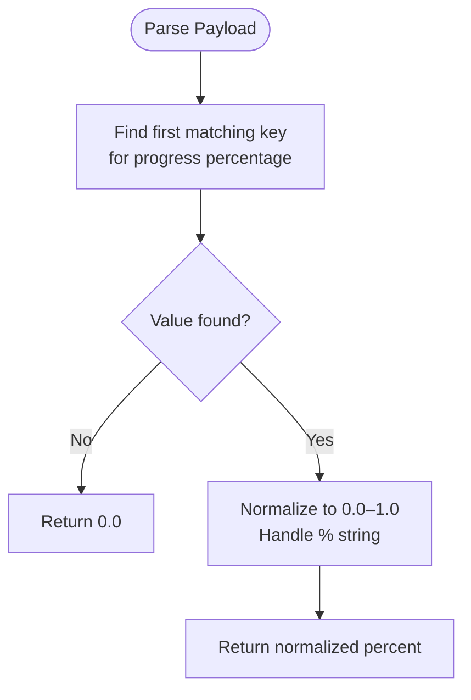
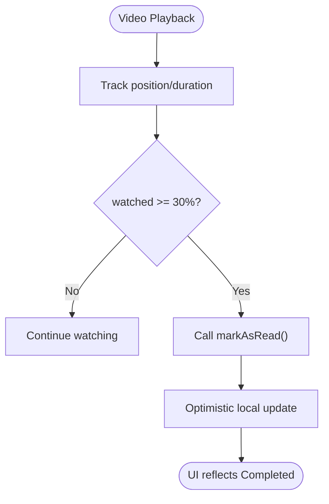
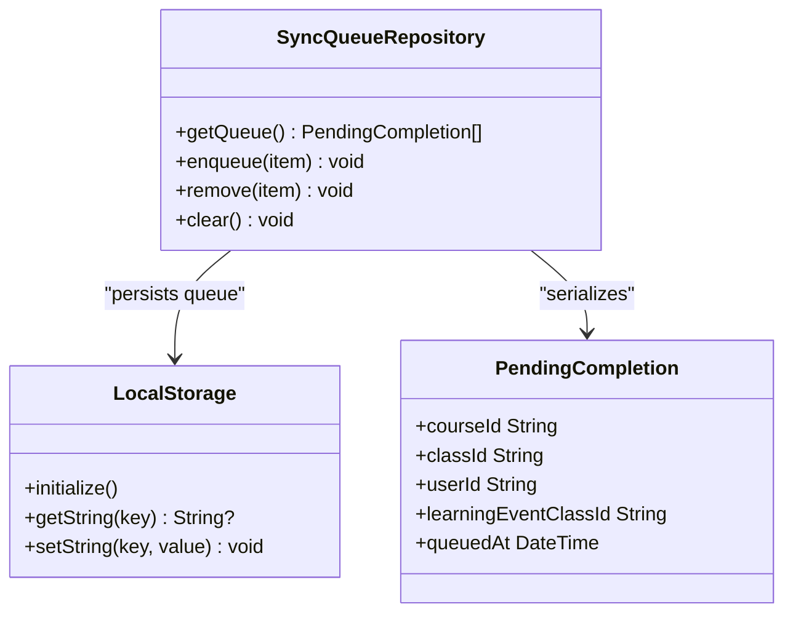
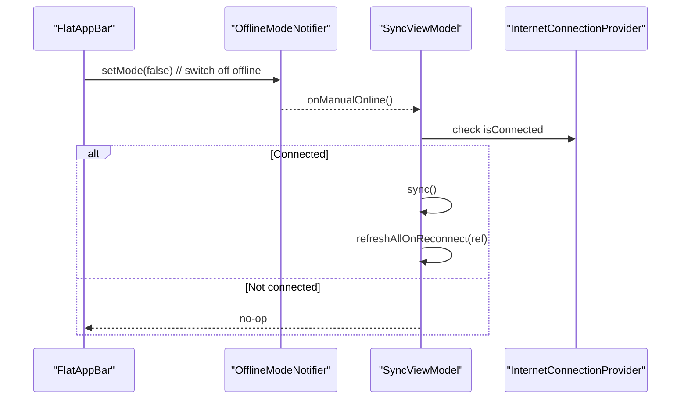
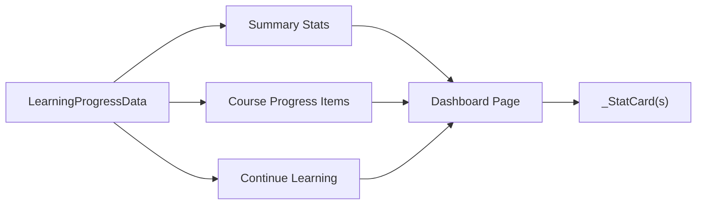
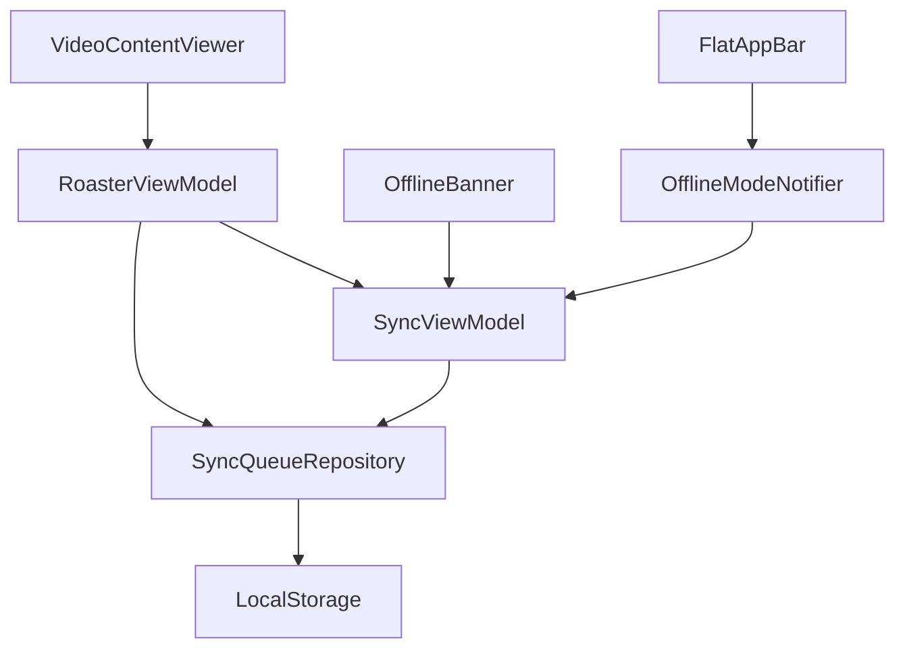

# Progress Tracking

<cite>
**Referenced Files in This Document**
- [course_join_detail.dart](file://lib/app/features/courses/model/course_join_detail.dart)
- [sync_queue_repository.dart](file://lib/app/features/courses/repository/sync_queue_repository.dart)
- [sync_view_model.dart](file://lib/app/features/courses/viewmodel/sync_view_model.dart)
- [roaster_view_model.dart](file://lib/app/features/courses/viewmodel/roaster_view_model.dart)
- [video_content_viewer.dart](file://lib/app/features/courses/view/content_viewer/video_content_viewer.dart)
- [local_storage_provider.dart](file://lib/app/core/provider/local_storage_provider.dart)
- [offline_mode_provider.dart](file://lib/app/core/provider/offline_mode_provider.dart)
- [flat_app_bar.dart](file://lib/app/core/views/elements/flat_app_bar.dart)
- [offline_banner.dart](file://lib/app/core/views/elements/offline_banner.dart)
- [learning_progress_model.dart](file://lib/app/features/dashboard/model/learning_progress_model.dart)
- [dashboard_page.dart](file://lib/app/features/dashboard/view/dashboard_page.dart)
- [in_progress_courses_page.dart](file://lib/app/features/dashboard/view/in_progress_courses_page.dart)
</cite>

## Table of Contents
1. Introduction
2. Project Structure
3. Core Components
4. Architecture Overview
5. Detailed Component Analysis
6. Dependency Analysis
7. Performance Considerations
8. Troubleshooting Guide
9. Conclusion

## Introduction
This document explains the Progress Tracking system: how user progress is monitored, stored locally for offline use, synchronized when connectivity is restored, and visualized across dashboards. It covers completion algorithms (including video watch thresholds), percentage calculation, milestone detection via class status, local storage strategy, sync queue behavior, and integration with content types such as videos and articles. It also addresses privacy considerations and data retention policies based on the implemented mechanisms.

## Project Structure
The progress tracking feature spans several layers:
- Models parse server payloads into structured objects including per-course progress percentages and class-level statuses.
- ViewModels manage state transitions for marking lessons complete and orchestrating sync operations.
- Repositories persist pending completions locally and provide a queue for later synchronization.
- UI components visualize progress through dashboard cards, badges, and progress rings.

**Diagram sources**
- [dashboard_page.dart:300-746](file://lib/app/features/dashboard/view/dashboard_page.dart#L300-L746)
- [in_progress_courses_page.dart:453-528](file://lib/app/features/dashboard/view/in_progress_courses_page.dart#L453-L528)
- [video_content_viewer.dart:1-171](file://lib/app/features/courses/view/content_viewer/video_content_viewer.dart#L1-L171)
- [offline_banner.dart:1-66](file://lib/app/core/views/elements/offline_banner.dart#L1-L66)
- [roaster_view_model.dart:1-264](file://lib/app/features/courses/viewmodel/roaster_view_model.dart#L1-L264)
- [sync_view_model.dart:1-139](file://lib/app/features/courses/viewmodel/sync_view_model.dart#L1-L139)
- [sync_queue_repository.dart:1-106](file://lib/app/features/courses/repository/sync_queue_repository.dart#L1-L106)
- [local_storage_provider.dart:1-49](file://lib/app/core/provider/local_storage_provider.dart#L1-L49)

**Section sources**
- [dashboard_page.dart:300-746](file://lib/app/features/dashboard/view/dashboard_page.dart#L300-L746)
- [in_progress_courses_page.dart:453-528](file://lib/app/features/dashboard/view/in_progress_courses_page.dart#L453-L528)
- [video_content_viewer.dart:1-171](file://lib/app/features/courses/view/content_viewer/video_content_viewer.dart#L1-L171)
- [offline_banner.dart:1-66](file://lib/app/core/views/elements/offline_banner.dart#L1-L66)
- [roaster_view_model.dart:1-264](file://lib/app/features/courses/viewmodel/roaster_view_model.dart#L1-L264)
- [sync_view_model.dart:1-139](file://lib/app/features/courses/viewmodel/sync_view_model.dart#L1-L139)
- [sync_queue_repository.dart:1-106](file://lib/app/features/courses/repository/sync_queue_repository.dart#L1-L106)
- [local_storage_provider.dart:1-49](file://lib/app/core/provider/local_storage_provider.dart#L1-L49)

## Core Components
- CourseJoinDetail parses course-level progress percentage from multiple possible API fields and normalizes it to a 0.0–1.0 value.
- RoasterViewModel handles marking classes complete, optimistically updating local state, and queuing completions when offline.
- SyncQueueRepository persists pending completions using Hive-backed LocalStorage.
- SyncViewModel orchestrates syncing queued completions to the server when online and triggers refetches after sync.
- VideoContentViewer monitors playback position and marks a video complete once a threshold is reached.
- Dashboard UI surfaces overall progress, completed counts, and continue-learning items.

**Section sources**
- [course_join_detail.dart:675-703](file://lib/app/features/courses/model/course_join_detail.dart#L675-L703)
- [roaster_view_model.dart:102-169](file://lib/app/features/courses/viewmodel/roaster_view_model.dart#L102-L169)
- [sync_queue_repository.dart:43-106](file://lib/app/features/courses/repository/sync_queue_repository.dart#L43-L106)
- [sync_view_model.dart:18-139](file://lib/app/features/courses/viewmodel/sync_view_model.dart#L18-L139)
- [video_content_viewer.dart:11-108](file://lib/app/features/courses/view/content_viewer/video_content_viewer.dart#L11-L108)
- [dashboard_page.dart:702-746](file://lib/app/features/dashboard/view/dashboard_page.dart#L702-L746)

## Architecture Overview
The system uses an optimistic update pattern with offline resilience:
- When a learner completes an activity (e.g., watches a video), the app updates local state immediately.
- If online, it calls the server endpoint; if offline, it enqueues the completion locally.
- On reconnect or manual “go online,” queued completions are flushed to the server and UI is refreshed.

**Diagram sources**
- [video_content_viewer.dart:83-108](file://lib/app/features/courses/view/content_viewer/video_content_viewer.dart#L83-L108)
- [roaster_view_model.dart:102-169](file://lib/app/features/courses/viewmodel/roaster_view_model.dart#L102-L169)
- [sync_queue_repository.dart:55-106](file://lib/app/features/courses/repository/sync_queue_repository.dart#L55-L106)
- [sync_view_model.dart:57-139](file://lib/app/features/courses/viewmodel/sync_view_model.dart#L57-L139)

## Detailed Component Analysis

### Progress Percentage Calculation
- The course-level progress percentage is extracted from multiple possible keys in the payload and normalized to a 0.0–1.0 range. Percent strings are parsed and converted appropriately.
- This value feeds into dashboard statistics and per-course progress indicators.

**Diagram sources**
- [course_join_detail.dart:675-703](file://lib/app/features/courses/model/course_join_detail.dart#L675-L703)

**Section sources**
- [course_join_detail.dart:675-703](file://lib/app/features/courses/model/course_join_detail.dart#L675-L703)

### Completion Thresholds and Milestones
- Video completion: A video is marked complete once the watched portion reaches a fixed threshold (30% of duration). This avoids requiring full playback while aligning with website behavior.
- Class milestones: Class status transitions to “Completed” when the server confirms completion or when an optimistic update applies status “3”.

**Diagram sources**
- [video_content_viewer.dart:11-108](file://lib/app/features/courses/view/content_viewer/video_content_viewer.dart#L11-L108)
- [roaster_view_model.dart:197-225](file://lib/app/features/courses/viewmodel/roaster_view_model.dart#L197-L225)

**Section sources**
- [video_content_viewer.dart:11-108](file://lib/app/features/courses/view/content_viewer/video_content_viewer.dart#L11-L108)
- [roaster_view_model.dart:197-225](file://lib/app/features/courses/viewmodel/roaster_view_model.dart#L197-L225)

### Local Storage Strategy for Offline Progress
- Pending completions are serialized and stored under a dedicated key in a Hive box managed by LocalStorage.
- The queue supports enqueue, read, remove, and clear operations, enabling robust offline-first behavior.

**Diagram sources**
- [local_storage_provider.dart:1-49](file://lib/app/core/provider/local_storage_provider.dart#L1-L49)
- [sync_queue_repository.dart:1-106](file://lib/app/features/courses/repository/sync_queue_repository.dart#L1-L106)

**Section sources**
- [local_storage_provider.dart:1-49](file://lib/app/core/provider/local_storage_provider.dart#L1-L49)
- [sync_queue_repository.dart:43-106](file://lib/app/features/courses/repository/sync_queue_repository.dart#L43-L106)

### Synchronization Mechanism
- SyncViewModel listens to connection changes and automatically flushes the queue when online.
- Manual “Go Offline” toggle can force offline mode; switching back to online triggers immediate sync and data refresh.

**Diagram sources**
- [flat_app_bar.dart:91-125](file://lib/app/core/views/elements/flat_app_bar.dart#L91-L125)
- [offline_mode_provider.dart:1-36](file://lib/app/core/provider/offline_mode_provider.dart#L1-L36)
- [sync_view_model.dart:119-126](file://lib/app/features/courses/viewmodel/sync_view_model.dart#L119-L126)

**Section sources**
- [flat_app_bar.dart:91-125](file://lib/app/core/views/elements/flat_app_bar.dart#L91-L125)
- [offline_mode_provider.dart:1-36](file://lib/app/core/provider/offline_mode_provider.dart#L1-L36)
- [sync_view_model.dart:57-139](file://lib/app/features/courses/viewmodel/sync_view_model.dart#L57-L139)

### Progress Visualization and Dashboards
- Dashboard displays summary metrics (enrolled, completed, required) and overall progress.
- In-progress courses list shows status pills and resume actions.
- Per-course progress rings show percentage values derived from server payloads.

**Diagram sources**
- [learning_progress_model.dart:1-86](file://lib/app/features/dashboard/model/learning_progress_model.dart#L1-L86)
- [dashboard_page.dart:300-746](file://lib/app/features/dashboard/view/dashboard_page.dart#L300-L746)

**Section sources**
- [learning_progress_model.dart:1-86](file://lib/app/features/dashboard/model/learning_progress_model.dart#L1-L86)
- [dashboard_page.dart:702-746](file://lib/app/features/dashboard/view/dashboard_page.dart#L702-L746)
- [in_progress_courses_page.dart:472-528](file://lib/app/features/dashboard/view/in_progress_courses_page.dart#L472-L528)

### Integration with Content Delivery System
- Videos: Playback position is tracked; completion triggered at 30% threshold.
- Articles/PDFs/Webpages: These content types are surfaced via course structure models; progress is typically driven by server-reported course/class status rather than client-side reading metrics in this codebase.
- Quizzes/Assessments: Assessment launch flows exist in the model mapping; specific scoring logic is not present in the analyzed files.

**Section sources**
- [video_content_viewer.dart:11-108](file://lib/app/features/courses/view/content_viewer/video_content_viewer.dart#L11-L108)
- [course_join_detail.dart:334-384](file://lib/app/features/courses/model/course_join_detail.dart#L334-L384)

### Examples of Progress Updates and Reset
- Progress update example: Learner watches a video past the threshold; RoasterViewModel marks the class complete and updates local state; if offline, the completion is queued and synced later.
- Reset functionality: There is no explicit “reset progress” operation in the analyzed files. Re-fetching data from the server will reflect current server-side status.

**Section sources**
- [video_content_viewer.dart:83-108](file://lib/app/features/courses/view/content_viewer/video_content_viewer.dart#L83-L108)
- [roaster_view_model.dart:102-169](file://lib/app/features/courses/viewmodel/roaster_view_model.dart#L102-L169)

### Export Capabilities
- No export endpoints or utilities for progress data were identified in the analyzed files.

[No sources needed since this section provides general guidance]

## Dependency Analysis

**Diagram sources**
- [video_content_viewer.dart:83-108](file://lib/app/features/courses/view/content_viewer/video_content_viewer.dart#L83-L108)
- [roaster_view_model.dart:102-169](file://lib/app/features/courses/viewmodel/roaster_view_model.dart#L102-L169)
- [sync_view_model.dart:18-139](file://lib/app/features/courses/viewmodel/sync_view_model.dart#L18-L139)
- [sync_queue_repository.dart:43-106](file://lib/app/features/courses/repository/sync_queue_repository.dart#L43-L106)
- [local_storage_provider.dart:1-49](file://lib/app/core/provider/local_storage_provider.dart#L1-L49)
- [offline_banner.dart:1-66](file://lib/app/core/views/elements/offline_banner.dart#L1-L66)
- [flat_app_bar.dart:91-125](file://lib/app/core/views/elements/flat_app_bar.dart#L91-L125)
- [offline_mode_provider.dart:1-36](file://lib/app/core/provider/offline_mode_provider.dart#L1-L36)

**Section sources**
- [video_content_viewer.dart:83-108](file://lib/app/features/courses/view/content_viewer/video_content_viewer.dart#L83-L108)
- [roaster_view_model.dart:102-169](file://lib/app/features/courses/viewmodel/roaster_view_model.dart#L102-L169)
- [sync_view_model.dart:18-139](file://lib/app/features/courses/viewmodel/sync_view_model.dart#L18-L139)
- [sync_queue_repository.dart:43-106](file://lib/app/features/courses/repository/sync_queue_repository.dart#L43-L106)
- [local_storage_provider.dart:1-49](file://lib/app/core/provider/local_storage_provider.dart#L1-L49)
- [offline_banner.dart:1-66](file://lib/app/core/views/elements/offline_banner.dart#L1-L66)
- [flat_app_bar.dart:91-125](file://lib/app/core/views/elements/flat_app_bar.dart#L91-L125)
- [offline_mode_provider.dart:1-36](file://lib/app/core/provider/offline_mode_provider.dart#L1-L36)

## Performance Considerations
- Optimistic updates reduce perceived latency by immediately reflecting completions in the UI before server confirmation.
- Background fetches avoid loading-state flashes that could reset UI state.
- Sync operations iterate only the local queue and remove items upon successful server responses, minimizing redundant work.
- Video completion checks are lightweight and guard against duplicate completion signals.

[No sources needed since this section provides general guidance]

## Troubleshooting Guide
- Offline banner indicates effective offline state (manual toggle or no internet) and allows tapping to re-sync when possible.
- If sync fails for individual items, they remain in the queue for retry on next sync cycle.
- Errors during video playback are handled with a fallback attempt (e.g., muted mode) to improve reliability.

**Section sources**
- [offline_banner.dart:1-66](file://lib/app/core/views/elements/offline_banner.dart#L1-L66)
- [sync_view_model.dart:64-84](file://lib/app/features/courses/viewmodel/sync_view_model.dart#L64-L84)
- [video_content_viewer.dart:110-132](file://lib/app/features/courses/view/content_viewer/video_content_viewer.dart#L110-L132)

## Conclusion
The Progress Tracking system combines robust local persistence with automatic synchronization to ensure reliable progress recording across connectivity states. Completion logic is content-aware (e.g., video threshold), while dashboards present clear metrics and continue-learning prompts. The design emphasizes responsiveness through optimistic updates and resilient sync behavior. Privacy and retention are implicitly managed via local-only queues until successful sync, with no additional retention policies observed in the analyzed code.

[No sources needed since this section summarizes without analyzing specific files]