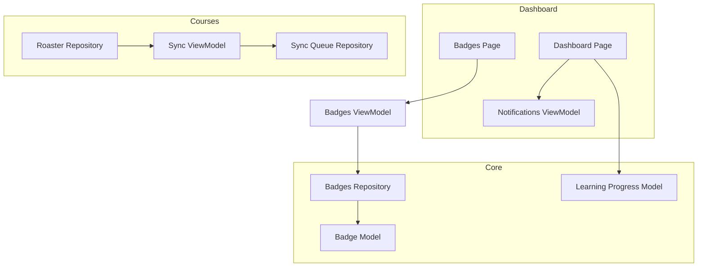
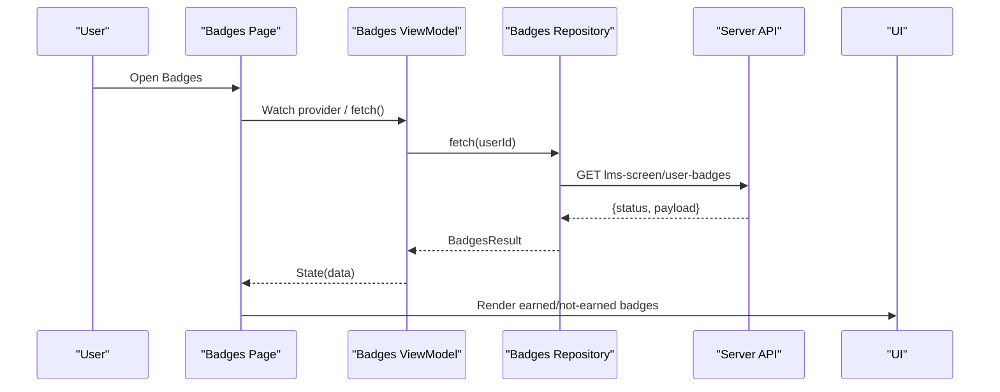
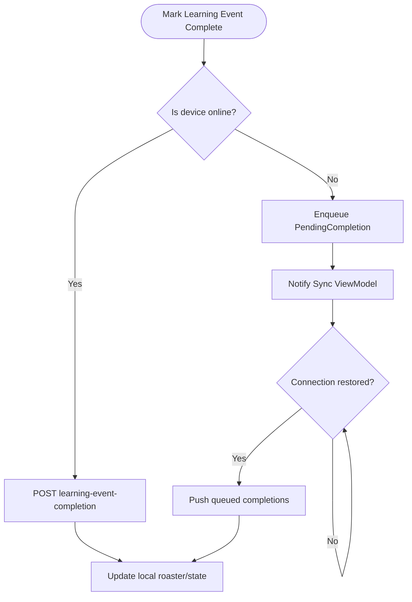
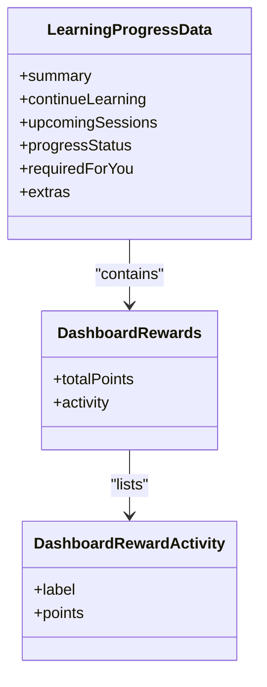
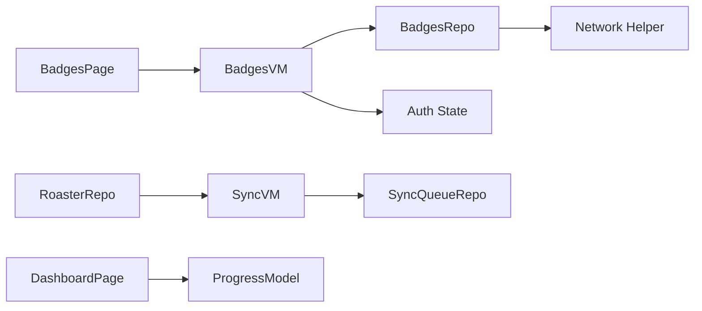

# Achievement System

<cite>
**Referenced Files in This Document**
- [badge.dart](file://lib/app/features/dashboard/model/badge.dart)
- [badges_repository.dart](file://lib/app/features/dashboard/repository/badges_repository.dart)
- [badges_view_model.dart](file://lib/app/features/dashboard/viewmodel/badges_view_model.dart)
- [badges_page.dart](file://lib/app/features/dashboard/view/badges_page.dart)
- [learning_progress_model.dart](file://lib/app/features/dashboard/model/learning_progress_model.dart)
- [roaster_repository.dart](file://lib/app/features/courses/repository/roaster_repository.dart)
- [sync_view_model.dart](file://lib/app/features/courses/viewmodel/sync_view_model.dart)
- [sync_queue_repository.dart](file://lib/app/features/courses/repository/sync_queue_repository.dart)
- [notifications_view_model.dart](file://lib/app/features/dashboard/viewmodel/notifications_view_model.dart)
- [dashboard_page.dart](file://lib/app/features/dashboard/view/dashboard_page.dart)
</cite>

## Table of Contents
1. Introduction
2. Project Structure
3. Core Components
4. Architecture Overview
5. Detailed Component Analysis
6. Dependency Analysis
7. Performance Considerations
8. Troubleshooting Guide
9. Conclusion

## Introduction
This document explains the Achievement System within the dashboard, focusing on how badges are tracked and displayed, how achievements relate to course completion events, how user activity is monitored, and how local state synchronizes with server-side records. It also covers the data model for achievements, scoring and progression tracking via points and rewards, and the notification system that informs users about milestones.

## Project Structure
The achievement system spans several layers:
- Data models define the structure of badges and related dashboard data.
- Repositories handle network calls to fetch badge lists and mark learning event completions.
- ViewModels manage UI state and orchestrate data fetching and synchronization.
- Views render earned and available badges, progress, points, and notifications.

**Diagram sources**
- [badges_page.dart:21-37](file://lib/app/features/dashboard/view/badges_page.dart#L21-L37)
- [badges_view_model.dart:30-78](file://lib/app/features/dashboard/viewmodel/badges_view_model.dart#L30-L78)
- [badges_repository.dart:6-28](file://lib/app/features/dashboard/repository/badges_repository.dart#L6-L28)
- [badge.dart:1-52](file://lib/app/features/dashboard/model/badge.dart#L1-L52)
- [learning_progress_model.dart:1-34](file://lib/app/features/dashboard/model/learning_progress_model.dart#L1-L34)
- [roaster_repository.dart:74-101](file://lib/app/features/courses/repository/roaster_repository.dart#L74-L101)
- [sync_view_model.dart:25-70](file://lib/app/features/courses/viewmodel/sync_view_model.dart#L25-L70)
- [sync_queue_repository.dart:40-77](file://lib/app/features/courses/repository/sync_queue_repository.dart#L40-L77)
- [dashboard_page.dart:2166-2318](file://lib/app/features/dashboard/view/dashboard_page.dart#L2166-L2318)

**Section sources**
- [badges_page.dart:21-37](file://lib/app/features/dashboard/view/badges_page.dart#L21-L37)
- [badges_view_model.dart:30-78](file://lib/app/features/dashboard/viewmodel/badges_view_model.dart#L30-L78)
- [badges_repository.dart:6-28](file://lib/app/features/dashboard/repository/badges_repository.dart#L6-L28)
- [badge.dart:1-52](file://lib/app/features/dashboard/model/badge.dart#L1-L52)
- [learning_progress_model.dart:1-34](file://lib/app/features/dashboard/model/learning_progress_model.dart#L1-L34)
- [roaster_repository.dart:74-101](file://lib/app/features/courses/repository/roaster_repository.dart#L74-L101)
- [sync_view_model.dart:25-70](file://lib/app/features/courses/viewmodel/sync_view_model.dart#L25-L70)
- [sync_queue_repository.dart:40-77](file://lib/app/features/courses/repository/sync_queue_repository.dart#L40-L77)
- [dashboard_page.dart:2166-2318](file://lib/app/features/dashboard/view/dashboard_page.dart#L2166-L2318)

## Core Components
- Badge data model: Represents a single badge (id, title, image) and a result container that separates earned vs not-earned badges with counts.
- Badges repository: Fetches the user’s badges from the server endpoint and maps the response into the result model.
- Badges view model: Manages loading/error/data states and triggers badge fetching using the authenticated user ID.
- Badges page: Renders earned and available badges in responsive grids, shows empty states, and provides detail dialogs for earned badges.
- Learning progress model: Includes dashboard extras such as rewards and activities used to display points and recent activities.
- Course completion flow: Marks learning events as complete, queues offline actions, and syncs when online.
- Notification system: Displays and manages notifications; supports adding local transient notifications and marking items read.

**Section sources**
- [badge.dart:1-52](file://lib/app/features/dashboard/model/badge.dart#L1-L52)
- [badges_repository.dart:6-28](file://lib/app/features/dashboard/repository/badges_repository.dart#L6-L28)
- [badges_view_model.dart:30-78](file://lib/app/features/dashboard/viewmodel/badges_view_model.dart#L30-L78)
- [badges_page.dart:148-205](file://lib/app/features/dashboard/view/badges_page.dart#L148-L205)
- [learning_progress_model.dart:1-34](file://lib/app/features/dashboard/model/learning_progress_model.dart#L1-L34)
- [roaster_repository.dart:74-101](file://lib/app/features/courses/repository/roaster_repository.dart#L74-L101)
- [sync_view_model.dart:25-70](file://lib/app/features/courses/viewmodel/sync_view_model.dart#L25-L70)
- [sync_queue_repository.dart:40-77](file://lib/app/features/courses/repository/sync_queue_repository.dart#L40-L77)
- [notifications_view_model.dart:111-146](file://lib/app/features/dashboard/viewmodel/notifications_view_model.dart#L111-L146)

## Architecture Overview
The achievement system integrates three primary flows:
- Badge retrieval and display: The Badges Page requests data through its ViewModel, which uses the Badges Repository to call the server and returns structured results for rendering.
- Course completion and progression: When a learning event is marked complete, the app either posts immediately or enqueues the action locally if offline; a background sync process pushes queued completions when connectivity is restored.
- Points and rewards visualization: The dashboard displays total points and recent reward activities derived from the learning progress model.

**Diagram sources**
- [badges_page.dart:21-37](file://lib/app/features/dashboard/view/badges_page.dart#L21-L37)
- [badges_view_model.dart:30-78](file://lib/app/features/dashboard/viewmodel/badges_view_model.dart#L30-L78)
- [badges_repository.dart:16-27](file://lib/app/features/dashboard/repository/badges_repository.dart#L16-L27)

**Section sources**
- [badges_page.dart:21-37](file://lib/app/features/dashboard/view/badges_page.dart#L21-L37)
- [badges_view_model.dart:30-78](file://lib/app/features/dashboard/viewmodel/badges_view_model.dart#L30-L78)
- [badges_repository.dart:16-27](file://lib/app/features/dashboard/repository/badges_repository.dart#L16-L27)

## Detailed Component Analysis

### Badge Data Model
- UserBadge: Contains id, title, and optional image URL. JSON parsing handles missing fields gracefully.
- BadgesResult: Aggregates earned and not-earned badge lists with counts. Parses nested payload safely.

Complexity: Parsing is O(n) over the number of badges returned by the server.

**Section sources**
- [badge.dart:1-52](file://lib/app/features/dashboard/model/badge.dart#L1-L52)

### Badges Repository
- Endpoint: Calls lms-screen/user-badges with user_id, page, and limit parameters.
- Error handling: Throws an exception when status indicates failure, propagating a message to the ViewModel.
- Caching: Explicitly disables request caching to ensure fresh badge data.

**Section sources**
- [badges_repository.dart:6-28](file://lib/app/features/dashboard/repository/badges_repository.dart#L6-L28)

### Badges ViewModel
- State management: Uses a simple state object with providerState, result, and error.
- Lifecycle: Automatically fetches badges upon creation using the current user ID from auth state.
- Error propagation: Updates state to error with a friendly message on exceptions.

**Section sources**
- [badges_view_model.dart:30-78](file://lib/app/features/dashboard/viewmodel/badges_view_model.dart#L30-L78)

### Badges Page UI
- Layout: Responsive grid showing earned badges first, then available badges.
- Empty states: Displays messages when no badges exist in either category.
- Detail dialog: For earned badges, opens a dialog describing the achievement context.
- Visual cues: Lock overlay for not-earned badges; grayscale filter applied to unearned images.

**Section sources**
- [badges_page.dart:148-205](file://lib/app/features/dashboard/view/badges_page.dart#L148-L205)
- [badges_page.dart:228-320](file://lib/app/features/dashboard/view/badges_page.dart#L228-L320)
- [badges_page.dart:322-380](file://lib/app/features/dashboard/view/badges_page.dart#L322-L380)
- [badges_page.dart:382-435](file://lib/app/features/dashboard/view/badges_page.dart#L382-L435)

### Course Completion and Progression Tracking
- Marking completion: The Roaster Repository posts to a learning-event completion endpoint with course/class identifiers and user info.
- Offline support: If offline, the app enqueues a PendingCompletion item to a Hive-backed queue.
- Sync process: A Sync ViewModel watches connectivity and pushes queued completions when online, updating roaster data accordingly.

**Diagram sources**
- [roaster_repository.dart:74-101](file://lib/app/features/courses/repository/roaster_repository.dart#L74-L101)
- [sync_view_model.dart:25-70](file://lib/app/features/courses/viewmodel/sync_view_model.dart#L25-L70)
- [sync_queue_repository.dart:40-77](file://lib/app/features/courses/repository/sync_queue_repository.dart#L40-L77)

**Section sources**
- [roaster_repository.dart:74-101](file://lib/app/features/courses/repository/roaster_repository.dart#L74-L101)
- [sync_view_model.dart:25-70](file://lib/app/features/courses/viewmodel/sync_view_model.dart#L25-L70)
- [sync_queue_repository.dart:40-77](file://lib/app/features/courses/repository/sync_queue_repository.dart#L40-L77)

### Points, Rewards, and Progress Visualization
- Points display: The dashboard renders a prominent points circle and recent reward activities with labels and point increments.
- Data source: Derived from the learning progress model’s extras block, which includes rewards and activity entries.

**Diagram sources**
- [learning_progress_model.dart:1-34](file://lib/app/features/dashboard/model/learning_progress_model.dart#L1-L34)
- [learning_progress_model.dart:353-366](file://lib/app/features/dashboard/model/learning_progress_model.dart#L353-L366)
- [dashboard_page.dart:2166-2318](file://lib/app/features/dashboard/view/dashboard_page.dart#L2166-L2318)

**Section sources**
- [learning_progress_model.dart:1-34](file://lib/app/features/dashboard/model/learning_progress_model.dart#L1-L34)
- [learning_progress_model.dart:353-366](file://lib/app/features/dashboard/model/learning_progress_model.dart#L353-L366)
- [dashboard_page.dart:2166-2318](file://lib/app/features/dashboard/view/dashboard_page.dart#L2166-L2318)

### Notification System Integration
- Local notifications: The notifications ViewModel supports adding client-generated notifications (e.g., download status, reminders) without duplicates.
- Persistence: Actions like marking a notification as read update both local state and backend records.
- UI integration: The dashboard header can show recent notifications and allow interactions.

**Section sources**
- [notifications_view_model.dart:111-146](file://lib/app/features/dashboard/viewmodel/notifications_view_model.dart#L111-L146)

## Dependency Analysis
- Coupling:
  - Badges Page depends on Badges ViewModel for state and refresh behavior.
  - Badges ViewModel depends on Badges Repository and Auth state for user identification.
  - Badges Repository depends on network helpers and server configuration.
  - Course completion depends on Roaster Repository and Sync components for offline-first reliability.
  - Dashboard UI depends on Learning Progress Model for points and rewards.
- Cohesion:
  - Each layer has a clear responsibility: models represent data, repositories handle I/O, viewmodels manage state, views render UI.
- External dependencies:
  - Server endpoints for badges and learning event completion.
  - Local storage for syncing pending completions.

**Diagram sources**
- [badges_page.dart:21-37](file://lib/app/features/dashboard/view/badges_page.dart#L21-L37)
- [badges_view_model.dart:30-78](file://lib/app/features/dashboard/viewmodel/badges_view_model.dart#L30-L78)
- [badges_repository.dart:6-28](file://lib/app/features/dashboard/repository/badges_repository.dart#L6-L28)
- [roaster_repository.dart:74-101](file://lib/app/features/courses/repository/roaster_repository.dart#L74-L101)
- [sync_view_model.dart:25-70](file://lib/app/features/courses/viewmodel/sync_view_model.dart#L25-L70)
- [sync_queue_repository.dart:40-77](file://lib/app/features/courses/repository/sync_queue_repository.dart#L40-L77)
- [learning_progress_model.dart:1-34](file://lib/app/features/dashboard/model/learning_progress_model.dart#L1-L34)

**Section sources**
- [badges_page.dart:21-37](file://lib/app/features/dashboard/view/badges_page.dart#L21-L37)
- [badges_view_model.dart:30-78](file://lib/app/features/dashboard/viewmodel/badges_view_model.dart#L30-L78)
- [badges_repository.dart:6-28](file://lib/app/features/dashboard/repository/badges_repository.dart#L6-L28)
- [roaster_repository.dart:74-101](file://lib/app/features/courses/repository/roaster_repository.dart#L74-L101)
- [sync_view_model.dart:25-70](file://lib/app/features/courses/viewmodel/sync_view_model.dart#L25-L70)
- [sync_queue_repository.dart:40-77](file://lib/app/features/courses/repository/sync_queue_repository.dart#L40-L77)
- [learning_progress_model.dart:1-34](file://lib/app/features/dashboard/model/learning_progress_model.dart#L1-L34)

## Performance Considerations
- Badge list size: The repository requests up to 200 badges per page; consider pagination or filtering if the list grows significantly.
- Image rendering: Unearned badges apply grayscale filters; ensure efficient image loading and fallbacks to avoid layout shifts.
- Offline sync: Queuing completions prevents blocking UI; batch processing during sync reduces network overhead.
- State updates: ViewModel updates are minimal and scoped to loading/data/error transitions, reducing unnecessary rebuilds.

[No sources needed since this section provides general guidance]

## Troubleshooting Guide
- Unable to load badges:
  - Cause: Server response status indicates failure or network error.
  - Action: Retry via the provided retry button; check authentication and user ID availability.
- No badges shown:
  - Earned section empty: User has not completed courses that grant badges.
  - Available section empty: No additional badges defined or all are already earned.
- Offline completion not reflected:
  - Ensure the device reconnects; the Sync ViewModel will push queued completions automatically.
  - Verify pending count badge updates after enqueueing.
- Notifications not persisting:
  - Marking as read may fail; retry or check backend connectivity.

**Section sources**
- [badges_view_model.dart:50-73](file://lib/app/features/dashboard/viewmodel/badges_view_model.dart#L50-L73)
- [badges_page.dart:463-495](file://lib/app/features/dashboard/view/badges_page.dart#L463-L495)
- [sync_view_model.dart:55-70](file://lib/app/features/courses/viewmodel/sync_view_model.dart#L55-L70)
- [notifications_view_model.dart:111-146](file://lib/app/features/dashboard/viewmodel/notifications_view_model.dart#L111-L146)

## Conclusion
The Achievement System combines a clean data model, robust repository layer, and responsive UI to present earned and available badges. Course completion events drive progression, with offline-first support ensuring reliable synchronization. Points and rewards are visualized prominently on the dashboard, while the notification system keeps users informed. Together, these components provide a cohesive experience for tracking and celebrating learner milestones.

[No sources needed since this section summarizes without analyzing specific files]