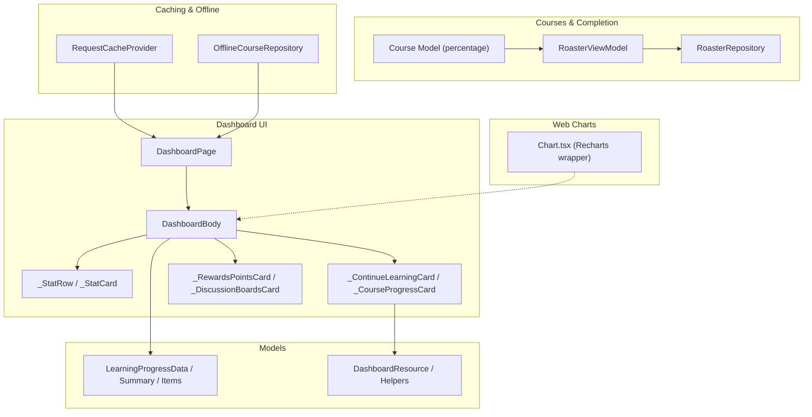
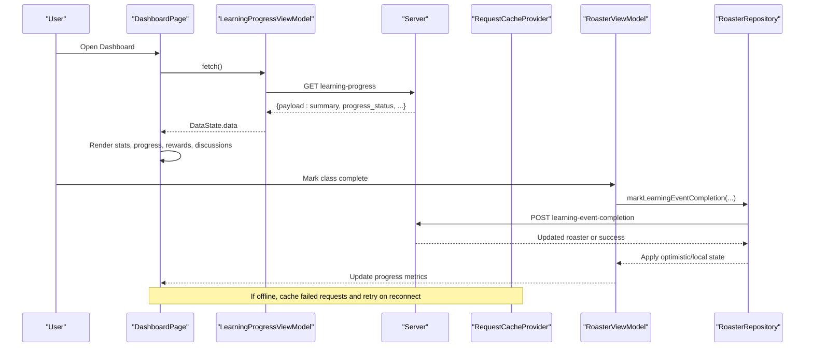
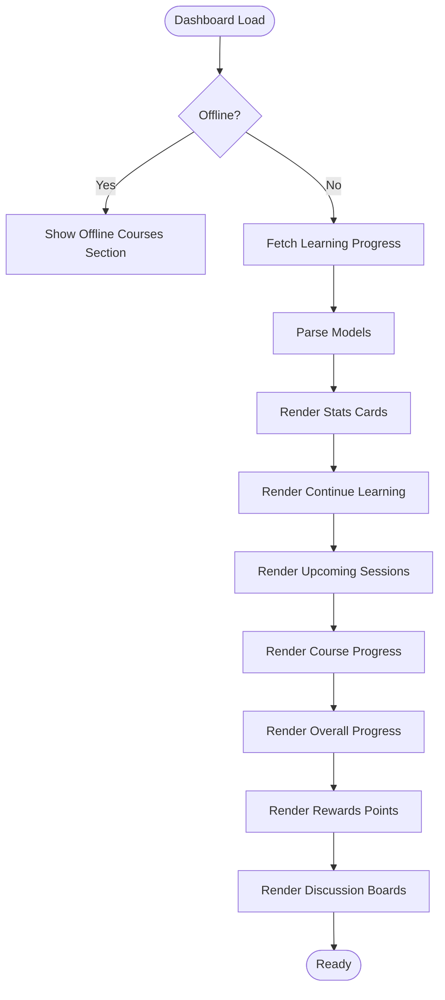
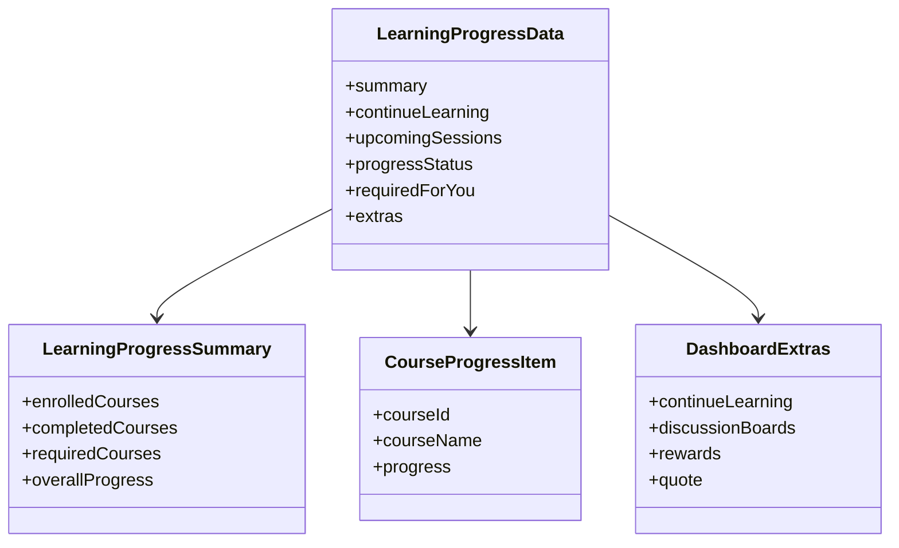
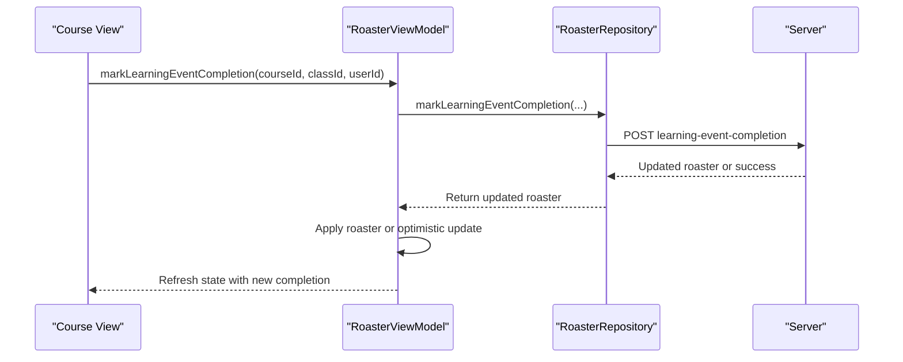
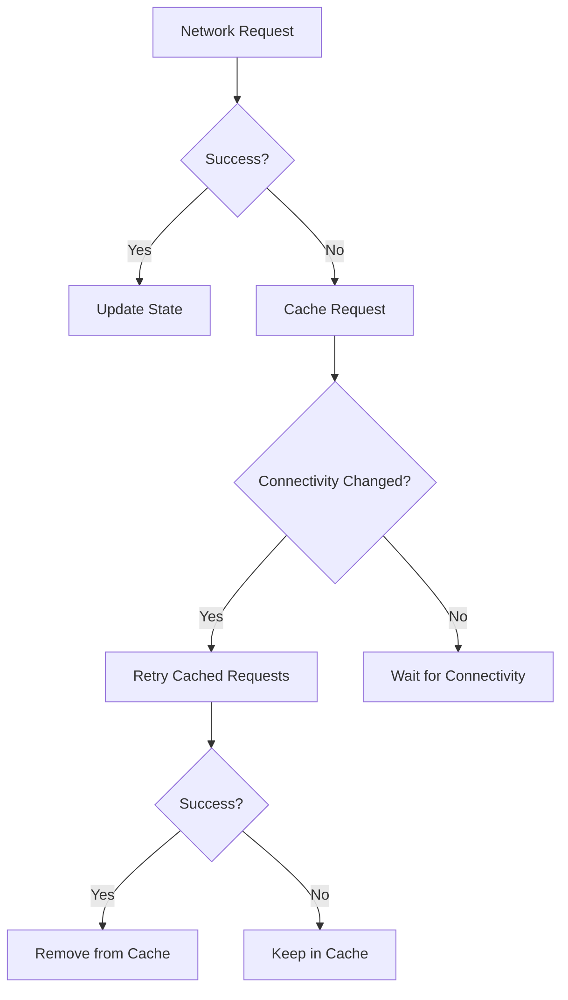
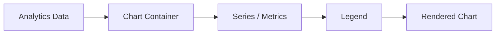
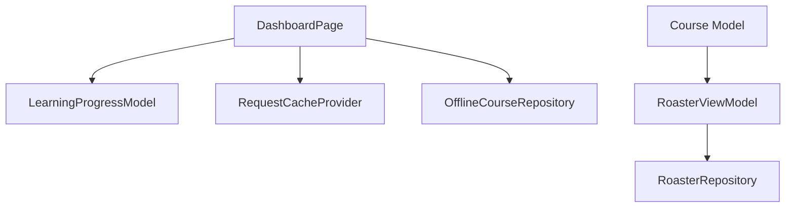

# Analytics & Reporting

<cite>
**Referenced Files in This Document**
- [dashboard_page.dart](file://lib/app/features/dashboard/view/dashboard_page.dart)
- [learning_progress_model.dart](file://lib/app/features/dashboard/model/learning_progress_model.dart)
- [dashboard.dart](file://lib/app/features/dashboard/model/dashboard.dart)
- [course.dart](file://lib/app/features/courses/model/course.dart)
- [roaster_view_model.dart](file://lib/app/features/courses/viewmodel/roaster_view_model.dart)
- [roaster_repository.dart](file://lib/app/features/courses/repository/roaster_repository.dart)
- [offline_course_repository.dart](file://lib/app/features/courses/repository/offline_course_repository.dart)
- [request_cache_provider.dart](file://lib/app/core/provider/request_cache_provider.dart)
- [chart.tsx](file://src/app/components/ui/chart.tsx)
- [main.dart](file://lib/main.dart)
</cite>

## Table of Contents
1. [Introduction](#introduction)
2. [Project Structure](#project-structure)
3. [Core Components](#core-components)
4. [Architecture Overview](#architecture-overview)
5. [Detailed Component Analysis](#detailed-component-analysis)
6. [Dependency Analysis](#dependency-analysis)
7. [Performance Considerations](#performance-considerations)
8. [Troubleshooting Guide](#troubleshooting-guide)
9. [Conclusion](#conclusion)
10. [Appendices](#appendices)

## Introduction
This document explains the Analytics and Reporting subsystem for the Learning Management System (LMS). It covers how learning analytics are collected, aggregated, calculated, and presented to users through dashboards and charts. It also documents progress trend analysis, performance insights, caching strategies, real-time updates, export considerations, and privacy/anonymization practices observed in the codebase.

## Project Structure
The analytics and reporting features span several modules:
- Dashboard UI that renders learning metrics, progress cards, upcoming sessions, rewards, and discussion activity.
- Data models that parse server payloads into typed structures for summaries, progress items, and dashboard extras.
- Course completion tracking via roaster records and repositories that mark events as completed.
- Caching and offline support for resilient data access and background synchronization.
- Charting components for visualizing metrics on the web platform.

**Diagram sources**
- [dashboard_page.dart:302-513](file://lib/app/features/dashboard/view/dashboard_page.dart#L302-L513)
- [learning_progress_model.dart:1-64](file://lib/app/features/dashboard/model/learning_progress_model.dart#L1-L64)
- [dashboard.dart:202-246](file://lib/app/features/dashboard/model/dashboard.dart#L202-L246)
- [roaster_view_model.dart:137-170](file://lib/app/features/courses/viewmodel/roaster_view_model.dart#L137-L170)
- [roaster_repository.dart:41-76](file://lib/app/features/courses/repository/roaster_repository.dart#L41-L76)
- [course.dart:255-279](file://lib/app/features/courses/model/course.dart#L255-L279)
- [request_cache_provider.dart:40-83](file://lib/app/core/provider/request_cache_provider.dart#L40-L83)
- [offline_course_repository.dart:34-65](file://lib/app/features/courses/repository/offline_course_repository.dart#L34-L65)
- [chart.tsx:1-50](file://src/app/components/ui/chart.tsx#L1-L50)

**Section sources**
- [dashboard_page.dart:302-513](file://lib/app/features/dashboard/view/dashboard_page.dart#L302-L513)
- [learning_progress_model.dart:1-64](file://lib/app/features/dashboard/model/learning_progress_model.dart#L1-L64)
- [dashboard.dart:202-246](file://lib/app/features/dashboard/model/dashboard.dart#L202-L246)
- [roaster_view_model.dart:137-170](file://lib/app/features/courses/viewmodel/roaster_view_model.dart#L137-L170)
- [roaster_repository.dart:41-76](file://lib/app/features/courses/repository/roaster_repository.dart#L41-L76)
- [course.dart:255-279](file://lib/app/features/courses/model/course.dart#L255-L279)
- [request_cache_provider.dart:40-83](file://lib/app/core/provider/request_cache_provider.dart#L40-L83)
- [offline_course_repository.dart:34-65](file://lib/app/features/courses/repository/offline_course_repository.dart#L34-L65)
- [chart.tsx:1-50](file://src/app/components/ui/chart.tsx#L1-L50)

## Core Components
- Dashboard UI: Renders summary stats (enrolled, required, completed), continue-learning entries, upcoming sessions, course progress, overall progress, rewards points, and discussion board activity. It also handles refresh, error states, and offline fallbacks.
- Learning Progress Models: Parse server responses into structured data including summary counts, per-course progress, required courses, and dashboard extras (continue learning, discussion boards, rewards, quotes).
- Course Completion Tracking: Marks learning events as completed via roaster endpoints; calculates course percentage based on completed classes.
- Caching and Offline Support: Stores failed requests and retries when connectivity is restored; supports saving courses for offline access with bounded pagination.
- Web Charting: Provides a Recharts-based chart container and legend for visualization on the web platform.

**Section sources**
- [dashboard_page.dart:302-513](file://lib/app/features/dashboard/view/dashboard_page.dart#L302-L513)
- [learning_progress_model.dart:1-64](file://lib/app/features/dashboard/model/learning_progress_model.dart#L1-L64)
- [course.dart:255-279](file://lib/app/features/courses/model/course.dart#L255-L279)
- [request_cache_provider.dart:40-83](file://lib/app/core/provider/request_cache_provider.dart#L40-L83)
- [offline_course_repository.dart:34-65](file://lib/app/features/courses/repository/offline_course_repository.dart#L34-L65)
- [chart.tsx:1-50](file://src/app/components/ui/chart.tsx#L1-L50)

## Architecture Overview
The analytics pipeline begins with the dashboard fetching learning progress data from the server. The response is parsed into typed models and rendered across multiple widgets. Completion events update roaster records, which feed back into progress calculations and dashboard metrics. Caching ensures resilience during network issues, while offline mode serves locally saved content. On the web, charts visualize metrics using a reusable chart component.

**Diagram sources**
- [dashboard_page.dart:126-128](file://lib/app/features/dashboard/view/dashboard_page.dart#L126-L128)
- [dashboard_page.dart:302-513](file://lib/app/features/dashboard/view/dashboard_page.dart#L302-L513)
- [learning_progress_model.dart:1-64](file://lib/app/features/dashboard/model/learning_progress_model.dart#L1-L64)
- [roaster_view_model.dart:137-170](file://lib/app/features/courses/viewmodel/roaster_view_model.dart#L137-L170)
- [roaster_repository.dart:41-76](file://lib/app/features/courses/repository/roaster_repository.dart#L41-L76)
- [request_cache_provider.dart:40-83](file://lib/app/core/provider/request_cache_provider.dart#L40-L83)

## Detailed Component Analysis

### Dashboard Analytics UI
- Displays enrolled, required, and completed counts via stat cards.
- Shows continue-learning entries cross-referenced with per-course progress.
- Presents upcoming sessions with reminders for near-start events.
- Renders course progress list and overall progress.
- Includes rewards points and discussion board activity.
- Handles offline mode by showing offline-saved courses instead of failing live fetches.

**Diagram sources**
- [dashboard_page.dart:140-153](file://lib/app/features/dashboard/view/dashboard_page.dart#L140-L153)
- [dashboard_page.dart:302-513](file://lib/app/features/dashboard/view/dashboard_page.dart#L302-L513)

**Section sources**
- [dashboard_page.dart:140-153](file://lib/app/features/dashboard/view/dashboard_page.dart#L140-L153)
- [dashboard_page.dart:302-513](file://lib/app/features/dashboard/view/dashboard_page.dart#L302-L513)

### Learning Progress Models and Aggregation
- Parses payload sections: summary, continue_learning, upcoming_sessions, progress_status, required_for_you, and dashboard extras.
- Computes derived values such as formatted due dates and combined date/time for session start times.
- Supports flexible fields and null safety for robust parsing.

**Diagram sources**
- [learning_progress_model.dart:1-64](file://lib/app/features/dashboard/model/learning_progress_model.dart#L1-L64)
- [learning_progress_model.dart:66-86](file://lib/app/features/dashboard/model/learning_progress_model.dart#L66-L86)
- [learning_progress_model.dart:158-175](file://lib/app/features/dashboard/model/learning_progress_model.dart#L158-L175)
- [learning_progress_model.dart:202-231](file://lib/app/features/dashboard/model/learning_progress_model.dart#L202-L231)

**Section sources**
- [learning_progress_model.dart:1-64](file://lib/app/features/dashboard/model/learning_progress_model.dart#L1-L64)
- [learning_progress_model.dart:66-86](file://lib/app/features/dashboard/model/learning_progress_model.dart#L66-L86)
- [learning_progress_model.dart:158-175](file://lib/app/features/dashboard/model/learning_progress_model.dart#L158-L175)
- [learning_progress_model.dart:202-231](file://lib/app/features/dashboard/model/learning_progress_model.dart#L202-L231)

### Course Completion and Progress Calculation
- Marking a learning event as completed triggers an API call; if successful, the updated roaster record is applied to local state; otherwise, an optimistic update is used.
- Course percentage is computed from the ratio of completed classes to total classes.

**Diagram sources**
- [roaster_view_model.dart:137-170](file://lib/app/features/courses/viewmodel/roaster_view_model.dart#L137-L170)
- [roaster_repository.dart:41-76](file://lib/app/features/courses/repository/roaster_repository.dart#L41-L76)
- [course.dart:255-279](file://lib/app/features/courses/model/course.dart#L255-L279)

**Section sources**
- [roaster_view_model.dart:137-170](file://lib/app/features/courses/viewmodel/roaster_view_model.dart#L137-L170)
- [roaster_repository.dart:41-76](file://lib/app/features/courses/repository/roaster_repository.dart#L41-L76)
- [course.dart:255-279](file://lib/app/features/courses/model/course.dart#L255-L279)

### Caching Strategy and Real-Time Updates
- Failed requests are cached and retried when connectivity is restored, ensuring analytics data eventually syncs.
- Offline mode bypasses live dashboard fetches and shows locally saved courses to avoid errors.
- Background re-fetch after marking completion helps propagate status without immediate re-fetch conflicts.

**Diagram sources**
- [request_cache_provider.dart:40-83](file://lib/app/core/provider/request_cache_provider.dart#L40-L83)
- [dashboard_page.dart:140-153](file://lib/app/features/dashboard/view/dashboard_page.dart#L140-L153)
- [roaster_view_model.dart:137-170](file://lib/app/features/courses/viewmodel/roaster_view_model.dart#L137-L170)

**Section sources**
- [request_cache_provider.dart:40-83](file://lib/app/core/provider/request_cache_provider.dart#L40-L83)
- [dashboard_page.dart:140-153](file://lib/app/features/dashboard/view/dashboard_page.dart#L140-L153)
- [roaster_view_model.dart:137-170](file://lib/app/features/courses/viewmodel/roaster_view_model.dart#L137-L170)

### Data Visualization Components
- The web platform includes a Recharts-based chart container and legend for rendering analytics visuals.
- Dashboards use custom widgets for stats and progress; charts can be integrated where needed for trend analysis.

**Diagram sources**
- [chart.tsx:1-50](file://src/app/components/ui/chart.tsx#L1-L50)
- [chart.tsx:251-293](file://src/app/components/ui/chart.tsx#L251-L293)

**Section sources**
- [chart.tsx:1-50](file://src/app/components/ui/chart.tsx#L1-L50)
- [chart.tsx:251-293](file://src/app/components/ui/chart.tsx#L251-L293)

## Dependency Analysis
- Dashboard UI depends on learning progress models and viewmodels to render analytics.
- Course completion logic depends on roaster viewmodel and repository to update server state and local progress.
- Caching provider interacts with connectivity changes to ensure eventual consistency.
- Offline repository manages bounded pagination and resource downloads for offline access.

**Diagram sources**
- [dashboard_page.dart:302-513](file://lib/app/features/dashboard/view/dashboard_page.dart#L302-L513)
- [learning_progress_model.dart:1-64](file://lib/app/features/dashboard/model/learning_progress_model.dart#L1-L64)
- [request_cache_provider.dart:40-83](file://lib/app/core/provider/request_cache_provider.dart#L40-L83)
- [offline_course_repository.dart:34-65](file://lib/app/features/courses/repository/offline_course_repository.dart#L34-L65)
- [roaster_view_model.dart:137-170](file://lib/app/features/courses/viewmodel/roaster_view_model.dart#L137-L170)
- [roaster_repository.dart:41-76](file://lib/app/features/courses/repository/roaster_repository.dart#L41-L76)
- [course.dart:255-279](file://lib/app/features/courses/model/course.dart#L255-L279)

**Section sources**
- [dashboard_page.dart:302-513](file://lib/app/features/dashboard/view/dashboard_page.dart#L302-L513)
- [learning_progress_model.dart:1-64](file://lib/app/features/dashboard/model/learning_progress_model.dart#L1-L64)
- [request_cache_provider.dart:40-83](file://lib/app/core/provider/request_cache_provider.dart#L40-L83)
- [offline_course_repository.dart:34-65](file://lib/app/features/courses/repository/offline_course_repository.dart#L34-L65)
- [roaster_view_model.dart:137-170](file://lib/app/features/courses/viewmodel/roaster_view_model.dart#L137-L170)
- [roaster_repository.dart:41-76](file://lib/app/features/courses/repository/roaster_repository.dart#L41-L76)
- [course.dart:255-279](file://lib/app/features/courses/model/course.dart#L255-L279)

## Performance Considerations
- Bounded pagination prevents indefinite fetching when downloading course content for offline use.
- Optimistic updates reduce perceived latency when marking completions; background re-fetch avoids immediate overwrite conflicts.
- Caching failed requests minimizes redundant network calls and improves resilience.
- Dashboard layout adapts to screen sizes to optimize rendering performance and user experience.

[No sources needed since this section provides general guidance]

## Troubleshooting Guide
- Unauthorized errors trigger redirection to login; ensure session validity before dashboard loads.
- Offline mode displays saved courses; connect to the internet to refresh live analytics.
- Completion marking may fall back to alternative endpoints if primary endpoint fails; verify network and permissions.
- Caching retries depend on connectivity changes; check device network settings.

**Section sources**
- [dashboard_page.dart:172-180](file://lib/app/features/dashboard/view/dashboard_page.dart#L172-L180)
- [dashboard_page.dart:140-153](file://lib/app/features/dashboard/view/dashboard_page.dart#L140-L153)
- [roaster_view_model.dart:137-170](file://lib/app/features/courses/viewmodel/roaster_view_model.dart#L137-L170)
- [request_cache_provider.dart:40-83](file://lib/app/core/provider/request_cache_provider.dart#L40-L83)

## Conclusion
The Analytics and Reporting subsystem integrates dashboard UI, robust data models, completion tracking, caching, and charting to deliver comprehensive learning analytics. It balances real-time updates with offline resilience and optimizes performance through bounded operations and optimistic updates. Privacy considerations are addressed by avoiding unnecessary personal data exposure in analytics views and relying on server-provided labels and aggregates.

[No sources needed since this section summarizes without analyzing specific files]

## Appendices

### Examples of Custom Analytics Widgets
- Stat cards for enrolled, required, and completed counts.
- Continue-learning card with descriptions and due dates.
- Rewards points card aggregating activity points.
- Discussion boards card showing recent activity and reply counts.

**Section sources**
- [dashboard_page.dart:671-793](file://lib/app/features/dashboard/view/dashboard_page.dart#L671-L793)
- [dashboard_page.dart:523-560](file://lib/app/features/dashboard/view/dashboard_page.dart#L523-L560)
- [dashboard_page.dart:466-496](file://lib/app/features/dashboard/view/dashboard_page.dart#L466-L496)

### Export Functionality
- No explicit export endpoints or functions were identified in the analyzed files. Export capabilities would require additional implementation beyond current scope.

[No sources needed since this section does not analyze specific files]

### Privacy and Data Anonymization
- Analytics views primarily display aggregated counts and labels provided by the server.
- Personal identifiers are minimized in UI; banners include greeting and username only as part of dashboard extras.
- No direct PII collection mechanisms were found in the analyzed analytics components.

**Section sources**
- [learning_progress_model.dart:237-265](file://lib/app/features/dashboard/model/learning_progress_model.dart#L237-L265)
- [dashboard_page.dart:564-667](file://lib/app/features/dashboard/view/dashboard_page.dart#L564-L667)