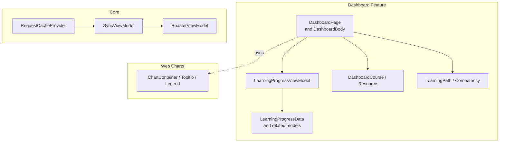
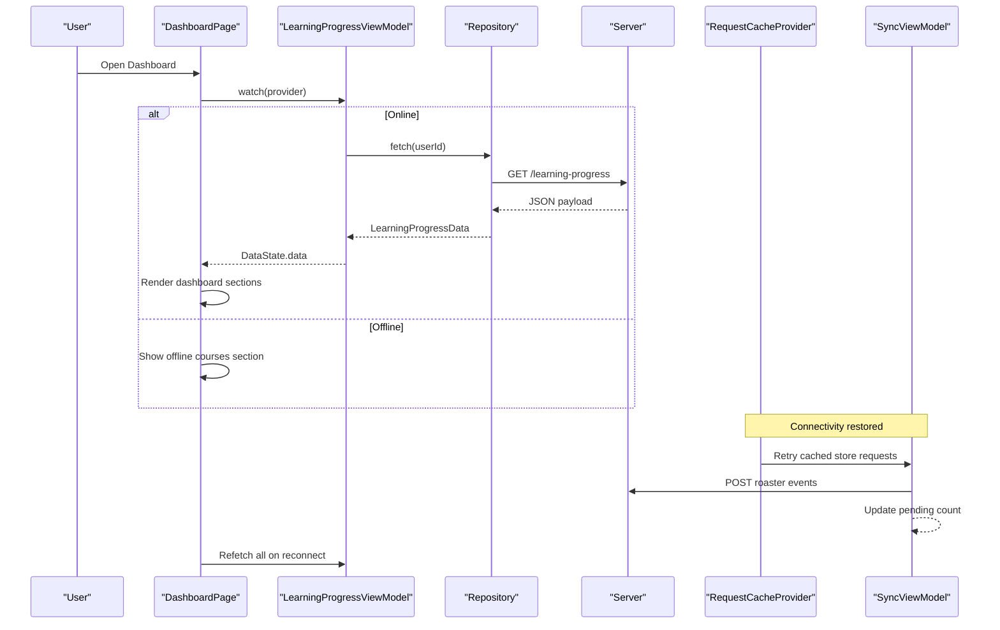
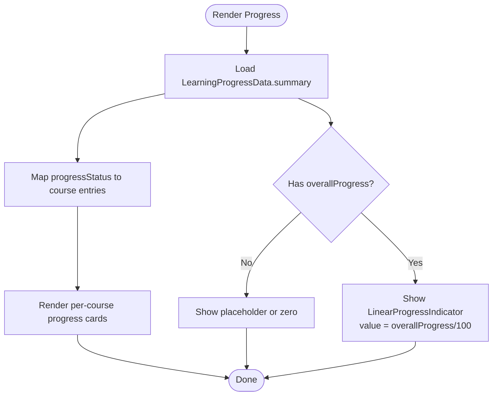
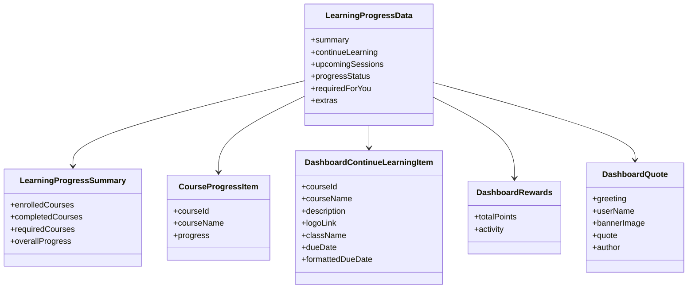
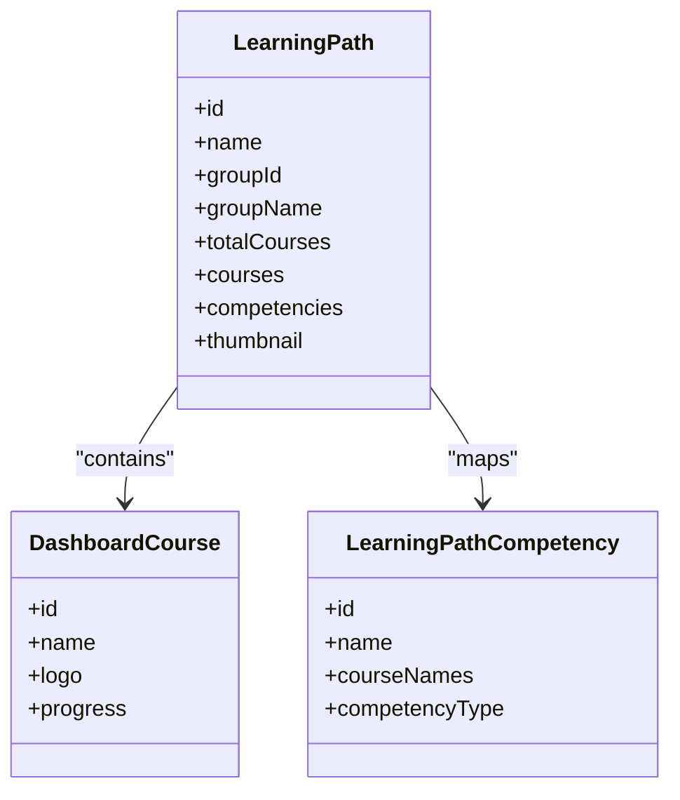
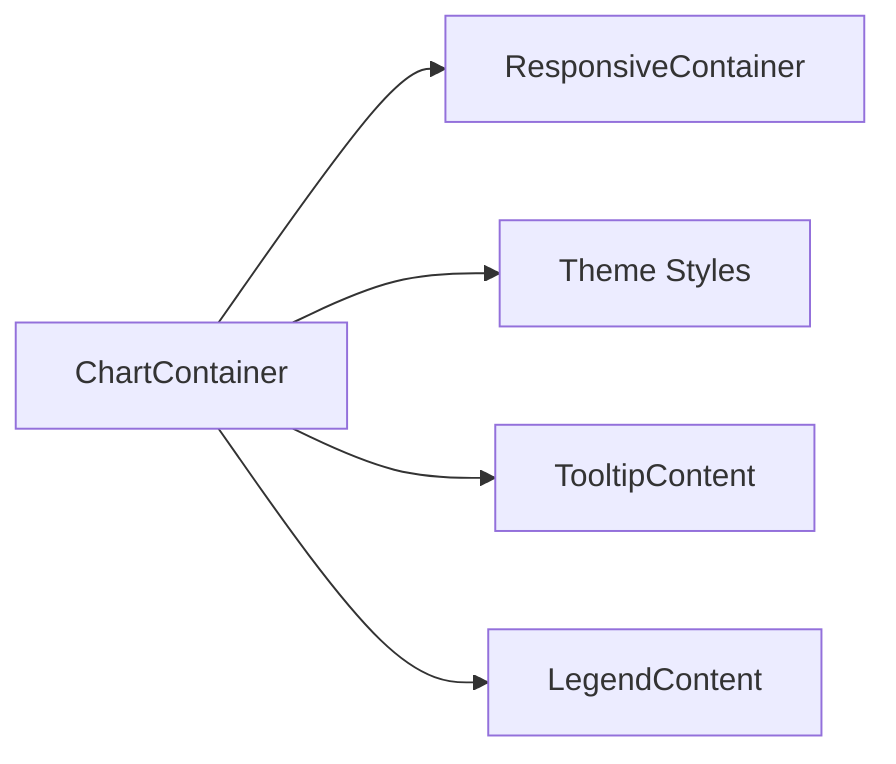
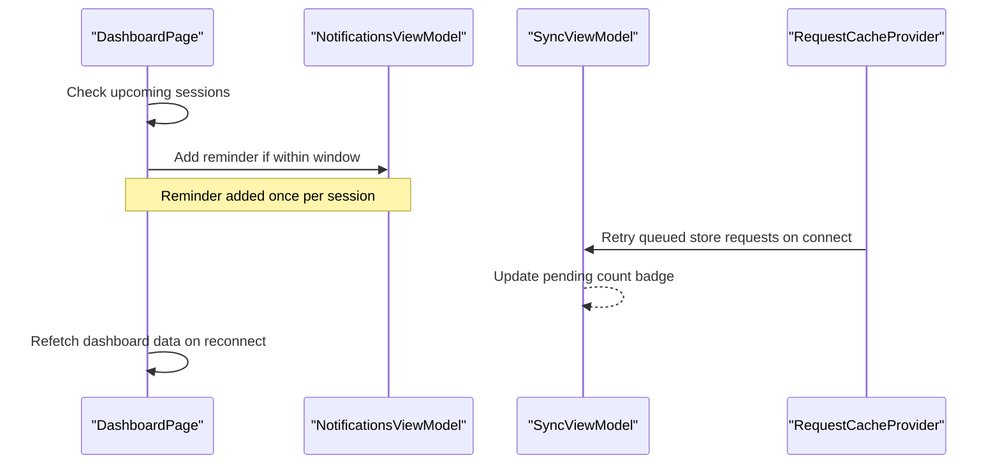
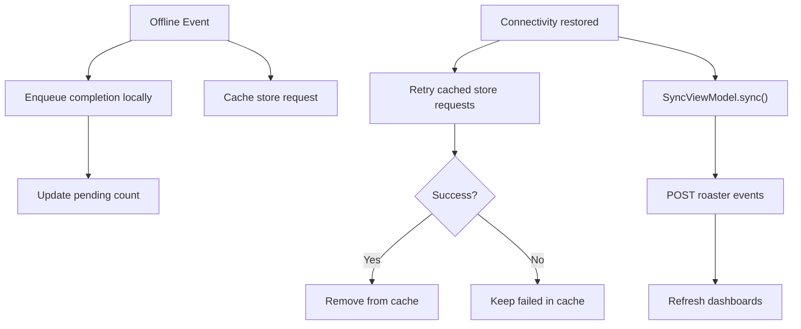
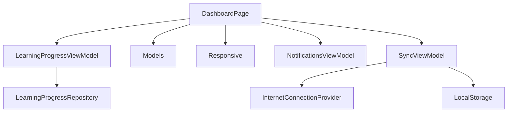

# Dashboard & Analytics

<cite>
**Referenced Files in This Document**
- [dashboard_page.dart](file://lib/app/features/dashboard/view/dashboard_page.dart)
- [learning_progress_model.dart](file://lib/app/features/dashboard/model/learning_progress_model.dart)
- [dashboard_model.dart](file://lib/app/features/dashboard/model/dashboard.dart)
- [learning_path_model.dart](file://lib/app/features/dashboard/model/learning_path.dart)
- [learning_progress_view_model.dart](file://lib/app/features/dashboard/viewmodel/learning_progress_view_model.dart)
- [sync_view_model.dart](file://lib/app/features/courses/viewmodel/sync_view_model.dart)
- [roaster_view_model.dart](file://lib/app/features/courses/viewmodel/roaster_view_model.dart)
- [request_cache_provider.dart](file://lib/app/core/provider/request_cache_provider.dart)
- [chart.tsx](file://src/app/components/ui/chart.tsx)
</cite>

## Table of Contents
1. [Introduction](#introduction)
2. [Project Structure](#project-structure)
3. [Core Components](#core-components)
4. [Architecture Overview](#architecture-overview)
5. [Detailed Component Analysis](#detailed-component-analysis)
6. [Dependency Analysis](#dependency-analysis)
7. [Performance Considerations](#performance-considerations)
8. [Troubleshooting Guide](#troubleshooting-guide)
9. [Conclusion](#conclusion)

## Introduction
This document explains the Dashboard & Analytics feature module, focusing on the dashboard interface design, progress visualization components, and analytics data presentation. It details how course completion metrics, achievements, and learning path progression are aggregated and displayed, including chart implementations, responsive design patterns, real-time updates for progress indicators, and synchronization between local cache and server for accurate analytics reporting.

## Project Structure
The dashboard is implemented primarily in Flutter under the features directory with a clear separation of concerns:
- View layer: dashboard page and widgets that render the UI
- Models: structured representations of API payloads (progress, rewards, quotes, discussion boards, courses, learning paths)
- ViewModels: state management and data fetching orchestration
- Core providers: caching and connectivity handling
- Web charting utilities: reusable chart components for analytics visualizations

**Diagram sources**
- [dashboard_page.dart:130-513](file://lib/app/features/dashboard/view/dashboard_page.dart#L130-L513)
- [learning_progress_view_model.dart:7-59](file://lib/app/features/dashboard/viewmodel/learning_progress_view_model.dart#L7-L59)
- [learning_progress_model.dart:1-64](file://lib/app/features/dashboard/model/learning_progress_model.dart#L1-L64)
- [dashboard_model.dart:42-162](file://lib/app/features/dashboard/model/dashboard.dart#L42-L162)
- [learning_path_model.dart:3-41](file://lib/app/features/dashboard/model/learning_path.dart#L3-L41)
- [sync_view_model.dart:55-117](file://lib/app/features/courses/viewmodel/sync_view_model.dart#L55-L117)
- [request_cache_provider.dart:63-78](file://lib/app/core/provider/request_cache_provider.dart#L63-L78)
- [chart.tsx:37-69](file://src/app/components/ui/chart.tsx#L37-L69)

**Section sources**
- [dashboard_page.dart:130-513](file://lib/app/features/dashboard/view/dashboard_page.dart#L130-L513)
- [learning_progress_view_model.dart:7-59](file://lib/app/features/dashboard/viewmodel/learning_progress_view_model.dart#L7-L59)
- [learning_progress_model.dart:1-64](file://lib/app/features/dashboard/model/learning_progress_model.dart#L1-L64)
- [dashboard_model.dart:42-162](file://lib/app/features/dashboard/model/dashboard.dart#L42-L162)
- [learning_path_model.dart:3-41](file://lib/app/features/dashboard/model/learning_path.dart#L3-L41)
- [sync_view_model.dart:55-117](file://lib/app/features/courses/viewmodel/sync_view_model.dart#L55-L117)
- [request_cache_provider.dart:63-78](file://lib/app/core/provider/request_cache_provider.dart#L63-L78)
- [chart.tsx:37-69](file://src/app/components/ui/chart.tsx#L37-L69)

## Core Components
- DashboardPage and DashboardBody: Main entry points that fetch and render dashboard sections, handle offline mode, refresh behavior, and responsive layouts.
- LearningProgressViewModel: Orchestrates fetching dashboard progress data and manages loading/error states.
- Data models: Represent summary metrics, continue-learning items, upcoming sessions, progress status, required courses, rewards, quotes, discussion boards, and learning paths.
- Sync and caching: Ensure analytics remain accurate by syncing queued completions and re-sending cached requests when connectivity returns.
- Chart utilities: Provide reusable chart containers, tooltips, and legends for analytics visualizations.

Key responsibilities:
- Present enrollment, required, and completed counts
- Show continue-learning recommendations with due dates and logos
- Display upcoming sessions and trigger reminders
- Visualize overall progress and per-course progress
- Surface rewards points and activity
- List discussion board activity
- Handle supervisor/mentor confirm overlays

**Section sources**
- [dashboard_page.dart:130-513](file://lib/app/features/dashboard/view/dashboard_page.dart#L130-L513)
- [learning_progress_view_model.dart:7-59](file://lib/app/features/dashboard/viewmodel/learning_progress_view_model.dart#L7-L59)
- [learning_progress_model.dart:1-64](file://lib/app/features/dashboard/model/learning_progress_model.dart#L1-L64)
- [dashboard_model.dart:42-162](file://lib/app/features/dashboard/model/dashboard.dart#L42-L162)
- [sync_view_model.dart:55-117](file://lib/app/features/courses/viewmodel/sync_view_model.dart#L55-L117)
- [request_cache_provider.dart:63-78](file://lib/app/core/provider/request_cache_provider.dart#L63-L78)
- [chart.tsx:37-69](file://src/app/components/ui/chart.tsx#L37-L69)

## Architecture Overview
The dashboard follows a state-driven architecture:
- The view watches a Riverpod provider for dashboard data
- On load or refresh, the view model calls the repository to fetch progress data
- Models parse the payload into strongly-typed structures
- UI renders responsive cards and lists based on device width
- Offline mode shows saved courses; online mode fetches live data
- When connectivity changes, cached requests are retried and screens refetch

**Diagram sources**
- [dashboard_page.dart:130-195](file://lib/app/features/dashboard/view/dashboard_page.dart#L130-L195)
- [learning_progress_view_model.dart:28-42](file://lib/app/features/dashboard/viewmodel/learning_progress_view_model.dart#L28-L42)
- [request_cache_provider.dart:63-78](file://lib/app/core/provider/request_cache_provider.dart#L63-L78)
- [sync_view_model.dart:55-117](file://lib/app/features/courses/viewmodel/sync_view_model.dart#L55-L117)

## Detailed Component Analysis

### Dashboard Interface Design and Responsive Layouts
- The dashboard body adapts layout based on screen size using responsive helpers:
  - Mobile: vertical stacking with an overall progress card between continue-learning and upcoming sessions
  - Tablet/Desktop: two-column rows for continue-learning + upcoming sessions, and course progress + overall progress
- Cards use consistent padding, borders, and typography aligned with design tokens
- Refresh indicator triggers a full refetch of dashboard data
- Banner displays personalized greeting, quote, and background image from the API

Examples of custom widgets:
- Stat row and stat cards for enrolled, required, and completed counts
- Continue-learning card with description, logo, class name, and due date
- Upcoming sessions card with virtual class badges
- Course progress card showing per-course percentages
- Overall progress card with a linear progress indicator
- Rewards points card and discussion boards card

Real-time updates:
- Reminders for upcoming sessions within a defined window are added locally once per session
- Supervisor/mentor confirmation overlays appear sequentially with proper lifecycle guards

**Section sources**
- [dashboard_page.dart:302-513](file://lib/app/features/dashboard/view/dashboard_page.dart#L302-L513)
- [dashboard_page.dart:564-667](file://lib/app/features/dashboard/view/dashboard_page.dart#L564-L667)
- [dashboard_page.dart:671-793](file://lib/app/features/dashboard/view/dashboard_page.dart#L671-L793)
- [dashboard_page.dart:1896-1919](file://lib/app/features/dashboard/view/dashboard_page.dart#L1896-L1919)
- [dashboard_page.dart:1923-1932](file://lib/app/features/dashboard/view/dashboard_page.dart#L1923-L1932)

### Progress Visualization Components
- Overall progress is shown via a linear progress indicator driven by the summary’s overall percentage
- Per-course progress is rendered as individual entries with percentage values
- Stat cards animate counters for quick readability
- Responsive sizing ensures clarity across devices

**Diagram sources**
- [dashboard_page.dart:430-464](file://lib/app/features/dashboard/view/dashboard_page.dart#L430-L464)
- [dashboard_page.dart:1896-1919](file://lib/app/features/dashboard/view/dashboard_page.dart#L1896-L1919)

**Section sources**
- [dashboard_page.dart:430-464](file://lib/app/features/dashboard/view/dashboard_page.dart#L430-L464)
- [dashboard_page.dart:1896-1919](file://lib/app/features/dashboard/view/dashboard_page.dart#L1896-L1919)

### Analytics Data Presentation and Aggregation Logic
- Summary metrics:
  - Enrolled courses, required courses, completed courses, and overall progress are parsed from the summary object
- Continue-learning aggregation:
  - Items include descriptions, logos, class names, and due dates
  - Progress values are cross-referenced against progress_status keyed by course ID
- Upcoming sessions:
  - Dates/times are combined and converted to local time for display
  - Reminders are generated if a session starts within a threshold window
- Required courses:
  - Displays raw progress labels (including non-numeric states like “Not Enrolled”)
- Rewards and discussion boards:
  - Points totals and recent activity are surfaced in dedicated cards

**Diagram sources**
- [learning_progress_model.dart:1-64](file://lib/app/features/dashboard/model/learning_progress_model.dart#L1-L64)
- [learning_progress_model.dart:66-86](file://lib/app/features/dashboard/model/learning_progress_model.dart#L66-L86)
- [learning_progress_model.dart:158-175](file://lib/app/features/dashboard/model/learning_progress_model.dart#L158-L175)
- [learning_progress_model.dart:267-315](file://lib/app/features/dashboard/model/learning_progress_model.dart#L267-L315)
- [learning_progress_model.dart:365-377](file://lib/app/features/dashboard/model/learning_progress_model.dart#L365-L377)
- [learning_progress_model.dart:237-265](file://lib/app/features/dashboard/model/learning_progress_model.dart#L237-L265)

**Section sources**
- [learning_progress_model.dart:1-64](file://lib/app/features/dashboard/model/learning_progress_model.dart#L1-L64)
- [learning_progress_model.dart:66-86](file://lib/app/features/dashboard/model/learning_progress_model.dart#L66-L86)
- [learning_progress_model.dart:158-175](file://lib/app/features/dashboard/model/learning_progress_model.dart#L158-L175)
- [learning_progress_model.dart:267-315](file://lib/app/features/dashboard/model/learning_progress_model.dart#L267-L315)
- [learning_progress_model.dart:365-377](file://lib/app/features/dashboard/model/learning_progress_model.dart#L365-L377)
- [learning_progress_model.dart:237-265](file://lib/app/features/dashboard/model/learning_progress_model.dart#L237-L265)

### Learning Path Progression
- Learning paths group courses and competencies
- Each path includes total courses, list of courses, and associated competencies
- Thumbnails derive from the first course’s logo when available
- Competencies map to course names either via arrays or comma-separated strings

**Diagram sources**
- [learning_path_model.dart:3-41](file://lib/app/features/dashboard/model/learning_path.dart#L3-L41)
- [learning_path_model.dart:43-81](file://lib/app/features/dashboard/model/learning_path.dart#L43-L81)
- [dashboard_model.dart:42-162](file://lib/app/features/dashboard/model/dashboard.dart#L42-L162)

**Section sources**
- [learning_path_model.dart:3-41](file://lib/app/features/dashboard/model/learning_path.dart#L3-L41)
- [learning_path_model.dart:43-81](file://lib/app/features/dashboard/model/learning_path.dart#L43-L81)
- [dashboard_model.dart:42-162](file://lib/app/features/dashboard/model/dashboard.dart#L42-L162)

### Chart Implementations and Reusability
- The web charting layer provides a reusable container with responsive sizing and theme-aware styling
- Tooltips and legends are configurable via a chart configuration object
- These components can be used to visualize analytics such as progress trends, reward activity, or course completion rates

**Diagram sources**
- [chart.tsx:37-69](file://src/app/components/ui/chart.tsx#L37-L69)
- [chart.tsx:107-249](file://src/app/components/ui/chart.tsx#L107-L249)
- [chart.tsx:253-305](file://src/app/components/ui/chart.tsx#L253-L305)

**Section sources**
- [chart.tsx:37-69](file://src/app/components/ui/chart.tsx#L37-L69)
- [chart.tsx:107-249](file://src/app/components/ui/chart.tsx#L107-L249)
- [chart.tsx:253-305](file://src/app/components/ui/chart.tsx#L253-L305)

### Real-Time Updates for Progress Indicators
- Session reminders are computed on dashboard load and added once per session
- When connectivity is restored, cached store requests are retried and dashboards refetch to reflect latest progress
- Pending completion queue updates are reflected in UI via sync state

**Diagram sources**
- [dashboard_page.dart:155-180](file://lib/app/features/dashboard/view/dashboard_page.dart#L155-L180)
- [sync_view_model.dart:91-117](file://lib/app/features/courses/viewmodel/sync_view_model.dart#L91-L117)
- [request_cache_provider.dart:63-78](file://lib/app/core/provider/request_cache_provider.dart#L63-L78)

**Section sources**
- [dashboard_page.dart:155-180](file://lib/app/features/dashboard/view/dashboard_page.dart#L155-L180)
- [sync_view_model.dart:91-117](file://lib/app/features/courses/viewmodel/sync_view_model.dart#L91-L117)
- [request_cache_provider.dart:63-78](file://lib/app/core/provider/request_cache_provider.dart#L63-L78)

### Data Synchronization Between Local Cache and Server
- Store requests are cached locally when offline and replayed when connectivity returns
- Completion events are enqueued locally when offline and synced later
- SyncViewModel orchestrates flushing the queue and refreshing all screens upon reconnect

**Diagram sources**
- [roaster_view_model.dart:106-138](file://lib/app/features/courses/viewmodel/roaster_view_model.dart#L106-L138)
- [sync_view_model.dart:55-117](file://lib/app/features/courses/viewmodel/sync_view_model.dart#L55-L117)
- [request_cache_provider.dart:63-78](file://lib/app/core/provider/request_cache_provider.dart#L63-L78)

**Section sources**
- [roaster_view_model.dart:106-138](file://lib/app/features/courses/viewmodel/roaster_view_model.dart#L106-L138)
- [sync_view_model.dart:55-117](file://lib/app/features/courses/viewmodel/sync_view_model.dart#L55-L117)
- [request_cache_provider.dart:63-78](file://lib/app/core/provider/request_cache_provider.dart#L63-L78)

## Dependency Analysis
- DashboardPage depends on:
  - LearningProgressViewModel for data state
  - Models for parsing and presenting data
  - Responsive utilities for layout adaptation
  - Notification and sync providers for reminders and connectivity
- LearningProgressViewModel depends on:
  - Authentication state for user context
  - Repository abstraction for data fetching
- Sync and caching depend on:
  - Internet connection provider
  - Local storage provider
  - Cached request repository

**Diagram sources**
- [dashboard_page.dart:130-195](file://lib/app/features/dashboard/view/dashboard_page.dart#L130-L195)
- [learning_progress_view_model.dart:7-23](file://lib/app/features/dashboard/viewmodel/learning_progress_view_model.dart#L7-L23)
- [sync_view_model.dart:28-42](file://lib/app/features/courses/viewmodel/sync_view_model.dart#L28-L42)
- [request_cache_provider.dart:9-28](file://lib/app/core/provider/request_cache_provider.dart#L9-L28)

**Section sources**
- [dashboard_page.dart:130-195](file://lib/app/features/dashboard/view/dashboard_page.dart#L130-L195)
- [learning_progress_view_model.dart:7-23](file://lib/app/features/dashboard/viewmodel/learning_progress_view_model.dart#L7-L23)
- [sync_view_model.dart:28-42](file://lib/app/features/courses/viewmodel/sync_view_model.dart#L28-L42)
- [request_cache_provider.dart:9-28](file://lib/app/core/provider/request_cache_provider.dart#L9-L28)

## Performance Considerations
- Use responsive layouts to minimize reflows and ensure efficient rendering across devices
- Avoid redundant network calls by leveraging cached data and refetch only on explicit actions or connectivity changes
- Keep animations lightweight; prefer simple transitions for counters and progress bars
- Defer heavy computations (e.g., date formatting) to model getters where possible
- Batch UI updates when multiple providers change simultaneously

[No sources needed since this section provides general guidance]

## Troubleshooting Guide
Common issues and resolutions:
- Unauthorized errors:
  - The view model maps unauthorized responses to a friendly message and triggers redirect to login
- Network errors:
  - Friendly messages guide users to check connectivity; offline mode shows saved courses
- Missing dashboard data:
  - Error view prompts retry; ensure the endpoint returns expected payload structure
- Stale analytics after reconnect:
  - Ensure sync runs and dashboards refetch on connectivity restoration

**Section sources**
- [learning_progress_view_model.dart:44-57](file://lib/app/features/dashboard/viewmodel/learning_progress_view_model.dart#L44-L57)
- [dashboard_page.dart:130-195](file://lib/app/features/dashboard/view/dashboard_page.dart#L130-L195)
- [sync_view_model.dart:91-117](file://lib/app/features/courses/viewmodel/sync_view_model.dart#L91-L117)

## Conclusion
The Dashboard & Analytics module delivers a responsive, data-rich experience that aggregates course completion metrics, achievements, and learning path progression. It combines robust state management, resilient caching and synchronization, and reusable charting utilities to present accurate analytics in real time. By adhering to the outlined patterns and considerations, teams can extend and maintain the dashboard effectively while ensuring performance and reliability across devices and network conditions.