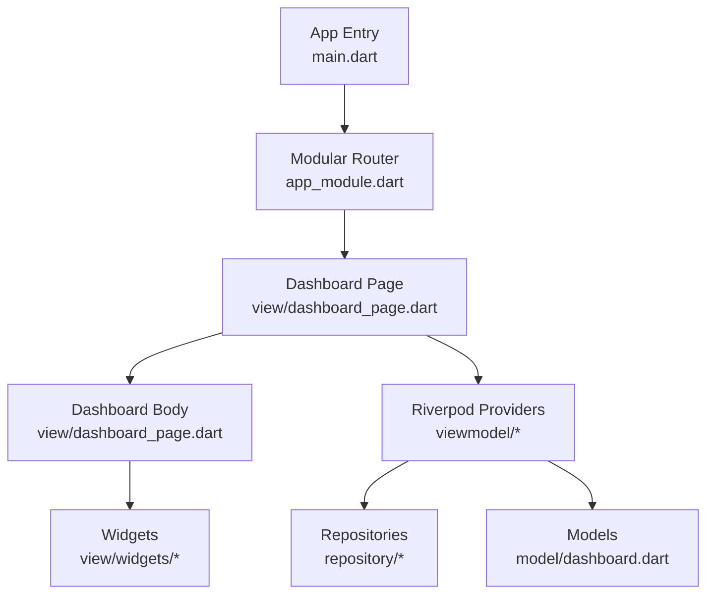
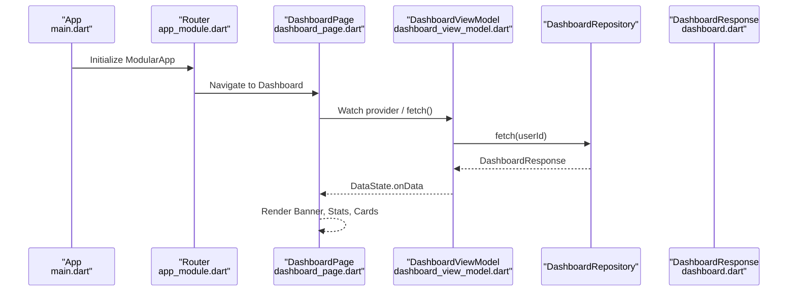
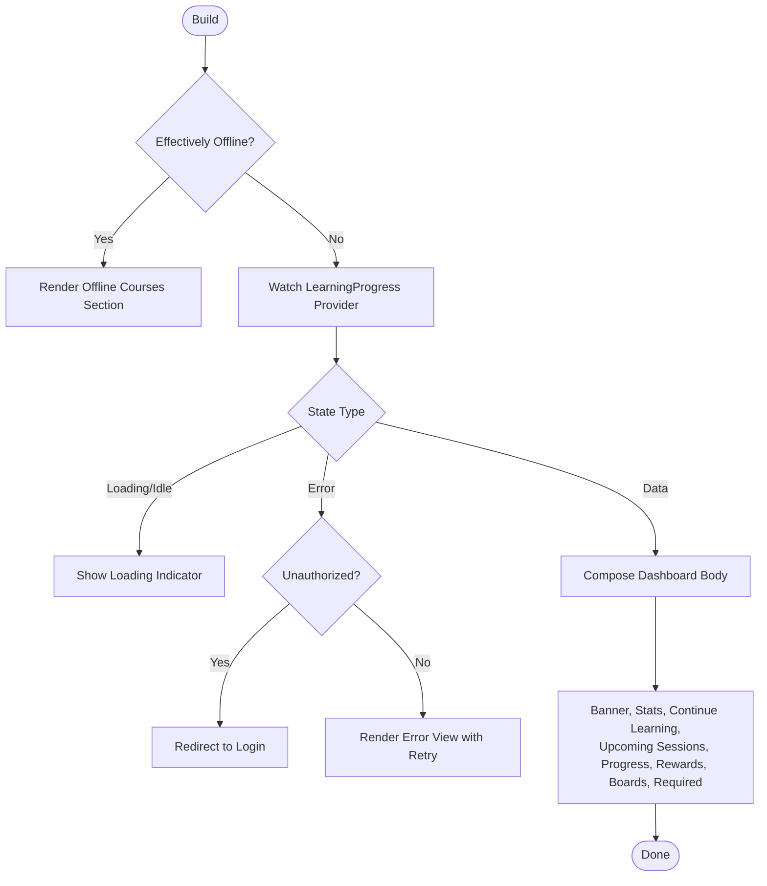
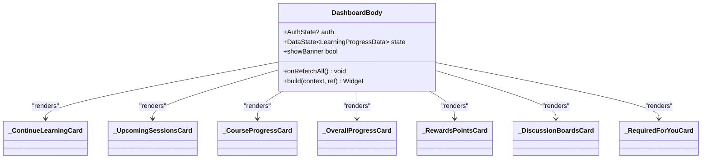
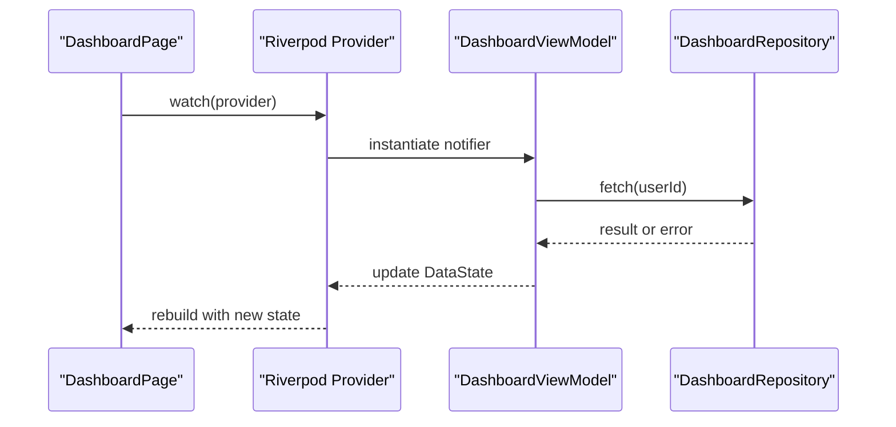
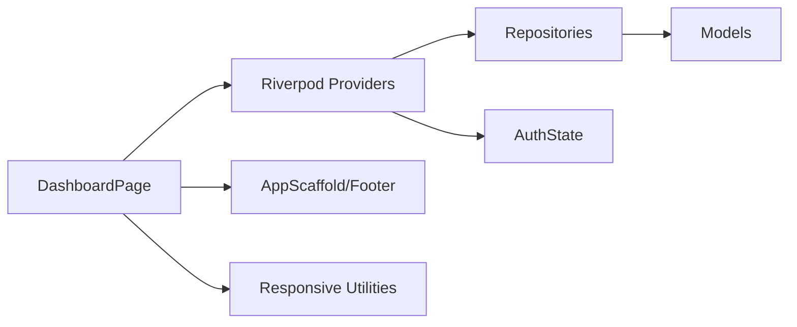

# Dashboard Interface

<cite>
**Referenced Files in This Document**
- [main.dart](file://lib/main.dart)
- [app_module.dart](file://lib/app_module.dart)
- [dashboard_page.dart](file://lib/app/features/dashboard/view/dashboard_page.dart)
- [dashboard_view_model.dart](file://lib/app/features/dashboard/viewmodel/dashboard_view_model.dart)
- [dashboard.dart](file://lib/app/features/dashboard/model/dashboard.dart)
- [offline_courses_section.dart](file://lib/app/features/dashboard/view/widgets/offline_courses_section.dart)
</cite>

## Table of Contents
1. Introduction
2. Project Structure
3. Core Components
4. Architecture Overview
5. Detailed Component Analysis
6. Dependency Analysis
7. Performance Considerations
8. Troubleshooting Guide
9. Conclusion

## Introduction
This document explains the Dashboard Interface component, focusing on its main layout, responsive design patterns, and user interaction flows. It covers how course enrollment overview, progress indicators, and navigation elements are implemented; how widgets are composed; how state is managed with Riverpod providers; and how data binding works end-to-end. It also includes guidance for custom dashboard widgets, loading states, error handling, accessibility considerations, and integration with the authentication system to personalize content.

## Project Structure
The Dashboard feature follows a clean separation:
- View layer: UI composition, responsiveness, and user interactions live in the dashboard view file.
- ViewModel layer: State management via Riverpod StateNotifier encapsulates fetching and error transitions.
- Model layer: Data classes parse API responses into strongly-typed objects used by the UI.
- Widgets: Reusable components (e.g., offline courses section) compose the dashboard body.

**Diagram sources**
- [main.dart:16-37](file://lib/main.dart#L16-L37)
- [app_module.dart:7-19](file://lib/app_module.dart#L7-L19)
- [dashboard_page.dart:46-513](file://lib/app/features/dashboard/view/dashboard_page.dart#L46-L513)
- [dashboard_view_model.dart:8-43](file://lib/app/features/dashboard/viewmodel/dashboard_view_model.dart#L8-L43)
- [dashboard.dart:3-247](file://lib/app/features/dashboard/model/dashboard.dart#L3-L247)

**Section sources**
- [main.dart:16-37](file://lib/main.dart#L16-L37)
- [app_module.dart:7-19](file://lib/app_module.dart#L7-L19)

## Core Components
- DashboardPage: The root widget that orchestrates lifecycle, supervisor/mentor confirm overlays, unauthorized redirects, and overall refresh behavior.
- DashboardBody: Renders the main dashboard sections responsively, including banner, stats row, continue learning, upcoming sessions, course progress, overall progress, rewards, discussion boards, required courses, and footer.
- Models: Strongly typed representations of dashboard payloads (courses, resources, quotes).
- Offline mode: When effectively offline, the page shows saved courses instead of attempting network calls.

Key responsibilities:
- Responsive layout decisions based on screen size.
- Centralized refresh via Pull-to-Refresh.
- Error and loading states surfaced consistently.
- Personalization via auth state.

**Section sources**
- [dashboard_page.dart:46-513](file://lib/app/features/dashboard/view/dashboard_page.dart#L46-L513)
- [dashboard.dart:3-247](file://lib/app/features/dashboard/model/dashboard.dart#L3-L247)

## Architecture Overview
The dashboard uses Riverpod for state management and modular routing for navigation. The app initializes localization and Riverpod scope at startup, then routes to the dashboard through modules. The dashboard view watches Riverpod providers to render UI and triggers fetches when needed.

**Diagram sources**
- [main.dart:16-37](file://lib/main.dart#L16-L37)
- [app_module.dart:7-19](file://lib/app_module.dart#L7-L19)
- [dashboard_view_model.dart:8-43](file://lib/app/features/dashboard/viewmodel/dashboard_view_model.dart#L8-L43)
- [dashboard_page.dart:131-513](file://lib/app/features/dashboard/view/dashboard_page.dart#L131-L513)
- [dashboard.dart:3-247](file://lib/app/features/dashboard/model/dashboard.dart#L3-L247)

## Detailed Component Analysis

### DashboardPage: Layout, Responsiveness, and Interactions
- Lifecycle and flow control:
  - On first frame, runs a supervisor/mentor confirmation flow that can show inline overlays sequentially.
  - Detects unauthorized errors and redirects to login after a single guard flag prevents repeated redirects.
  - Handles effective offline mode by rendering an offline-only section without network calls.
- Refresh and notifications:
  - Pull-to-refresh triggers a refetch of learning progress.
  - Checks upcoming sessions and posts local reminders within a defined time window.
- Main body:
  - Uses a responsive builder to switch between mobile, tablet, and desktop layouts.
  - Composes multiple cards: Continue Learning, Upcoming Sessions, Course Progress, Overall Progress, Rewards Points, Discussion Boards, Required For You, plus a footer.

**Diagram sources**
- [dashboard_page.dart:131-513](file://lib/app/features/dashboard/view/dashboard_page.dart#L131-L513)

**Section sources**
- [dashboard_page.dart:46-513](file://lib/app/features/dashboard/view/dashboard_page.dart#L46-L513)

### DashboardBody: Widget Composition and Data Binding
- Responsive grid:
  - Desktop: side-by-side columns for Continue Learning and Upcoming Sessions; Course Progress alongside Overall Progress; Rewards and Discussion Boards side-by-side.
  - Tablet/Mobile: stacked column layout with adjusted spacing and typography.
- Data binding:
  - Reads from a Riverpod provider to get LearningProgressData.
  - Derives lists for Continue Learning and Course Progress by mapping model fields to DashboardCourse entries.
- Navigation and actions:
  - Each card exposes tap targets to navigate to relevant screens or open web views for resources.
- Footer:
  - Consistent horizontal padding ensures alignment across all sections.

**Diagram sources**
- [dashboard_page.dart:302-513](file://lib/app/features/dashboard/view/dashboard_page.dart#L302-L513)

**Section sources**
- [dashboard_page.dart:302-513](file://lib/app/features/dashboard/view/dashboard_page.dart#L302-L513)

### Models: Dashboard Response and Entities
- DashboardResponse: Parses ongoing courses and resources from API payload, filtering active articles.
- DashboardCourse: Normalizes various field names and formats dates; supports non-course items and “Not Enrolled” status.
- DashboardResource: Resolves action types and URLs from multiple possible shapes; builds logo paths safely.

These models ensure consistent data contracts for the UI and simplify downstream logic.

**Section sources**
- [dashboard.dart:3-247](file://lib/app/features/dashboard/model/dashboard.dart#L3-L247)

### Offline Mode and Saved Courses
When the app detects it is effectively offline, the dashboard bypasses network requests and renders a dedicated offline section showing locally saved courses. This avoids generic error screens and preserves usability.

**Section sources**
- [dashboard_page.dart:140-153](file://lib/app/features/dashboard/view/dashboard_page.dart#L140-L153)
- [offline_courses_section.dart](file://lib/app/features/dashboard/view/widgets/offline_courses_section.dart)

### Authentication Integration and Personalization
- The dashboard reads the current AuthState to personalize content (e.g., greeting and quote in the banner).
- Unauthorized errors trigger a redirect to login using a shared helper, guarded to prevent repeated redirects during a build cycle.
- The app bootstraps Riverpod and Modular so that auth state is available throughout the tree.

**Section sources**
- [dashboard_page.dart:131-194](file://lib/app/features/dashboard/view/dashboard_page.dart#L131-L194)
- [main.dart:16-37](file://lib/main.dart#L16-L37)

### Riverpod State Management and Data Flow
- DashboardViewModel encapsulates fetching and error transitions for dashboard-specific data.
- The view watches providers to react to loading, data, and error states.
- Fetching is triggered on initialization and refresh actions.

**Diagram sources**
- [dashboard_view_model.dart:8-43](file://lib/app/features/dashboard/viewmodel/dashboard_view_model.dart#L8-L43)
- [dashboard_page.dart:131-194](file://lib/app/features/dashboard/view/dashboard_page.dart#L131-L194)

**Section sources**
- [dashboard_view_model.dart:8-43](file://lib/app/features/dashboard/viewmodel/dashboard_view_model.dart#L8-L43)

## Dependency Analysis
- UI depends on:
  - Riverpod providers for state and services.
  - Responsive utilities to adapt layout.
  - Shared scaffold and footer for consistent chrome.
- ViewModel depends on:
  - Repository abstraction for data access.
  - Auth state to resolve userId.
- Models depend on:
  - Utility formatters for dates and numbers.

**Diagram sources**
- [dashboard_page.dart:131-513](file://lib/app/features/dashboard/view/dashboard_page.dart#L131-L513)
- [dashboard_view_model.dart:8-43](file://lib/app/features/dashboard/viewmodel/dashboard_view_model.dart#L8-L43)
- [dashboard.dart:3-247](file://lib/app/features/dashboard/model/dashboard.dart#L3-L247)

**Section sources**
- [dashboard_page.dart:131-513](file://lib/app/features/dashboard/view/dashboard_page.dart#L131-L513)
- [dashboard_view_model.dart:8-43](file://lib/app/features/dashboard/viewmodel/dashboard_view_model.dart#L8-L43)

## Performance Considerations
- Avoid unnecessary rebuilds by watching only the necessary providers and using immutable data structures in models.
- Defer heavy operations (e.g., reminder checks) to post-frame callbacks to keep builds fast.
- Use responsive builders to minimize layout thrash across breakpoints.
- Prefer lazy lists for long sections and avoid nested expensive widgets inside scrollable areas.

[No sources needed since this section provides general guidance]

## Troubleshooting Guide
Common issues and resolutions:
- Unauthorized redirect loop: Ensure the redirect guard flag is set before navigating and cleared appropriately on successful login.
- No data shown: Verify that the provider has fetched data and that the repository returns valid payloads; check network connectivity and offline mode toggle.
- Overlays not closing: Confirm completer completion paths are executed when user confirms or dismisses dialogs.
- Reminder notifications not appearing: Ensure upcoming sessions have valid start times and that the reminder window logic matches expectations.

**Section sources**
- [dashboard_page.dart:172-194](file://lib/app/features/dashboard/view/dashboard_page.dart#L172-L194)
- [dashboard_page.dart:263-297](file://lib/app/features/dashboard/view/dashboard_page.dart#L263-L297)

## Conclusion
The Dashboard Interface delivers a responsive, personalized learning hub with clear state management via Riverpod, robust error handling, and thoughtful offline support. Its modular widget composition enables easy extension with new cards and features while maintaining consistency across devices. Integrating with authentication ensures each learner sees tailored content, and the structured data models keep the UI predictable and maintainable.

[No sources needed since this section summarizes without analyzing specific files]