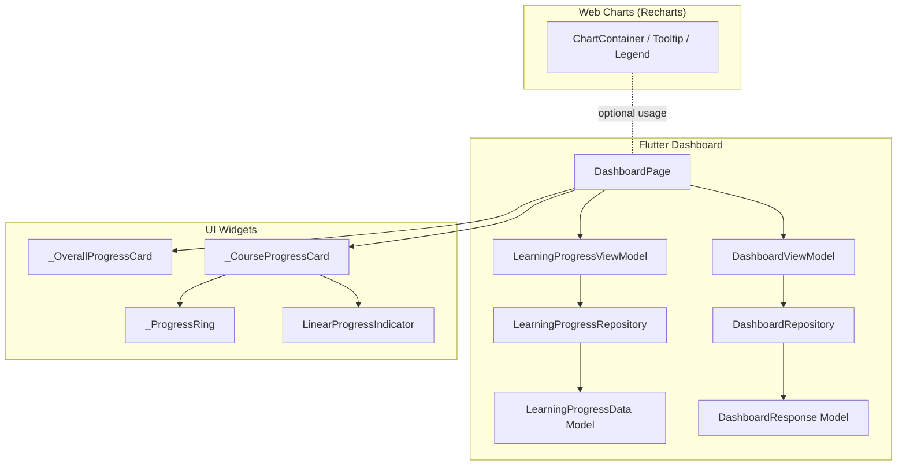
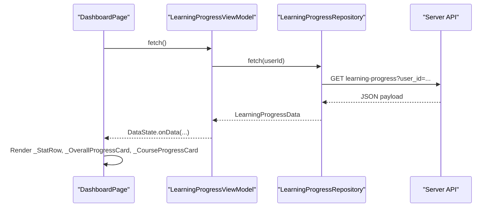
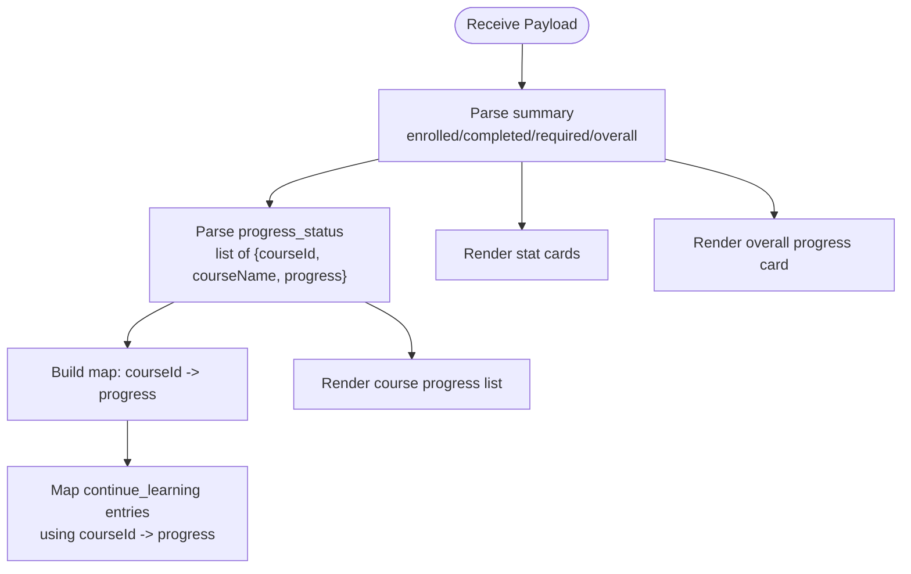
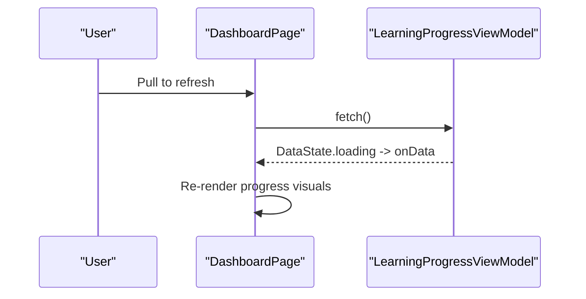
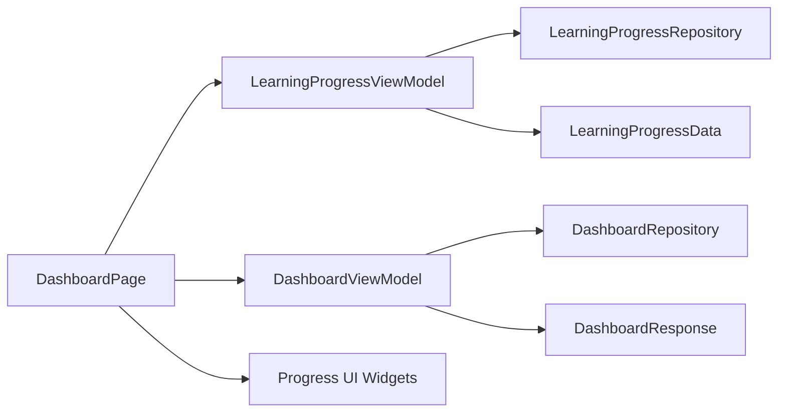

# Progress Visualization

<cite>
**Referenced Files in This Document**
- [dashboard_page.dart](file://lib/app/features/dashboard/view/dashboard_page.dart)
- [learning_progress_model.dart](file://lib/app/features/dashboard/model/learning_progress_model.dart)
- [learning_progress_view_model.dart](file://lib/app/features/dashboard/viewmodel/learning_progress_view_model.dart)
- [learning_progress_repository.dart](file://lib/app/features/dashboard/repository/learning_progress_repository.dart)
- [dashboard.dart](file://lib/app/features/dashboard/model/dashboard.dart)
- [dashboard_repository.dart](file://lib/app/features/dashboard/repository/dashboard_repository.dart)
- [dashboard_view_model.dart](file://lib/app/features/dashboard/viewmodel/dashboard_view_model.dart)
- [course_grid_card.dart](file://lib/app/features/courses/view/widgets/course_grid_card.dart)
- [all_course_progress_page.dart](file://lib/app/features/dashboard/view/all_course_progress_page.dart)
- [chart.tsx](file://src/app/components/ui/chart.tsx)
</cite>

## Table of Contents
1. [Introduction](#introduction)
2. [Project Structure](#project-structure)
3. [Core Components](#core-components)
4. [Architecture Overview](#architecture-overview)
5. [Detailed Component Analysis](#detailed-component-analysis)
6. [Dependency Analysis](#dependency-analysis)
7. [Performance Considerations](#performance-considerations)
8. [Troubleshooting Guide](#troubleshooting-guide)
9. [Conclusion](#conclusion)
10. [Appendices](#appendices)

## Introduction
This document explains the Progress Visualization system used to display course completion metrics, overall learning progress, and related analytics on the dashboard and progress screens. It covers data aggregation for completion percentages, time-related tracking where applicable, chart library integration (Recharts-based UI components), custom Flutter visualization widgets, real-time update patterns via state providers, caching behavior, and offline support considerations.

## Project Structure
The progress visualization spans three layers:
- Data models and parsing for progress payloads
- ViewModels that fetch and manage state
- UI components that render stats, progress bars, rings, and charts

**Diagram sources**
- [dashboard_page.dart:302-514](file://lib/app/features/dashboard/view/dashboard_page.dart#L302-L514)
- [learning_progress_view_model.dart:7-42](file://lib/app/features/dashboard/viewmodel/learning_progress_view_model.dart#L7-L42)
- [learning_progress_repository.dart:1-200](file://lib/app/features/dashboard/repository/learning_progress_repository.dart#L1-L200)
- [learning_progress_model.dart:1-64](file://lib/app/features/dashboard/model/learning_progress_model.dart#L1-L64)
- [dashboard_view_model.dart:8-42](file://lib/app/features/dashboard/viewmodel/dashboard_view_model.dart#L8-L42)
- [dashboard_repository.dart:16-29](file://lib/app/features/dashboard/repository/dashboard_repository.dart#L16-L29)
- [dashboard.dart:42-161](file://lib/app/features/dashboard/model/dashboard.dart#L42-L161)
- [course_grid_card.dart:145-186](file://lib/app/features/courses/view/widgets/course_grid_card.dart#L145-L186)
- [chart.tsx:37-70](file://src/app/components/ui/chart.tsx#L37-L70)

**Section sources**
- [dashboard_page.dart:302-514](file://lib/app/features/dashboard/view/dashboard_page.dart#L302-L514)
- [learning_progress_model.dart:1-64](file://lib/app/features/dashboard/model/learning_progress_model.dart#L1-L64)
- [learning_progress_view_model.dart:7-42](file://lib/app/features/dashboard/viewmodel/learning_progress_view_model.dart#L7-L42)
- [dashboard_view_model.dart:8-42](file://lib/app/features/dashboard/viewmodel/dashboard_view_model.dart#L8-L42)
- [chart.tsx:37-70](file://src/app/components/ui/chart.tsx#L37-L70)

## Core Components
- LearningProgressData: Aggregates summary counts, continue-learning items, upcoming sessions, per-course progress, required courses, and dashboard extras (rewards, quotes, discussion boards).
- DashboardResponse: Represents ongoing courses and resources from a legacy dashboard endpoint.
- ViewModels: Manage loading states, errors, and network calls for both learning progress and dashboard endpoints.
- UI Cards: Render stat cards, overall progress, course progress lists, and progress rings/bars.

Key responsibilities:
- Parsing API payloads into strongly typed models
- Managing data state transitions (idle/loading/data/error)
- Rendering responsive progress visuals with consistent design tokens

**Section sources**
- [learning_progress_model.dart:1-64](file://lib/app/features/dashboard/model/learning_progress_model.dart#L1-L64)
- [dashboard.dart:42-161](file://lib/app/features/dashboard/model/dashboard.dart#L42-L161)
- [learning_progress_view_model.dart:7-42](file://lib/app/features/dashboard/viewmodel/learning_progress_view_model.dart#L7-L42)
- [dashboard_view_model.dart:8-42](file://lib/app/features/dashboard/viewmodel/dashboard_view_model.dart#L8-L42)

## Architecture Overview
The progress visualization follows a clean separation:
- Repository layer performs HTTP requests and returns parsed responses
- ViewModel wraps repository calls, updates DataState, and handles friendly error messages
- UI reads state via Riverpod providers and renders progress visuals

**Diagram sources**
- [learning_progress_view_model.dart:28-42](file://lib/app/features/dashboard/viewmodel/learning_progress_view_model.dart#L28-L42)
- [learning_progress_repository.dart:1-200](file://lib/app/features/dashboard/repository/learning_progress_repository.dart#L1-L200)
- [dashboard_page.dart:302-514](file://lib/app/features/dashboard/view/dashboard_page.dart#L302-L514)

## Detailed Component Analysis

### Data Aggregation Logic
- Summary metrics: enrolledCourses, completedCourses, requiredCourses, overallProgress are parsed directly from the summary block.
- Per-course progress: progressStatus provides courseId, courseName, and integer percentage; these feed the Course Progress card.
- Continue Learning: enriched items include description/logo/class info; numeric progress is cross-referenced from progressStatus by courseId.
- Required courses: may include non-numeric labels like “Not Enrolled”; handled as strings for display.
- Extras: rewards points, discussion board activity, and quote banner are included for richer dashboard context.

**Diagram sources**
- [learning_progress_model.dart:23-64](file://lib/app/features/dashboard/model/learning_progress_model.dart#L23-L64)
- [dashboard_page.dart:523-560](file://lib/app/features/dashboard/view/dashboard_page.dart#L523-L560)

**Section sources**
- [learning_progress_model.dart:66-86](file://lib/app/features/dashboard/model/learning_progress_model.dart#L66-L86)
- [learning_progress_model.dart:158-175](file://lib/app/features/dashboard/model/learning_progress_model.dart#L158-L175)
- [dashboard_page.dart:523-560](file://lib/app/features/dashboard/view/dashboard_page.dart#L523-L560)

### Completion Metrics Display
- Stat cards show enrolled, required, and completed counts sourced from summary.
- Overall progress displays a large animated percentage derived from summary.overallProgress.
- Course progress list shows each course’s percentage with a linear progress bar.

Examples:
- Stat row rendering uses values from summary.enrolledCourses, requiredCourses, completedCourses.
- Overall progress card animates the percentage value and applies gradient styling.

**Section sources**
- [dashboard_page.dart:671-717](file://lib/app/features/dashboard/view/dashboard_page.dart#L671-L717)
- [dashboard_page.dart:1846-1899](file://lib/app/features/dashboard/view/dashboard_page.dart#L1846-L1899)

### Time Spent Tracking
- The current implementation does not track or display cumulative time spent per course.
- Upcoming sessions provide start/end date/time fields which can be used to schedule reminders and display session timing, but no elapsed-time metric is computed here.

**Section sources**
- [learning_progress_model.dart:107-156](file://lib/app/features/dashboard/model/learning_progress_model.dart#L107-L156)

### Performance Metrics and Analytics
- Rewards section aggregates totalPoints and recent activity for motivational feedback.
- Discussion boards show reply counts and last reply timestamps for engagement insights.
- These are part of the dashboard extras and rendered alongside progress visuals.

**Section sources**
- [learning_progress_model.dart:202-231](file://lib/app/features/dashboard/model/learning_progress_model.dart#L202-L231)
- [learning_progress_model.dart:322-377](file://lib/app/features/dashboard/model/learning_progress_model.dart#L322-L377)

### Chart Library Integration and Custom Visualizations
- Recharts-based chart components (ChartContainer, Tooltip, Legend) are available for web views and can be used to visualize progress trends if needed. They provide responsive containers, theme-aware colors, and customizable tooltips/legends.
- Flutter-specific visualizations use native widgets:
  - LinearProgressIndicator for horizontal progress bars
  - CircularProgressIndicator inside a small ring widget for compact per-item progress
  - Animated counters for smooth number transitions

Configuration highlights:
- ChartContainer accepts a config map to define color themes and labels for series
- Tooltips and legends are configurable via props and helper functions
- Flutter progress widgets accept fraction values (0..1) and style options

**Section sources**
- [chart.tsx:37-70](file://src/app/components/ui/chart.tsx#L37-L70)
- [chart.tsx:107-182](file://src/app/components/ui/chart.tsx#L107-L182)
- [chart.tsx:251-305](file://src/app/components/ui/chart.tsx#L251-L305)
- [course_grid_card.dart:145-186](file://lib/app/features/courses/view/widgets/course_grid_card.dart#L145-L186)
- [all_course_progress_page.dart:424-456](file://lib/app/features/dashboard/view/all_course_progress_page.dart#L424-L456)

### Real-Time Progress Updates
- Pull-to-refresh triggers refetching of learning progress and dashboard data through provider notifiers.
- Unauthorized or network errors are surfaced with friendly messages and trigger redirects or retry prompts.

**Diagram sources**
- [dashboard_page.dart:126-128](file://lib/app/features/dashboard/view/dashboard_page.dart#L126-L128)
- [learning_progress_view_model.dart:28-42](file://lib/app/features/dashboard/viewmodel/learning_progress_view_model.dart#L28-L42)

**Section sources**
- [dashboard_page.dart:126-128](file://lib/app/features/dashboard/view/dashboard_page.dart#L126-L128)
- [learning_progress_view_model.dart:44-57](file://lib/app/features/dashboard/viewmodel/learning_progress_view_model.dart#L44-L57)

### Examples of Chart Types and Configuration Options
- Bar charts: Use ChartContainer with Recharts BarChart and configure series via config mapping for colors and labels.
- Progress rings: Use Flutter’s CircularProgressIndicator within a circular container to show per-course percentage.
- Timeline views: Use upcoming sessions’ startDateTime to build timeline-like lists or charts; currently displayed as session cards with dates/times.

Configuration examples (conceptual):
- Define series keys in config with label/icon/color/theme mappings
- Pass payload data arrays to Recharts components wrapped in ChartContainer
- For Flutter, set value = percent / 100 and choose backgroundColor/valueColor

[No sources needed since this section provides conceptual guidance]

### Caching Strategy for Progress Data
- Dashboard endpoint explicitly disables caching at the repository level for freshness.
- Learning progress endpoint behavior depends on the underlying network helper configuration; ensure cache settings align with desired staleness tolerance.

Recommendations:
- If offline-first behavior is desired for progress, enable appropriate cache types in the repository call and handle stale data gracefully in the UI.

**Section sources**
- [dashboard_repository.dart:16-29](file://lib/app/features/dashboard/repository/dashboard_repository.dart#L16-L29)

### Offline Support Considerations
- When effectively offline, the dashboard switches to showing locally saved courses instead of attempting live fetches.
- Progress visuals rely on cached or previously loaded data; ensure providers retain last known state during connectivity loss.

**Section sources**
- [dashboard_page.dart:140-153](file://lib/app/features/dashboard/view/dashboard_page.dart#L140-L153)

## Dependency Analysis
The following diagram maps key dependencies between view, view model, repository, and models:

**Diagram sources**
- [dashboard_page.dart:302-514](file://lib/app/features/dashboard/view/dashboard_page.dart#L302-L514)
- [learning_progress_view_model.dart:7-42](file://lib/app/features/dashboard/viewmodel/learning_progress_view_model.dart#L7-L42)
- [dashboard_view_model.dart:8-42](file://lib/app/features/dashboard/viewmodel/dashboard_view_model.dart#L8-L42)
- [learning_progress_model.dart:1-64](file://lib/app/features/dashboard/model/learning_progress_model.dart#L1-L64)
- [dashboard.dart:42-161](file://lib/app/features/dashboard/model/dashboard.dart#L42-L161)

**Section sources**
- [dashboard_page.dart:302-514](file://lib/app/features/dashboard/view/dashboard_page.dart#L302-L514)
- [learning_progress_view_model.dart:7-42](file://lib/app/features/dashboard/viewmodel/learning_progress_view_model.dart#L7-L42)
- [dashboard_view_model.dart:8-42](file://lib/app/features/dashboard/viewmodel/dashboard_view_model.dart#L8-L42)

## Performance Considerations
- Avoid unnecessary rebuilds by keeping progress calculations in view models and passing immutable data to UI.
- Use responsive layouts to minimize layout thrash on different screen sizes.
- Prefer lightweight progress indicators (linear/ring) for high-frequency updates.
- For charts, batch data updates and leverage Recharts’ responsive container to optimize rendering.

[No sources needed since this section provides general guidance]

## Troubleshooting Guide
Common issues and resolutions:
- Unauthorized errors: Friendly message indicates session expiry; app redirects to login automatically.
- Network errors: Friendly message prompts user to check connectivity; consider enabling offline mode to show cached content.
- Empty progress data: Ensure the API returns valid payload; verify courseId mappings when combining continue-learning with progress_status.

**Section sources**
- [learning_progress_view_model.dart:44-57](file://lib/app/features/dashboard/viewmodel/learning_progress_view_model.dart#L44-L57)
- [dashboard_page.dart:172-180](file://lib/app/features/dashboard/view/dashboard_page.dart#L172-L180)

## Conclusion
The Progress Visualization system combines robust data modeling, clear state management, and responsive UI components to present meaningful learning analytics. It supports multiple visualization types, integrates chart libraries where appropriate, and includes safeguards for offline scenarios and error handling. Future enhancements can add time-spent tracking and more advanced analytics while maintaining performance and usability.

## Appendices

### Data Models Reference
- LearningProgressSummary: aggregated counts and overall progress
- CourseProgressItem: per-course percentage
- DashboardExtras: rewards, quotes, discussion boards
- DashboardCourse: ongoing course details including next session and completion date

**Section sources**
- [learning_progress_model.dart:66-86](file://lib/app/features/dashboard/model/learning_progress_model.dart#L66-L86)
- [learning_progress_model.dart:158-175](file://lib/app/features/dashboard/model/learning_progress_model.dart#L158-L175)
- [learning_progress_model.dart:202-231](file://lib/app/features/dashboard/model/learning_progress_model.dart#L202-L231)
- [dashboard.dart:42-161](file://lib/app/features/dashboard/model/dashboard.dart#L42-L161)