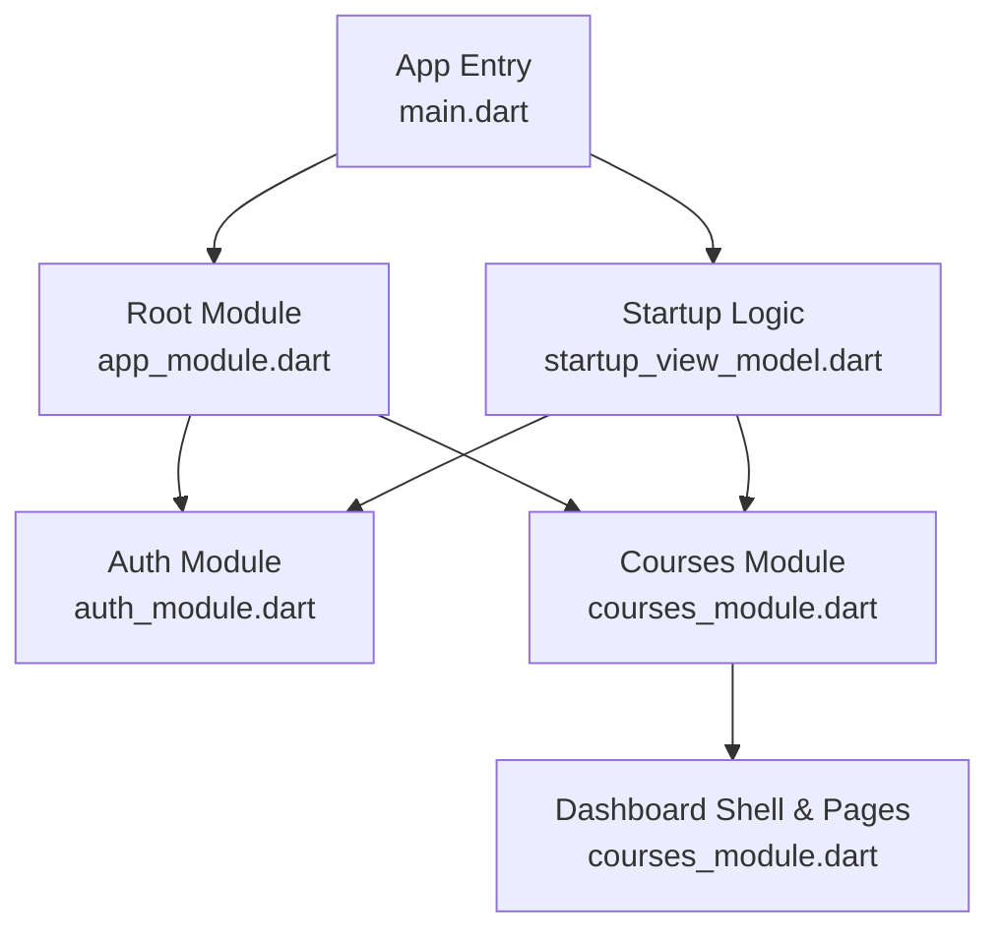
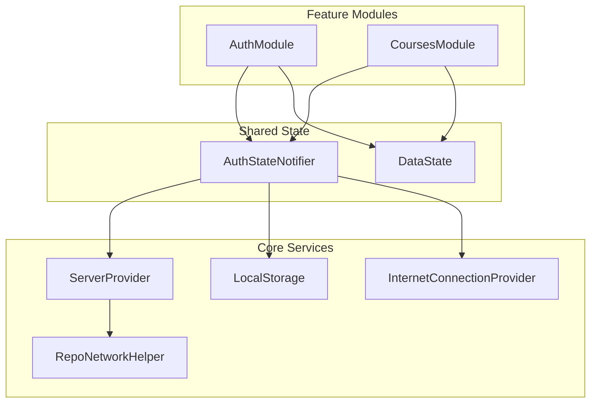
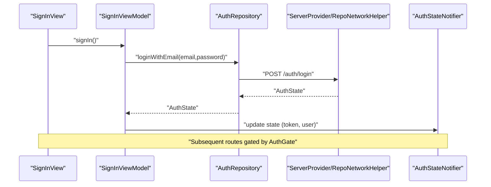
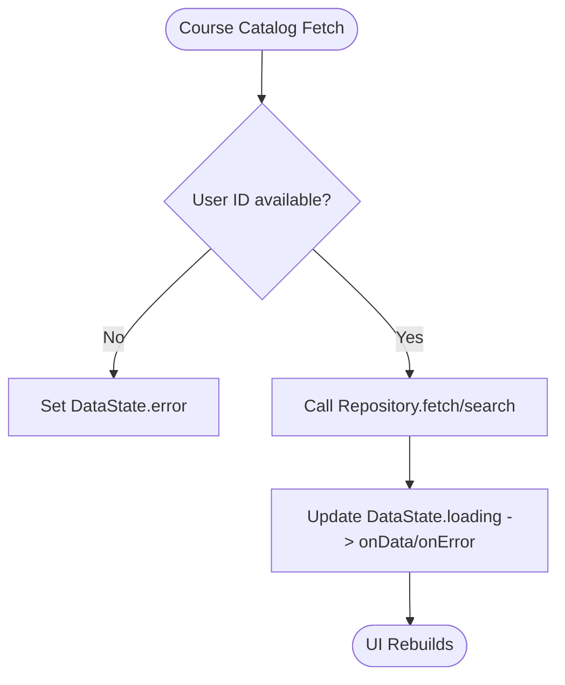
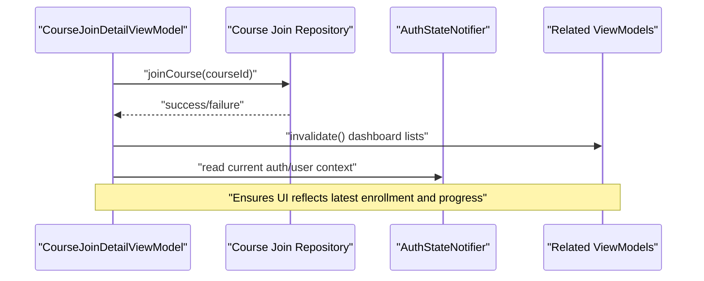
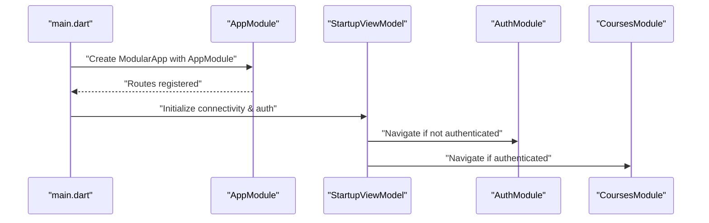
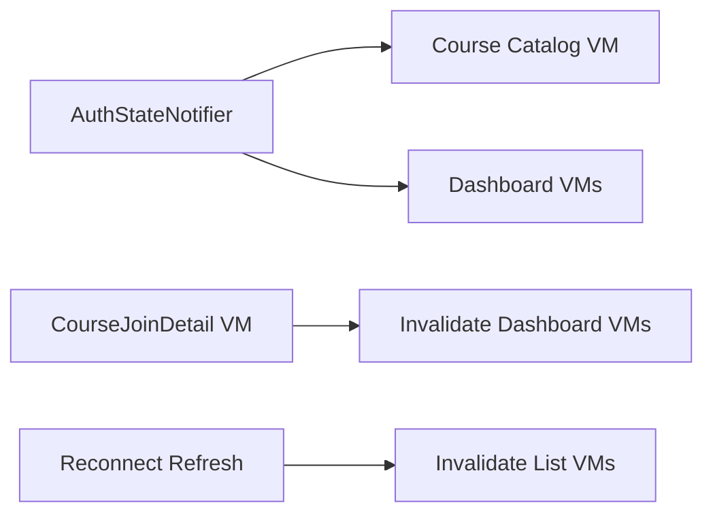
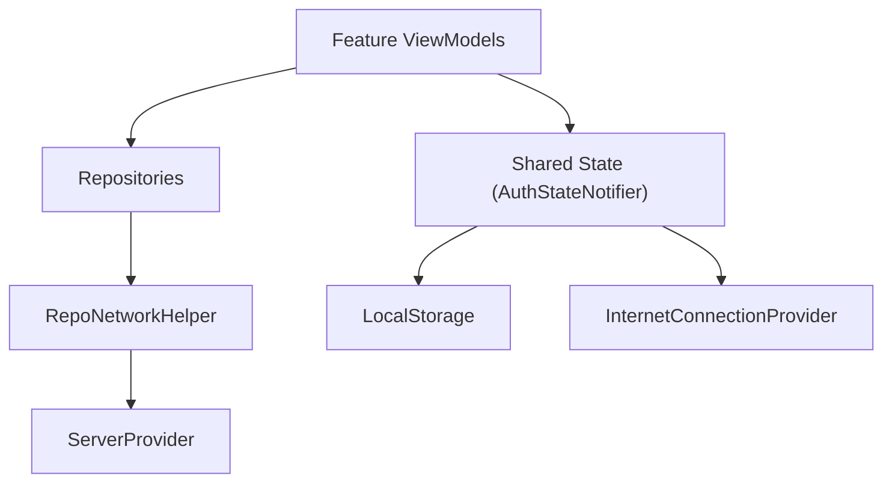

# Feature Modules

<cite>
**Referenced Files in This Document**
- [main.dart](file://lib/main.dart)
- [app_module.dart](file://lib/app_module.dart)
- [auth_module.dart](file://lib/app/features/authentication/module/auth_module.dart)
- [courses_module.dart](file://lib/app/features/courses/module/courses_module.dart)
- [startup_view_model.dart](file://lib/app/features/startup/view_model/startup_view_model.dart)
- [signin_viewmodel.dart](file://lib/app/features/authentication/viewmodel/signin_viewmodel.dart)
- [auth_state_provider.dart](file://lib/app/features/authentication/app_state/auth_state_provider.dart)
- [auth_repository.dart](file://lib/app/features/authentication/repository/auth_repository.dart)
- [server_provider.dart](file://lib/app/core/provider/server_provider.dart)
- [repo_network_helper.dart](file://lib/app/core/logic/repository/repo_network_helper.dart)
- [data_state.dart](file://lib/app/core/logic/data_state/data_state.dart)
- [course_catalog_view_model.dart](file://lib/app/features/courses/viewmodel/course_catalog_view_model.dart)
- [course_join_detail_view_model.dart](file://lib/app/features/courses/viewmodel/course_join_detail_view_model.dart)
- [reconnect_refresh.dart](file://lib/app/core/provider/reconnect_refresh.dart)
</cite>

## Table of Contents
1. Introduction
2. Project Structure
3. Core Components
4. Architecture Overview
5. Detailed Component Analysis
6. Dependency Analysis
7. Performance Considerations
8. Troubleshooting Guide
9. Conclusion
10. Appendices

## Introduction
This document explains the modular architecture of Leadership Edge Live LMS, focusing on how major features are encapsulated as self-contained modules with their own views, view models, repositories, and state management. It documents the feature isolation pattern, inter-module communication via shared providers and repositories, module lifecycle, dependency injection setup using Flutter Modular and Riverpod, and integration with cross-cutting concerns such as authentication, networking, and local storage. It also provides guidelines for creating new feature modules following established patterns.

## Project Structure
The application bootstraps with a global entry point that initializes localization, media, and dependency injection containers, then wires routes through Flutter Modular. The root module registers top-level routes and delegates to feature modules:
- Authentication module handles sign-in flows and protects routes.
- Courses module hosts dashboards, course listings, details, and related pages behind an auth gate.
- Startup logic checks connectivity and authentication state to navigate users appropriately.

**Diagram sources**
- [main.dart:16-37](file://lib/main.dart#L16-L37)
- [app_module.dart:7-19](file://lib/app_module.dart#L7-L19)
- [auth_module.dart:5-9](file://lib/app/features/authentication/module/auth_module.dart#L5-L9)
- [courses_module.dart:20-68](file://lib/app/features/courses/module/courses_module.dart#L20-L68)
- [startup_view_model.dart:20-37](file://lib/app/features/startup/view_model/startup_view_model.dart#L20-L37)

**Section sources**
- [main.dart:16-37](file://lib/main.dart#L16-L37)
- [app_module.dart:7-19](file://lib/app_module.dart#L7-L19)

## Core Components
- Dependency Injection and Routing:
  - Flutter Modular manages app modules and routes.
  - Riverpod provides scoped, reactive state and services (providers).
- Shared Services:
  - ServerProvider configures API base URL and network configuration.
  - RepoNetworkHelper standardizes HTTP requests, caching, offline behavior, and token handling.
  - LocalStorage and InternetConnectionProvider abstract persistence and connectivity.
- State Management:
  - DataState models uniform loading/error/data states across view models.
  - AuthStateNotifier centralizes authentication state and lifecycle.

Key responsibilities:
- Views render UI and delegate actions to view models.
- View models coordinate business logic, call repositories, and update state.
- Repositories encapsulate data access (network/local), using shared network helpers.
- Providers expose services and state to the rest of the app.

**Section sources**
- [server_provider.dart:8-25](file://lib/app/core/provider/server_provider.dart#L8-L25)
- [repo_network_helper.dart:31-43](file://lib/app/core/logic/repository/repo_network_helper.dart#L31-L43)
- [data_state.dart:1-22](file://lib/app/core/logic/data_state/data_state.dart#L1-L22)
- [auth_state_provider.dart:15-36](file://lib/app/features/authentication/app_state/auth_state_provider.dart#L15-L36)

## Architecture Overview
The system follows a layered, feature-isolated architecture:
- Feature modules encapsulate routes, UI, state, and data access.
- Cross-cutting concerns (auth, networking, storage, connectivity) are provided via shared providers.
- Inter-module communication occurs by reading/writing shared state (e.g., AuthStateNotifier) and invalidating dependent view models when necessary.

**Diagram sources**
- [auth_module.dart:5-9](file://lib/app/features/authentication/module/auth_module.dart#L5-L9)
- [courses_module.dart:20-68](file://lib/app/features/courses/module/courses_module.dart#L20-L68)
- [server_provider.dart:8-25](file://lib/app/core/provider/server_provider.dart#L8-L25)
- [repo_network_helper.dart:31-43](file://lib/app/core/logic/repository/repo_network_helper.dart#L31-L43)
- [auth_state_provider.dart:15-36](file://lib/app/features/authentication/app_state/auth_state_provider.dart#L15-L36)
- [data_state.dart:1-22](file://lib/app/core/logic/data_state/data_state.dart#L1-L22)

## Detailed Component Analysis

### Authentication Flow
The authentication flow integrates UI, view model, repository, and shared state:
- SignInViewModel triggers login via AuthRepository.
- AuthRepository uses RepoNetworkHelper to call server endpoints.
- AuthStateNotifier persists and exposes authentication state.
- Routes are protected via AuthGate; navigation decisions occur in startup logic.

**Diagram sources**
- [signin_viewmodel.dart:11-45](file://lib/app/features/authentication/viewmodel/signin_viewmodel.dart#L11-L45)
- [auth_repository.dart:7-27](file://lib/app/features/authentication/repository/auth_repository.dart#L7-L27)
- [server_provider.dart:8-25](file://lib/app/core/provider/server_provider.dart#L8-L25)
- [repo_network_helper.dart:31-43](file://lib/app/core/logic/repository/repo_network_helper.dart#L31-L43)
- [auth_state_provider.dart:15-36](file://lib/app/features/authentication/app_state/auth_state_provider.dart#L15-L36)

**Section sources**
- [signin_viewmodel.dart:11-45](file://lib/app/features/authentication/viewmodel/signin_viewmodel.dart#L11-L45)
- [auth_repository.dart:7-66](file://lib/app/features/authentication/repository/auth_repository.dart#L7-L66)
- [auth_state_provider.dart:15-36](file://lib/app/features/authentication/app_state/auth_state_provider.dart#L15-L36)

### Course Catalog and Detail
Course-related features demonstrate typical feature module patterns:
- CourseCatalogViewModel fetches catalog/search results using its repository and updates DataState.
- CourseJoinDetailViewModel coordinates joining a course and invalidates multiple dashboard-related view models to refresh lists and progress.

**Diagram sources**
- [course_catalog_view_model.dart:71-111](file://lib/app/features/courses/viewmodel/course_catalog_view_model.dart#L71-L111)
- [data_state.dart:1-22](file://lib/app/core/logic/data_state/data_state.dart#L1-L22)

**Diagram sources**
- [course_join_detail_view_model.dart:152-171](file://lib/app/features/courses/viewmodel/course_join_detail_view_model.dart#L152-L171)

**Section sources**
- [course_catalog_view_model.dart:71-111](file://lib/app/features/courses/viewmodel/course_catalog_view_model.dart#L71-L111)
- [course_join_detail_view_model.dart:152-171](file://lib/app/features/courses/viewmodel/course_join_detail_view_model.dart#L152-L171)

### Module Lifecycle and Navigation
- App bootstrap initializes services and wraps the app with ProviderScope and ModularApp.
- AppModule defines routes and mounts feature modules.
- StartupViewModel initializes connectivity and authentication, then navigates to either auth or courses based on session state.

**Diagram sources**
- [main.dart:16-37](file://lib/main.dart#L16-L37)
- [app_module.dart:7-19](file://lib/app_module.dart#L7-L19)
- [startup_view_model.dart:20-37](file://lib/app/features/startup/view_model/startup_view_model.dart#L20-L37)
- [auth_module.dart:5-9](file://lib/app/features/authentication/module/auth_module.dart#L5-L9)
- [courses_module.dart:20-68](file://lib/app/features/courses/module/courses_module.dart#L20-L68)

**Section sources**
- [main.dart:16-37](file://lib/main.dart#L16-L37)
- [app_module.dart:7-19](file://lib/app_module.dart#L7-L19)
- [startup_view_model.dart:20-37](file://lib/app/features/startup/view_model/startup_view_model.dart#L20-L37)

### Inter-Module Communication Patterns
- Shared state via AuthStateNotifier allows features to read current user/session and react to changes.
- Invalidation of multiple view models after mutations ensures consistent UI across modules (e.g., after joining a course).
- Reconnection/refresh utilities invalidate relevant view models to re-sync data after connectivity changes.

**Diagram sources**
- [auth_state_provider.dart:15-36](file://lib/app/features/authentication/app_state/auth_state_provider.dart#L15-L36)
- [course_join_detail_view_model.dart:152-171](file://lib/app/features/courses/viewmodel/course_join_detail_view_model.dart#L152-L171)
- [reconnect_refresh.dart:58-77](file://lib/app/core/provider/reconnect_refresh.dart#L58-L77)

**Section sources**
- [course_join_detail_view_model.dart:152-171](file://lib/app/features/courses/viewmodel/course_join_detail_view_model.dart#L152-L171)
- [reconnect_refresh.dart:58-77](file://lib/app/core/provider/reconnect_refresh.dart#L58-L77)

## Dependency Analysis
- Feature modules depend on core providers for networking, storage, and connectivity.
- View models depend on repositories and shared state providers.
- Repositories depend on RepoNetworkHelper and configuration from ServerProvider.

**Diagram sources**
- [server_provider.dart:8-25](file://lib/app/core/provider/server_provider.dart#L8-L25)
- [repo_network_helper.dart:31-43](file://lib/app/core/logic/repository/repo_network_helper.dart#L31-L43)
- [auth_state_provider.dart:15-36](file://lib/app/features/authentication/app_state/auth_state_provider.dart#L15-L36)

**Section sources**
- [server_provider.dart:8-25](file://lib/app/core/provider/server_provider.dart#L8-L25)
- [repo_network_helper.dart:31-43](file://lib/app/core/logic/repository/repo_network_helper.dart#L31-L43)
- [auth_state_provider.dart:15-36](file://lib/app/features/authentication/app_state/auth_state_provider.dart#L15-L36)

## Performance Considerations
- Use autoDispose providers for view models to avoid unnecessary memory retention.
- Prefer ref.exists before invalidating providers to prevent accidental rebuilds.
- Keep network calls idempotent and leverage caching where appropriate via RequestCacheType.
- Avoid rebuilding repositories on every toggle of offline mode by reading isManualOffline at call time.

[No sources needed since this section provides general guidance]

## Troubleshooting Guide
Common issues and resolutions:
- Network errors: Ensure RepoNetworkConfig includes correct baseUrl and authToken; verify connectivity provider initialization.
- Unauthorized responses: Auto-refresh flow relies on auto_login_token; confirm it exists and is valid.
- Offline mode: When toggled, requests may bypass network; ensure UI reflects offline state and cached data is used.
- Stale UI after mutations: Invalidate affected view models (e.g., after course join) to refresh lists and progress.

**Section sources**
- [repo_network_helper.dart:31-43](file://lib/app/core/logic/repository/repo_network_helper.dart#L31-L43)
- [auth_repository.dart:29-66](file://lib/app/features/authentication/repository/auth_repository.dart#L29-L66)
- [course_join_detail_view_model.dart:152-171](file://lib/app/features/courses/viewmodel/course_join_detail_view_model.dart#L152-L171)

## Conclusion
Leadership Edge Live LMS employs a robust, feature-isolated architecture with clear separation of concerns:
- Features encapsulate routes, UI, state, and data access.
- Shared providers deliver cross-cutting capabilities like authentication, networking, and storage.
- Inter-module communication leverages shared state and targeted invalidation to maintain consistency.
Following the established patterns simplifies adding new features while preserving modularity and testability.

[No sources needed since this section summarizes without analyzing specific files]

## Appendices

### Guidelines for Creating New Feature Modules
- Create a new module class extending Module and register routes under a dedicated path.
- Protect sensitive routes with an AuthGate to enforce authentication.
- Implement a view model using Riverpod (StateNotifier or ChangeNotifier) and manage state with DataState.
- Build a repository that uses RepoNetworkHelper for network operations and respects caching and offline modes.
- Inject dependencies via Riverpod providers; use ServerProvider for base URL and AuthStateNotifier for user context.
- After mutating shared data, invalidate related view models to keep UI consistent.
- Initialize any required services during app startup if they affect routing or initial state.

**Section sources**
- [courses_module.dart:20-68](file://lib/app/features/courses/module/courses_module.dart#L20-L68)
- [data_state.dart:1-22](file://lib/app/core/logic/data_state/data_state.dart#L1-L22)
- [repo_network_helper.dart:31-43](file://lib/app/core/logic/repository/repo_network_helper.dart#L31-L43)
- [server_provider.dart:8-25](file://lib/app/core/provider/server_provider.dart#L8-L25)
- [course_join_detail_view_model.dart:152-171](file://lib/app/features/courses/viewmodel/course_join_detail_view_model.dart#L152-L171)