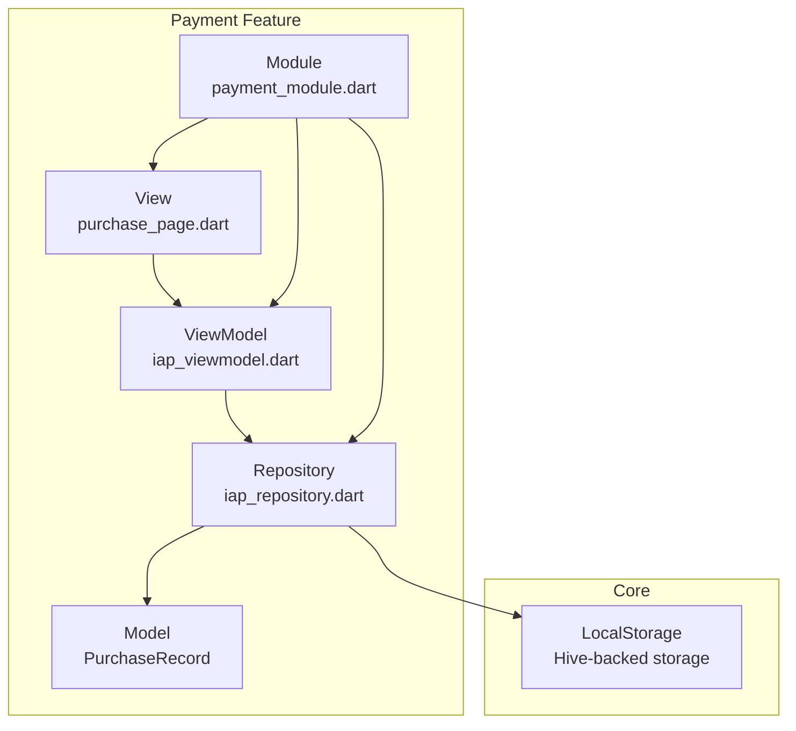
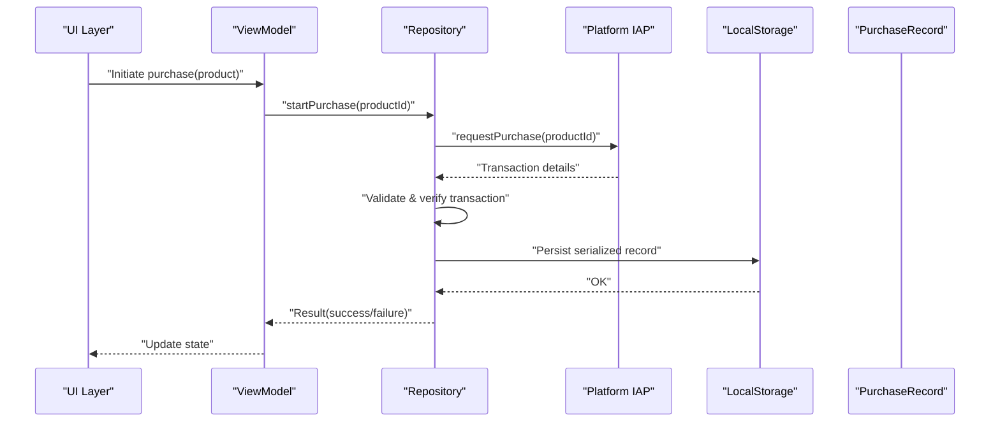
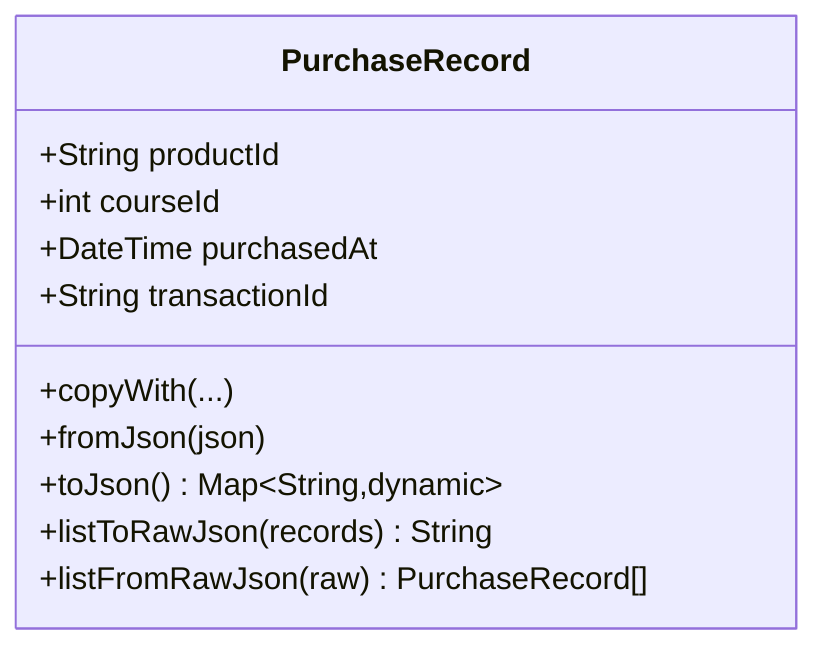
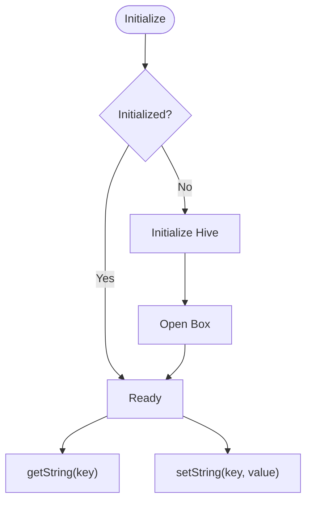
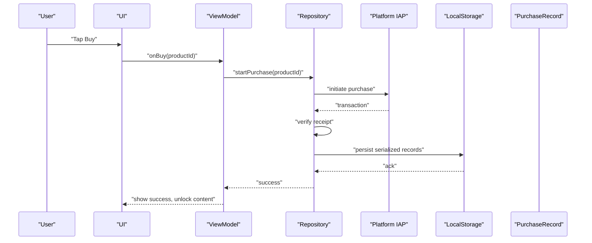
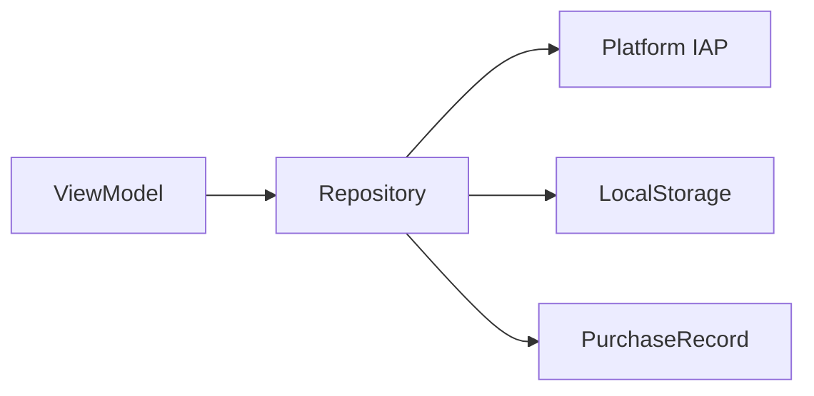

# In-App Purchases

<cite>
**Referenced Files in This Document**
- [purchase_record.dart](file://lib/app/features/payment/model/purchase_record.dart)
- [purchase_record_test.dart](file://test/payment/purchase_record_test.dart)
- [local_storage_provider.dart](file://lib/app/core/provider/local_storage_provider.dart)
- [pubspec.yaml](file://pubspec.yaml)
</cite>

## Table of Contents
1. [Introduction](#introduction)
2. [Project Structure](#project-structure)
3. [Core Components](#core-components)
4. [Architecture Overview](#architecture-overview)
5. [Detailed Component Analysis](#detailed-component-analysis)
6. [Dependency Analysis](#dependency-analysis)
7. [Performance Considerations](#performance-considerations)
8. [Troubleshooting Guide](#troubleshooting-guide)
9. [Conclusion](#conclusion)
10. [Appendices](#appendices)

## Introduction
This document describes the In-App Purchases (IAP) implementation for the application, focusing on the purchase flow from product listing to completion. It covers product catalog management, purchase initiation, transaction handling, and post-purchase verification. It also explains integration points with platform-specific IAP services (Google Play Billing on Android and StoreKit on iOS), receipt validation mechanisms, error handling for failed purchases, network issues, and user cancellations. Finally, it provides examples for one-time purchases, consumable items, and non-consumable products, along with testing strategies using mock implementations and test scenarios.

## Project Structure
The IAP feature is organized under a payment module with clear separation of concerns: models, repository, viewmodel, view, and module. The current codebase includes a robust data model for persisted purchase records and unit tests validating serialization and deserialization. Platform-specific IAP integrations are not present in this snapshot; however, the structure supports adding them via the repository and viewmodel layers.

**Diagram sources**
- [purchase_record.dart:1-62](file://lib/app/features/payment/model/purchase_record.dart#L1-L62)
- [local_storage_provider.dart:1-48](file://lib/app/core/provider/local_storage_provider.dart#L1-L48)

**Section sources**
- [purchase_record.dart:1-62](file://lib/app/features/payment/model/purchase_record.dart#L1-L62)
- [local_storage_provider.dart:1-48](file://lib/app/core/provider/local_storage_provider.dart#L1-L48)

## Core Components
- PurchaseRecord: A serializable model representing a completed purchase, including product identifier, associated course identifier, timestamp, and transaction identifier. It supports JSON serialization/deserialization and list-level helpers for persistence.
- LocalStorage: A Hive-backed key-value store used to persist serialized purchase records or related metadata across app sessions.

Key responsibilities:
- Model layer: Encapsulates purchase data and provides safe conversion to/from JSON for local storage and potential server sync.
- Storage layer: Provides initialization and get/set operations for strings, enabling durable storage of purchase records.

**Section sources**
- [purchase_record.dart:1-62](file://lib/app/features/payment/model/purchase_record.dart#L1-L62)
- [local_storage_provider.dart:1-48](file://lib/app/core/provider/local_storage_provider.dart#L1-L48)

## Architecture Overview
The IAP architecture follows a layered approach:
- View: UI triggers purchase actions and displays status.
- ViewModel: Orchestrates business logic, coordinates with repository, and updates UI state.
- Repository: Abstracts platform IAP calls and manages purchase lifecycle, including verification and persistence.
- Model: Represents purchase entities and supports serialization.
- Storage: Persists purchase records locally.

[No sources needed since this diagram shows conceptual workflow, not actual code structure]

## Detailed Component Analysis

### PurchaseRecord Model
- Purpose: Captures completed purchase information and enables reliable serialization for local storage and future server synchronization.
- Fields:
  - productId: Unique identifier of the purchased item.
  - courseId: Application-specific resource unlocked by the purchase.
  - purchasedAt: Timestamp of purchase completion.
  - transactionId: Platform-provided transaction identifier for audit and reconciliation.
- Methods:
  - copyWith: Creates modified copies immutably.
  - fromJson/toJson: Converts between Dart objects and JSON.
  - listToRawJson/listFromRawJson: Batch serialization utilities for lists of records.

Complexity considerations:
- Serialization is O(n) over the number of records when using list helpers.
- Parsing uses standard JSON decoding; ensure input integrity to avoid parsing errors.

Error handling:
- JSON parsing relies on well-formed inputs; invalid formats will throw exceptions during deserialization. Tests validate expected keys and round-trip behavior.

Testing highlights:
- Validates presence of all required keys in JSON.
- Ensures correct serialization of fields, including ISO-8601 timestamps.
- Verifies list serialization/deserialization preserves counts and field values.

**Diagram sources**
- [purchase_record.dart:1-62](file://lib/app/features/payment/model/purchase_record.dart#L1-L62)

**Section sources**
- [purchase_record.dart:1-62](file://lib/app/features/payment/model/purchase_record.dart#L1-L62)
- [purchase_record_test.dart:1-142](file://test/payment/purchase_record_test.dart#L1-L142)

### LocalStorage Provider
- Purpose: Provides a simple string-based key-value store backed by Hive for persisting serialized purchase records or related metadata.
- Initialization: Initializes Hive appropriately for web vs. native platforms and opens a named box.
- Operations:
  - getString(key): Retrieves a value, initializing if necessary.
  - setString(key, value): Stores a value, initializing if necessary.

Usage in IAP:
- After successful purchase verification, serialize PurchaseRecord(s) and store via setString.
- On app start, retrieve and parse stored records to restore purchase state.

**Diagram sources**
- [local_storage_provider.dart:1-48](file://lib/app/core/provider/local_storage_provider.dart#L1-L48)

**Section sources**
- [local_storage_provider.dart:1-48](file://lib/app/core/provider/local_storage_provider.dart#L1-L48)

### IAP Flow: From Product Listing to Completion
Conceptual steps:
- Product Catalog Management:
  - Fetch available products from backend or platform catalogs.
  - Cache product metadata locally for offline access and faster rendering.
- Purchase Initiation:
  - User selects a product; ViewModel requests purchase through Repository.
  - Repository invokes platform IAP (Google Play Billing/StoreKit).
- Transaction Handling:
  - Platform returns transaction details upon success.
  - Repository validates and verifies the transaction (receipt validation).
  - Persist verified purchase via LocalStorage using PurchaseRecord serialization.
- Post-Purchase:
  - Unlock content (e.g., course access) based on courseId.
  - Update UI state to reflect success.

[No sources needed since this diagram shows conceptual workflow, not actual code structure]

### Integration with Platform-Specific IAP Services
- Google Play Billing (Android):
  - Use platform billing client to query products, initiate purchases, and handle purchase updates.
  - Validate receipts server-side or via secure verification endpoints.
- StoreKit (iOS):
  - Use StoreKit APIs to fetch products, process purchases, and manage transactions.
  - Validate receipts using Apple’s receipt validation service.

Note: The current repository and viewmodel files are placeholders indicating where platform-specific logic should be implemented.

[No sources needed since this section provides general guidance]

### Receipt Validation Mechanisms
- Server-side validation:
  - Send platform receipts to a backend service that verifies with Google Play or Apple servers.
  - Return confirmation to the app to unlock content.
- Client-side checks:
  - Verify transaction IDs and timestamps against stored records to prevent duplicates.
  - Ensure idempotency when re-processing transactions after restarts.

[No sources needed since this section provides general guidance]

### Error Handling
Common scenarios and handling strategies:
- Failed purchases:
  - Display user-friendly messages and allow retry.
  - Log error codes for diagnostics.
- Network issues:
  - Retry with exponential backoff for receipt validation.
  - Queue pending validations until connectivity resumes.
- User cancellations:
  - Gracefully cancel flows without errors; update UI accordingly.
- Duplicate transactions:
  - Detect by transactionId and skip reprocessing.

[No sources needed since this section provides general guidance]

### Examples: One-Time, Consumable, and Non-Consumable Products
- One-time purchases:
  - Example: Unlock a specific course permanently.
  - Implementation: Record productId and courseId; persist once per transactionId.
- Consumable items:
  - Example: Purchase credits or tokens.
  - Implementation: Allow multiple purchases; track quantity consumed via additional fields or server state.
- Non-consumable products:
  - Example: Lifetime premium access.
  - Implementation: Persist a flag tied to userId; guard against duplicate purchases.

[No sources needed since this section provides general guidance]

## Dependency Analysis
- Internal dependencies:
  - ViewModel depends on Repository for IAP orchestration.
  - Repository depends on Platform IAP and LocalStorage for persistence.
  - Model (PurchaseRecord) is used by Repository for serialization.
- External dependencies:
  - Flutter SDK and Riverpod for state management (if used in ViewModel).
  - Hive for persistent storage via LocalStorage.

[No sources needed since this diagram shows conceptual relationships, not actual code structure]

**Section sources**
- [purchase_record.dart:1-62](file://lib/app/features/payment/model/purchase_record.dart#L1-L62)
- [local_storage_provider.dart:1-48](file://lib/app/core/provider/local_storage_provider.dart#L1-L48)

## Performance Considerations
- Minimize redundant purchases:
  - Deduplicate by transactionId before initiating new purchases.
- Efficient serialization:
  - Use batch serialization helpers for lists to reduce overhead.
- Caching:
  - Cache product catalogs locally to reduce network calls.
- Background processing:
  - Perform receipt validation asynchronously to keep UI responsive.

[No sources needed since this section provides general guidance]

## Troubleshooting Guide
Symptoms and resolutions:
- Purchase appears but content not unlocked:
  - Verify receipt validation succeeded and persisted record exists.
  - Check LocalStorage for serialized PurchaseRecord entries.
- Repeated prompts to buy:
  - Ensure duplicate detection by transactionId is implemented.
  - Confirm restoration logic reads persisted records on app start.
- Network errors during validation:
  - Implement retries and fallback states; inform users of connectivity issues.
- Platform-specific errors:
  - Inspect error codes from Google Play Billing or StoreKit and map to user messages.

[No sources needed since this section provides general guidance]

## Conclusion
The IAP implementation centers around a robust PurchaseRecord model and a LocalStorage provider for durable persistence. While platform-specific integrations are not included in this snapshot, the modular structure supports adding Google Play Billing and StoreKit via the repository and viewmodel layers. Following the outlined flow, validation strategies, and error handling patterns will ensure a reliable and user-friendly purchasing experience.

[No sources needed since this section summarizes without analyzing specific files]

## Appendices

### Testing Strategies
- Unit tests for model serialization:
  - Validate JSON keys, field types, and round-trip conversions.
  - Test list serialization helpers for correctness and edge cases.
- Mock implementations:
  - Mock platform IAP responses to simulate success, failure, and cancellation scenarios.
  - Mock LocalStorage to assert persistence behavior without real disk writes.
- Test scenarios:
  - Successful purchase with receipt validation and content unlock.
  - Network failure during validation with retry behavior.
  - User cancellation mid-flow with no side effects.
  - Duplicate transaction handling to prevent reprocessing.

**Section sources**
- [purchase_record_test.dart:1-142](file://test/payment/purchase_record_test.dart#L1-L142)

### Configuration Notes
- Dependencies:
  - The project uses Flutter SDK and various packages; IAP-specific plugins can be added as needed.
- Environment setup:
  - Ensure proper entitlements and configurations for Google Play Billing and StoreKit when integrating platform services.

**Section sources**
- [pubspec.yaml:1-171](file://pubspec.yaml#L1-L171)