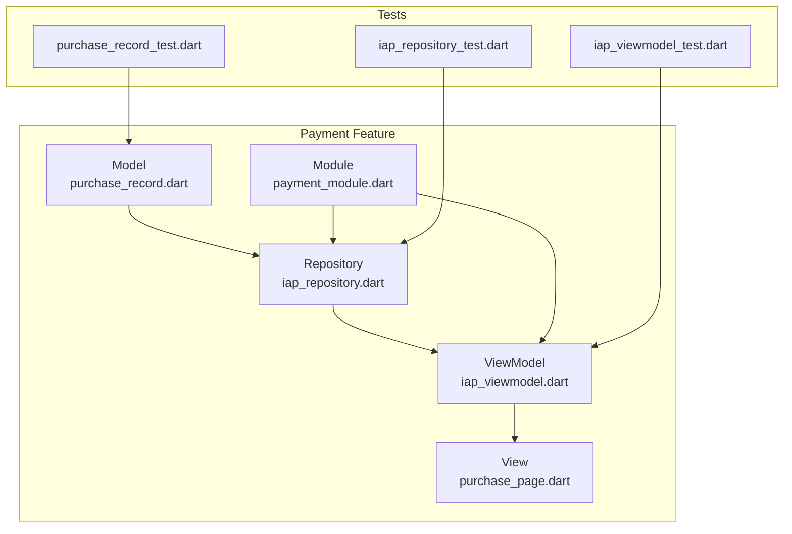
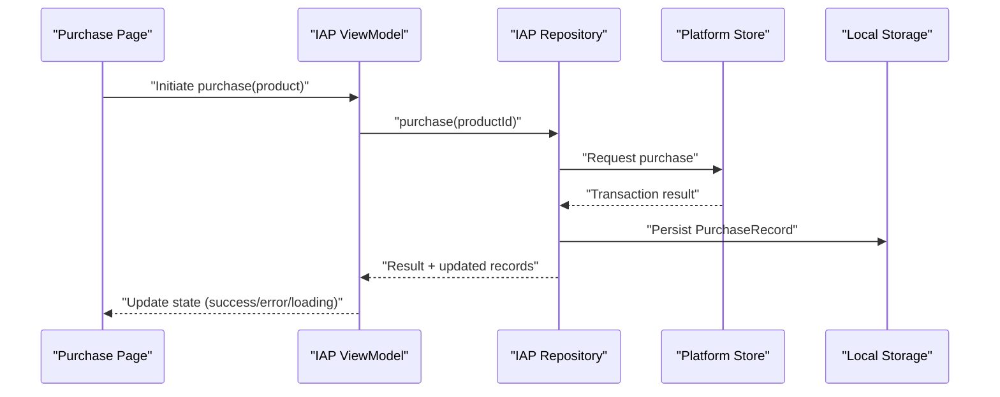
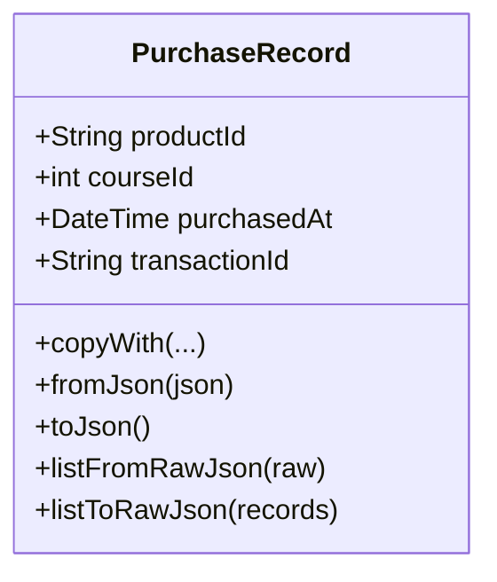
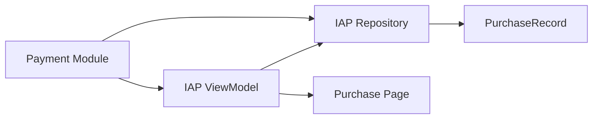

# Payment Integration

<cite>
**Referenced Files in This Document**
- [purchase_record.dart](file://lib/app/features/payment/model/purchase_record.dart)
- [iap_repository.dart](file://lib/app/features/payment/repository/iap_repository.dart)
- [iap_viewmodel.dart](file://lib/app/features/payment/viewmodel/iap_viewmodel.dart)
- [payment_module.dart](file://lib/app/features/payment/module/payment_module.dart)
- [purchase_page.dart](file://lib/app/features/payment/view/purchase_page.dart)
- [purchase_record_test.dart](file://test/payment/purchase_record_test.dart)
- [iap_repository_test.dart](file://test/payment/iap_repository_test.dart)
- [iap_viewmodel_test.dart](file://test/payment/iap_viewmodel_test.dart)
- [course.dart](file://lib/app/features/courses/model/course.dart)
- [class_info.dart](file://lib/app/features/courses/model/class_info.dart)
</cite>

## Table of Contents
1. [Introduction](#introduction)
2. [Project Structure](#project-structure)
3. [Core Components](#core-components)
4. [Architecture Overview](#architecture-overview)
5. [Detailed Component Analysis](#detailed-component-analysis)
6. [Dependency Analysis](#dependency-analysis)
7. [Performance Considerations](#performance-considerations)
8. [Troubleshooting Guide](#troubleshooting-guide)
9. [Conclusion](#conclusion)
10. [Appendices](#appendices)

## Introduction
This document describes the Payment Integration feature module for in-app purchases, payment processing workflows, and subscription management. It explains how platform-specific integrations (Google Play Store and Apple App Store) are intended to be used for purchase verification and receipt validation, how payment state is managed, and how errors and retries are handled. It also covers product catalog management, purchase flows, license verification, testing strategies, and mock implementations for development environments.

The current codebase includes a persistent model for purchase records and placeholder scaffolding for repository, viewmodel, module, and UI components that are marked as removed. The documentation below outlines both the existing implementation and the recommended architecture for completing the payment integration.

## Project Structure
The payment feature is organized under lib/app/features/payment with subfolders for model, repository, viewmodel, view, and module. A concrete data model exists for purchase records, while other components currently contain placeholders indicating removal. Tests exist for the model and placeholders for repository and viewmodel tests.

**Diagram sources**
- [purchase_record.dart:1-62](file://lib/app/features/payment/model/purchase_record.dart#L1-L62)
- [iap_repository.dart:1-2](file://lib/app/features/payment/repository/iap_repository.dart#L1-L2)
- [iap_viewmodel.dart:1-2](file://lib/app/features/payment/viewmodel/iap_viewmodel.dart#L1-L2)
- [purchase_page.dart:1-1](file://lib/app/features/payment/view/purchase_page.dart#L1-L1)
- [payment_module.dart:1-1](file://lib/app/features/payment/module/payment_module.dart#L1-L1)
- [purchase_record_test.dart:1-141](file://test/payment/purchase_record_test.dart#L1-L141)
- [iap_repository_test.dart:1-1](file://test/payment/iap_repository_test.dart#L1-L1)
- [iap_viewmodel_test.dart:1-1](file://test/payment/iap_viewmodel_test.dart#L1-L1)

**Section sources**
- [purchase_record.dart:1-62](file://lib/app/features/payment/model/purchase_record.dart#L1-L62)
- [iap_repository.dart:1-2](file://lib/app/features/payment/repository/iap_repository.dart#L1-L2)
- [iap_viewmodel.dart:1-2](file://lib/app/features/payment/viewmodel/iap_viewmodel.dart#L1-L2)
- [purchase_page.dart:1-1](file://lib/app/features/payment/view/purchase_page.dart#L1-L1)
- [payment_module.dart:1-1](file://lib/app/features/payment/module/payment_module.dart#L1-L1)
- [purchase_record_test.dart:1-141](file://test/payment/purchase_record_test.dart#L1-L141)
- [iap_repository_test.dart:1-1](file://test/payment/iap_repository_test.dart#L1-L1)
- [iap_viewmodel_test.dart:1-1](file://test/payment/iap_viewmodel_test.dart#L1-L1)

## Core Components
- PurchaseRecord model: Represents a completed purchase stored locally on the device, including product identifier, associated course identifier, purchase timestamp, and transaction identifier. It supports serialization/deserialization and list operations.
- Repository placeholder: Intended to encapsulate platform IAP calls and local persistence. Currently marked as removed.
- ViewModel placeholder: Intended to coordinate UI state and orchestrate repository calls. Currently marked as removed.
- Module placeholder: Intended to wire dependencies for dependency injection. Currently marked as removed.
- View placeholder: Intended to host the purchase flow UI. Currently marked as removed.

Key responsibilities:
- Model: Persistable representation of purchases; round-trips to JSON for storage or sync.
- Repository: Encapsulates store interactions (Google Play/Apple App Store), receipt validation, and local record management.
- ViewModel: Manages UI state (loading, success, error), triggers purchases, handles retries, and exposes state to views.
- Module: Provides DI bindings for repository and viewmodel.
- View: Presents product catalog, initiates purchases, shows status, and handles user feedback.

**Section sources**
- [purchase_record.dart:1-62](file://lib/app/features/payment/model/purchase_record.dart#L1-L62)
- [iap_repository.dart:1-2](file://lib/app/features/payment/repository/iap_repository.dart#L1-L2)
- [iap_viewmodel.dart:1-2](file://lib/app/features/payment/viewmodel/iap_viewmodel.dart#L1-L2)
- [payment_module.dart:1-1](file://lib/app/features/payment/module/payment_module.dart#L1-L1)
- [purchase_page.dart:1-1](file://lib/app/features/payment/view/purchase_page.dart#L1-L1)

## Architecture Overview
The intended architecture follows a layered approach:
- View observes ViewModel state and triggers actions (e.g., initiate purchase).
- ViewModel coordinates business logic, manages state, and delegates to Repository.
- Repository abstracts platform IAP SDKs and local storage, exposing clean APIs to the ViewModel.
- Model persists purchase records and supports serialization.

**Diagram sources**
- [purchase_page.dart:1-1](file://lib/app/features/payment/view/purchase_page.dart#L1-L1)
- [iap_viewmodel.dart:1-2](file://lib/app/features/payment/viewmodel/iap_viewmodel.dart#L1-L2)
- [iap_repository.dart:1-2](file://lib/app/features/payment/repository/iap_repository.dart#L1-L2)
- [purchase_record.dart:1-62](file://lib/app/features/payment/model/purchase_record.dart#L1-L62)

## Detailed Component Analysis

### PurchaseRecord Model
- Purpose: Captures completed purchases with fields for product ID, course ID, purchase time, and transaction ID. Supports copyWith, JSON serialization, and list helpers.
- Complexity: O(1) per field access; list serialization/deserialization O(n) over n records.
- Data flow: Used by repository to persist successful transactions and by UI to reflect ownership.

**Diagram sources**
- [purchase_record.dart:1-62](file://lib/app/features/payment/model/purchase_record.dart#L1-L62)

**Section sources**
- [purchase_record.dart:1-62](file://lib/app/features/payment/model/purchase_record.dart#L1-L62)
- [purchase_record_test.dart:1-141](file://test/payment/purchase_record_test.dart#L1-L141)

### Repository Placeholder (IAP Repository)
- Current state: Placeholder file indicating removal.
- Intended role: Encapsulate Google Play Billing and StoreKit calls, handle purchase updates, verify receipts, and manage local records via PurchaseRecord.
- Suggested API surface:
  - purchase(productId): initiate purchase and return result stream or Future.
  - restorePurchases(): recover past purchases.
  - verifyReceipt(transactionId, payload): validate with server/store.
  - getOwnedProducts(): list owned products from local storage.

[No sources needed since this section analyzes placeholder files without implementation]

### ViewModel Placeholder (IAP ViewModel)
- Current state: Placeholder file indicating removal.
- Intended role: Manage UI state (loading, success, error), orchestrate repository calls, implement retry logic, and expose observable state to the view.
- Suggested responsibilities:
  - Expose states like idle, purchasing, purchased, failed.
  - Handle network/store errors with retry/backoff.
  - Debounce rapid purchase attempts and prevent duplicates.

[No sources needed since this section analyzes placeholder files without implementation]

### Module Placeholder (Payment Module)
- Current state: Placeholder file indicating removal.
- Intended role: Provide dependency injection bindings for repository and viewmodel, enabling testability and environment-specific configurations (e.g., sandbox vs production).

[No sources needed since this section analyzes placeholder files without implementation]

### View Placeholder (Purchase Page)
- Current state: Placeholder file indicating removal.
- Intended role: Present product catalog, initiate purchases, show progress and errors, and navigate based on outcomes.

[No sources needed since this section analyzes placeholder files without implementation]

### Product Catalog and Course Integration
- Courses and classes include an is_payment flag, indicating whether a course requires purchase. This flag can drive UI prompts and gating logic.
- The product identifiers used in tests suggest a naming convention such as live.leadershipedge.app.course_<id>, aligning with typical store product IDs.

**Section sources**
- [course.dart:185-239](file://lib/app/features/courses/model/course.dart#L185-L239)
- [class_info.dart:348-424](file://lib/app/features/courses/model/class_info.dart#L348-L424)
- [purchase_record_test.dart:14-19](file://test/payment/purchase_record_test.dart#L14-L19)

## Dependency Analysis
- Model depends only on Dart standard libraries for JSON handling.
- Repository would depend on platform IAP packages and local storage.
- ViewModel depends on Repository and exposes state to View.
- Module binds Repository and ViewModel for DI.
- Tests validate model behavior and provide skeletons for repository and viewmodel tests.

**Diagram sources**
- [iap_viewmodel.dart:1-2](file://lib/app/features/payment/viewmodel/iap_viewmodel.dart#L1-L2)
- [iap_repository.dart:1-2](file://lib/app/features/payment/repository/iap_repository.dart#L1-L2)
- [purchase_record.dart:1-62](file://lib/app/features/payment/model/purchase_record.dart#L1-L62)
- [purchase_page.dart:1-1](file://lib/app/features/payment/view/purchase_page.dart#L1-L1)
- [payment_module.dart:1-1](file://lib/app/features/payment/module/payment_module.dart#L1-L1)

**Section sources**
- [purchase_record.dart:1-62](file://lib/app/features/payment/model/purchase_record.dart#L1-L62)
- [iap_repository.dart:1-2](file://lib/app/features/payment/repository/iap_repository.dart#L1-L2)
- [iap_viewmodel.dart:1-2](file://lib/app/features/payment/viewmodel/iap_viewmodel.dart#L1-L2)
- [payment_module.dart:1-1](file://lib/app/features/payment/module/payment_module.dart#L1-L1)
- [purchase_page.dart:1-1](file://lib/app/features/payment/view/purchase_page.dart#L1-L1)

## Performance Considerations
- Minimize redundant store queries by caching owned products locally using PurchaseRecord.
- Batch operations when restoring purchases to reduce network and UI overhead.
- Use debouncing for purchase initiation to avoid duplicate requests.
- Prefer streaming updates from platform IAP to keep UI responsive during long-running operations.

[No sources needed since this section provides general guidance]

## Troubleshooting Guide
Common issues and resolutions:
- Failed transactions: Surface clear error messages to users; log transaction details for diagnostics. Implement retry with exponential backoff for transient failures.
- Receipt validation failures: Validate signatures and timestamps; ensure server-side verification uses the correct environment (sandbox vs production).
- Duplicate purchases: Deduplicate by transactionId before persisting or granting entitlements.
- Subscription edge cases: Handle renewals, cancellations, and grace periods; reconcile with server state periodically.

Testing strategies:
- Unit tests for model serialization and deserialization are present and should be expanded to cover edge cases.
- Mock repository and viewmodel tests can simulate store responses and verify state transitions.
- Use platform-specific test accounts and sandbox environments for end-to-end scenarios.

**Section sources**
- [purchase_record_test.dart:1-141](file://test/payment/purchase_record_test.dart#L1-L141)
- [iap_repository_test.dart:1-1](file://test/payment/iap_repository_test.dart#L1-L1)
- [iap_viewmodel_test.dart:1-1](file://test/payment/iap_viewmodel_test.dart#L1-L1)

## Conclusion
The payment integration module has a solid foundation with a robust PurchaseRecord model and comprehensive unit tests for serialization. Repository, ViewModel, Module, and View components are scaffolded but currently marked as removed. Implementing these components will complete the end-to-end in-app purchase workflow, including platform integrations, purchase verification, receipt validation, state management, error handling, and retry mechanisms. Leveraging the existing model and tests will accelerate development and ensure reliability.

[No sources needed since this section summarizes without analyzing specific files]

## Appendices

### Recommended Implementation Checklist
- Implement IAP Repository:
  - Integrate Google Play Billing and StoreKit.
  - Expose purchase, restore, verify, and query APIs.
  - Persist PurchaseRecord on successful transactions.
- Implement IAP ViewModel:
  - Manage loading, success, and error states.
  - Add retry/backoff for transient failures.
  - Prevent duplicate purchases via transactionId checks.
- Implement Payment Module:
  - Wire dependencies for DI.
  - Support environment toggles (sandbox/production).
- Implement Purchase Page:
  - Display product catalog and prices.
  - Initiate purchases and show real-time status.
  - Handle navigation and post-purchase actions.

### Testing Strategies
- Unit tests:
  - Expand model tests to cover invalid inputs and boundary conditions.
  - Add repository tests with mocks for store responses.
  - Add viewmodel tests to assert state transitions and retry behavior.
- Integration tests:
  - Use sandbox accounts to exercise full purchase flows.
  - Verify receipt validation against server endpoints.
- Regression tests:
  - Guard against regressions in serialization and state handling.

[No sources needed since this section provides general guidance]