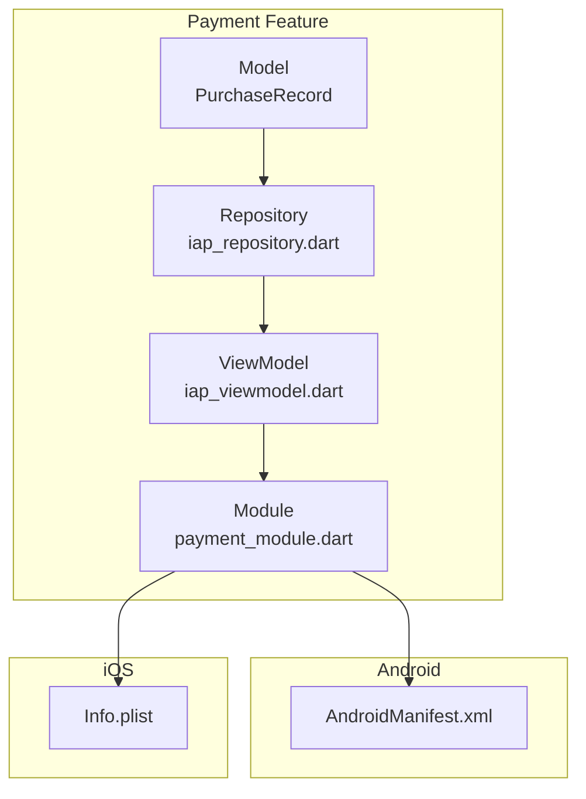
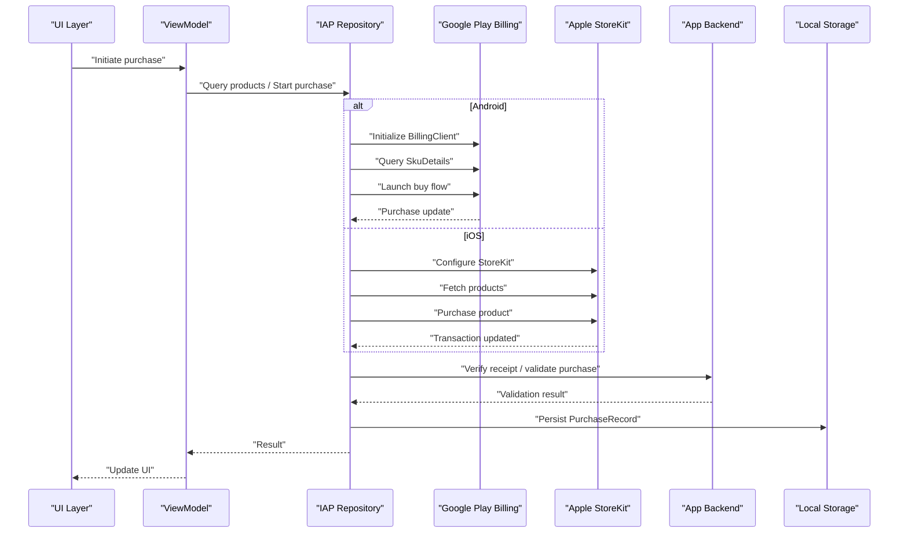
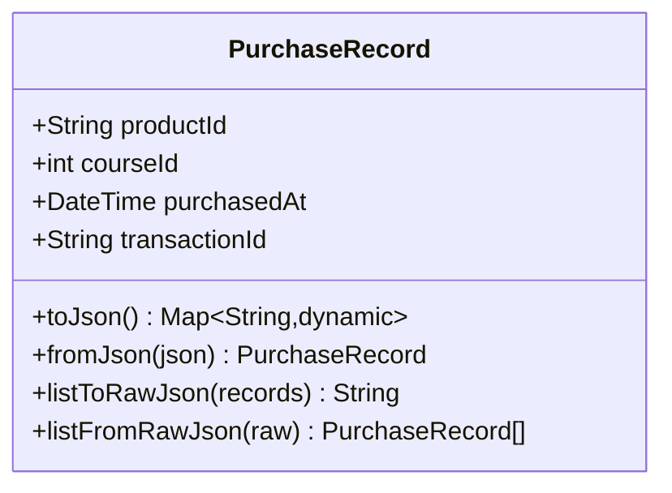
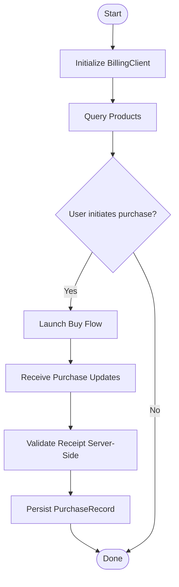
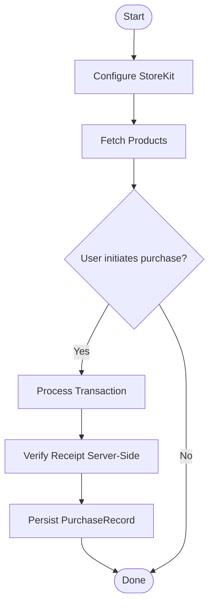
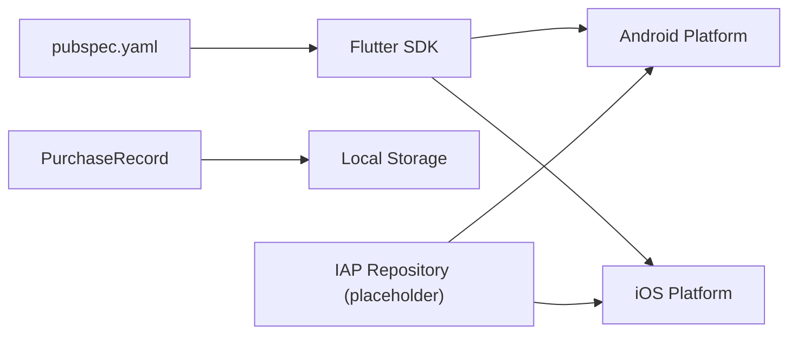

# Platform-Specific Integrations

<cite>
**Referenced Files in This Document**
- [pubspec.yaml](file://pubspec.yaml)
- [purchase_record.dart](file://lib/app/features/payment/model/purchase_record.dart)
- [iap_repository.dart](file://lib/app/features/payment/repository/iap_repository.dart)
- [iap_viewmodel.dart](file://lib/app/features/payment/viewmodel/iap_viewmodel.dart)
- [payment_module.dart](file://lib/app/features/payment/module/payment_module.dart)
- [AndroidManifest.xml](file://android/app/src/main/AndroidManifest.xml)
- [Info.plist](file://ios/Runner/Info.plist)
- [purchase_record_test.dart](file://test/payment/purchase_record_test.dart)
</cite>

## Table of Contents
1. Introduction
2. Project Structure
3. Core Components
4. Architecture Overview
5. Detailed Component Analysis
6. Dependency Analysis
7. Performance Considerations
8. Troubleshooting Guide
9. Conclusion

## Introduction
This document provides platform-specific guidance for integrating Google Play Store and Apple App Store payments into the Flutter application. It covers billing client setup, product queries, purchase flows, receipt validation, platform differences, required permissions, store configurations, development and production setup, sandbox testing, debugging techniques, error handling strategies, and cross-platform fallbacks. The repository currently contains a payment feature scaffold with a local purchase record model and placeholder files for repository, viewmodel, and module; actual IAP integrations are not yet implemented.

## Project Structure
The payment-related code is organized under lib/app/features/payment with subfolders for model, repository, viewmodel, and module. A PurchaseRecord model persists completed purchases locally. Platform configuration files exist for Android and iOS but do not include IAP-specific entries at this time.

**Diagram sources**
- [purchase_record.dart:1-62](file://lib/app/features/payment/model/purchase_record.dart#L1-L62)
- [iap_repository.dart:1-1](file://lib/app/features/payment/repository/iap_repository.dart#L1-L1)
- [iap_viewmodel.dart:1-1](file://lib/app/features/payment/viewmodel/iap_viewmodel.dart#L1-L1)
- [payment_module.dart:1-1](file://lib/app/features/payment/module/payment_module.dart#L1-L1)
- [AndroidManifest.xml:1-46](file://android/app/src/main/AndroidManifest.xml#L1-L46)
- [Info.plist:1-78](file://ios/Runner/Info.plist#L1-L78)

**Section sources**
- [purchase_record.dart:1-62](file://lib/app/features/payment/model/purchase_record.dart#L1-L62)
- [AndroidManifest.xml:1-46](file://android/app/src/main/AndroidManifest.xml#L1-L46)
- [Info.plist:1-78](file://ios/Runner/Info.plist#L1-L78)

## Core Components
- PurchaseRecord: A local data model representing a completed purchase with fields for product identifier, course identifier, timestamp, and transaction identifier. It supports JSON serialization/deserialization and list utilities.
- Placeholder IAP components: Repository, ViewModel, and Module files exist but are marked as removed/deleted placeholders, indicating that IAP integration is not yet implemented.

Key responsibilities:
- Model: Persist and serialize purchase records locally for offline access and audit.
- Repository (to be implemented): Encapsulate platform-specific IAP calls (Google Play Billing on Android, StoreKit on iOS).
- ViewModel (to be implemented): Coordinate UI state and orchestrate repository calls.
- Module (to be implemented): Wire dependencies and configure providers or DI.

**Section sources**
- [purchase_record.dart:1-62](file://lib/app/features/payment/model/purchase_record.dart#L1-L62)
- [iap_repository.dart:1-1](file://lib/app/features/payment/repository/iap_repository.dart#L1-L1)
- [iap_viewmodel.dart:1-1](file://lib/app/features/payment/viewmodel/iap_viewmodel.dart#L1-L1)
- [payment_module.dart:1-1](file://lib/app/features/payment/module/payment_module.dart#L1-L1)

## Architecture Overview
The intended architecture separates concerns across layers:
- UI layer triggers purchase actions.
- ViewModel manages state and user feedback.
- Repository abstracts platform IAP SDKs.
- Platform-specific implementations handle billing client initialization, product queries, purchase flows, and receipt verification.
- Local storage persists PurchaseRecord after successful verification.

[No diagram sources needed since this diagram shows conceptual workflow, not actual code structure]

## Detailed Component Analysis

### PurchaseRecord Model
- Purpose: Represent and persist completed purchases locally with stable identifiers for auditing and entitlement checks.
- Fields:
  - productId: Platform product identifier used by stores.
  - courseId: Internal identifier to grant content access.
  - purchasedAt: Timestamp of purchase completion.
  - transactionId: Unique store transaction identifier for reconciliation.
- Serialization: Provides toJson/fromJson and list helpers for bulk operations.

**Diagram sources**
- [purchase_record.dart:1-62](file://lib/app/features/payment/model/purchase_record.dart#L1-L62)

**Section sources**
- [purchase_record.dart:1-62](file://lib/app/features/payment/model/purchase_record.dart#L1-L62)
- [purchase_record_test.dart:1-141](file://test/payment/purchase_record_test.dart#L1-L141)

### Google Play Store Integration (Android)
Implementation targets:
- Billing client setup: Initialize BillingClient with app context and listener for purchase updates.
- Product queries: Fetch SkuDetails for subscriptions or one-time products using QueryProductDetailsAsync or legacy SkuDetails.
- Purchase flows: Launch BuyIntent for products; handle pending purchases and acknowledgments.
- Receipt validation: Validate signed receipts server-side or via secure backend APIs; verify signatures and bundle IDs.

Required Android configuration:
- Add necessary permissions and meta-data for billing if using a plugin or native implementation.
- Ensure package name matches Google Play Console configuration.

Development and testing:
- Use Google Play internal testing track or closed testing with licensed testers.
- Configure test accounts and product status in Google Play Console.

Debugging:
- Log billing responses and errors from BillingClient.
- Verify product IDs and entitlement mapping.

[No diagram sources needed since this diagram shows conceptual workflow, not actual code structure]

### Apple App Store Integration (iOS)
Implementation targets:
- StoreKit configuration: Set up SKPaymentQueue observer and product requests.
- Product fetching: Request SKProducts using product identifiers.
- Transaction processing: Handle SKPaymentTransaction updates, including purchases, restores, and failures.
- Receipt verification: Send receipts to backend for signature verification against Apple’s receipt validation service.

Required iOS configuration:
- Ensure App ID and In-App Purchase products are configured in App Store Connect.
- Confirm bundle identifier matches the app.

Development and testing:
- Use Sandbox environment via TestFlight or Xcode Archive with sandbox users.
- Create sandbox tester accounts in App Store Connect.

Debugging:
- Inspect transaction states and error codes from StoreKit.
- Validate product identifiers and entitlement mapping.

[No diagram sources needed since this diagram shows conceptual workflow, not actual code structure]

### Platform Differences and Requirements
- Permissions and manifests/plists:
  - Android: Ensure manifest includes any required billing permissions and metadata when implementing native or plugin-based billing.
  - iOS: Info.plist does not require explicit keys for StoreKit; ensure correct bundle identifier and product setup in App Store Connect.
- Store configuration:
  - Google Play: Products must be created and published in Google Play Console; use appropriate product types (subscription vs. one-time).
  - Apple App Store: Products must be created in App Store Connect; ensure pricing and availability settings are correct.
- Testing:
  - Google Play: Use internal testing/closed testing tracks and licensed testers.
  - Apple: Use Sandbox testers and TestFlight for end-to-end flows.

**Section sources**
- [AndroidManifest.xml:1-46](file://android/app/src/main/AndroidManifest.xml#L1-L46)
- [Info.plist:1-78](file://ios/Runner/Info.plist#L1-L78)

## Dependency Analysis
Current dependencies relevant to payments:
- No explicit IAP packages are declared in pubspec.yaml at this time.
- Payment feature scaffolding exists but IAP repository and viewmodel are placeholders.

**Diagram sources**
- [pubspec.yaml:1-171](file://pubspec.yaml#L1-L171)
- [purchase_record.dart:1-62](file://lib/app/features/payment/model/purchase_record.dart#L1-L62)
- [iap_repository.dart:1-1](file://lib/app/features/payment/repository/iap_repository.dart#L1-L1)

**Section sources**
- [pubspec.yaml:1-171](file://pubspec.yaml#L1-L171)

## Performance Considerations
- Cache product details locally to reduce network calls during repeated UI interactions.
- Debounce purchase initiation to prevent duplicate transactions.
- Perform receipt validation asynchronously and provide optimistic UI updates while awaiting backend confirmation.
- Minimize main-thread work; offload heavy parsing and validation to background isolates.

[No sources needed since this section provides general guidance]

## Troubleshooting Guide
Common issues and resolutions:
- Product not found:
  - Verify product identifiers match those configured in Google Play Console or App Store Connect.
  - Ensure products are active and available in the target environment (internal testing or sandbox).
- Purchase fails silently:
  - Check platform logs for billing errors or StoreKit transaction failures.
  - Validate user account eligibility (e.g., region restrictions, family sharing limitations).
- Receipt validation errors:
  - Confirm backend endpoints are reachable and correctly verifying signatures.
  - Ensure bundle identifiers and package names match store configurations.
- Fallback mechanisms:
  - If platform IAP is unavailable, present an error message and offer retry or alternative purchase methods (e.g., web checkout) where applicable.
  - Persist partial purchase state to resume later.

**Section sources**
- [purchase_record_test.dart:1-141](file://test/payment/purchase_record_test.dart#L1-L141)

## Conclusion
The repository provides a solid foundation for platform-specific payment integrations through a well-defined PurchaseRecord model and structured feature folders. To complete the implementation, add platform-specific IAP logic in the repository and viewmodel, wire them via the module, and integrate receipt validation with your backend. Follow the platform-specific setup and testing guidelines to ensure reliable purchases on both Google Play and Apple App Store.

[No sources needed since this section summarizes without analyzing specific files]