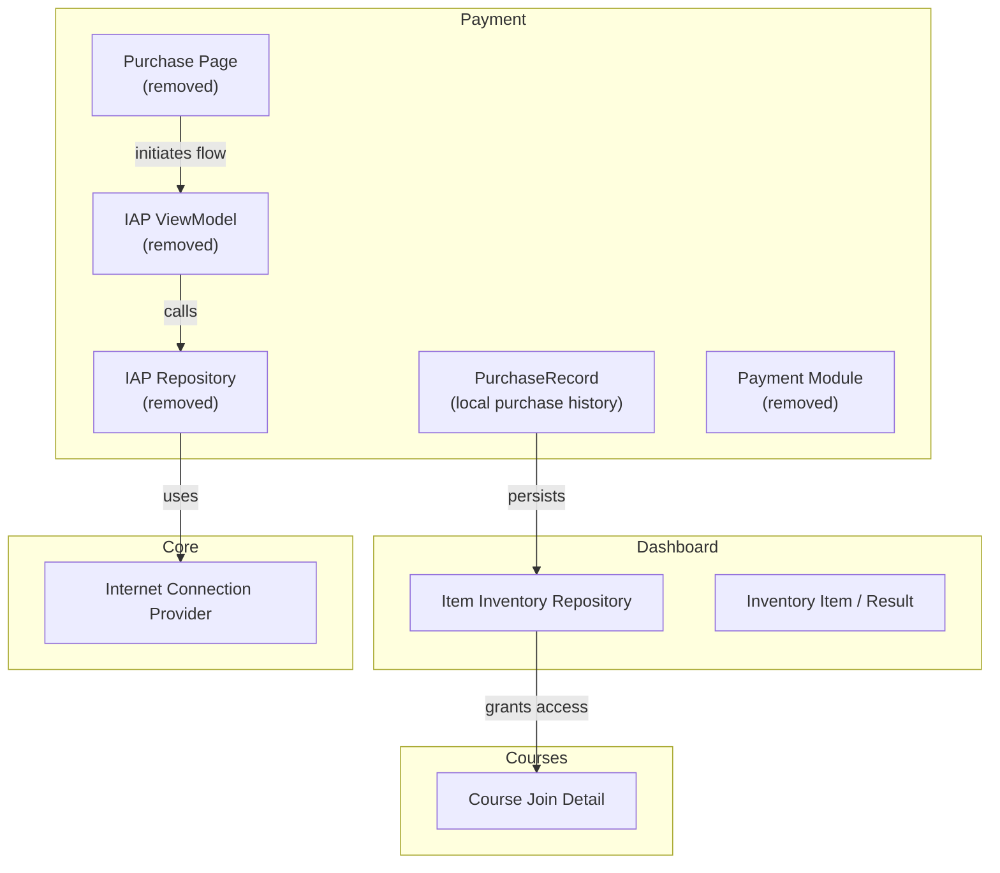
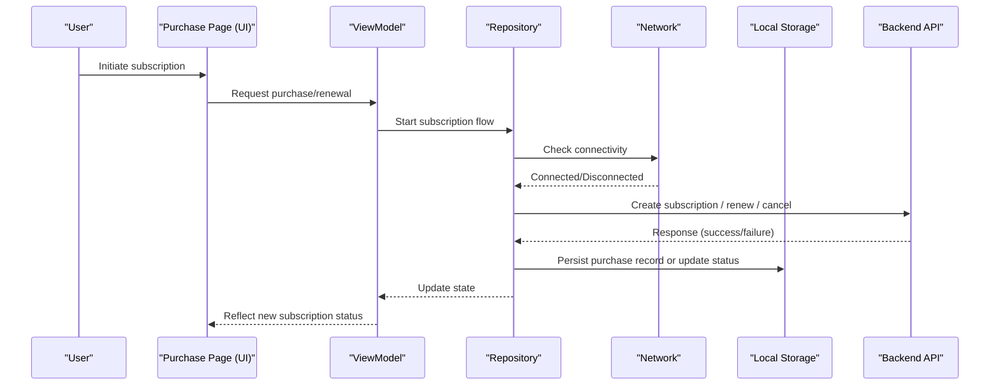
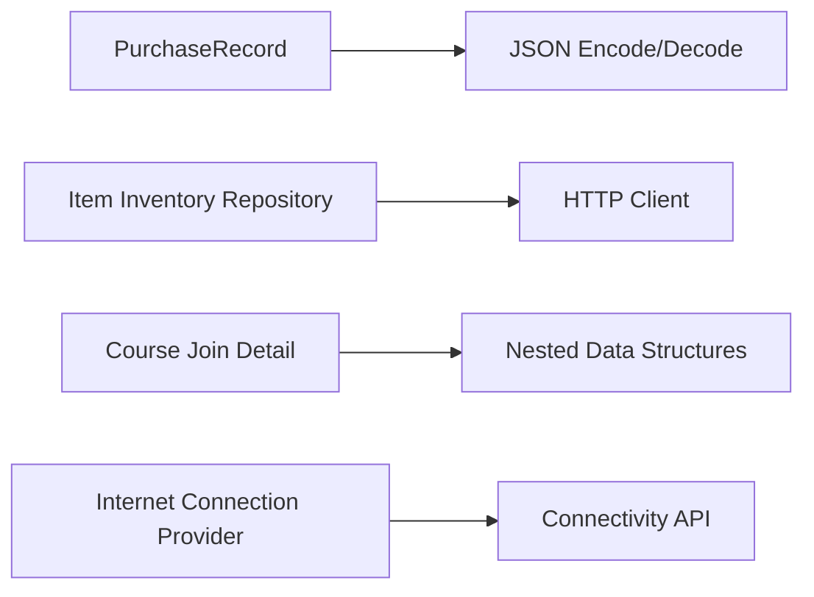

# Subscription Management

<cite>
**Referenced Files in This Document**
- [purchase_record.dart](file://lib/app/features/payment/model/purchase_record.dart)
- [iap_viewmodel.dart](file://lib/app/features/payment/viewmodel/iap_viewmodel.dart)
- [iap_repository.dart](file://lib/app/features/payment/repository/iap_repository.dart)
- [purchase_page.dart](file://lib/app/features/payment/view/purchase_page.dart)
- [payment_module.dart](file://lib/app/features/payment/module/payment_module.dart)
- [item_inventory_repository.dart](file://lib/app/features/dashboard/repository/item_inventory_repository.dart)
- [inventory_item.dart](file://lib/app/features/dashboard/model/inventory_item.dart)
- [course_join_detail.dart](file://lib/app/features/courses/model/course_join_detail.dart)
- [internet_connection_provider.dart](file://lib/app/core/provider/internet_connection_provider.dart)
</cite>

## Table of Contents
1. Introduction
2. Project Structure
3. Core Components
4. Architecture Overview
5. Detailed Component Analysis
6. Dependency Analysis
7. Performance Considerations
8. Troubleshooting Guide
9. Conclusion
10. Appendices

## Introduction
This document describes the Subscription Management functionality as implemented in the codebase. It covers the subscription lifecycle (creation, renewal, cancellation, upgrade/downgrade), state management, auto-renewal handling, grace period management, platform integration points, entitlement and license verification, UI components for user interactions, and edge cases such as expired subscriptions and billing issues.

Important context: The In-App Purchase (IAP) feature has been removed from this repository. The payment-related modules are present but marked as deleted. As a result, the current implementation focuses on local purchase records and inventory-based access patterns rather than active platform subscription flows. Where applicable, this document explains how to extend or restore subscription capabilities using the existing structures.

## Project Structure
The subscription-related code is organized under features/payment with supporting models and repositories elsewhere in the app. Key areas include:
- Payment models for persisting purchase history locally
- Removed IAP view model, repository, and view (placeholders indicating prior implementation)
- Inventory system used to grant access via redeemable items
- Course enrollment logic that gates access based on registration status
- Connectivity provider ensuring reliable network operations during subscription-related flows

**Diagram sources**
- [purchase_record.dart:1-62](file://lib/app/features/payment/model/purchase_record.dart#L1-L62)
- [item_inventory_repository.dart:39-77](file://lib/app/features/dashboard/repository/item_inventory_repository.dart#L39-L77)
- [inventory_item.dart:1-49](file://lib/app/features/dashboard/model/inventory_item.dart#L1-L49)
- [course_join_detail.dart:39-67](file://lib/app/features/courses/model/course_join_detail.dart#L39-L67)
- [internet_connection_provider.dart:31-58](file://lib/app/core/provider/internet_connection_provider.dart#L31-L58)

**Section sources**
- [purchase_record.dart:1-62](file://lib/app/features/payment/model/purchase_record.dart#L1-L62)
- [item_inventory_repository.dart:39-77](file://lib/app/features/dashboard/repository/item_inventory_repository.dart#L39-L77)
- [inventory_item.dart:1-49](file://lib/app/features/dashboard/model/inventory_item.dart#L1-L49)
- [course_join_detail.dart:39-67](file://lib/app/features/courses/model/course_join_detail.dart#L39-L67)
- [internet_connection_provider.dart:31-58](file://lib/app/core/provider/internet_connection_provider.dart#L31-L58)

## Core Components
- PurchaseRecord: A local data model representing completed purchases. It stores product identifiers, associated course IDs, timestamps, and transaction IDs. It supports JSON serialization/deserialization and list conversions for persistence.
- Item Inventory Repository: Provides methods to fetch inventory and redeem items. Redemption calls a backend endpoint and returns structured results indicating success or failure.
- Inventory Item and Result: Data models describing available items, redemption status, and user points.
- Course Join Detail: Encapsulates enrollment state and selection logic for classes requiring session selection before enrollment.
- Internet Connection Provider: Ensures connectivity checks and listener management to avoid duplicate subscriptions and ensure idempotent initialization.

These components collectively support a pattern where access to content can be granted through local purchase records or redeemed items, while connectivity safeguards help maintain consistent state across network changes.

**Section sources**
- [purchase_record.dart:1-62](file://lib/app/features/payment/model/purchase_record.dart#L1-L62)
- [item_inventory_repository.dart:39-77](file://lib/app/features/dashboard/repository/item_inventory_repository.dart#L39-L77)
- [inventory_item.dart:1-49](file://lib/app/features/dashboard/model/inventory_item.dart#L1-L49)
- [course_join_detail.dart:39-67](file://lib/app/features/courses/model/course_join_detail.dart#L39-L67)
- [internet_connection_provider.dart:31-58](file://lib/app/core/provider/internet_connection_provider.dart#L31-L58)

## Architecture Overview
The current architecture relies on local purchase records and inventory redemption to manage access. Platform subscription APIs are not active in this build due to removal of IAP components. The following diagram shows the conceptual flow when restoring or implementing subscription management:

[No sources needed since this diagram shows conceptual workflow, not actual code structure]

## Detailed Component Analysis

### PurchaseRecord Model
Purpose:
- Represents a completed purchase tied to a specific product and course.
- Stores timestamp and transaction ID for auditability and reconciliation.
- Supports JSON serialization for local storage and retrieval.

Key behaviors:
- Creation via constructor or factory from JSON.
- Copy-with pattern for immutable updates.
- List conversion helpers for batch persistence.

Complexity:
- Serialization/deserialization is O(n) over the number of records.
- Memory footprint scales linearly with stored records.

Optimization opportunities:
- Consider indexing by courseId and productId for faster lookups.
- Introduce deduplication by transactionId to prevent redundant entries.

Error handling:
- Parsing errors should be guarded against malformed JSON.
- Validate required fields before constructing instances.

**Section sources**
- [purchase_record.dart:1-62](file://lib/app/features/payment/model/purchase_record.dart#L1-L62)

### Item Inventory Repository
Purpose:
- Fetches inventory data and handles item redemption.
- Encodes requests and parses responses into typed results.

Key behaviors:
- GET inventory endpoint returns user points and items.
- POST redeem-item endpoint grants access upon successful redemption.
- Returns structured results indicating success or failure with messages.

Complexity:
- Network-bound operations; response parsing is O(n) over returned items.

Optimization opportunities:
- Cache inventory results with short TTL to reduce repeated requests.
- Batch operations if supported by backend.

Error handling:
- Non-success status codes return descriptive error messages.
- Network failures should trigger retry or offline fallbacks.

**Section sources**
- [item_inventory_repository.dart:39-77](file://lib/app/features/dashboard/repository/item_inventory_repository.dart#L39-L77)

### Inventory Item and Result Models
Purpose:
- Describe available items, their attributes, and redemption status.
- Provide user points totals and item lists for UI display.

Key behaviors:
- JSON deserialization maps server payloads to strongly-typed objects.
- Flags indicate whether an item is redeemed and whether it can be redeemed.

Complexity:
- Deserialization is O(n) over items in payload.

Optimization opportunities:
- Lazy loading of images or heavy assets.
- Pagination support for large inventories.

Error handling:
- Handle missing fields gracefully with defaults.
- Validate numeric fields to prevent type mismatches.

**Section sources**
- [inventory_item.dart:1-49](file://lib/app/features/dashboard/model/inventory_item.dart#L1-L49)

### Course Join Detail
Purpose:
- Captures enrollment state and assists with selecting appropriate class sessions for enrollment.
- Computes selections for classes requiring session choices, preferring upcoming sessions and falling back to past sessions when necessary.

Key behaviors:
- Filters structures by class types and selects earliest upcoming or latest past learning events.
- Exposes a map of class IDs to selected event IDs for enrollment submission.

Complexity:
- Selection computation iterates over structures and learning events; complexity proportional to total events.

Optimization opportunities:
- Memoize computed selections to avoid recomputation on rebuilds.
- Precompute upcoming vs past events at load time.

Error handling:
- Ensure null safety when class IDs or events are missing.
- Provide clear fallback behavior when no valid selection exists.

**Section sources**
- [course_join_detail.dart:39-67](file://lib/app/features/courses/model/course_join_detail.dart#L39-L67)

### Internet Connection Provider
Purpose:
- Monitors internet connectivity and manages listeners to avoid duplicate subscriptions.
- Ensures idempotent initialization to prevent multiple probes and refresh cycles.

Key behaviors:
- Initializes once and subscribes to connection status changes.
- Uses strictness settings to balance sensitivity and stability.

Complexity:
- Listener management is constant-time per call after initialization.

Optimization opportunities:
- Debounce rapid reconnect events to reduce churn.
- Provide explicit callbacks for app-wide state synchronization.

Error handling:
- Handle transient disconnects without false positives.
- Avoid wiping unrelated state on reconnection.

**Section sources**
- [internet_connection_provider.dart:31-58](file://lib/app/core/provider/internet_connection_provider.dart#L31-L58)

### Removed IAP Components
Status:
- ViewModel, Repository, View, and Module files exist but are marked as removed.
- These placeholders indicate prior implementation of in-app purchases that is no longer active.

Implications:
- No active platform subscription flows are executed in this build.
- Access control currently depends on local purchase records and inventory redemption.

Recommendations:
- If restoring subscription features, reintegrate these components with updated platform APIs.
- Ensure proper state synchronization between local records and backend entitlements.

**Section sources**
- [iap_viewmodel.dart:1-2](file://lib/app/features/payment/viewmodel/iap_viewmodel.dart#L1-L2)
- [iap_repository.dart:1-2](file://lib/app/features/payment/repository/iap_repository.dart#L1-L2)
- [purchase_page.dart:1-2](file://lib/app/features/payment/view/purchase_page.dart#L1-L2)
- [payment_module.dart:1-2](file://lib/app/features/payment/module/payment_module.dart#L1-L2)

## Dependency Analysis
The core dependencies among components are:
- PurchaseRecord depends on Dart’s standard library for JSON encoding/decoding.
- Item Inventory Repository depends on network utilities and HTTP options.
- Course Join Detail depends on nested data structures for class and event mappings.
- Internet Connection Provider depends on platform connectivity APIs and internal state management.

[No sources needed since this diagram shows conceptual relationships, not direct code mapping]

**Section sources**
- [purchase_record.dart:1-62](file://lib/app/features/payment/model/purchase_record.dart#L1-L62)
- [item_inventory_repository.dart:39-77](file://lib/app/features/dashboard/repository/item_inventory_repository.dart#L39-L77)
- [course_join_detail.dart:39-67](file://lib/app/features/courses/model/course_join_detail.dart#L39-L67)
- [internet_connection_provider.dart:31-58](file://lib/app/core/provider/internet_connection_provider.dart#L31-L58)

## Performance Considerations
- Local storage operations for PurchaseRecord should be batched to minimize disk I/O.
- Inventory fetching should implement caching strategies to reduce network overhead.
- Connection monitoring should debounce rapid state changes to avoid excessive refresh cycles.
- Computation of class session selections should be memoized to prevent unnecessary recalculations.

[No sources needed since this section provides general guidance]

## Troubleshooting Guide
Common issues and resolutions:
- Network connectivity problems: Use the Internet Connection Provider to detect offline states and defer non-critical operations until connectivity is restored.
- Redemption failures: Inspect backend response messages and handle non-success statuses gracefully. Provide user feedback and retry options.
- Enrollment selection errors: Ensure class-to-event mappings are correctly computed and that fallbacks to past sessions are applied when no upcoming sessions exist.
- Duplicate listeners: Rely on the idempotent initialization of the connection provider to avoid multiple subscriptions and unintended side effects.

**Section sources**
- [internet_connection_provider.dart:31-58](file://lib/app/core/provider/internet_connection_provider.dart#L31-L58)
- [item_inventory_repository.dart:39-77](file://lib/app/features/dashboard/repository/item_inventory_repository.dart#L39-L77)
- [course_join_detail.dart:39-67](file://lib/app/features/courses/model/course_join_detail.dart#L39-L67)

## Conclusion
The current codebase implements a lightweight subscription-like access model using local purchase records and inventory redemption. Platform subscription APIs are not active due to removal of IAP components. To fully realize subscription lifecycle management (creation, renewal, cancellation, upgrades/downgrades), restore or integrate the IAP components with robust state synchronization, entitlement checks, and graceful error handling. The existing models and repositories provide a solid foundation for extending subscription capabilities.

[No sources needed since this section summarizes without analyzing specific files]

## Appendices

### Subscription Lifecycle Mapping (Conceptual)
- Creation: Initialize a subscription via UI, validate connectivity, call backend to create subscription, persist local record, update entitlements.
- Renewal: On expiration or near-expiration, attempt renewal; handle success/failure; update local state and notify UI.
- Cancellation: Allow user-initiated cancellation; confirm intent; call backend; update local state; revoke entitlements.
- Upgrade/Downgrade: Process plan changes; prorate charges if applicable; update entitlements accordingly.

[No sources needed since this diagram shows conceptual workflow, not actual code structure]