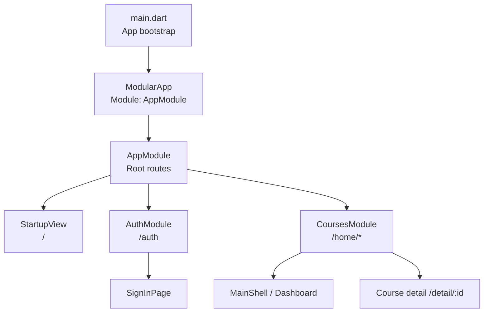
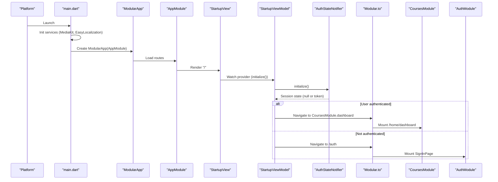
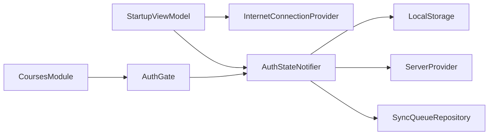

# Startup & Navigation

<cite>
**Referenced Files in This Document**
- [main.dart](file://lib/main.dart)
- [app_module.dart](file://lib/app_module.dart)
- [startup_view.dart](file://lib/app/features/startup/view/startup_view.dart)
- [startup_view_model.dart](file://lib/app/features/startup/view_model/startup_view_model.dart)
- [auth_gate.dart](file://lib/app/features/authentication/view/auth_gate.dart)
- [auth_state_provider.dart](file://lib/app/features/authentication/app_state/auth_state_provider.dart)
- [courses_module.dart](file://lib/app/features/courses/module/courses_module.dart)
- [auth_module.dart](file://lib/app/features/authentication/module/auth_module.dart)
- [safe_pop.dart](file://lib/app/core/views/elements/safe_pop.dart)
- [launch_background.xml](file://android/app/src/main/res/drawable/launch_background.xml)
</cite>

## Table of Contents
1. [Introduction](#introduction)
2. [Project Structure](#project-structure)
3. [Core Components](#core-components)
4. [Architecture Overview](#architecture-overview)
5. [Detailed Component Analysis](#detailed-component-analysis)
6. [Dependency Analysis](#dependency-analysis)
7. [Performance Considerations](#performance-considerations)
8. [Troubleshooting Guide](#troubleshooting-guide)
9. [Conclusion](#conclusion)

## Introduction
This document explains the Startup & Navigation feature module for the application. It covers how the app initializes, how the startup screen determines where to navigate next, and how Flutter Modular is used to configure modular routing with authentication guards and deep linking support. It also documents dependency injection setup during startup, route transitions, navigation guards, dynamic routing based on user state, and how features integrate with the global navigation system.

## Project Structure
The application bootstraps via a single entry point that initializes platform services, sets up localization, and configures Flutter Modular. The root module defines top-level routes and mounts feature modules for authentication and courses. Feature modules encapsulate their own routes and can be guarded by an authentication wrapper.

**Diagram sources**
- [main.dart:16-37](file://lib/main.dart#L16-L37)
- [app_module.dart:7-19](file://lib/app_module.dart#L7-L19)
- [courses_module.dart:20-68](file://lib/app/features/courses/module/courses_module.dart#L20-L68)
- [auth_module.dart:5-9](file://lib/app/features/authentication/module/auth_module.dart#L5-L9)

**Section sources**
- [main.dart:16-37](file://lib/main.dart#L16-L37)
- [app_module.dart:7-19](file://lib/app_module.dart#L7-L19)

## Core Components
- Application bootstrap and router wiring
- Root module and feature modules
- Startup view and view model
- Authentication gate and state
- Safe navigation helpers

Key responsibilities:
- Initialize platform services (media, localization) and wrap the app with providers and Modular.
- Define root routes and mount feature modules.
- On startup, check connectivity and authentication state, then navigate to either login or dashboard.
- Protect authenticated routes with a guard that validates session before rendering content.
- Provide safe back-navigation behavior and reset imperative stacks when needed.

**Section sources**
- [main.dart:16-59](file://lib/main.dart#L16-L59)
- [app_module.dart:7-19](file://lib/app_module.dart#L7-L19)
- [startup_view.dart:7-27](file://lib/app/features/startup/view/startup_view.dart#L7-L27)
- [startup_view_model.dart:9-38](file://lib/app/features/startup/view_model/startup_view_model.dart#L9-L38)
- [auth_gate.dart:8-68](file://lib/app/features/authentication/view/auth_gate.dart#L8-L68)
- [auth_state_provider.dart:15-203](file://lib/app/features/authentication/app_state/auth_state_provider.dart#L15-L203)
- [courses_module.dart:20-68](file://lib/app/features/courses/module/courses_module.dart#L20-L68)
- [safe_pop.dart:1-29](file://lib/app/core/views/elements/safe_pop.dart#L1-L29)

## Architecture Overview
The app uses a layered approach:
- Bootstrap layer: initializes services and wraps the UI tree with providers and Modular.
- Routing layer: Flutter Modular manages declarative routes; feature modules define sub-routes.
- State layer: Riverpod provides global state (e.g., authentication).
- Guard layer: AuthGate ensures only authenticated users access protected routes.

**Diagram sources**
- [main.dart:16-37](file://lib/main.dart#L16-L37)
- [app_module.dart:15-19](file://lib/app_module.dart#L15-L19)
- [startup_view.dart:11-12](file://lib/app/features/startup/view/startup_view.dart#L11-L12)
- [startup_view_model.dart:20-36](file://lib/app/features/startup/view_model/startup_view_model.dart#L20-L36)
- [auth_state_provider.dart:168-184](file://lib/app/features/authentication/app_state/auth_state_provider.dart#L168-L184)
- [courses_module.dart:40-49](file://lib/app/features/courses/module/courses_module.dart#L40-L49)
- [auth_module.dart:7-9](file://lib/app/features/authentication/module/auth_module.dart#L7-L9)

## Detailed Component Analysis

### Application Bootstrap and Router Wiring
- Ensures Flutter binding and media initialization.
- Initializes localization and cleans temporary files.
- Wraps the app with ProviderScope and ModularApp, setting the router configuration to use Modular’s routerConfig.

Behavior highlights:
- Localization delegates are applied to MaterialApp.
- Modular router is integrated into MaterialApp.router.

**Section sources**
- [main.dart:16-59](file://lib/main.dart#L16-L59)

### Root Module and Feature Modules
- AppModule defines:
  - Root route "/" mapped to StartupView.
  - Mounted feature modules:
    - AuthModule at "/auth".
    - CoursesModule at "/home".
- CoursesModule defines multiple child routes under "/home", including dashboard and course details with dynamic parameters.

Routing patterns:
- Declarative child routes for each feature.
- Dynamic route parameter usage for course detail pages.

**Section sources**
- [app_module.dart:7-19](file://lib/app_module.dart#L7-L19)
- [courses_module.dart:20-68](file://lib/app/features/courses/module/courses_module.dart#L20-L68)
- [auth_module.dart:5-9](file://lib/app/features/authentication/module/auth_module.dart#L5-L9)

### Startup View and ViewModel
- StartupView displays a logo and loading indicator while initialization runs.
- StartupViewModel initializes connectivity and authentication state, then navigates:
  - To dashboard if a valid session exists.
  - To login if no session exists.

Initialization flow:
- Initialize internet connection provider.
- Initialize auth state (load persisted session, validate token if online).
- Delay briefly to ensure UI readiness.
- Route based on current auth state.

**Section sources**
- [startup_view.dart:7-27](file://lib/app/features/startup/view/startup_view.dart#L7-L27)
- [startup_view_model.dart:9-38](file://lib/app/features/startup/view_model/startup_view_model.dart#L9-L38)
- [auth_state_provider.dart:168-184](file://lib/app/features/authentication/app_state/auth_state_provider.dart#L168-L184)

### Authentication Gate and State
- AuthGate protects routes by checking authentication state before rendering the child widget.
- It initializes connectivity and auth state, then redirects to login if not authenticated.
- While checking, it shows a loading indicator.

Authentication state management:
- Loads persisted session from storage.
- Validates token online or defers validation until connected.
- Provides methods to refresh tokens and logout.

**Section sources**
- [auth_gate.dart:8-68](file://lib/app/features/authentication/view/auth_gate.dart#L8-L68)
- [auth_state_provider.dart:15-203](file://lib/app/features/authentication/app_state/auth_state_provider.dart#L15-L203)

### Courses Module Routes and Dynamic Routing
- Defines dashboard and several feature pages under "/home".
- Uses dynamic route parameter ":id" for course detail page.
- All routes are wrapped with AuthGate to enforce authentication.

Dynamic routing example:
- Navigating to "/home/detail/<courseId>" renders CourseClassesPage with courseId extracted from route parameters.

**Section sources**
- [courses_module.dart:20-68](file://lib/app/features/courses/module/courses_module.dart#L20-L68)

### Safe Navigation Helpers
- safePop handles back navigation safely:
  - If there is something to pop, it pops.
  - Otherwise, navigates to the dashboard to avoid black screens.
- resetToModularRoot clears any imperative Navigator stack entries before switching to Modular routes.

Use cases:
- Deep links landing directly on protected screens.
- Screens opened via raw Navigator.push that need to be cleared before declarative navigation.

**Section sources**
- [safe_pop.dart:1-29](file://lib/app/core/views/elements/safe_pop.dart#L1-L29)

### Splash Screen Implementation
- Native splash: Android launch background resources provide a white background during early boot.
- App-level splash: StartupView shows a logo and progress indicator while initialization completes.

Platform integration:
- Android launch_background.xml defines the initial visual experience before Flutter draws.

**Section sources**
- [launch_background.xml:1-12](file://android/app/src/main/res/drawable/launch_background.xml#L1-L12)
- [startup_view.dart:14-24](file://lib/app/features/startup/view/startup_view.dart#L14-L24)

## Dependency Analysis
The startup sequence depends on several providers and repositories:
- InternetConnectionProvider: initialized early to enable network-aware behavior.
- AuthStateNotifier: loads and validates session; drives navigation decisions.
- LocalStorage: persists session data across app restarts.
- ServerProvider: supplies base URL for API calls.
- SyncQueueRepository: cleared on logout to prevent cross-user state leakage.

**Diagram sources**
- [startup_view_model.dart:20-36](file://lib/app/features/startup/view_model/startup_view_model.dart#L20-L36)
- [auth_state_provider.dart:15-24](file://lib/app/features/authentication/app_state/auth_state_provider.dart#L15-L24)
- [auth_gate.dart:27-45](file://lib/app/features/authentication/view/auth_gate.dart#L27-L45)
- [courses_module.dart:40-68](file://lib/app/features/courses/module/courses_module.dart#L40-L68)

**Section sources**
- [startup_view_model.dart:20-36](file://lib/app/features/startup/view_model/startup_view_model.dart#L20-L36)
- [auth_state_provider.dart:15-24](file://lib/app/features/authentication/app_state/auth_state_provider.dart#L15-L24)
- [auth_gate.dart:27-45](file://lib/app/features/authentication/view/auth_gate.dart#L27-L45)

## Performance Considerations
- Initialization failures for connectivity and auth are treated as non-fatal to keep the app responsive.
- Token validation is deferred when offline and retried when connectivity resumes.
- Short delay before navigation ensures UI stability during startup.
- Using declarative routes with Modular reduces imperative stack complexity and improves predictability.

[No sources needed since this section provides general guidance]

## Troubleshooting Guide
Common issues and resolutions:
- Black screen after back press: Use safePop to ensure a valid destination remains in the stack.
- Navigation does nothing while a modal is open: Call resetToModularRoot before navigating to clear imperative Navigator entries.
- Login loop or stuck on splash: Verify AuthStateNotifier.initialize completes and that navigation occurs based on session state.
- Deep link lands on protected screen without context: Ensure safePop or explicit navigation to dashboard is used when no history exists.

**Section sources**
- [safe_pop.dart:1-29](file://lib/app/core/views/elements/safe_pop.dart#L1-L29)
- [startup_view_model.dart:20-36](file://lib/app/features/startup/view_model/startup_view_model.dart#L20-L36)
- [auth_gate.dart:27-68](file://lib/app/features/authentication/view/auth_gate.dart#L27-L68)

## Conclusion
The Startup & Navigation module establishes a robust foundation for app initialization and routing:
- Platform services and localization are initialized before the UI builds.
- Modular routing organizes features into isolated modules with clear boundaries.
- Authentication guards protect sensitive routes and redirect appropriately.
- Startup logic decides between login and dashboard based on persisted session state.
- Safe navigation helpers prevent edge-case pitfalls like empty stacks or stale imperative routes.

This design supports scalable growth, predictable navigation flows, and resilient behavior under connectivity and authentication changes.

[No sources needed since this section summarizes without analyzing specific files]