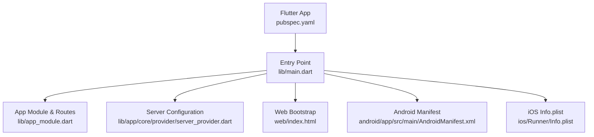
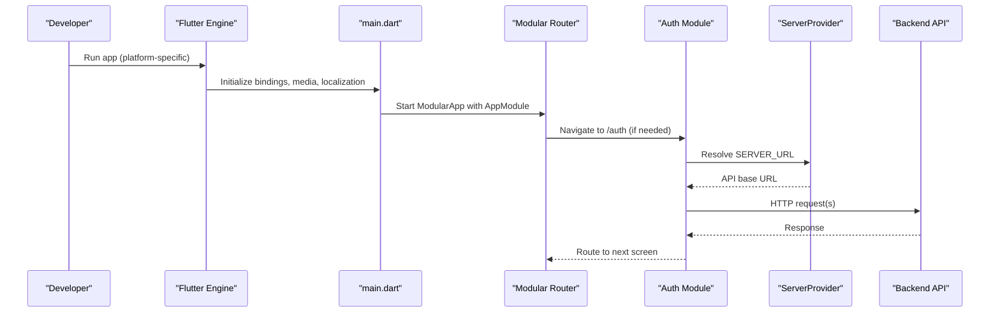
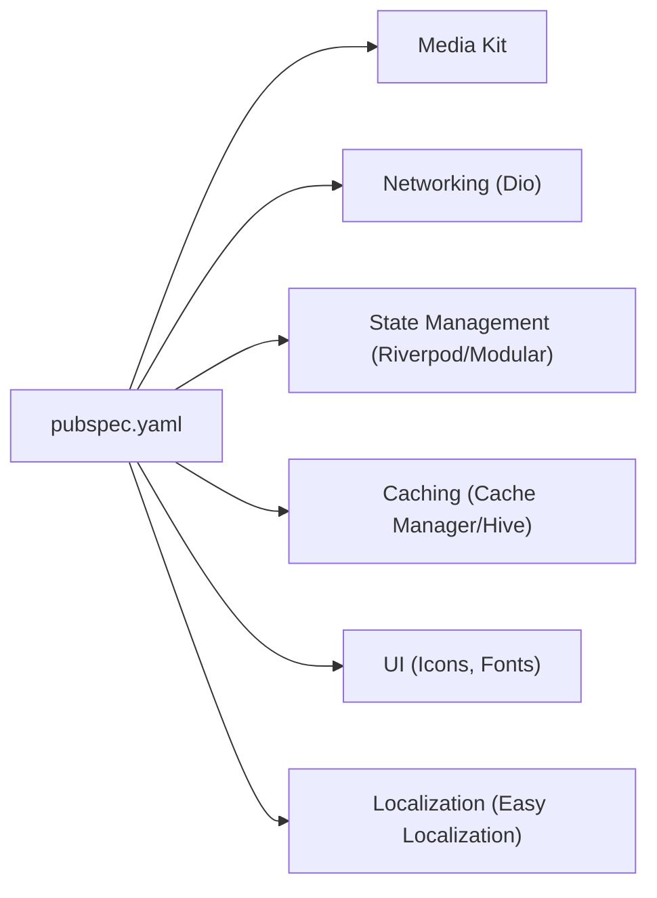

# Getting Started

<cite>
**Referenced Files in This Document**
- [README.md](file://README.md)
- [pubspec.yaml](file://pubspec.yaml)
- [main.dart](file://lib/main.dart)
- [app_module.dart](file://lib/app_module.dart)
- [server_provider.dart](file://lib/app/core/provider/server_provider.dart)
- [dev_cors_proxy.js](file://dev_cors_proxy.js)
- [AndroidManifest.xml](file://android/app/src/main/AndroidManifest.xml)
- [Info.plist](file://ios/Runner/Info.plist)
- [index.html](file://web/index.html)
- [local.properties](file://android/local.properties)
</cite>

## Table of Contents
1. Introduction
2. Project Structure
3. Core Components
4. Architecture Overview
5. Detailed Component Analysis
6. Dependency Analysis
7. Performance Considerations
8. Troubleshooting Guide
9. Conclusion
10. Appendices

## Introduction
This guide helps you set up and run the Leadership Edge Live LMS Flutter application on your local machine. It covers prerequisites, installation steps, environment configuration, building for multiple platforms, initial configuration (API endpoint setup), running in development mode, and verification steps to confirm a successful setup.

## Project Structure
The project is a Flutter application with platform-specific directories for Android, iOS, Web, Linux, macOS, and Windows. The Dart entry point initializes localization, media playback, and routing before launching the app shell.

**Diagram sources**
- [pubspec.yaml:1-171](file://pubspec.yaml#L1-L171)
- [main.dart:16-38](file://lib/main.dart#L16-L38)
- [app_module.dart:7-20](file://lib/app_module.dart#L7-L20)
- [server_provider.dart:8-17](file://lib/app/core/provider/server_provider.dart#L8-L17)
- [index.html:1-39](file://web/index.html#L1-L39)
- [AndroidManifest.xml:1-46](file://android/app/src/main/AndroidManifest.xml#L1-L46)
- [Info.plist:1-78](file://ios/Runner/Info.plist#L1-L78)

**Section sources**
- [README.md:1-19](file://README.md#L1-L19)
- [pubspec.yaml:1-171](file://pubspec.yaml#L1-L171)
- [main.dart:16-38](file://lib/main.dart#L16-L38)

## Core Components
- Application bootstrap: Initializes Flutter bindings, media kit, localization, and starts the modular app with providers.
- Routing and modules: Defines top-level routes and feature modules (authentication and courses).
- Server configuration: Provides a configurable API base URL via build-time defines, with a default staging endpoint.
- Platform manifests: Android and iOS configurations required for running the app on respective devices/emulators.

Key responsibilities:
- lib/main.dart: Bootstraps the app and sets up global services.
- lib/app_module.dart: Registers routes and feature modules.
- lib/app/core/provider/server_provider.dart: Supplies the API origin and network configuration.

**Section sources**
- [main.dart:16-38](file://lib/main.dart#L16-L38)
- [app_module.dart:7-20](file://lib/app_module.dart#L7-L20)
- [server_provider.dart:8-17](file://lib/app/core/provider/server_provider.dart#L8-L17)

## Architecture Overview
At runtime, the app initializes core services, then uses Modular to route to feature modules. Network requests are routed through a server provider that reads the API origin from build-time defines or defaults to staging. On web, a CORS proxy can be used during development to avoid browser security restrictions.

**Diagram sources**
- [main.dart:16-38](file://lib/main.dart#L16-L38)
- [app_module.dart:15-19](file://lib/app_module.dart#L15-L19)
- [server_provider.dart:8-17](file://lib/app/core/provider/server_provider.dart#L8-L17)

## Detailed Component Analysis

### Prerequisites
- Install Flutter SDK compatible with the project’s Dart SDK constraint.
- For Android development:
  - Install Android Studio and set up an emulator or connect a device.
  - Ensure the Flutter tool can detect your Android SDK path.
- For iOS development:
  - Install Xcode and configure code signing if needed.
- For Web development:
  - Use a modern browser (Chrome recommended).
- For Desktop development:
  - Enable desktop support for your OS and install required dependencies.

Verification tips:
- Run flutter doctor to check for missing tools or SDK paths.
- Confirm your Android SDK path is correctly set in android/local.properties if present.

**Section sources**
- [pubspec.yaml:21-22](file://pubspec.yaml#L21-L22)
- [local.properties:1-1](file://android/local.properties#L1-L1)

### Installation Steps
1. Clone the repository to your workspace.
2. Install dependencies:
   - Run the standard Flutter dependency command to fetch packages defined in pubspec.yaml.
3. Verify platform connectivity:
   - Android: Ensure at least one device or emulator is connected and recognized by Flutter.
   - iOS: Open the iOS workspace in Xcode and ensure signing is configured for testing.
   - Web: Ensure Chrome is available.
   - Desktop: Ensure desktop targets are enabled for your platform.

Build commands (examples):
- Android: Build and run on connected device or emulator.
- iOS: Build and run on simulator or device.
- Web: Build and run in Chrome.
- Desktop: Build and run for your OS target.

Note: These commands use the standard Flutter tooling; adjust device IDs or targets as needed.

**Section sources**
- [pubspec.yaml:1-171](file://pubspec.yaml#L1-L171)

### Environment Configuration
- API endpoint:
  - Override the API base URL at build time using a dart define flag when running or building.
  - If not provided, the app uses a default staging endpoint.
- Local development CORS proxy (Web only):
  - Start the included Node-based CORS proxy to forward requests to the staging host while adding necessary headers.
  - Configure the app to point to the proxy URL via the same dart define mechanism.

Steps:
- To use a custom backend URL, pass the appropriate dart define when running or building.
- For web development without CORS issues, start the proxy and set the app’s SERVER_URL to the proxy endpoint.

**Section sources**
- [server_provider.dart:8-17](file://lib/app/core/provider/server_provider.dart#L8-L17)
- [dev_cors_proxy.js:1-75](file://dev_cors_proxy.js#L1-L75)

### Initial Configuration
- API endpoints:
  - Set the SERVER_URL via dart define to point to your backend.
- Database initialization:
  - This client-side app does not include a local database initialization step in the provided files. Data is typically fetched from the configured API.
- Development server:
  - For web, optionally run the CORS proxy to bypass browser CORS restrictions when calling the staging API.

**Section sources**
- [server_provider.dart:8-17](file://lib/app/core/provider/server_provider.dart#L8-L17)
- [dev_cors_proxy.js:1-75](file://dev_cors_proxy.js#L1-L75)

### Building for Different Platforms
- Android:
  - Ensure device/emulator is connected and permissions are declared in the manifest.
- iOS:
  - Ensure Info.plist settings are correct and signing is configured for testing.
- Web:
  - Use the web entrypoint and consider the CORS proxy for local development.
- Desktop:
  - Ensure desktop support is enabled and run the appropriate target.

Platform-specific notes:
- Android manifest declares the main activity and embedding version.
- iOS Info.plist includes display name and other app metadata.
- Web index.html loads the Flutter bootstrap script.

**Section sources**
- [AndroidManifest.xml:1-46](file://android/app/src/main/AndroidManifest.xml#L1-L46)
- [Info.plist:1-78](file://ios/Runner/Info.plist#L1-L78)
- [index.html:1-39](file://web/index.html#L1-L39)

### Running in Development Mode
- Start the app on your preferred platform using the Flutter run command.
- For web, you may run the CORS proxy first and set the SERVER_URL to the proxy endpoint.
- The app will initialize localization, media, and routing, then navigate to the startup view.

**Section sources**
- [main.dart:16-38](file://lib/main.dart#L16-L38)
- [dev_cors_proxy.js:1-75](file://dev_cors_proxy.js#L1-L75)

### Accessing the Admin Dashboard
- The current routing registers authentication and courses modules. If an admin dashboard exists, it would be accessed after authentication or via a specific route within those modules.
- Verify login credentials and roles on the backend to access any admin features once authenticated.

**Section sources**
- [app_module.dart:15-19](file://lib/app_module.dart#L15-L19)

## Dependency Analysis
The app depends on Flutter and several packages for state management, networking, caching, media playback, UI components, and localization. Platform integrations are handled via Flutter plugins.

**Diagram sources**
- [pubspec.yaml:30-121](file://pubspec.yaml#L30-L121)

**Section sources**
- [pubspec.yaml:30-121](file://pubspec.yaml#L30-L121)

## Performance Considerations
- Prefer efficient media playback libraries already included for cross-platform video support.
- Use offline mode toggles and request caching where applicable to reduce network calls.
- Keep assets minimal and leverage lazy loading for heavy content.

[No sources needed since this section provides general guidance]

## Troubleshooting Guide
Common issues and resolutions:
- Missing Flutter SDK or incorrect Dart SDK version:
  - Ensure your Flutter SDK satisfies the project’s Dart SDK constraint.
- Android SDK path not detected:
  - Check android/local.properties for the correct Flutter SDK path and verify Android toolchain setup.
- iOS build/signing errors:
  - Open the iOS workspace in Xcode and configure signing for development.
- Web CORS errors:
  - Run the included CORS proxy and set SERVER_URL to the proxy endpoint during development.
- App not connecting to backend:
  - Verify SERVER_URL points to a reachable API endpoint and that the backend allows requests from your environment.

Verification steps:
- Run flutter doctor to validate toolchain.
- Attempt a simple network call to your configured SERVER_URL from a browser or curl to confirm accessibility.
- Launch the app and observe the startup view; subsequent navigation should proceed based on authentication state.

**Section sources**
- [pubspec.yaml:21-22](file://pubspec.yaml#L21-L22)
- [local.properties:1-1](file://android/local.properties#L1-L1)
- [dev_cors_proxy.js:1-75](file://dev_cors_proxy.js#L1-L75)
- [server_provider.dart:8-17](file://lib/app/core/provider/server_provider.dart#L8-L17)

## Conclusion
You now have the essential steps to set up, configure, and run the Leadership Edge Live LMS across platforms. Configure the API endpoint via dart defines, use the CORS proxy for web development if needed, and rely on the app’s built-in bootstrapping and routing to navigate to authentication and course features. Validate your setup using flutter doctor and basic connectivity checks.

[No sources needed since this section summarizes without analyzing specific files]

## Appendices

### Quick Reference Commands
- Install dependencies:
  - Use the standard Flutter dependency command to fetch packages listed in pubspec.yaml.
- Run on Android:
  - Use the standard Flutter run command targeting an Android device or emulator.
- Run on iOS:
  - Use the standard Flutter run command targeting an iOS simulator or device.
- Run on Web:
  - Use the standard Flutter run command targeting Chrome; optionally start the CORS proxy first.
- Run on Desktop:
  - Use the standard Flutter run command targeting your desktop platform.

**Section sources**
- [pubspec.yaml:1-171](file://pubspec.yaml#L1-L171)