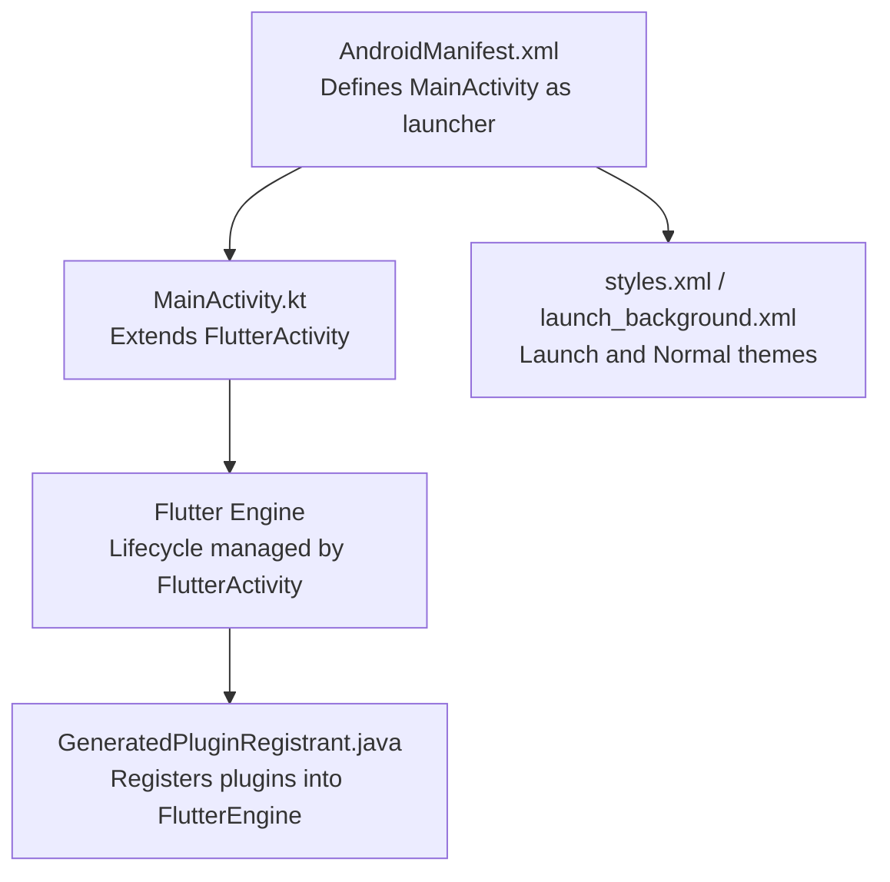
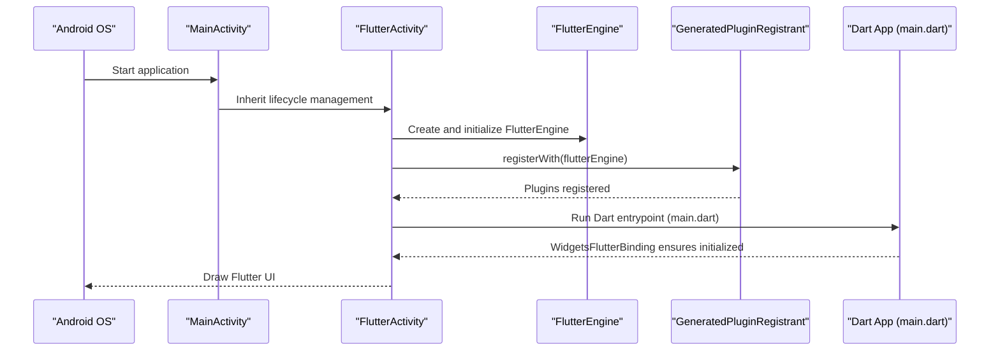
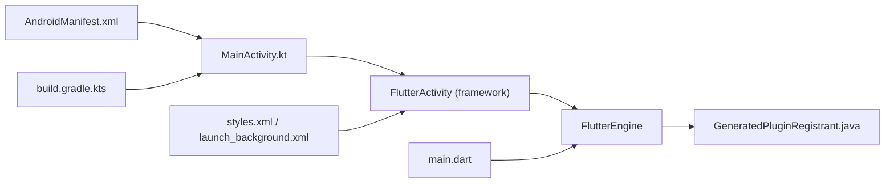

# Activity Lifecycle & Main Activity

<cite>
**Referenced Files in This Document**
- [MainActivity.kt](file://android/app/src/main/kotlin/live/leadershipedge/app/MainActivity.kt)
- [AndroidManifest.xml](file://android/app/src/main/AndroidManifest.xml)
- [GeneratedPluginRegistrant.java](file://android/app/src/main/java/io/flutter/plugins/GeneratedPluginRegistrant.java)
- [styles.xml](file://android/app/src/main/res/values/styles.xml)
- [launch_background.xml](file://android/app/src/main/res/drawable/launch_background.xml)
- [build.gradle.kts](file://android/app/build.gradle.kts)
- [main.dart](file://lib/main.dart)
</cite>

## Table of Contents
1. [Introduction](#introduction)
2. [Project Structure](#project-structure)
3. [Core Components](#core-components)
4. [Architecture Overview](#architecture-overview)
5. [Detailed Component Analysis](#detailed-component-analysis)
6. [Dependency Analysis](#dependency-analysis)
7. [Performance Considerations](#performance-considerations)
8. [Troubleshooting Guide](#troubleshooting-guide)
9. [Conclusion](#conclusion)

## Introduction
This document explains the Android MainActivity implementation for the Leadership Edge Live LMS Flutter app. It focuses on how MainActivity extends FlutterActivity, how the default Flutter lifecycle is handled, and how to customize lifecycle behavior safely while maintaining compatibility with Flutter’s engine. It also covers configuration changes, system events, plugin registration, and integration points that affect activity lifecycle.

## Project Structure
The Android side of the app uses a minimal MainActivity that delegates most responsibilities to Flutter’s embedding. The manifest configures the activity as the launcher entry point and sets important flags for lifecycle and configuration handling. Themes define splash and normal themes used during launch and runtime.

**Diagram sources**
- [AndroidManifest.xml:6-32](file://android/app/src/main/AndroidManifest.xml#L6-L32)
- [MainActivity.kt:1-6](file://android/app/src/main/kotlin/live/leadershipedge/app/MainActivity.kt#L1-L6)
- [GeneratedPluginRegistrant.java:17-78](file://android/app/src/main/java/io/flutter/plugins/GeneratedPluginRegistrant.java#L17-L78)
- [styles.xml:3-17](file://android/app/src/main/res/values/styles.xml#L3-L17)
- [launch_background.xml:1-12](file://android/app/src/main/res/drawable/launch_background.xml#L1-L12)

**Section sources**
- [AndroidManifest.xml:6-32](file://android/app/src/main/AndroidManifest.xml#L6-L32)
- [MainActivity.kt:1-6](file://android/app/src/main/kotlin/live/leadershipedge/app/MainActivity.kt#L1-L6)
- [styles.xml:3-17](file://android/app/src/main/res/values/styles.xml#L3-L17)
- [launch_background.xml:1-12](file://android/app/src/main/res/drawable/launch_background.xml#L1-L12)

## Core Components
- MainActivity: A thin Kotlin class extending FlutterActivity. By default, it inherits all lifecycle behavior from FlutterActivity, which manages the Flutter engine lifecycle and UI rendering.
- AndroidManifest: Declares MainActivity as exported launcher activity, sets launchMode, theme, and configChanges to handle orientation and other configuration changes without restarting the activity.
- GeneratedPluginRegistrant: Automatically registers platform plugins into the FlutterEngine when the engine starts.
- Styles and Splash: Define LaunchTheme and NormalTheme; the splash background is shown until Flutter draws its first frame.

Key behaviors provided by FlutterActivity (inherited):
- Creates and owns the FlutterEngine instance.
- Handles lifecycle callbacks such as onCreate(), onResume(), onPause(), onDestroy() to start, pause, resume, and destroy the Flutter engine and Dart isolate.
- Manages plugin registration via GeneratedPluginRegistrant.
- Bridges Android system events to Flutter where applicable.

Customization points available in this project:
- Override lifecycle methods in MainActivity if you need custom initialization or cleanup.
- Use AndroidManifest attributes to control configuration change handling and soft input behavior.
- Add custom initialization logic before Flutter starts (e.g., in onCreate()) or after Flutter is ready (e.g., in main.dart).

**Section sources**
- [MainActivity.kt:1-6](file://android/app/src/main/kotlin/live/leadershipedge/app/MainActivity.kt#L1-L6)
- [AndroidManifest.xml:6-32](file://android/app/src/main/AndroidManifest.xml#L6-L32)
- [GeneratedPluginRegistrant.java:17-78](file://android/app/src/main/java/io/flutter/plugins/GeneratedPluginRegistrant.java#L17-L78)
- [styles.xml:3-17](file://android/app/src/main/res/values/styles.xml#L3-L17)

## Architecture Overview
The following sequence shows how the app launches and how Flutter integrates with the Android activity lifecycle.

**Diagram sources**
- [AndroidManifest.xml:6-32](file://android/app/src/main/AndroidManifest.xml#L6-L32)
- [MainActivity.kt:1-6](file://android/app/src/main/kotlin/live/leadershipedge/app/MainActivity.kt#L1-L6)
- [GeneratedPluginRegistrant.java:17-78](file://android/app/src/main/java/io/flutter/plugins/GeneratedPluginRegistrant.java#L17-L78)
- [main.dart:16-37](file://lib/main.dart#L16-L37)

## Detailed Component Analysis

### MainActivity and Default FlutterActivity Behavior
- MainActivity extends FlutterActivity and does not override any methods. This means all lifecycle management is delegated to FlutterActivity.
- FlutterActivity handles:
  - Creating the FlutterEngine and attaching the Dart UI.
  - Starting and stopping the Dart isolate based on activity state.
  - Forwarding lifecycle events (onCreate, onStart, onResume, onPause, onStop, onDestroy) to the engine.
  - Managing plugin registration through GeneratedPluginRegistrant.

When to customize:
- If you need to run code before Flutter initializes (e.g., set up analytics), override onCreate() and call super.onCreate().
- If you need to respond to visibility changes, override onResume()/onPause() and call super to preserve Flutter behavior.
- For configuration changes, prefer using AndroidManifest configChanges to avoid restarts, or handle them in overridden methods.

Best practices:
- Always call super.lifecycleMethod() when overriding to maintain Flutter’s internal state.
- Avoid heavy work in lifecycle callbacks; defer to background threads or use Flutter-side mechanisms where possible.
- Keep Android-specific initialization minimal and idempotent.

**Section sources**
- [MainActivity.kt:1-6](file://android/app/src/main/kotlin/live/leadershipedge/app/MainActivity.kt#L1-L6)
- [AndroidManifest.xml:6-32](file://android/app/src/main/AndroidManifest.xml#L6-L32)
- [GeneratedPluginRegistrant.java:17-78](file://android/app/src/main/java/io/flutter/plugins/GeneratedPluginRegistrant.java#L17-L78)

### Configuration Changes and System Events
- The manifest declares configChanges including orientation, keyboard, screen size, locale, layout direction, font scale, density, and uiMode. This tells Android to handle these changes within the activity rather than restarting it.
- windowSoftInputMode is set to adjustResize, allowing the Flutter UI to resize when the keyboard appears.
- launchMode is singleTop, which affects back stack behavior when launching the same activity again.

Handling tips:
- If you add new configuration changes, update configChanges accordingly to prevent unwanted restarts.
- For complex configuration changes, consider persisting state and reinitializing resources in onResume() or onConfigurationChanged().

**Section sources**
- [AndroidManifest.xml:6-14](file://android/app/src/main/AndroidManifest.xml#L6-L14)

### Plugin Registration and Engine Integration
- GeneratedPluginRegistrant registers platform plugins into the FlutterEngine at startup. This includes connectivity, web view, image picker, media, storage, and more.
- These plugins rely on the FlutterEngine lifecycle managed by FlutterActivity. Ensure your custom lifecycle overrides do not interfere with engine initialization or teardown.

Integration guidance:
- Do not manually instantiate or manage FlutterEngine unless you fully replace FlutterActivity’s behavior.
- If you need to access native features early, do so in onCreate() before calling super, but ensure it does not block engine startup.

**Section sources**
- [GeneratedPluginRegistrant.java:17-78](file://android/app/src/main/java/io/flutter/plugins/GeneratedPluginRegistrant.java#L17-L78)

### Startup Flow and Flutter Initialization
- The Dart entrypoint initializes bindings, media kit, localization, and runs the app. This happens after the FlutterEngine is created by FlutterActivity.
- You can perform additional setup in main.dart before runApp() to ensure global initialization is complete.

Notes:
- Any Android-specific pre-initialization should be done in MainActivity.onCreate() before super.onCreate() if necessary.
- Post-initialization hooks in Dart are preferred for cross-platform concerns.

**Section sources**
- [main.dart:16-37](file://lib/main.dart#L16-L37)

### Custom Lifecycle Example Patterns
Below are conceptual patterns you can apply in MainActivity when customization is needed. Replace placeholders with your actual logic and always call super.lifecycleMethod().

- Pre-initialization in onCreate():
  - Perform lightweight setup before Flutter starts.
  - Avoid blocking operations; delegate heavy work to background tasks.

- Visibility handling in onResume()/onPause():
  - Resume or pause time-sensitive tasks (e.g., timers, sensors).
  - Ensure you restore state consistently.

- Configuration change handling:
  - Rely on configChanges to avoid restarts when possible.
  - If you must handle changes programmatically, update UI and resources accordingly.

- Cleanup in onDestroy():
  - Release resources held by Android components.
  - Ensure no references keep the activity alive unintentionally.

[No sources needed since this section provides conceptual guidance]

## Dependency Analysis
The following diagram shows key dependencies between Android components and Flutter integration points.

**Diagram sources**
- [MainActivity.kt:1-6](file://android/app/src/main/kotlin/live/leadershipedge/app/MainActivity.kt#L1-L6)
- [AndroidManifest.xml:6-32](file://android/app/src/main/AndroidManifest.xml#L6-L32)
- [GeneratedPluginRegistrant.java:17-78](file://android/app/src/main/java/io/flutter/plugins/GeneratedPluginRegistrant.java#L17-L78)
- [styles.xml:3-17](file://android/app/src/main/res/values/styles.xml#L3-L17)
- [build.gradle.kts:1-45](file://android/app/build.gradle.kts#L1-L45)
- [main.dart:16-37](file://lib/main.dart#L16-L37)

**Section sources**
- [MainActivity.kt:1-6](file://android/app/src/main/kotlin/live/leadershipedge/app/MainActivity.kt#L1-L6)
- [AndroidManifest.xml:6-32](file://android/app/src/main/AndroidManifest.xml#L6-L32)
- [GeneratedPluginRegistrant.java:17-78](file://android/app/src/main/java/io/flutter/plugins/GeneratedPluginRegistrant.java#L17-L78)
- [build.gradle.kts:1-45](file://android/app/build.gradle.kts#L1-L45)

## Performance Considerations
- Keep MainActivity.onCreate() lightweight to avoid delaying Flutter’s first frame.
- Use configChanges to minimize activity restarts during orientation or keyboard changes.
- Avoid holding long-lived references to context or views in lifecycle callbacks to prevent memory leaks.
- Defer heavy initialization to background threads or Flutter-side initialization where appropriate.
- Monitor plugin registration overhead; GeneratedPluginRegistrant adds plugins automatically, which is efficient but still part of startup cost.

[No sources needed since this section provides general guidance]

## Troubleshooting Guide
Common issues and resolutions:
- App crashes on launch:
  - Verify MainActivity extends FlutterActivity and does not block initialization.
  - Check that GeneratedPluginRegistrant is present and not corrupted.
- Orientation or keyboard causes unexpected restarts:
  - Ensure configChanges includes required flags in AndroidManifest.
  - Confirm you are not forcing a restart in custom code.
- Soft input overlaps content:
  - Confirm windowSoftInputMode is set appropriately (adjustResize).
- Plugins not working:
  - Ensure GeneratedPluginRegistrant includes the relevant plugin registrations.
  - Rebuild the project to regenerate plugin registrant if dependencies changed.

**Section sources**
- [AndroidManifest.xml:6-14](file://android/app/src/main/AndroidManifest.xml#L6-L14)
- [GeneratedPluginRegistrant.java:17-78](file://android/app/src/main/java/io/flutter/plugins/GeneratedPluginRegistrant.java#L17-L78)

## Conclusion
MainActivity in this project is intentionally minimal, delegating lifecycle management to FlutterActivity. This approach simplifies maintenance and ensures consistent behavior across Android versions. Customize lifecycle only when necessary, always call super to preserve Flutter’s internal state, and leverage AndroidManifest configuration to handle common scenarios like orientation changes. Plugin registration is automated, and startup flow integrates smoothly with Flutter’s Dart entrypoint.

[No sources needed since this section summarizes without analyzing specific files]