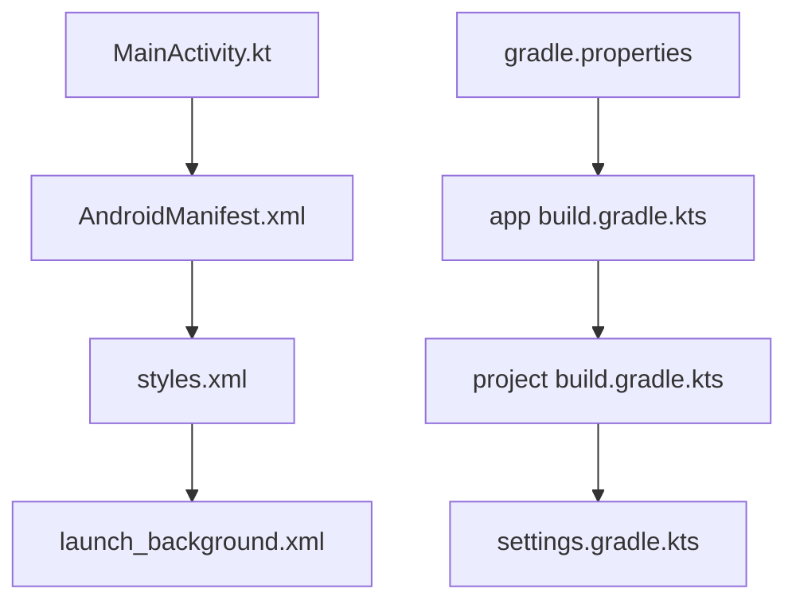
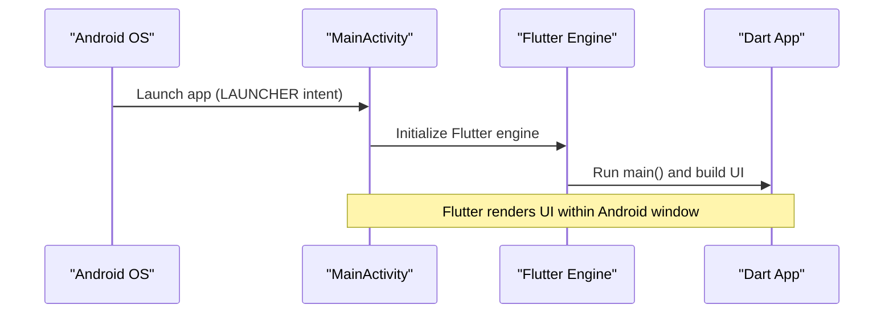
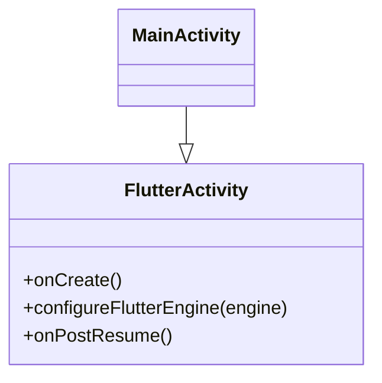
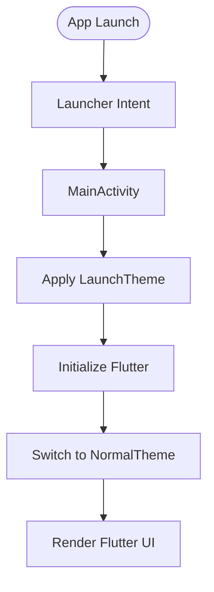
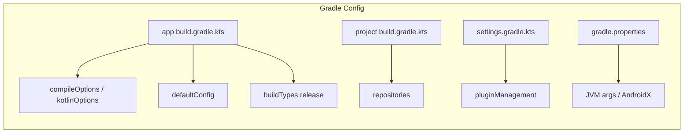

# Android Integration

<cite>
**Referenced Files in This Document**
- [MainActivity.kt](file://android/app/src/main/kotlin/live/leadershipedge/app/MainActivity.kt)
- [AndroidManifest.xml](file://android/app/src/main/AndroidManifest.xml)
- [app build.gradle.kts](file://android/app/build.gradle.kts)
- [project build.gradle.kts](file://android/build.gradle.kts)
- [settings.gradle.kts](file://android/settings.gradle.kts)
- [gradle.properties](file://android/gradle.properties)
- [styles.xml](file://android/app/src/main/res/values/styles.xml)
- [launch_background.xml](file://android/app/src/main/res/drawable/launch_background.xml)
- [pubspec.yaml](file://pubspec.yaml)
</cite>

## Table of Contents
1. [Introduction](#introduction)
2. [Project Structure](#project-structure)
3. [Core Components](#core-components)
4. [Architecture Overview](#architecture-overview)
5. [Detailed Component Analysis](#detailed-component-analysis)
6. [Dependency Analysis](#dependency-analysis)
7. [Performance Considerations](#performance-considerations)
8. [Troubleshooting Guide](#troubleshooting-guide)
9. [Conclusion](#conclusion)
10. [Appendices](#appendices)

## Introduction
This document explains the Android platform integration for Leadership Edge Live LMS. It covers the Flutter-to-Android bridge via MainActivity, AndroidManifest configuration, Gradle build settings, and how to extend the app with Android-specific features such as notifications, file system access, camera integration, and background services. It also documents signing release builds, ProGuard/R8 configuration, performance optimizations, adding native modules, handling platform UI components, and debugging Android-specific issues.

## Project Structure
The Android side is a standard Flutter Android project:
- Entry point activity extends FlutterActivity
- Manifest declares the launcher activity and Flutter embedding metadata
- Gradle files configure compile SDK, NDK, Java/Kotlin versions, application ID, and build types
- Resources define launch themes and splash screen

**Diagram sources**
- [MainActivity.kt:1-6](file://android/app/src/main/kotlin/live/leadershipedge/app/MainActivity.kt#L1-L6)
- [AndroidManifest.xml:1-46](file://android/app/src/main/AndroidManifest.xml#L1-L46)
- [styles.xml:1-19](file://android/app/src/main/res/values/styles.xml#L1-L19)
- [launch_background.xml:1-13](file://android/app/src/main/res/drawable/launch_background.xml#L1-L13)
- [app build.gradle.kts:1-45](file://android/app/build.gradle.kts#L1-L45)
- [project build.gradle.kts:1-22](file://android/build.gradle.kts#L1-L22)
- [settings.gradle.kts:1-26](file://android/settings.gradle.kts#L1-L26)
- [gradle.properties:1-4](file://android/gradle.properties#L1-L4)

**Section sources**
- [MainActivity.kt:1-6](file://android/app/src/main/kotlin/live/leadershipedge/app/MainActivity.kt#L1-L6)
- [AndroidManifest.xml:1-46](file://android/app/src/main/AndroidManifest.xml#L1-L46)
- [app build.gradle.kts:1-45](file://android/app/build.gradle.kts#L1-L45)
- [project build.gradle.kts:1-22](file://android/build.gradle.kts#L1-L22)
- [settings.gradle.kts:1-26](file://android/settings.gradle.kts#L1-L26)
- [gradle.properties:1-4](file://android/gradle.properties#L1-L4)
- [styles.xml:1-19](file://android/app/src/main/res/values/styles.xml#L1-L19)
- [launch_background.xml:1-13](file://android/app/src/main/res/drawable/launch_background.xml#L1-L13)

## Core Components
- MainActivity: Minimal entry point that extends FlutterActivity to host the Flutter engine.
- AndroidManifest: Declares the launcher activity, theme, Flutter embedding version, and queries for text processing.
- Gradle configuration: Sets compile/target SDK, NDK, Java/Kotlin versions, applicationId, minSdk/targetSdk/versionCode/versionName, and release build type.
- Resources: Define launch and normal themes and a white splash background.

Key responsibilities:
- Bootstrap Flutter from an Android Activity
- Configure app identity and runtime behavior via manifest
- Provide build-time configuration for compilation and packaging

**Section sources**
- [MainActivity.kt:1-6](file://android/app/src/main/kotlin/live/leadershipedge/app/MainActivity.kt#L1-L6)
- [AndroidManifest.xml:1-46](file://android/app/src/main/AndroidManifest.xml#L1-L46)
- [app build.gradle.kts:1-45](file://android/app/build.gradle.kts#L1-L45)
- [styles.xml:1-19](file://android/app/src/main/res/values/styles.xml#L1-L19)
- [launch_background.xml:1-13](file://android/app/src/main/res/drawable/launch_background.xml#L1-L13)

## Architecture Overview
Flutter runs inside the Android process managed by MainActivity. The manifest configures the launcher and Flutter embedding. Gradle compiles Kotlin/Java and packages assets into the APK/AAB.

**Diagram sources**
- [MainActivity.kt:1-6](file://android/app/src/main/kotlin/live/leadershipedge/app/MainActivity.kt#L1-L6)
- [AndroidManifest.xml:6-27](file://android/app/src/main/AndroidManifest.xml#L6-L27)

## Detailed Component Analysis

### MainActivity (FlutterActivity)
- Purpose: Hosts the Flutter UI by extending FlutterActivity.
- Behavior: No custom overrides; relies on Flutter’s default lifecycle and view management.
- Extension points: Override methods like configureFlutterEngine or onPostResume if you need to register plugins or customize initialization.

**Diagram sources**
- [MainActivity.kt:1-6](file://android/app/src/main/kotlin/live/leadershipedge/app/MainActivity.kt#L1-L6)

**Section sources**
- [MainActivity.kt:1-6](file://android/app/src/main/kotlin/live/leadershipedge/app/MainActivity.kt#L1-L6)

### AndroidManifest Configuration
- Launcher activity: Declares MainActivity as exported and singleTop with appropriate configChanges and hardware acceleration.
- Themes: Uses LaunchTheme during startup and NormalTheme thereafter.
- Flutter embedding: Declares flutterEmbedding version 2.
- Queries: Includes PROCESS_TEXT query required by Flutter’s text processing plugin.

Permissions and capabilities:
- Currently no explicit permissions are declared in the manifest. Platform features requiring permissions should be added here when needed (e.g., camera, storage, notifications).

**Diagram sources**
- [AndroidManifest.xml:6-27](file://android/app/src/main/AndroidManifest.xml#L6-L27)
- [styles.xml:1-19](file://android/app/src/main/res/values/styles.xml#L1-L19)

**Section sources**
- [AndroidManifest.xml:1-46](file://android/app/src/main/AndroidManifest.xml#L1-L46)
- [styles.xml:1-19](file://android/app/src/main/res/values/styles.xml#L1-L19)

### Build Configuration (Gradle)
- Application ID and namespace: Set consistently for identification and packaging.
- Compile SDK and NDK: Inherited from Flutter toolchain.
- Java/Kotlin compatibility: Configured to Java 11.
- Versioning: Min/target SDK and version code/name sourced from Flutter tooling.
- Release build type: Currently uses debug signing; must be updated for production releases.

Repository and global settings:
- Repositories: Google and Maven Central.
- Build directory: Moved to root-level build folder for cleaner workspace organization.
- Settings: Includes Flutter tooling gradle and applies Android and Kotlin plugins.

**Diagram sources**
- [app build.gradle.kts:1-45](file://android/app/build.gradle.kts#L1-L45)
- [project build.gradle.kts:1-22](file://android/build.gradle.kts#L1-L22)
- [settings.gradle.kts:1-26](file://android/settings.gradle.kts#L1-L26)
- [gradle.properties:1-4](file://android/gradle.properties#L1-L4)

**Section sources**
- [app build.gradle.kts:1-45](file://android/app/build.gradle.kts#L1-L45)
- [project build.gradle.kts:1-22](file://android/build.gradle.kts#L1-L22)
- [settings.gradle.kts:1-26](file://android/settings.gradle.kts#L1-L26)
- [gradle.properties:1-4](file://android/gradle.properties#L1-L4)

### Android-Specific Features

#### Notifications
- Current state: No notification-related entries exist in the manifest or Gradle files.
- To add:
  - Declare notification channels at app start (via Dart using a notification plugin).
  - If posting from background, ensure proper service setup and channel usage.
  - For Android 13+, request POST_NOTIFICATIONS permission at runtime and declare it in the manifest when used.

#### File System Access
- Current state: No storage permissions declared.
- To add:
  - Use path_provider for app-scoped directories without permissions.
  - For shared storage access on Android 10+, use SAF or scoped storage patterns via a file picker plugin.
  - Add READ_EXTERNAL_STORAGE/WRITE_EXTERNAL_STORAGE only if targeting legacy devices and justified.

#### Camera Integration
- Current state: No camera permissions declared.
- To add:
  - Use image_picker or camera plugin; they will require CAMERA permission.
  - Ensure AndroidManifest includes the CAMERA permission and any related features.
  - Handle runtime permission prompts in Dart layer.

#### Background Services
- Current state: No services or foreground services declared.
- To add:
  - Implement a ForegroundService for long-running tasks and show persistent notifications.
  - Register the service in the manifest and manage lifecycle from Dart via a platform channel or plugin.

[No sources needed since this section provides guidance based on current absence of declarations]

### Signing Process for Release Builds
- Current state: Release build type uses debug signing configuration.
- Required steps:
  - Create a keystore and store its alias, key password, and store password securely.
  - Configure signing in the app module’s Gradle file with a dedicated release signingConfig.
  - Remove debug signing override and ensure release artifacts are signed before distribution.

Best practices:
- Keep keystores out of version control.
- Use environment variables or local-only secrets for passwords.
- Validate signatures post-build and test installation on device.

**Section sources**
- [app build.gradle.kts:33-39](file://android/app/build.gradle.kts#L33-L39)

### ProGuard/R8 Configuration
- Current state: No explicit R8 rules are present in the app module.
- Recommendations:
  - Enable R8 shrinking and obfuscation in release builds.
  - Add keep rules for Flutter engine, platform channels, and any third-party libraries that rely on reflection or serialization.
  - Test thoroughly after enabling to avoid runtime crashes due to missing classes.

**Section sources**
- [app build.gradle.kts:33-39](file://android/app/build.gradle.kts#L33-L39)

### Performance Optimizations Specific to Android
- JVM arguments: Increased heap and metaspace sizes in gradle.properties to reduce build OOM errors.
- Hardware acceleration: Enabled in the activity for smoother rendering.
- Build caching: Standard Gradle cache usage; consider enabling parallel builds and daemon tuning if needed.
- Resource optimization: Keep splash and icons optimized; avoid large bitmaps in drawables.

**Section sources**
- [gradle.properties:1-4](file://android/gradle.properties#L1-L4)
- [AndroidManifest.xml:12-14](file://android/app/src/main/AndroidManifest.xml#L12-L14)

### Adding New Android Native Modules
Steps:
1. Create a new Kotlin class implementing the desired functionality.
2. Expose methods via MethodChannel or use a Flutter plugin structure.
3. Register the plugin in GeneratedPluginRegistrant if necessary (usually automatic).
4. Update AndroidManifest if declaring activities, services, receivers, or permissions.
5. Rebuild and test on device.

Example pattern:
- Define a MethodChannel in Dart and implement corresponding handlers in Kotlin.
- Use platform-specific APIs behind a clean Dart interface.

[No sources needed since this section provides general guidance]

### Handling Platform-Specific UI Components
- Use platform channels to call native UI dialogs or actions not available in Flutter widgets.
- For complex views, embed a PlatformView and bridge to Flutter via PlatformViewsController.
- Keep UI logic minimal in native code; prefer business logic separation.

[No sources needed since this section provides general guidance]

### Debugging Android-Specific Issues
- Logs: Use Logcat filtered by package name to inspect logs from native code and Flutter engine.
- Permissions: Verify runtime permission flows and manifest declarations.
- Build issues: Inspect Gradle console output; adjust JVM args if memory errors occur.
- Signing: Validate keystore and aliases; confirm release builds are properly signed.

[No sources needed since this section provides general guidance]

## Dependency Analysis
Flutter dependencies relevant to Android platform features:
- image_picker: Requires CAMERA permission on Android.
- path_provider: Provides safe file paths without extra permissions for app directories.
- media_kit and video playback: May require additional native libraries depending on backend.
- flutter_inappwebview: Uses platform WebView implementations.

These dependencies influence Android manifest and runtime behavior when used.

**Section sources**
- [pubspec.yaml:86-99](file://pubspec.yaml#L86-L99)
- [pubspec.yaml:62-77](file://pubspec.yaml#L62-L77)

## Performance Considerations
- Build performance:
  - JVM args in gradle.properties help prevent OOM during builds.
  - Consider enabling Gradle parallel execution and configuring the Gradle daemon for faster builds.
- Runtime performance:
  - Hardware acceleration is enabled for the activity.
  - Avoid heavy work on the main thread; offload to background threads or services.
  - Optimize images and assets; use appropriate resolutions.

[No sources needed since this section provides general guidance]

## Troubleshooting Guide
Common issues and resolutions:
- Missing permissions:
  - Add required permissions to the manifest and handle runtime requests in Dart.
- Build failures:
  - Check Gradle console for errors; adjust Java/Kotlin versions or NDK as needed.
- Release signing problems:
  - Ensure keystore exists and signing config is correct; remove debug signing override.
- R8/shrinking issues:
  - Add keep rules for Flutter and third-party libraries; test thoroughly.

**Section sources**
- [app build.gradle.kts:33-39](file://android/app/build.gradle.kts#L33-L39)
- [gradle.properties:1-4](file://android/gradle.properties#L1-L4)

## Conclusion
The Android integration for Leadership Edge Live LMS follows Flutter best practices with a minimal MainActivity, clear manifest configuration, and Gradle-based build setup. To enable advanced features like notifications, camera, and background services, add the necessary permissions and platform code. For production readiness, configure secure signing, enable R8 with appropriate keep rules, and apply performance optimizations tailored to Android.

## Appendices

### Quick Reference: Key Files and Roles
- MainActivity.kt: Entry point hosting Flutter UI.
- AndroidManifest.xml: Declares launcher activity, themes, and Flutter embedding.
- app build.gradle.kts: Module-level build configuration including signing and versioning.
- project build.gradle.kts: Global repositories and build directory layout.
- settings.gradle.kts: Plugin management and Flutter tooling inclusion.
- gradle.properties: JVM and AndroidX settings.
- styles.xml and launch_background.xml: Launch and normal themes and splash.

**Section sources**
- [MainActivity.kt:1-6](file://android/app/src/main/kotlin/live/leadershipedge/app/MainActivity.kt#L1-L6)
- [AndroidManifest.xml:1-46](file://android/app/src/main/AndroidManifest.xml#L1-L46)
- [app build.gradle.kts:1-45](file://android/app/build.gradle.kts#L1-L45)
- [project build.gradle.kts:1-22](file://android/build.gradle.kts#L1-L22)
- [settings.gradle.kts:1-26](file://android/settings.gradle.kts#L1-L26)
- [gradle.properties:1-4](file://android/gradle.properties#L1-L4)
- [styles.xml:1-19](file://android/app/src/main/res/values/styles.xml#L1-L19)
- [launch_background.xml:1-13](file://android/app/src/main/res/drawable/launch_background.xml#L1-L13)