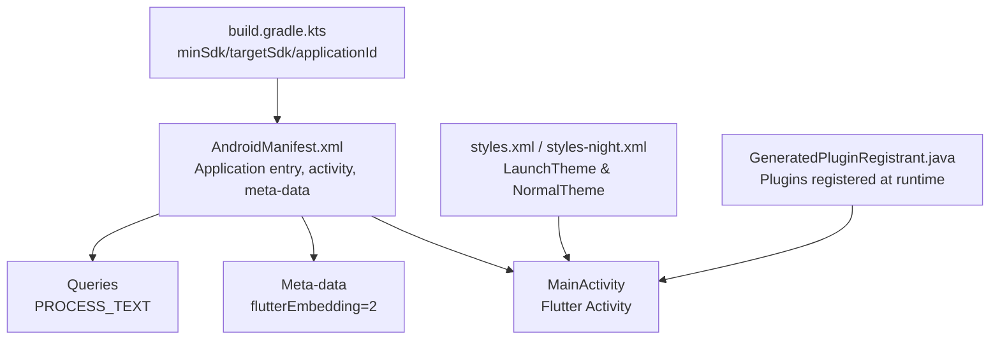
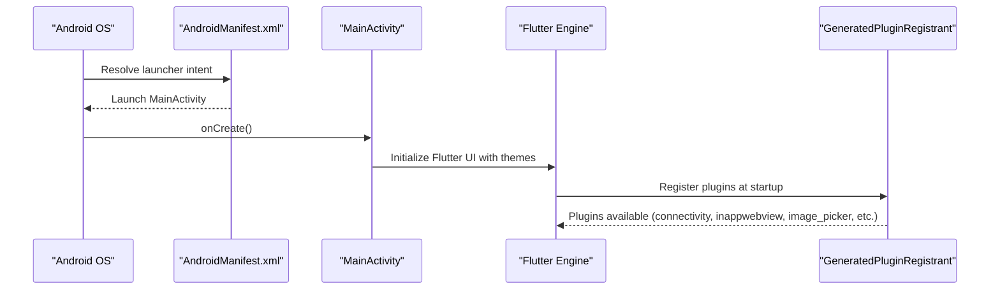
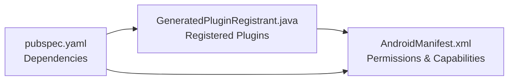

# AndroidManifest Configuration

<cite>
**Referenced Files in This Document**
- [AndroidManifest.xml](file://android/app/src/main/AndroidManifest.xml)
- [AndroidManifest.xml (profile)](file://android/app/src/profile/AndroidManifest.xml)
- [build.gradle.kts](file://android/app/build.gradle.kts)
- [styles.xml](file://android/app/src/main/res/values/styles.xml)
- [styles.xml (night)](file://android/app/src/main/res/values-night/styles.xml)
- [GeneratedPluginRegistrant.java](file://android/app/src/main/java/io/flutter/plugins/GeneratedPluginRegistrant.java)
- [pubspec.yaml](file://pubspec.yaml)
</cite>

## Table of Contents
1. [Introduction](#introduction)
2. [Project Structure](#project-structure)
3. [Core Components](#core-components)
4. [Architecture Overview](#architecture-overview)
5. [Detailed Component Analysis](#detailed-component-analysis)
6. [Dependency Analysis](#dependency-analysis)
7. [Performance Considerations](#performance-considerations)
8. [Troubleshooting Guide](#troubleshooting-guide)
9. [Conclusion](#conclusion)
10. [Appendices](#appendices)

## Introduction
This document explains the AndroidManifest configuration for the Leadership Edge Live LMS Android app, focusing on permissions, intent filters, application-level settings, and platform-specific considerations. It also provides guidance for adding new permissions, configuring deep links and shortcuts, optimizing for different Android versions, and addressing security and privacy requirements.

## Project Structure
The Android integration is a standard Flutter project with:
- A main manifest defining the application entry point, theme metadata, and queries for text processing.
- A profile manifest that adds development-time network access.
- Gradle build configuration specifying SDK levels and application ID.
- Theme resources for light and dark modes.
- A generated plugin registrant listing all registered plugins at runtime.

**Diagram sources**
- [AndroidManifest.xml:1-45](file://android/app/src/main/AndroidManifest.xml#L1-L45)
- [build.gradle.kts:8-31](file://android/app/build.gradle.kts#L8-L31)
- [styles.xml:1-19](file://android/app/src/main/res/values/styles.xml#L1-L19)
- [styles.xml (night):1-19](file://android/app/src/main/res/values-night/styles.xml#L1-L19)
- [GeneratedPluginRegistrant.java:17-78](file://android/app/src/main/java/io/flutter/plugins/GeneratedPluginRegistrant.java#L17-L78)

**Section sources**
- [AndroidManifest.xml:1-45](file://android/app/src/main/AndroidManifest.xml#L1-L45)
- [build.gradle.kts:8-31](file://android/app/build.gradle.kts#L8-L31)
- [styles.xml:1-19](file://android/app/src/main/res/values/styles.xml#L1-L19)
- [styles.xml (night):1-19](file://android/app/src/main/res/values-night/styles.xml#L1-L19)
- [GeneratedPluginRegistrant.java:17-78](file://android/app/src/main/java/io/flutter/plugins/GeneratedPluginRegistrant.java#L17-L78)

## Core Components
- Application and Activity
  - The application defines label, icon, and name via placeholder.
  - The main activity is exported, uses singleTop launch mode, handles configuration changes, enables hardware acceleration, and adjusts window soft input behavior.
  - Meta-data declares the Flutter embedding version.
- Queries
  - Declares support for processing plain text to satisfy package visibility rules required by Flutter’s text processing plugin.
- Profile Manifest
  - Adds INTERNET permission for development builds to enable hot reload and debugging.

Key responsibilities:
- Define the app entry point and runtime behavior.
- Declare minimal system capabilities needed by Flutter and core plugins.
- Provide theming during startup and normal operation.

**Section sources**
- [AndroidManifest.xml:2-33](file://android/app/src/main/AndroidManifest.xml#L2-L33)
- [AndroidManifest.xml:34-44](file://android/app/src/main/AndroidManifest.xml#L34-L44)
- [AndroidManifest.xml (profile):1-7](file://android/app/src/profile/AndroidManifest.xml#L1-L7)

## Architecture Overview
At runtime, Android launches MainActivity as defined in the manifest. Flutter initializes using the declared themes and embedding version. Plugins are registered automatically by the generated registrant, enabling features like connectivity, in-app web view, image picker, media playback, local storage, and URL launching.

**Diagram sources**
- [AndroidManifest.xml:6-32](file://android/app/src/main/AndroidManifest.xml#L6-L32)
- [GeneratedPluginRegistrant.java:17-78](file://android/app/src/main/java/io/flutter/plugins/GeneratedPluginRegistrant.java#L17-L78)

## Detailed Component Analysis

### Permissions
Current state:
- No runtime or install-time permissions are declared in the main manifest.
- Development-only INTERNET permission is present in the profile manifest.

Implications based on dependencies and plugins:
- Internet access: Required for API calls and connectivity checks. Add INTERNET to the main manifest for production if not already present.
- Storage/media access: Image picker may require storage-related permissions depending on Android version and target SDK. On modern Android, scoped storage typically avoids explicit storage permissions for gallery pickers, but camera usage may require CAMERA permission.
- Camera access: If users capture photos directly, add CAMERA permission and handle runtime requests.
- Background services: None declared currently. If background tasks are added later, declare services and related permissions accordingly.

Recommendations:
- Add INTERNET to the main manifest for production builds.
- Add CAMERA if capturing images from the camera is supported.
- For file downloads or caching outside app-scoped storage, consider READ/WRITE_EXTERNAL_STORAGE only when targeting legacy devices; otherwise rely on scoped storage APIs.

Security and privacy notes:
- Only request permissions you actually use.
- Provide clear user-facing explanations for why each permission is needed.
- Respect Android’s runtime permission model and handle denials gracefully.

**Section sources**
- [AndroidManifest.xml:1-45](file://android/app/src/main/AndroidManifest.xml#L1-L45)
- [AndroidManifest.xml (profile):1-7](file://android/app/src/profile/AndroidManifest.xml#L1-L7)
- [pubspec.yaml:30-99](file://pubspec.yaml#L30-L99)
- [GeneratedPluginRegistrant.java:17-78](file://android/app/src/main/java/io/flutter/plugins/GeneratedPluginRegistrant.java#L17-L78)

### Intent Filters
Current state:
- The main activity includes an intent filter for the launcher action and category, making it the app’s entry point.
- No additional intent filters for deep linking or custom schemes are declared.

Guidance for deep linking:
- To open specific screens via URLs, add an intent-filter with action VIEW, category DEFAULT/BROWSABLE, and data elements specifying scheme, host, and optional path patterns.
- Ensure your app can parse incoming URIs and navigate to the appropriate content.

App shortcuts:
- Shortcuts are typically configured programmatically or via XML resources referenced by the app; they do not require manifest entries beyond what is already present.

Background service registration:
- Not currently present. If needed, define <service> components and, where applicable, declare foreground service types and permissions per Android version requirements.

**Section sources**
- [AndroidManifest.xml:6-27](file://android/app/src/main/AndroidManifest.xml#L6-L27)

### Application-Level Configurations
- Label and Icon
  - App label is set; icon references a mipmap resource generated by Flutter launcher icons tooling.
- Themes
  - LaunchTheme controls the splash screen appearance before Flutter draws its first frame.
  - NormalTheme applies once Flutter UI is ready. Separate definitions exist for light and dark modes.
- Meta-data
  - flutterEmbedding=2 ensures compatibility with Flutter’s V2 embedding.
- Queries
  - PROCESS_TEXT query allows text processing features used by Flutter’s text plugin under Android 11+ package visibility rules.

Optimization tips:
- Keep LaunchTheme lightweight to minimize perceived startup time.
- Use vector drawables for icons to reduce APK size.
- Review queries to include only necessary actions to comply with package visibility while enabling required functionality.

**Section sources**
- [AndroidManifest.xml:2-33](file://android/app/src/main/AndroidManifest.xml#L2-L33)
- [AndroidManifest.xml:34-44](file://android/app/src/main/AndroidManifest.xml#L34-L44)
- [styles.xml:1-19](file://android/app/src/main/res/values/styles.xml#L1-L19)
- [styles.xml (night):1-19](file://android/app/src/main/res/values-night/styles.xml#L1-L19)

### Platform-Specific Settings
- SDK Levels
  - minSdk, targetSdk, compileSdk, and NDK version are managed via Flutter’s defaults in Gradle.
- Java/Kotlin Compatibility
  - Source and target compatibility set to Java 11; Kotlin JVM target aligned accordingly.
- Application ID
  - Set to a unique namespace for publishing.

Version considerations:
- Ensure targetSdk aligns with current Google Play requirements.
- For Android 12+, review launchMode and taskAffinity settings if multiple activities are introduced.
- For Android 11+, keep queries minimal and accurate for package visibility.

**Section sources**
- [build.gradle.kts:8-31](file://android/app/build.gradle.kts#L8-L31)

## Dependency Analysis
The app integrates several Flutter plugins that influence manifest needs:
- Connectivity: Network status checks; requires INTERNET for actual network operations.
- In-app WebView: Loads web content within the app; INTERNET required.
- Image Picker: May require CAMERA and/or storage-related permissions depending on usage and Android version.
- Media Kit: Video playback; generally does not require special permissions unless accessing external media.
- Path Provider, SharedPreferences, Sqflite: Local storage; no special permissions needed for app-scoped storage.
- URL Launcher: Opens external URLs; no special permissions required.

**Diagram sources**
- [pubspec.yaml:30-99](file://pubspec.yaml#L30-L99)
- [GeneratedPluginRegistrant.java:17-78](file://android/app/src/main/java/io/flutter/plugins/GeneratedPluginRegistrant.java#L17-L78)
- [AndroidManifest.xml:1-45](file://android/app/src/main/AndroidManifest.xml#L1-L45)

**Section sources**
- [pubspec.yaml:30-99](file://pubspec.yaml#L30-L99)
- [GeneratedPluginRegistrant.java:17-78](file://android/app/src/main/java/io/flutter/plugins/GeneratedPluginRegistrant.java#L17-L78)
- [AndroidManifest.xml:1-45](file://android/app/src/main/AndroidManifest.xml#L1-L45)

## Performance Considerations
- Startup time: Minimize heavy work in LaunchTheme and ensure assets are optimized.
- Plugin overhead: Only register plugins you need; avoid unused dependencies to reduce initialization cost.
- Network: Use efficient HTTP clients and cache responses where appropriate to reduce bandwidth and improve responsiveness.
- Memory: Avoid loading large media into memory unnecessarily; stream when possible.

[No sources needed since this section provides general guidance]

## Troubleshooting Guide
Common issues and resolutions:
- Missing INTERNET permission:
  - Symptom: Network calls fail or connectivity checks return false.
  - Resolution: Add INTERNET permission to the main manifest for production builds.
- Image picker failures:
  - Symptom: Cannot pick images or camera fails.
  - Resolution: Add CAMERA permission if capturing photos; verify runtime permission handling and scoped storage usage.
- Deep link not opening:
  - Symptom: Tapping a URL does not navigate to the expected screen.
  - Resolution: Add appropriate intent-filter with action VIEW and data scheme/host/path; ensure app logic parses the URI and navigates correctly.
- Package visibility errors:
  - Symptom: Text processing or other interop features fail on Android 11+.
  - Resolution: Include necessary <queries> entries for required actions and MIME types.

**Section sources**
- [AndroidManifest.xml (profile):1-7](file://android/app/src/profile/AndroidManifest.xml#L1-L7)
- [AndroidManifest.xml:34-44](file://android/app/src/main/AndroidManifest.xml#L34-L44)

## Conclusion
The current manifest is minimal and focused on Flutter’s baseline requirements. Production builds should explicitly declare INTERNET and any feature-specific permissions such as CAMERA. Deep linking and background services can be added as needed. Adhering to Android’s permission and privacy guidelines will ensure a secure and compliant user experience.

[No sources needed since this section summarizes without analyzing specific files]

## Appendices

### Adding New Permissions
- Internet access:
  - Add INTERNET to the main manifest for production builds.
- Camera access:
  - Add CAMERA and handle runtime permission requests when capturing images.
- Storage access:
  - Prefer scoped storage APIs; only add legacy storage permissions if absolutely necessary for older devices.

### Configuring Intent Filters for Deep Linking
- Add an intent-filter to the relevant activity with:
  - Action: VIEW
  - Category: DEFAULT and optionally BROWSABLE
  - Data: scheme, host, and optional path patterns matching your URLs
- Ensure your app parses incoming URIs and routes to the correct screen.

### Optimizing Manifest for Different Android Versions
- Align targetSdk with current Google Play requirements.
- Keep queries minimal and accurate for Android 11+ package visibility.
- Review launchMode and taskAffinity if introducing multiple activities.
- Validate permissions against runtime permission models and provide user-friendly rationales.

### Security and Privacy Considerations
- Request only necessary permissions and explain their purpose to users.
- Handle permission denials gracefully and provide fallback experiences.
- Secure network communications and validate inputs from deep links.
- Regularly review third-party plugin requirements and remove unused dependencies.

[No sources needed since this section provides general guidance]