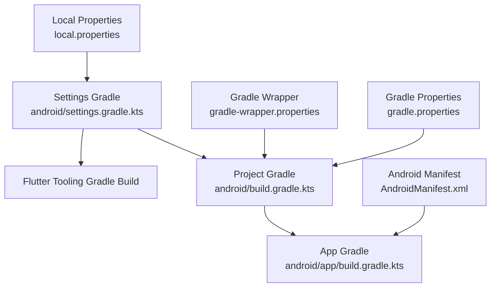
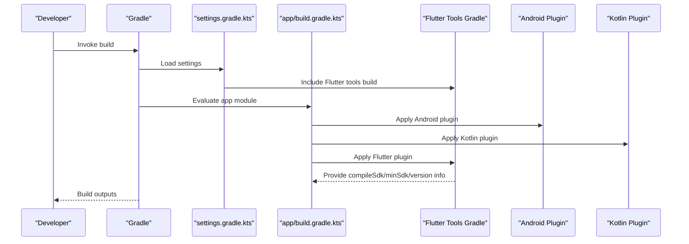
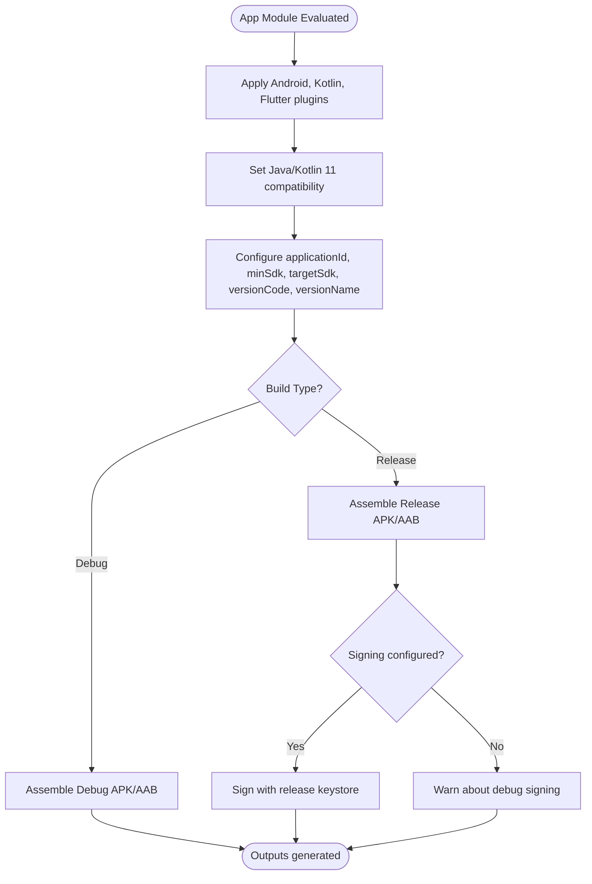
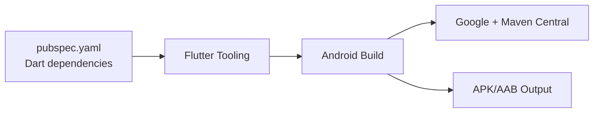

# Build Configuration & Dependencies

<cite>
**Referenced Files in This Document**
- [android/build.gradle.kts](file://android/build.gradle.kts)
- [android/app/build.gradle.kts](file://android/app/build.gradle.kts)
- [android/settings.gradle.kts](file://android/settings.gradle.kts)
- [android/gradle.properties](file://android/gradle.properties)
- [android/gradle/wrapper/gradle-wrapper.properties](file://android/gradle/wrapper/gradle-wrapper.properties)
- [android/local.properties](file://android/local.properties)
- [android/app/src/main/AndroidManifest.xml](file://android/app/src/main/AndroidManifest.xml)
- [pubspec.yaml](file://pubspec.yaml)
</cite>

## Table of Contents
1. [Introduction](#introduction)
2. [Project Structure](#project-structure)
3. [Core Components](#core-components)
4. [Architecture Overview](#architecture-overview)
5. [Detailed Component Analysis](#detailed-component-analysis)
6. [Dependency Analysis](#dependency-analysis)
7. [Performance Considerations](#performance-considerations)
8. [Troubleshooting Guide](#troubleshooting-guide)
9. [Conclusion](#conclusion)
10. [Appendices](#appendices)

## Introduction
This document explains the Android build configuration for the Leadership Edge Live LMS Flutter project. It covers Gradle scripts at both project and app levels, dependency management via Flutter tooling, plugin configurations, signing setup for release builds, code shrinking with R8, build variants, adding native dependencies, configuring build flavors, optimizing build performance, managing SDK versions, and CI/CD considerations.

## Project Structure
The Android module is a standard Flutter Android integration:
- Project-level Gradle script configures repositories and build directories.
- App-level Gradle script applies Android, Kotlin, and Flutter plugins and defines compile options, default config, and build types.
- Settings script includes the Flutter tooling Gradle build and declares plugin versions.
- Gradle wrapper pins the Gradle distribution.
- Gradle properties set JVM args and AndroidX/Jetifier flags.
- Local properties point to the Flutter SDK path.
- Android manifest defines the application entry point and metadata required by Flutter.

**Diagram sources**
- [android/build.gradle.kts:1-22](file://android/build.gradle.kts#L1-L22)
- [android/app/build.gradle.kts:1-45](file://android/app/build.gradle.kts#L1-L45)
- [android/settings.gradle.kts:1-26](file://android/settings.gradle.kts#L1-L26)
- [android/gradle/wrapper/gradle-wrapper.properties:1-6](file://android/gradle/wrapper/gradle-wrapper.properties#L1-L6)
- [android/gradle.properties:1-4](file://android/gradle.properties#L1-L4)
- [android/local.properties:1-1](file://android/local.properties#L1-L1)
- [android/app/src/main/AndroidManifest.xml:1-46](file://android/app/src/main/AndroidManifest.xml#L1-L46)

**Section sources**
- [android/build.gradle.kts:1-22](file://android/build.gradle.kts#L1-L22)
- [android/app/build.gradle.kts:1-45](file://android/app/build.gradle.kts#L1-L45)
- [android/settings.gradle.kts:1-26](file://android/settings.gradle.kts#L1-L26)
- [android/gradle/wrapper/gradle-wrapper.properties:1-6](file://android/gradle/wrapper/gradle-wrapper.properties#L1-L6)
- [android/gradle.properties:1-4](file://android/gradle.properties#L1-L4)
- [android/local.properties:1-1](file://android/local.properties#L1-L1)
- [android/app/src/main/AndroidManifest.xml:1-46](file://android/app/src/main/AndroidManifest.xml#L1-L46)

## Core Components
- Project-level build script:
  - Declares Google and Maven Central repositories.
  - Moves build outputs to a shared root build directory and configures subproject build directories.
  - Ensures evaluation order so that the app module is evaluated first.
  - Provides a clean task targeting the root build directory.
- App-level build script:
  - Applies Android Application, Kotlin Android, and Flutter Gradle plugins.
  - Sets namespace, compileSdk, ndkVersion, Java/Kotlin compatibility to version 11.
  - Defines defaultConfig with applicationId, minSdk, targetSdk, versionCode, and versionName sourced from Flutter tooling.
  - Configures buildTypes with a release type currently using debug signing (to be updated).
  - Links to the Flutter source tree.
- Settings script:
  - Loads Flutter SDK path from local.properties and includes the Flutter tools Gradle build.
  - Declares pluginManagement repositories and applies plugin versions for Flutter loader, Android application, and Kotlin Android.
  - Includes the :app module.
- Gradle wrapper:
  - Pins Gradle distribution to a specific version for reproducible builds.
- Gradle properties:
  - Increases JVM memory and enables AndroidX and Jetifier.
- Local properties:
  - Points to the Flutter SDK installation path used by settings script.
- Android manifest:
  - Declares the main activity, theme metadata, and Flutter embedding version.

**Section sources**
- [android/build.gradle.kts:1-22](file://android/build.gradle.kts#L1-L22)
- [android/app/build.gradle.kts:1-45](file://android/app/build.gradle.kts#L1-L45)
- [android/settings.gradle.kts:1-26](file://android/settings.gradle.kts#L1-L26)
- [android/gradle/wrapper/gradle-wrapper.properties:1-6](file://android/gradle/wrapper/gradle-wrapper.properties#L1-L6)
- [android/gradle.properties:1-4](file://android/gradle.properties#L1-L4)
- [android/local.properties:1-1](file://android/local.properties#L1-L1)
- [android/app/src/main/AndroidManifest.xml:1-46](file://android/app/src/main/AndroidManifest.xml#L1-L46)

## Architecture Overview
The build system integrates Flutter with Android through Gradle:
- The settings script loads the Flutter SDK path and includes the Flutter tools Gradle build, which provides tasks and extensions used by the app module.
- The app module applies the Android and Kotlin plugins and then the Flutter plugin, enabling compilation of Dart into Android artifacts and linking native components.
- Repositories are declared at the project level to resolve all dependencies consistently.

**Diagram sources**
- [android/settings.gradle.kts:1-26](file://android/settings.gradle.kts#L1-L26)
- [android/app/build.gradle.kts:1-45](file://android/app/build.gradle.kts#L1-L45)

## Detailed Component Analysis

### Project-Level Gradle Script
- Repository configuration ensures consistent artifact resolution across modules.
- Build directory relocation centralizes outputs under a single root directory, simplifying cleanup and CI caching.
- Evaluation ordering guarantees the app module is processed before other subprojects.
- Clean task targets the centralized build directory.

**Section sources**
- [android/build.gradle.kts:1-22](file://android/build.gradle.kts#L1-L22)

### App-Level Gradle Script
- Plugins:
  - Android Application plugin for Android packaging.
  - Kotlin Android plugin for Kotlin compilation.
  - Flutter Gradle plugin for integrating Dart code and Flutter assets.
- Compilation:
  - Java and Kotlin compatibility set to version 11.
- Default configuration:
  - Application ID, minimum/target SDK versions, and versioning are sourced from Flutter tooling variables.
- Build types:
  - Release build type exists but uses debug signing; update to a proper release keystore for production.
- Flutter linkage:
  - Source path points to the Flutter project root.

**Diagram sources**
- [android/app/build.gradle.kts:1-45](file://android/app/build.gradle.kts#L1-L45)

**Section sources**
- [android/app/build.gradle.kts:1-45](file://android/app/build.gradle.kts#L1-L45)

### Settings and Wrapper
- Settings script:
  - Reads Flutter SDK path from local.properties.
  - Includes the Flutter tools Gradle build to provide Flutter-specific tasks and extensions.
  - Declares pluginManagement repositories and applies pinned versions for Flutter loader, Android application, and Kotlin Android.
  - Includes the :app module.
- Wrapper:
  - Pins Gradle distribution version for deterministic builds across environments.

**Section sources**
- [android/settings.gradle.kts:1-26](file://android/settings.gradle.kts#L1-L26)
- [android/gradle/wrapper/gradle-wrapper.properties:1-6](file://android/gradle/wrapper/gradle-wrapper.properties#L1-L6)
- [android/local.properties:1-1](file://android/local.properties#L1-L1)

### Gradle Properties and AndroidX
- JVM arguments increase heap and metaspace to reduce out-of-memory errors during large builds.
- AndroidX enabled and Jetifier enabled for compatibility with legacy support libraries.

**Section sources**
- [android/gradle.properties:1-4](file://android/gradle.properties#L1-L4)

### Android Manifest
- Declares the main activity and sets Flutter embedding metadata.
- Configures launch mode, theme, and hardware acceleration.
- Includes queries for text processing required by Flutter’s text plugin.

**Section sources**
- [android/app/src/main/AndroidManifest.xml:1-46](file://android/app/src/main/AndroidManifest.xml#L1-L46)

## Dependency Analysis
- Flutter-managed dependencies:
  - Dart packages are declared in pubspec.yaml and resolved by Flutter tooling during the build.
  - Version constraints ensure compatible package updates.
- Android dependencies:
  - Resolved via Google and Maven Central repositories declared in the project-level script.
  - Flutter plugins may bring Android dependencies automatically when integrated.

**Diagram sources**
- [pubspec.yaml:1-171](file://pubspec.yaml#L1-L171)
- [android/build.gradle.kts:1-22](file://android/build.gradle.kts#L1-L22)

**Section sources**
- [pubspec.yaml:1-171](file://pubspec.yaml#L1-L171)
- [android/build.gradle.kts:1-22](file://android/build.gradle.kts#L1-L22)

## Performance Considerations
- Increase JVM memory:
  - Current Gradle properties allocate significant heap and metaspace to avoid OOM during large builds.
- Use a stable Gradle version:
  - Wrapper pins a specific Gradle distribution for reproducibility.
- Centralize build outputs:
  - Project-level script moves build directories to a common location, improving cache locality and cleanup.
- Avoid unnecessary rebuilds:
  - Keep dependencies pinned and use incremental builds where possible.
- Minimize resource size:
  - Enable R8/shrinking for release builds to reduce APK size and improve startup time.
- Parallel execution:
  - Ensure parallel tasks are enabled in your environment to speed up multi-module builds.

[No sources needed since this section provides general guidance]

## Troubleshooting Guide
Common issues and resolutions:
- Flutter SDK not found:
  - Ensure local.properties contains the correct flutter.sdk path.
- Out-of-memory errors:
  - Adjust Gradle JVM arguments in gradle.properties to increase heap and metaspace.
- AndroidX or Jetifier conflicts:
  - Verify android.useAndroidX and android.enableJetifier are enabled if required by dependencies.
- Release signing failures:
  - Configure a proper release keystore and reference it in the release build type instead of using debug signing.
- Inconsistent Gradle versions:
  - Pin the Gradle distribution in the wrapper properties and enforce it in CI.
- Missing repositories:
  - Confirm Google and Maven Central are declared in the project-level script.

**Section sources**
- [android/local.properties:1-1](file://android/local.properties#L1-L1)
- [android/gradle.properties:1-4](file://android/gradle.properties#L1-L4)
- [android/app/build.gradle.kts:33-39](file://android/app/build.gradle.kts#L33-L39)
- [android/gradle/wrapper/gradle-wrapper.properties:1-6](file://android/gradle/wrapper/gradle-wrapper.properties#L1-L6)
- [android/build.gradle.kts:1-6](file://android/build.gradle.kts#L1-L6)

## Conclusion
The Android build configuration integrates Flutter seamlessly with Android via Gradle. The current setup provides a solid foundation with centralized repositories, consistent build directories, and pinned plugin versions. For production readiness, configure proper release signing, enable R8 for code shrinking, and consider adding build flavors for different environments. With these steps, you can streamline development, optimize performance, and automate reliable builds in CI/CD pipelines.

[No sources needed since this section summarizes without analyzing specific files]

## Appendices

### Adding Native Dependencies
- Add Dart dependencies in pubspec.yaml; Flutter will integrate corresponding Android components when building.
- If a plugin requires additional Android permissions or configurations, update the Android manifest accordingly.

**Section sources**
- [pubspec.yaml:1-171](file://pubspec.yaml#L1-L171)
- [android/app/src/main/AndroidManifest.xml:1-46](file://android/app/src/main/AndroidManifest.xml#L1-L46)

### Configuring Build Flavors
- Define productFlavors in the app-level script to create environment-specific builds (e.g., dev, staging, prod).
- Use flavor-specific resources and manifest placeholders to vary behavior per environment.

[No sources needed since this section provides general guidance]

### Managing SDK Versions
- compileSdk, minSdk, and targetSdk are sourced from Flutter tooling in the app-level script.
- Update Flutter SDK to change underlying Android SDK versions consistently across the project.

**Section sources**
- [android/app/build.gradle.kts:8-31](file://android/app/build.gradle.kts#L8-L31)

### Setting Up CI/CD Pipelines
- Cache Gradle and Flutter dependencies to speed up builds.
- Use the pinned Gradle version from the wrapper.
- Store signing keys securely and inject them into the build process for release artifacts.
- Run tests and assemble APK/AAB in separate jobs for better isolation.

[No sources needed since this section provides general guidance]