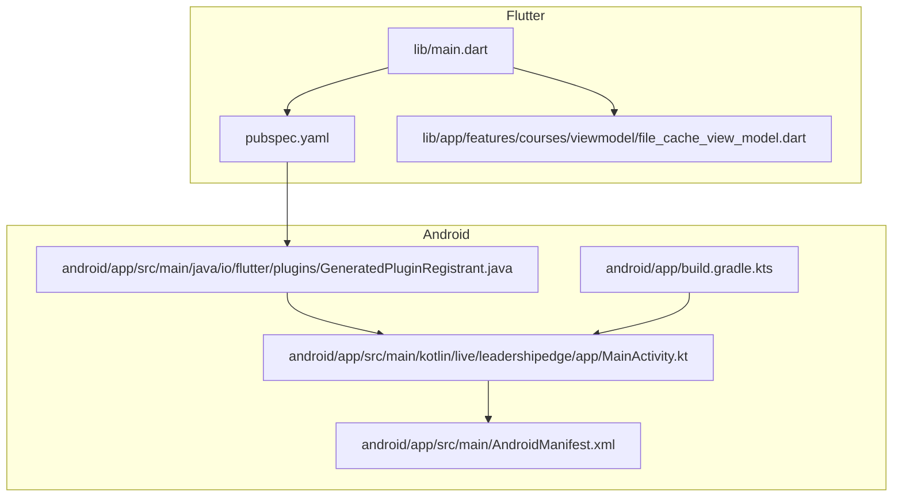
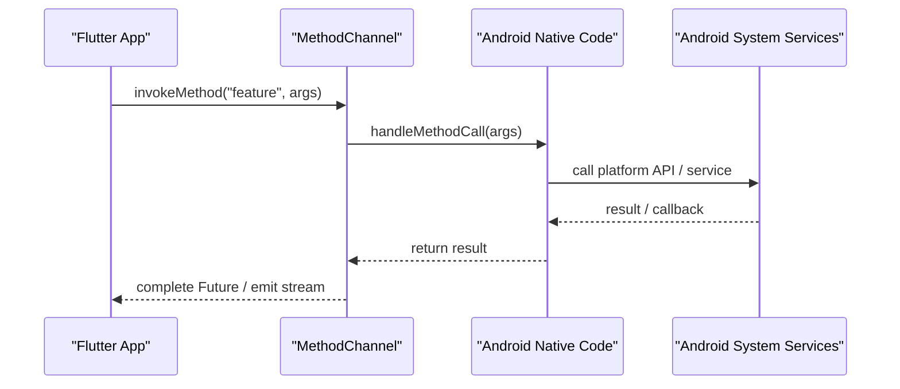
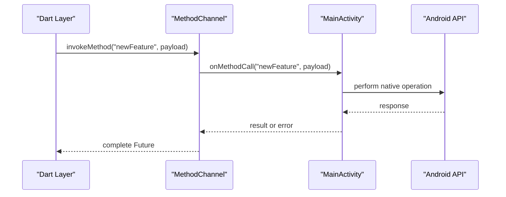
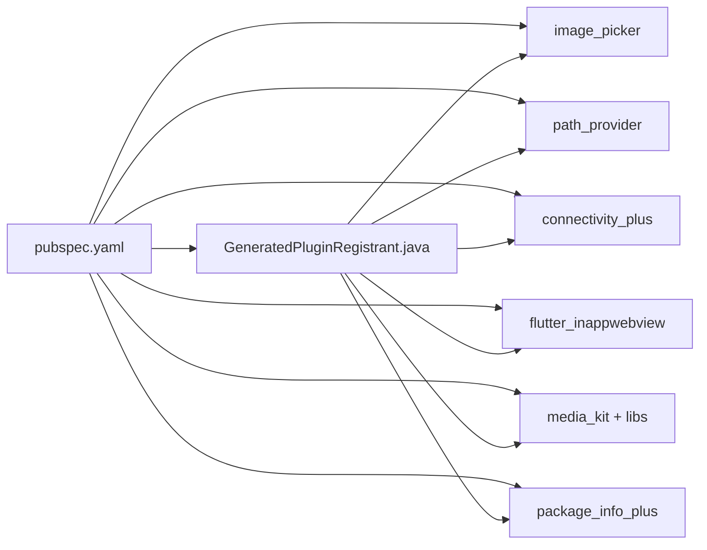

# Native Feature Integration

<cite>
**Referenced Files in This Document**
- [MainActivity.kt](file://android/app/src/main/kotlin/live/leadershipedge/app/MainActivity.kt)
- [AndroidManifest.xml](file://android/app/src/main/AndroidManifest.xml)
- [build.gradle.kts (app)](file://android/app/build.gradle.kts)
- [GeneratedPluginRegistrant.java](file://android/app/src/main/java/io/flutter/plugins/GeneratedPluginRegistrant.java)
- [main.dart](file://lib/main.dart)
- [pubspec.yaml](file://pubspec.yaml)
- [file_cache_view_model.dart](file://lib/app/features/courses/viewmodel/file_cache_view_model.dart)
</cite>

## Table of Contents
1. [Introduction](#introduction)
2. [Project Structure](#project-structure)
3. [Core Components](#core-components)
4. [Architecture Overview](#architecture-overview)
5. [Detailed Component Analysis](#detailed-component-analysis)
6. [Dependency Analysis](#dependency-analysis)
7. [Performance Considerations](#performance-considerations)
8. [Troubleshooting Guide](#troubleshooting-guide)
9. [Conclusion](#conclusion)
10. [Appendices](#appendices)

## Introduction
This document explains how to integrate native Android features into the Leadership Edge Live LMS Flutter application using MethodChannel and platform-specific plugins. It covers adding new Android modules, exchanging data between Flutter and native code, accessing Android APIs safely, handling runtime permissions, managing background tasks, and implementing common capabilities such as camera access, file system operations, notifications, and system services. It also includes guidance for debugging native code, testing platform-specific features, and maintaining backward compatibility across Android versions.

## Project Structure
The project follows a standard Flutter layout with an Android module under android/. The Flutter entry point initializes core services and runs the app shell. Android configuration is defined in Gradle and the manifest, while existing platform integrations are registered automatically by Flutter’s plugin system.

**Diagram sources**
- [main.dart:16-38](file://lib/main.dart#L16-L38)
- [pubspec.yaml:1-171](file://pubspec.yaml#L1-L171)
- [file_cache_view_model.dart:10-461](file://lib/app/features/courses/viewmodel/file_cache_view_model.dart#L10-L461)
- [AndroidManifest.xml:1-46](file://android/app/src/main/AndroidManifest.xml#L1-L46)
- [MainActivity.kt:1-6](file://android/app/src/main/kotlin/live/leadershipedge/app/MainActivity.kt#L1-L6)
- [build.gradle.kts (app):1-45](file://android/app/build.gradle.kts#L1-L45)
- [GeneratedPluginRegistrant.java:1-58](file://android/app/src/main/java/io/flutter/plugins/GeneratedPluginRegistrant.java#L1-L58)

**Section sources**
- [main.dart:16-38](file://lib/main.dart#L16-L38)
- [pubspec.yaml:1-171](file://pubspec.yaml#L1-L171)
- [AndroidManifest.xml:1-46](file://android/app/src/main/AndroidManifest.xml#L1-L46)
- [MainActivity.kt:1-6](file://android/app/src/main/kotlin/live/leadershipedge/app/MainActivity.kt#L1-L6)
- [build.gradle.kts (app):1-45](file://android/app/build.gradle.kts#L1-L45)
- [GeneratedPluginRegistrant.java:1-58](file://android/app/src/main/java/io/flutter/plugins/GeneratedPluginRegistrant.java#L1-L58)

## Core Components
- Flutter app entrypoint initializes localization, media, and routing before rendering the UI.
- Android side uses a minimal MainActivity that extends FlutterActivity; all platform integrations are typically added via plugins or custom channels.
- Existing platform plugins are auto-registered through GeneratedPluginRegistrant.java based on dependencies declared in pubspec.yaml.
- File caching and offline viewing logic is implemented in Dart and uses path_provider for storage locations.

Key responsibilities:
- Platform initialization and lifecycle management in MainActivity.
- Plugin registration and engine setup via GeneratedPluginRegistrant.
- App-level configuration and feature wiring in main.dart.
- Storage and content handling in file cache view model.

**Section sources**
- [main.dart:16-38](file://lib/main.dart#L16-L38)
- [MainActivity.kt:1-6](file://android/app/src/main/kotlin/live/leadershipedge/app/MainActivity.kt#L1-L6)
- [GeneratedPluginRegistrant.java:17-58](file://android/app/src/main/java/io/flutter/plugins/GeneratedPluginRegistrant.java#L17-L58)
- [file_cache_view_model.dart:10-461](file://lib/app/features/courses/viewmodel/file_cache_view_model.dart#L10-L461)

## Architecture Overview
The integration architecture separates concerns between Flutter and Android:
- Flutter handles UI, state, and business logic.
- Android provides native capabilities via plugins or custom MethodChannel implementations.
- Data exchange occurs over typed method calls and event streams.

[No sources needed since this diagram shows conceptual workflow, not actual code structure]

## Detailed Component Analysis

### Adding a New Android Module via MethodChannel
To add a new capability not covered by existing plugins:
- Define a channel name in Dart and create a MethodChannel instance.
- Implement a handler in Kotlin within MainActivity or a dedicated class to process calls and return results.
- Use consistent argument types and error codes for robust communication.

Best practices:
- Keep channel names stable and versioned if necessary.
- Validate inputs on both sides and return structured errors.
- Avoid blocking the main thread; offload heavy work to background threads.

[No sources needed since this diagram shows conceptual workflow, not actual code structure]

### Implementing Platform-Specific Functionality
Use existing plugins where possible to reduce maintenance overhead:
- Camera and image selection: image_picker
- File paths and directories: path_provider
- Network connectivity: connectivity_plus
- In-app web views: flutter_inappwebview
- Media playback: media_kit and related packages

When a feature requires deeper customization:
- Create a custom MethodChannel implementation in Kotlin.
- Expose only safe, well-defined interfaces to Dart.
- Handle lifecycle events carefully to avoid leaks or crashes.

**Section sources**
- [pubspec.yaml:30-99](file://pubspec.yaml#L30-L99)
- [GeneratedPluginRegistrant.java:17-58](file://android/app/src/main/java/io/flutter/plugins/GeneratedPluginRegistrant.java#L17-L58)

### Handling Data Exchange Between Flutter and Native Code
Guidelines:
- Use simple, serializable types (strings, numbers, booleans, lists, maps).
- For large payloads, pass file paths or URIs instead of raw bytes.
- Emit progress updates via EventChannel streams when applicable.
- Always handle exceptions and map them to meaningful Dart errors.

Example patterns:
- Request-response: invokeMethod with a Future result.
- Streaming: EventChannel for ongoing updates (e.g., download progress).
- Background tasks: use Android WorkManager or Foreground Services triggered from Dart via MethodChannel.

[No sources needed since this section provides general guidance]

### Accessing Android APIs Safely
- Check API availability and Android version before calling newer APIs.
- Use try-catch blocks around platform calls to prevent crashes.
- Respect user privacy and system policies; do not assume permissions are granted.

[No sources needed since this section provides general guidance]

### Handling Permissions at Runtime
For features requiring user consent (camera, storage, notifications):
- Request permissions before use and handle denials gracefully.
- Provide clear UX explaining why the permission is needed.
- Persist user choices and re-prompt appropriately.

Common flows:
- Camera: request camera permission, then launch picker or camera intent.
- Storage: request appropriate storage permissions based on Android version.
- Notifications: request notification permission on supported Android versions.

[No sources needed since this section provides general guidance]

### Managing Background Tasks
- Use Android WorkManager for deferrable background jobs (sync, cleanup).
- Use Foreground Services for long-running tasks with user visibility (e.g., downloads).
- Coordinate with Flutter via MethodChannel to start/stop tasks and report status.

[No sources needed since this section provides general guidance]

### Example: Camera Functionality
Recommended approach:
- Use image_picker to open camera or gallery.
- Handle permission checks and user cancellations.
- Process images in Dart and store via path_provider.

Integration points:
- Ensure image_picker is listed in dependencies and auto-registered.
- Add required permissions in AndroidManifest if extending beyond default behavior.

**Section sources**
- [pubspec.yaml:96-99](file://pubspec.yaml#L96-L99)
- [GeneratedPluginRegistrant.java:33-37](file://android/app/src/main/java/io/flutter/plugins/GeneratedPluginRegistrant.java#L33-L37)

### Example: File System Operations
Current usage:
- The app caches files and manages offline content using path_provider for directory resolution and dart:io for file operations.
- Encrypted-on-disk strategy ensures content safety until viewed.

Recommendations:
- Store temporary decrypted files in app-specific directories.
- Clean up temporary files after viewing to conserve space.
- Use streams for progress feedback during downloads.

**Section sources**
- [file_cache_view_model.dart:10-461](file://lib/app/features/courses/viewmodel/file_cache_view_model.dart#L10-L461)

### Example: Notifications
Implementation options:
- Use a plugin like flutter_local_notifications for scheduling and displaying notifications.
- Handle notification permissions and channel creation on Android.
- Trigger notifications from Dart and delegate display to native code.

[No sources needed since this section provides general guidance]

### Example: System Services
Use cases:
- Connectivity monitoring via connectivity_plus.
- Package info retrieval via package_info_plus.
- Lifecycle-aware behaviors via flutter_plugin_android_lifecycle.

Integration:
- These plugins are already registered in GeneratedPluginRegistrant.java based on pubspec.yaml dependencies.

**Section sources**
- [pubspec.yaml:30-99](file://pubspec.yaml#L30-L99)
- [GeneratedPluginRegistrant.java:17-58](file://android/app/src/main/java/io/flutter/plugins/GeneratedPluginRegistrant.java#L17-L58)

### Debugging Native Code
Steps:
- Use Android Studio to debug Kotlin code attached to the Flutter process.
- Log messages via Android logcat and correlate with Flutter logs.
- Test edge cases like missing permissions, low memory, and background execution limits.

Tips:
- Wrap platform calls in try-catch and log detailed context.
- Use feature flags to toggle experimental native features during development.

[No sources needed since this section provides general guidance]

### Testing Platform-Specific Features
Approach:
- Write unit tests for Dart logic that invokes platform channels.
- Mock platform responses to validate behavior without real device interactions.
- Use integration tests on devices/emulators to verify end-to-end flows.

Considerations:
- Simulate permission grants/denials.
- Verify behavior across multiple Android versions.

[No sources needed since this section provides general guidance]

### Maintaining Backward Compatibility
Guidelines:
- Guard new API calls with version checks.
- Provide fallbacks for older Android versions.
- Update minSdk/targetSdk thoughtfully and test against minimum supported versions.

[No sources needed since this section provides general guidance]

## Dependency Analysis
Existing platform integrations are driven by pubspec.yaml and auto-registered on Android.

**Diagram sources**
- [pubspec.yaml:30-99](file://pubspec.yaml#L30-L99)
- [GeneratedPluginRegistrant.java:17-58](file://android/app/src/main/java/io/flutter/plugins/GeneratedPluginRegistrant.java#L17-L58)

**Section sources**
- [pubspec.yaml:30-99](file://pubspec.yaml#L30-L99)
- [GeneratedPluginRegistrant.java:17-58](file://android/app/src/main/java/io/flutter/plugins/GeneratedPluginRegistrant.java#L17-L58)

## Performance Considerations
- Avoid heavy computations on the main thread; offload to background workers.
- Stream large data transfers and provide progress indicators.
- Reuse resources and minimize allocations in native code.
- Cache frequently accessed data locally and invalidate appropriately.

[No sources needed since this section provides general guidance]

## Troubleshooting Guide
Common issues and resolutions:
- Missing permissions: ensure proper declarations and runtime requests.
- Plugin registration failures: verify dependencies and rebuild.
- Crashes on specific Android versions: add version guards and fallbacks.
- Memory pressure: clean up temporary files and release resources promptly.

Diagnostic steps:
- Inspect logcat for native errors and stack traces.
- Reproduce on emulators with different API levels.
- Use Android Studio profiler to identify bottlenecks.

[No sources needed since this section provides general guidance]

## Conclusion
The Leadership Edge Live LMS integrates native Android features primarily through Flutter plugins and a minimal MainActivity. To extend functionality, prefer established plugins and fall back to custom MethodChannel implementations when necessary. Follow best practices for permissions, background tasks, data exchange, and compatibility to deliver a robust cross-platform experience.

[No sources needed since this section summarizes without analyzing specific files]

## Appendices

### A. Android Configuration Reference
- Application ID and SDK versions are configured in the app Gradle file.
- Manifest declares the main activity and Flutter embedding metadata.

**Section sources**
- [build.gradle.kts (app):8-31](file://android/app/build.gradle.kts#L8-L31)
- [AndroidManifest.xml:1-46](file://android/app/src/main/AndroidManifest.xml#L1-L46)

### B. Current Platform Integrations
- Plugins registered include connectivity, in-app web view, image picker, media kit, package info, and path provider.

**Section sources**
- [GeneratedPluginRegistrant.java:17-58](file://android/app/src/main/java/io/flutter/plugins/GeneratedPluginRegistrant.java#L17-L58)
- [pubspec.yaml:30-99](file://pubspec.yaml#L30-L99)