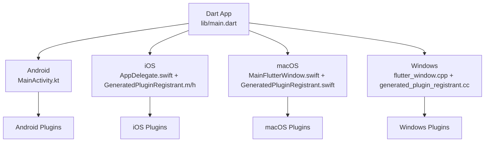
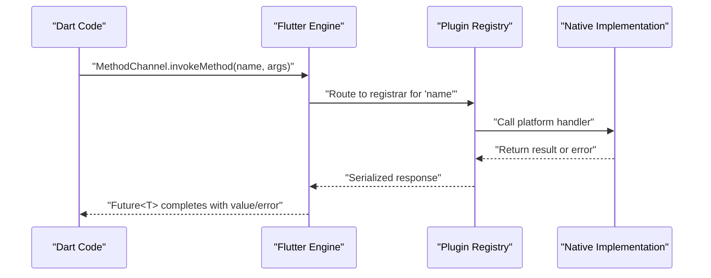
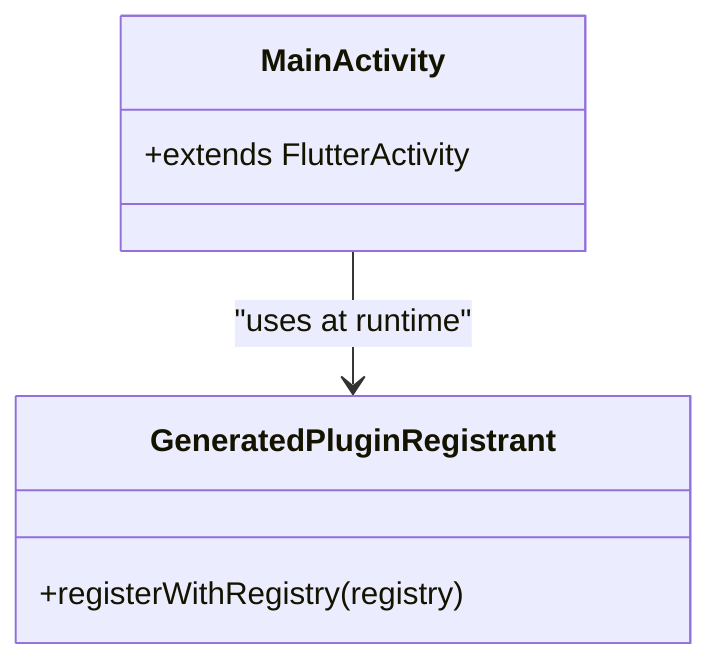
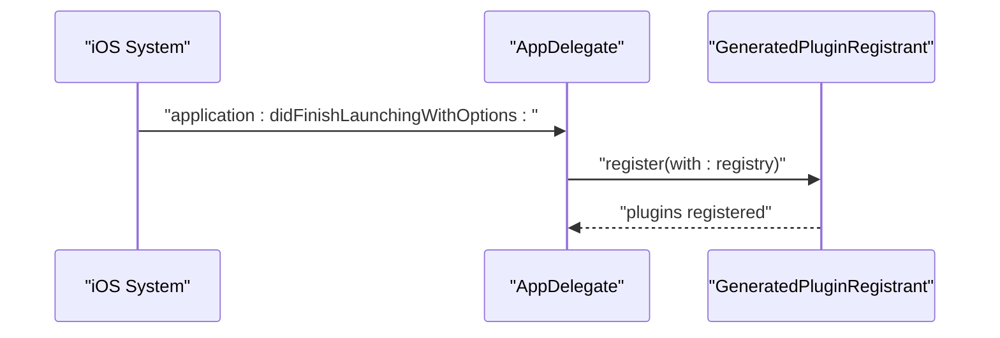
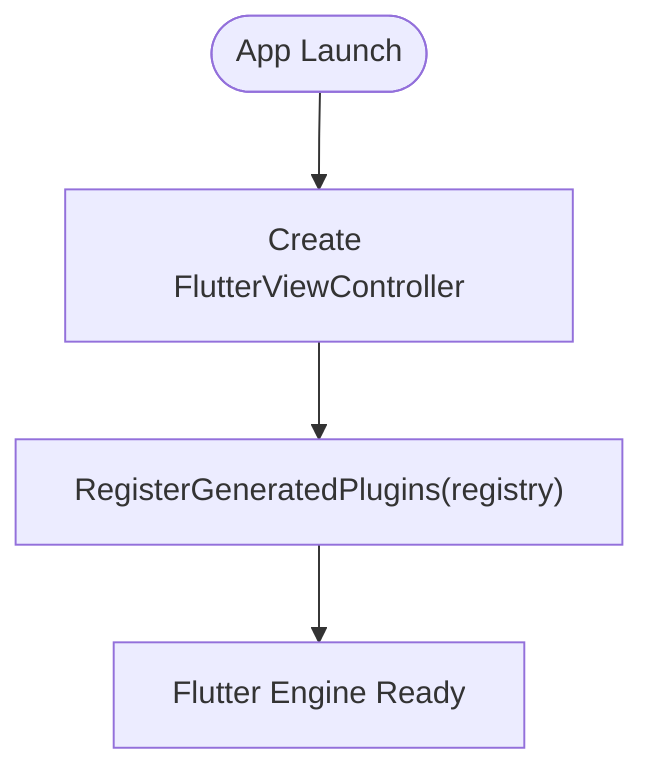
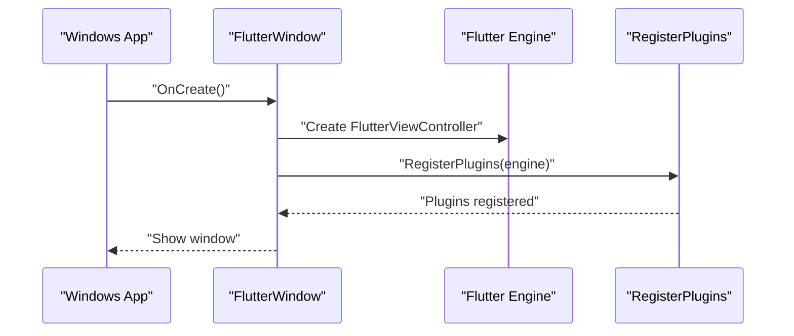
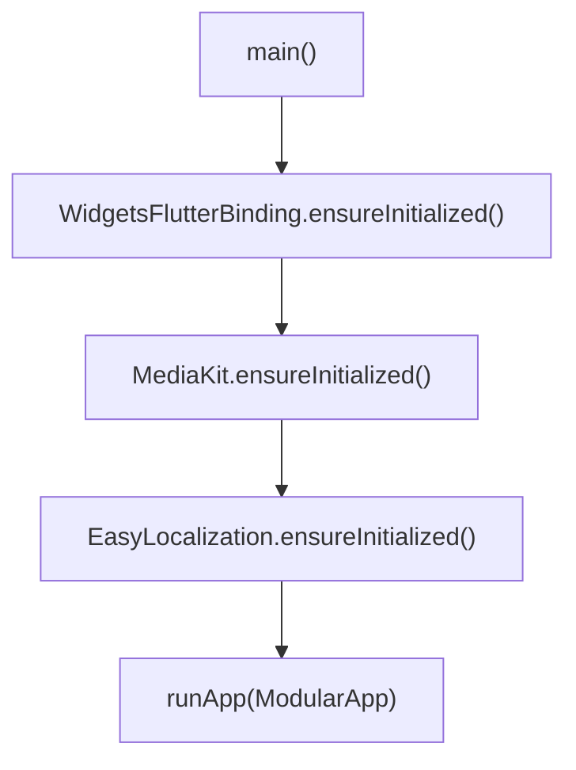
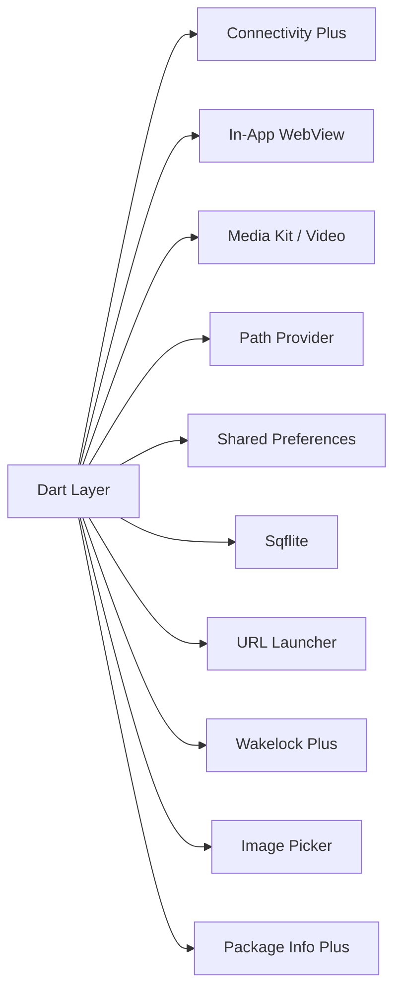

# Native Bridge Patterns

<cite>
**Referenced Files in This Document**
- [pubspec.yaml](file://pubspec.yaml)
- [main.dart](file://lib/main.dart)
- [MainActivity.kt](file://android/app/src/main/kotlin/live/leadershipedge/app/MainActivity.kt)
- [AppDelegate.swift](file://ios/Runner/AppDelegate.swift)
- [GeneratedPluginRegistrant.m](file://ios/Runner/GeneratedPluginRegistrant.m)
- [GeneratedPluginRegistrant.h](file://ios/Runner/GeneratedPluginRegistrant.h)
- [MainFlutterWindow.swift](file://macos/Runner/MainFlutterWindow.swift)
- [GeneratedPluginRegistrant.swift](file://macos/Flutter/GeneratedPluginRegistrant.swift)
- [flutter_window.cpp](file://windows/runner/flutter_window.cpp)
- [generated_plugin_registrant.cc](file://windows/flutter/generated_plugin_registrant.cc)
- [CMakeLists.txt](file://windows/flutter/CMakeLists.txt)
</cite>

## Table of Contents
1. Introduction
2. Project Structure
3. Core Components
4. Architecture Overview
5. Detailed Component Analysis
6. Dependency Analysis
7. Performance Considerations
8. Troubleshooting Guide
9. Conclusion
10. Appendices

## Introduction
This document explains the native bridge patterns used by Leadership Edge Live LMS to communicate between Flutter and native platforms (Android, iOS, macOS, Windows). It covers plugin architecture, method channel lifecycle, data serialization strategies, and how to implement custom platform-specific functionality accessible from shared Dart code. It also provides guidance for device capability access (camera, file system, sensors), asynchronous communication, handling platform differences, error handling, performance optimization, and testing native bridges.

## Project Structure
The project uses standard Flutter multi-platform structure:
- Android: MainActivity extends FlutterActivity; plugins are registered via generated registrant.
- iOS: AppDelegate implements implicit engine delegate and registers plugins via GeneratedPluginRegistrant.
- macOS: MainFlutterWindow initializes FlutterViewController and registers plugins.
- Windows: flutter_window.cpp creates FlutterViewController and calls RegisterPlugins; CMake config includes Flutter headers.
- Dart entrypoint initializes framework services and runs the app.

**Diagram sources**
- [main.dart:16-37](file://lib/main.dart#L16-L37)
- [MainActivity.kt:1-6](file://android/app/src/main/kotlin/live/leadershipedge/app/MainActivity.kt#L1-L6)
- [AppDelegate.swift:1-17](file://ios/Runner/AppDelegate.swift#L1-L17)
- [GeneratedPluginRegistrant.m:75-91](file://ios/Runner/GeneratedPluginRegistrant.m#L75-L91)
- [MainFlutterWindow.swift:1-29](file://macos/Runner/MainFlutterWindow.swift#L1-L29)
- [GeneratedPluginRegistrant.swift:20-32](file://macos/Flutter/GeneratedPluginRegistrant.swift#L20-L32)
- [flutter_window.cpp:12-40](file://windows/runner/flutter_window.cpp#L12-L40)
- [generated_plugin_registrant.cc:16-29](file://windows/flutter/generated_plugin_registrant.cc#L16-L29)

**Section sources**
- [main.dart:16-37](file://lib/main.dart#L16-L37)
- [MainActivity.kt:1-6](file://android/app/src/main/kotlin/live/leadershipedge/app/MainActivity.kt#L1-L6)
- [AppDelegate.swift:1-17](file://ios/Runner/AppDelegate.swift#L1-L17)
- [GeneratedPluginRegistrant.m:75-91](file://ios/Runner/GeneratedPluginRegistrant.m#L75-L91)
- [MainFlutterWindow.swift:1-29](file://macos/Runner/MainFlutterWindow.swift#L1-L29)
- [GeneratedPluginRegistrant.swift:20-32](file://macos/Flutter/GeneratedPluginRegistrant.swift#L20-L32)
- [flutter_window.cpp:12-40](file://windows/runner/flutter_window.cpp#L12-L40)
- [generated_plugin_registrant.cc:16-29](file://windows/flutter/generated_plugin_registrant.cc#L16-L29)

## Core Components
- Plugin registration on each platform ensures that Dart code can call into native capabilities through method channels provided by third-party plugins.
- The Dart side initializes core services (localization, media kit, modular app) before rendering UI.
- Platform-specific plugin sets include connectivity, in-app web view, media playback, path provider, shared preferences, database, URL launcher, and wakelock.

Key responsibilities:
- Android: Hosts Flutter engine via FlutterActivity; relies on generated plugin registrant.
- iOS: Initializes Flutter engine and registers plugins via GeneratedPluginRegistrant.
- macOS: Creates FlutterViewController and registers plugins.
- Windows: Creates Flutter window/controller and registers plugins via C API.

**Section sources**
- [pubspec.yaml:62-99](file://pubspec.yaml#L62-L99)
- [main.dart:16-37](file://lib/main.dart#L16-L37)
- [MainActivity.kt:1-6](file://android/app/src/main/kotlin/live/leadershipedge/app/MainActivity.kt#L1-L6)
- [AppDelegate.swift:1-17](file://ios/Runner/AppDelegate.swift#L1-L17)
- [GeneratedPluginRegistrant.m:75-91](file://ios/Runner/GeneratedPluginRegistrant.m#L75-L91)
- [MainFlutterWindow.swift:1-29](file://macos/Runner/MainFlutterWindow.swift#L1-L29)
- [GeneratedPluginRegistrant.swift:20-32](file://macos/Flutter/GeneratedPluginRegistrant.swift#L20-L32)
- [flutter_window.cpp:12-40](file://windows/runner/flutter_window.cpp#L12-L40)
- [generated_plugin_registrant.cc:16-29](file://windows/flutter/generated_plugin_registrant.cc#L16-L29)

## Architecture Overview
The native bridge architecture follows Flutter’s plugin model:
- Dart code invokes a MethodChannel exposed by a plugin package.
- The Flutter engine routes the call to the corresponding native implementation.
- Native code performs platform operations and returns results asynchronously.

[No sources needed since this diagram shows conceptual workflow, not actual code structure]

## Detailed Component Analysis

### Android Bridge
- MainActivity extends FlutterActivity, providing the default embedding.
- Plugins are registered automatically by the generated registrant during app startup.

**Diagram sources**
- [MainActivity.kt:1-6](file://android/app/src/main/kotlin/live/leadershipedge/app/MainActivity.kt#L1-L6)
- [GeneratedPluginRegistrant.m:75-91](file://ios/Runner/GeneratedPluginRegistrant.m#L75-L91)

**Section sources**
- [MainActivity.kt:1-6](file://android/app/src/main/kotlin/live/leadershipedge/app/MainActivity.kt#L1-L6)

### iOS Bridge
- AppDelegate implements implicit engine delegate and registers plugins via GeneratedPluginRegistrant.
- GeneratedPluginRegistrant exposes a static register method used by the engine.

**Diagram sources**
- [AppDelegate.swift:1-17](file://ios/Runner/AppDelegate.swift#L1-L17)
- [GeneratedPluginRegistrant.m:75-91](file://ios/Runner/GeneratedPluginRegistrant.m#L75-L91)
- [GeneratedPluginRegistrant.h:14-16](file://ios/Runner/GeneratedPluginRegistrant.h#L14-L16)

**Section sources**
- [AppDelegate.swift:1-17](file://ios/Runner/AppDelegate.swift#L1-L17)
- [GeneratedPluginRegistrant.m:75-91](file://ios/Runner/GeneratedPluginRegistrant.m#L75-L91)
- [GeneratedPluginRegistrant.h:14-16](file://ios/Runner/GeneratedPluginRegistrant.h#L14-L16)

### macOS Bridge
- MainFlutterWindow initializes FlutterViewController and registers plugins.
- GeneratedPluginRegistrant registers multiple plugins including media, file selector, and storage.

**Diagram sources**
- [MainFlutterWindow.swift:1-29](file://macos/Runner/MainFlutterWindow.swift#L1-L29)
- [GeneratedPluginRegistrant.swift:20-32](file://macos/Flutter/GeneratedPluginRegistrant.swift#L20-L32)

**Section sources**
- [MainFlutterWindow.swift:1-29](file://macos/Runner/MainFlutterWindow.swift#L1-L29)
- [GeneratedPluginRegistrant.swift:20-32](file://macos/Flutter/GeneratedPluginRegistrant.swift#L20-L32)

### Windows Bridge
- flutter_window.cpp constructs FlutterViewController and calls RegisterPlugins.
- generated_plugin_registrant.cc wires platform plugins via C API.
- CMakeLists.txt includes Flutter headers required for plugin integration.

**Diagram sources**
- [flutter_window.cpp:12-40](file://windows/runner/flutter_window.cpp#L12-L40)
- [generated_plugin_registrant.cc:16-29](file://windows/flutter/generated_plugin_registrant.cc#L16-L29)
- [CMakeLists.txt:27-38](file://windows/flutter/CMakeLists.txt#L27-L38)

**Section sources**
- [flutter_window.cpp:12-40](file://windows/runner/flutter_window.cpp#L12-L40)
- [generated_plugin_registrant.cc:16-29](file://windows/flutter/generated_plugin_registrant.cc#L16-L29)
- [CMakeLists.txt:27-38](file://windows/flutter/CMakeLists.txt#L27-L38)

### Dart Entry Initialization
- Ensures Flutter binding, initializes MediaKit, localization, and runs the modular app.

**Diagram sources**
- [main.dart:16-37](file://lib/main.dart#L16-L37)

**Section sources**
- [main.dart:16-37](file://lib/main.dart#L16-L37)

## Dependency Analysis
The application depends on several cross-platform plugins that provide native bridges:
- Connectivity, In-App WebView, Media Kit (video), Path Provider, Shared Preferences, Sqflite, URL Launcher, Wakelock, Image Picker, Package Info.

**Diagram sources**
- [pubspec.yaml:62-99](file://pubspec.yaml#L62-L99)

**Section sources**
- [pubspec.yaml:62-99](file://pubspec.yaml#L62-L99)

## Performance Considerations
- Batch method channel calls when possible to reduce inter-process overhead.
- Prefer streaming or event channels for continuous data (e.g., sensor updates).
- Avoid large payloads; compress or chunk data if necessary.
- Use background isolates for heavy computations off the UI thread.
- Initialize only required plugins per feature to minimize startup cost.
- Reuse platform resources (e.g., media players, file handles) where appropriate.

[No sources needed since this section provides general guidance]

## Troubleshooting Guide
Common issues and remedies:
- Missing plugin registration: Ensure platform-specific GeneratedPluginRegistrant is invoked during engine initialization.
- Method not found errors: Verify channel names match exactly across Dart and native sides.
- Serialization errors: Confirm types are supported by method channels (primitives, maps, lists); avoid unsupported objects.
- Permission denied: Request and handle permissions on the native side before invoking platform APIs.
- Cross-platform inconsistencies: Abstract platform logic behind a common Dart interface and test on all targets.

Verification steps:
- Check platform logs for exceptions thrown by native handlers.
- Add logging around method channel invocations to trace failures.
- Validate plugin versions and compatibility with Flutter SDK.

[No sources needed since this section provides general guidance]

## Conclusion
Leadership Edge Live LMS leverages Flutter’s plugin architecture to integrate native capabilities across Android, iOS, macOS, and Windows. The generated plugin registrants ensure consistent registration, while Dart initializes core services before launching the app. By following best practices for method channels, serialization, error handling, and performance, you can build robust, cross-platform features such as camera access, file system operations, and sensor integrations.

[No sources needed since this section summarizes without analyzing specific files]

## Appendices

### How to Implement Custom Platform-Specific Functionality
- Define a Dart abstraction (e.g., a class or service) that exposes methods for your feature.
- On each platform, implement a plugin that registers a MethodChannel with a unique name.
- Map Dart method calls to native implementations and return results asynchronously.
- Serialize data using supported types; wrap complex structures in Maps/lists.
- Handle errors consistently by returning structured error objects or throwing platform exceptions.

Example categories:
- Camera: Use image picker or custom plugin to capture images/video.
- File system: Use path provider and file selectors to read/write files securely.
- Sensors: Expose event channels for real-time sensor streams.

Best practices:
- Keep Dart interfaces stable; evolve native implementations independently.
- Test on all target platforms early and often.
- Provide fallback behavior when features are unavailable.

[No sources needed since this section provides general guidance]