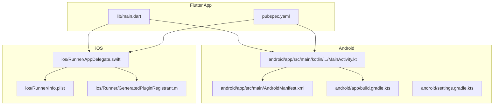
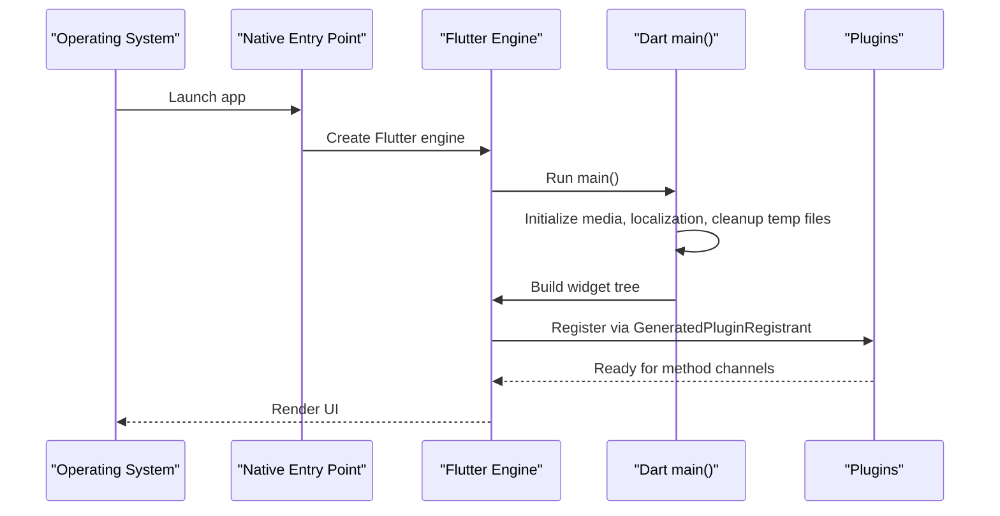
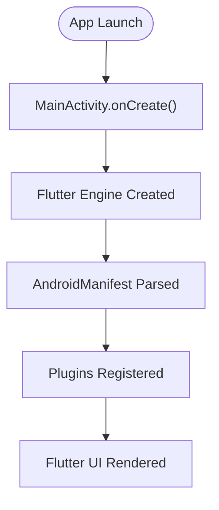
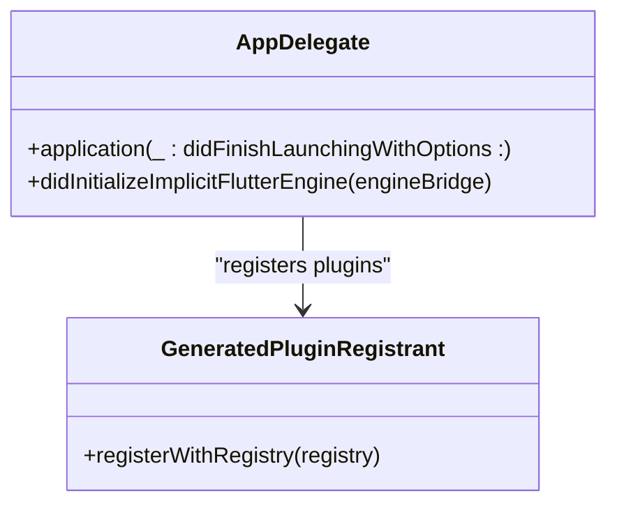
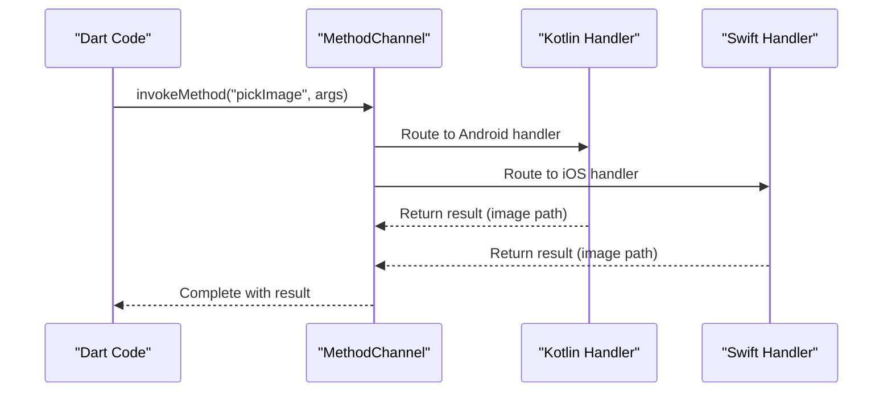
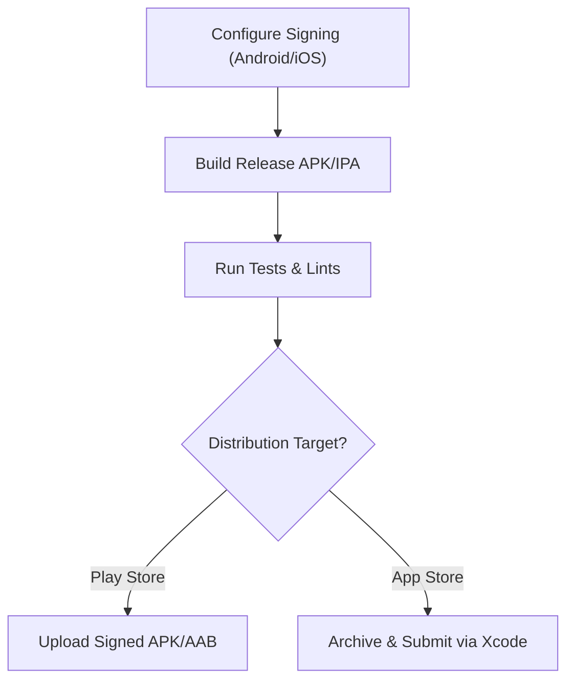
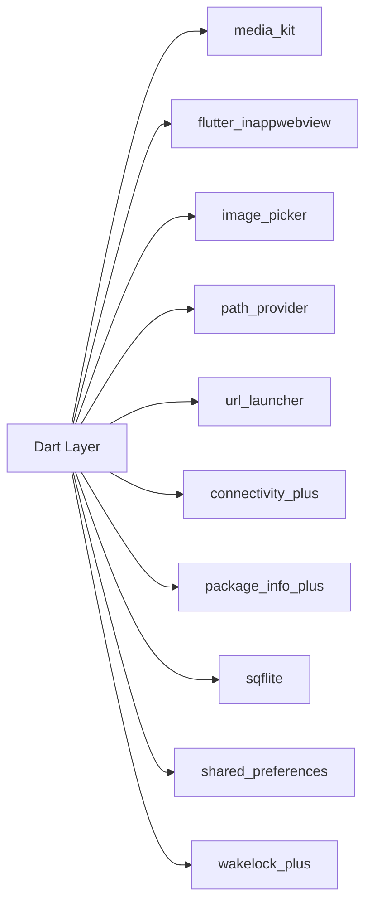
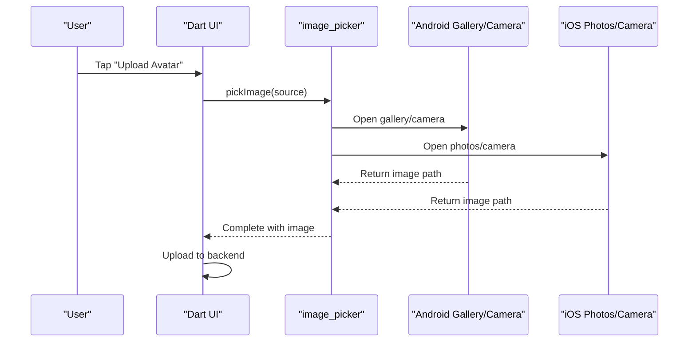
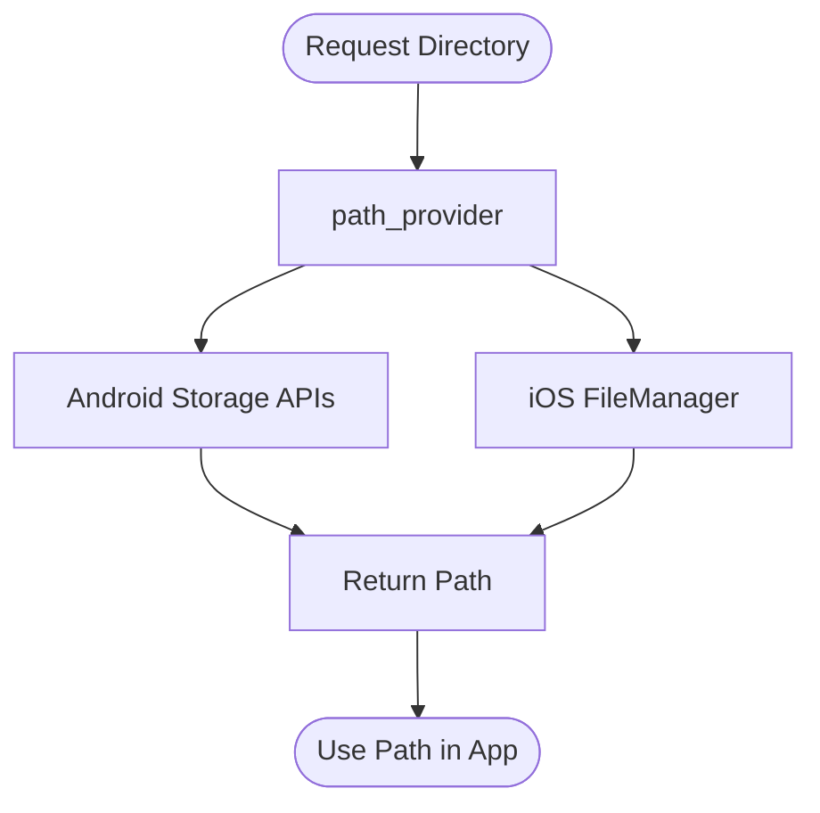

# Platform Integration

<cite>
**Referenced Files in This Document**
- [main.dart](file://lib/main.dart)
- [pubspec.yaml](file://pubspec.yaml)
- [MainActivity.kt](file://android/app/src/main/kotlin/live/leadershipedge/app/MainActivity.kt)
- [AndroidManifest.xml](file://android/app/src/main/AndroidManifest.xml)
- [build.gradle.kts](file://android/app/build.gradle.kts)
- [settings.gradle.kts](file://android/settings.gradle.kts)
- [AppDelegate.swift](file://ios/Runner/AppDelegate.swift)
- [Info.plist](file://ios/Runner/Info.plist)
- [GeneratedPluginRegistrant.m](file://ios/Runner/GeneratedPluginRegistrant.m)
</cite>

## Table of Contents
1. Introduction
2. Project Structure
3. Core Components
4. Architecture Overview
5. Detailed Component Analysis
6. Dependency Analysis
7. Performance Considerations
8. Troubleshooting Guide
9. Conclusion
10. Appendices

## Introduction
This document explains how the Leadership Edge Live LMS integrates with Android and iOS platforms using Flutter. It covers native platform entry points, permissions and capabilities, the Flutter-to-native bridge for device features (camera, file system, notifications), build configurations for signing and deployment, performance optimizations, debugging techniques, and guidance for adding new platform-specific functionality while keeping shared Flutter code clean and maintainable.

## Project Structure
The project follows a standard Flutter layout with platform folders for Android and iOS:
- lib contains the shared Flutter application code and modules.
- android holds the Android app configuration, manifest, and Kotlin entry point.
- ios holds the iOS app configuration, Info.plist, and Swift entry point.
- pubspec.yaml declares dependencies that enable cross-platform features such as media playback, WebView, image picking, path provider, and more.

**Diagram sources**
- [main.dart:16-38](file://lib/main.dart#L16-L38)
- [MainActivity.kt:1-6](file://android/app/src/main/kotlin/live/leadershipedge/app/MainActivity.kt#L1-L6)
- [AndroidManifest.xml:1-46](file://android/app/src/main/AndroidManifest.xml#L1-L46)
- [build.gradle.kts:1-45](file://android/app/build.gradle.kts#L1-L45)
- [settings.gradle.kts:1-26](file://android/settings.gradle.kts#L1-L26)
- [AppDelegate.swift:1-17](file://ios/Runner/AppDelegate.swift#L1-L17)
- [Info.plist:1-78](file://ios/Runner/Info.plist#L1-L78)
- [GeneratedPluginRegistrant.m:75-89](file://ios/Runner/GeneratedPluginRegistrant.m#L75-L89)

**Section sources**
- [main.dart:16-38](file://lib/main.dart#L16-L38)
- [pubspec.yaml:30-99](file://pubspec.yaml#L30-L99)
- [MainActivity.kt:1-6](file://android/app/src/main/kotlin/live/leadershipedge/app/MainActivity.kt#L1-L6)
- [AndroidManifest.xml:1-46](file://android/app/src/main/AndroidManifest.xml#L1-L46)
- [build.gradle.kts:1-45](file://android/app/build.gradle.kts#L1-L45)
- [settings.gradle.kts:1-26](file://android/settings.gradle.kts#L1-L26)
- [AppDelegate.swift:1-17](file://ios/Runner/AppDelegate.swift#L1-L17)
- [Info.plist:1-78](file://ios/Runner/Info.plist#L1-L78)
- [GeneratedPluginRegistrant.m:75-89](file://ios/Runner/GeneratedPluginRegistrant.m#L75-L89)

## Core Components
- Flutter app bootstrap initializes core services and runs the modular app shell.
- Android MainActivity extends FlutterActivity to host the Flutter engine.
- iOS AppDelegate implements FlutterImplicitEngineDelegate to register plugins for implicit engines.
- Platform manifests declare permissions and capabilities required by plugins.
- Generated plugin registrants wire third-party plugins into each platform.

Key responsibilities:
- Initialization order and readiness of media, localization, and routing.
- Plugin registration on both platforms.
- Manifest/plist declarations for runtime permissions and capabilities.

**Section sources**
- [main.dart:16-38](file://lib/main.dart#L16-L38)
- [MainActivity.kt:1-6](file://android/app/src/main/kotlin/live/leadershipedge/app/MainActivity.kt#L1-L6)
- [AppDelegate.swift:1-17](file://ios/Runner/AppDelegate.swift#L1-L17)
- [AndroidManifest.xml:1-46](file://android/app/src/main/AndroidManifest.xml#L1-L46)
- [Info.plist:1-78](file://ios/Runner/Info.plist#L1-L78)
- [GeneratedPluginRegistrant.m:75-89](file://ios/Runner/GeneratedPluginRegistrant.m#L75-L89)

## Architecture Overview
The Flutter app boots on both platforms, initializing media and localization before rendering the UI. Plugins are registered automatically via generated registrants. The architecture separates shared Dart logic from platform-specific implementations, enabling consistent behavior across devices.

**Diagram sources**
- [main.dart:16-38](file://lib/main.dart#L16-L38)
- [AppDelegate.swift:1-17](file://ios/Runner/AppDelegate.swift#L1-L17)
- [MainActivity.kt:1-6](file://android/app/src/main/kotlin/live/leadershipedge/app/MainActivity.kt#L1-L6)
- [GeneratedPluginRegistrant.m:75-89](file://ios/Runner/GeneratedPluginRegistrant.m#L75-L89)

## Detailed Component Analysis

### Android Platform Integration
- MainActivity is a thin wrapper around FlutterActivity, sufficient for most use cases. Extend it if you need custom lifecycle handling or platform channel setup.
- AndroidManifest defines the launcher activity, theme metadata, and Flutter embedding version. Add feature-specific permissions here when needed (e.g., camera, storage).
- Gradle config sets compile/target SDKs, Java/Kotlin versions, and release signing placeholder. Configure proper signing for production builds.

**Diagram sources**
- [MainActivity.kt:1-6](file://android/app/src/main/kotlin/live/leadershipedge/app/MainActivity.kt#L1-L6)
- [AndroidManifest.xml:1-46](file://android/app/src/main/AndroidManifest.xml#L1-L46)
- [build.gradle.kts:1-45](file://android/app/build.gradle.kts#L1-L45)

**Section sources**
- [MainActivity.kt:1-6](file://android/app/src/main/kotlin/live/leadershipedge/app/MainActivity.kt#L1-L6)
- [AndroidManifest.xml:1-46](file://android/app/src/main/AndroidManifest.xml#L1-L46)
- [build.gradle.kts:1-45](file://android/app/build.gradle.kts#L1-L45)
- [settings.gradle.kts:1-26](file://android/settings.gradle.kts#L1-L26)

### iOS Platform Integration
- AppDelegate implements FlutterImplicitEngineDelegate to ensure plugins are registered for implicit engines.
- Info.plist includes display name, supported orientations, ATS settings for media, and usage descriptions for photo library access.
- GeneratedPluginRegistrant wires up plugins like image picker, media kit, path provider, URL launcher, and others.

**Diagram sources**
- [AppDelegate.swift:1-17](file://ios/Runner/AppDelegate.swift#L1-L17)
- [GeneratedPluginRegistrant.m:75-89](file://ios/Runner/GeneratedPluginRegistrant.m#L75-L89)

**Section sources**
- [AppDelegate.swift:1-17](file://ios/Runner/AppDelegate.swift#L1-L17)
- [Info.plist:1-78](file://ios/Runner/Info.plist#L1-L78)
- [GeneratedPluginRegistrant.m:75-89](file://ios/Runner/GeneratedPluginRegistrant.m#L75-L89)

### Flutter-to-Native Bridge Patterns
- Method Channels: Used by plugins to call native APIs from Dart and vice versa. You can add custom channels in Dart and implement handlers in Kotlin/Swift.
- Event Streams: For ongoing events (e.g., media state changes), use event streams to push data from native to Dart.
- Platform Views: For embedding native views inside Flutter (e.g., webviews), rely on platform view support provided by plugins.

Common patterns in this project:
- Media playback via media_kit uses platform-specific backends for decoding and rendering.
- Image picking uses image_picker which bridges to native gallery/camera APIs.
- Path resolution uses path_provider to get safe directories per platform.
- In-app WebView uses flutter_inappwebview for consistent behavior across platforms.

[No sources needed since this diagram shows conceptual workflow, not actual code structure]

### Permissions Handling
- Android: Declare required permissions in AndroidManifest.xml for features like camera or storage. Request runtime permissions in Dart using appropriate plugins.
- iOS: Add usage description keys in Info.plist for camera, photos, etc. Prompt users via plugin APIs; handle denial gracefully.

Examples in this project:
- Photo library usage description is present in Info.plist for avatar upload flows.
- Android queries include text processing intent support required by Flutter’s text plugin.

**Section sources**
- [Info.plist:34-35](file://ios/Runner/Info.plist#L34-L35)
- [AndroidManifest.xml:34-44](file://android/app/src/main/AndroidManifest.xml#L34-L44)

### Build Configurations, Signing, and Deployment
- Android:
  - Gradle applies Flutter plugin and sets compile/target SDKs and Java/Kotlin versions.
  - Release build currently uses debug signing; configure a proper signingConfig for production.
  - Application ID and versioning are set in defaultConfig.
- iOS:
  - Info.plist maps Flutter build name/number to CFBundleShortVersionString and CFBundleVersion.
  - Ensure signing and provisioning profiles are configured in Xcode workspace for distribution.

**Section sources**
- [build.gradle.kts:22-39](file://android/app/build.gradle.kts#L22-L39)
- [Info.plist:21-26](file://ios/Runner/Info.plist#L21-L26)

### Platform-Specific Optimizations and Performance
- Media Playback: media_kit provides software decoding for formats like WebM/VP9 on all platforms, ensuring consistent playback without platform codec gaps.
- WebView: Using flutter_inappwebview avoids platform-view hit-test issues on macOS and provides consistent behavior across platforms.
- Asset Management: Keep assets minimal and use efficient formats; leverage caching via flutter_cache_manager where applicable.
- Startup Time: Defer non-critical initialization; ensure only necessary plugins are used at startup.

**Section sources**
- [pubspec.yaml:86-99](file://pubspec.yaml#L86-L99)
- [pubspec.yaml:68-76](file://pubspec.yaml#L68-L76)

### Debugging Techniques
- Android:
  - Use Android Studio logs and logcat to inspect plugin messages and errors.
  - Verify manifest entries and permissions if features fail at runtime.
- iOS:
  - Use Xcode console and debugger; check Info.plist keys and entitlements.
  - Validate plugin registrations in GeneratedPluginRegistrant.
- Flutter:
  - Enable verbose logging for plugins; use devtools for performance profiling.
  - Isolate issues by toggling features and checking platform-specific behaviors.

[No sources needed since this section provides general guidance]

### Adding New Platform-Specific Functionality
Steps to add a new capability:
1. Define a Dart API in shared code that encapsulates the feature.
2. Implement platform channels in Kotlin (Android) and Swift (iOS) to handle calls.
3. Update AndroidManifest.xml or Info.plist with required permissions and capabilities.
4. If using a third-party plugin, add it to pubspec.yaml and ensure platform integrations are present.
5. Test on both platforms; handle permission denials and edge cases.

Best practices:
- Keep platform differences isolated behind a unified Dart interface.
- Provide fallbacks for missing capabilities.
- Document required permissions and user prompts clearly.

[No sources needed since this section provides general guidance]

## Dependency Analysis
The project relies on several key plugins that require platform integration:
- media_kit and related packages for video/audio playback.
- flutter_inappwebview for embedded web content.
- image_picker for selecting images from gallery/camera.
- path_provider for accessing platform-specific directories.
- url_launcher for opening external URLs.
- connectivity_plus, package_info_plus, sqflite, shared_preferences, wakelock_plus for utility functions.

**Diagram sources**
- [pubspec.yaml:30-99](file://pubspec.yaml#L30-L99)
- [GeneratedPluginRegistrant.m:75-89](file://ios/Runner/GeneratedPluginRegistrant.m#L75-L89)

**Section sources**
- [pubspec.yaml:30-99](file://pubspec.yaml#L30-L99)
- [GeneratedPluginRegistrant.m:75-89](file://ios/Runner/GeneratedPluginRegistrant.m#L75-L89)

## Performance Considerations
- Prefer lazy loading of heavy features; initialize only what is needed at startup.
- Use efficient media formats and streaming where possible; leverage media_kit’s cross-platform decoding.
- Minimize memory footprint by releasing resources after use (e.g., closing players, disposing controllers).
- Cache static assets and network responses appropriately to reduce bandwidth and improve responsiveness.

[No sources needed since this section provides general guidance]

## Troubleshooting Guide
Common issues and resolutions:
- Permission denied:
  - Android: Ensure permissions are declared in AndroidManifest.xml and requested at runtime.
  - iOS: Ensure usage descriptions exist in Info.plist and prompt users via plugin APIs.
- Media playback failures:
  - Verify media_kit setup and platform-specific libraries are included.
  - Check format compatibility; prefer widely supported codecs or rely on media_kit’s software decoding.
- WebView issues:
  - Confirm flutter_inappwebview is properly integrated and platform views are enabled.
- Build/signing errors:
  - Android: Configure release signing in Gradle; avoid debug signing for production.
  - iOS: Ensure correct provisioning profiles and certificates in Xcode workspace.

**Section sources**
- [build.gradle.kts:33-39](file://android/app/build.gradle.kts#L33-L39)
- [Info.plist:21-26](file://ios/Runner/Info.plist#L21-L26)
- [AndroidManifest.xml:1-46](file://android/app/src/main/AndroidManifest.xml#L1-L46)
- [pubspec.yaml:86-99](file://pubspec.yaml#L86-L99)

## Conclusion
The Leadership Edge Live LMS integrates seamlessly with Android and iOS through Flutter’s platform abstraction. The native entry points are minimal, delegating most logic to Dart while leveraging plugins for device capabilities. Proper configuration of manifests/plists, build scripts, and permissions ensures reliable operation across platforms. Following the patterns and guidelines in this document will help maintain consistency, simplify debugging, and scale the app with new platform-specific features.

## Appendices

### Example: Camera and Gallery Flow (Conceptual)

[No sources needed since this diagram shows conceptual workflow, not actual code structure]

### Example: File System Access (Conceptual)

[No sources needed since this diagram shows conceptual workflow, not actual code structure]