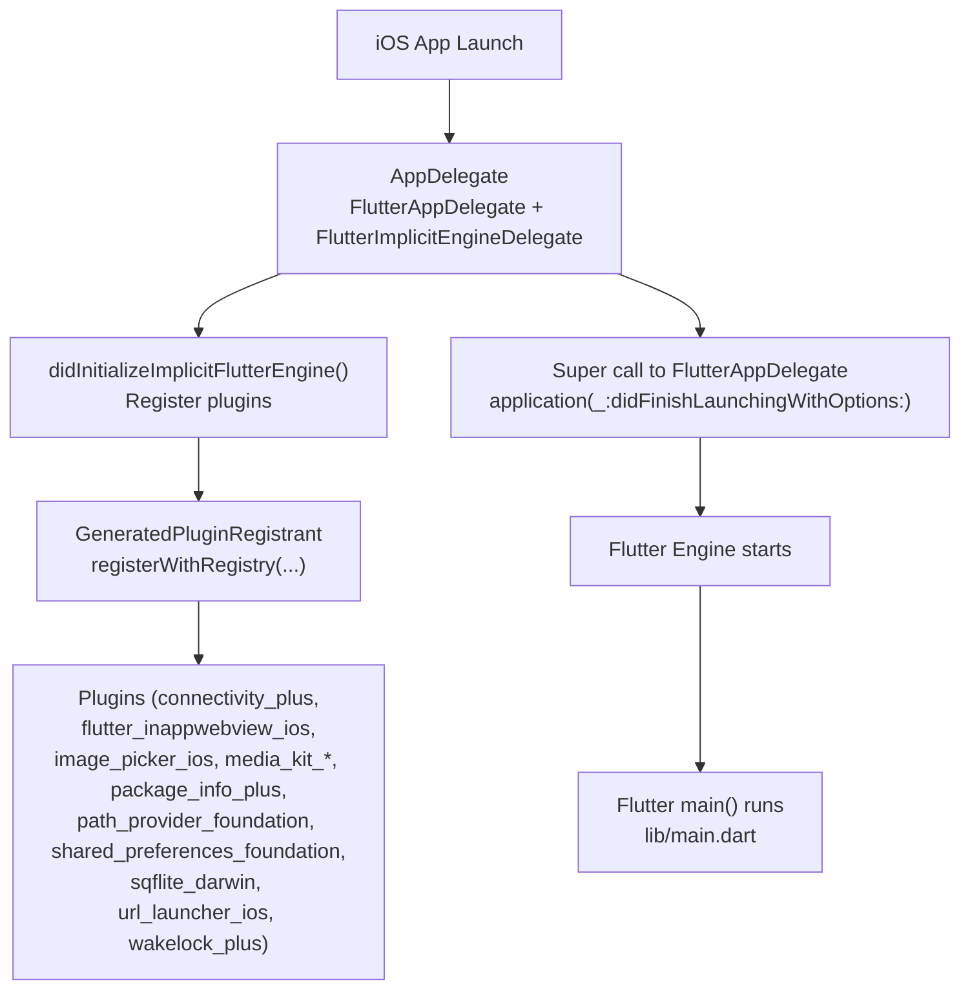
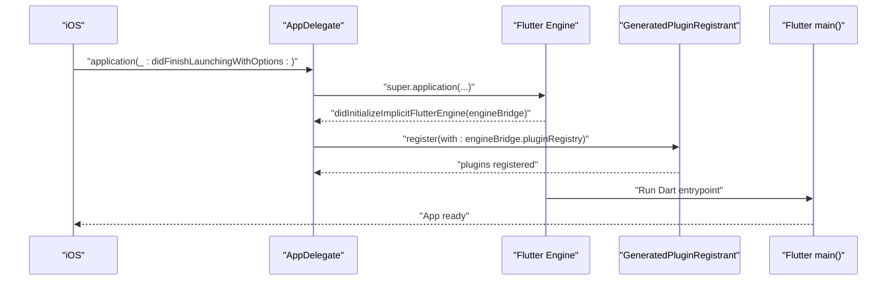
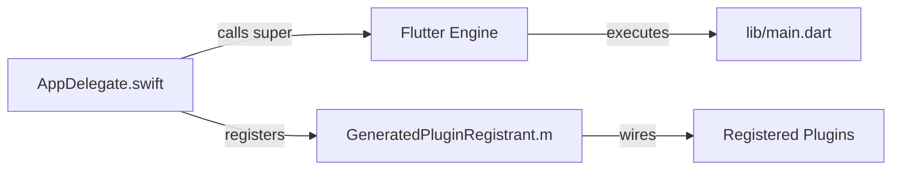

# AppDelegate Configuration

<cite>
**Referenced Files in This Document**
- [AppDelegate.swift](file://ios/Runner/AppDelegate.swift)
- [GeneratedPluginRegistrant.h](file://ios/Runner/GeneratedPluginRegistrant.h)
- [GeneratedPluginRegistrant.m](file://ios/Runner/GeneratedPluginRegistrant.m)
- [Info.plist](file://ios/Runner/Info.plist)
- [Podfile](file://ios/Podfile)
- [main.dart](file://lib/main.dart)
</cite>

## Table of Contents
1. [Introduction](#introduction)
2. [Project Structure](#project-structure)
3. [Core Components](#core-components)
4. [Architecture Overview](#architecture-overview)
5. [Detailed Component Analysis](#detailed-component-analysis)
6. [Dependency Analysis](#dependency-analysis)
7. [Performance Considerations](#performance-considerations)
8. [Troubleshooting Guide](#troubleshooting-guide)
9. [Conclusion](#conclusion)
10. [Appendices](#appendices)

## Introduction
This document explains how the iOS entry point for the Leadership Edge Live LMS is configured and how Flutter integrates with native iOS at launch. It focuses on:
- The FlutterAppDelegate implementation
- Implicit engine delegate setup and plugin registration
- How to extend AppDelegate for custom initialization, lifecycle handling, and third-party SDK integration
- Best practices for managing app state transitions and common customization patterns

The goal is to help you safely customize the iOS side without breaking Flutter’s embedding behavior.

## Project Structure
At a high level, the iOS side consists of:
- An application delegate that bootstraps Flutter and registers plugins
- A generated plugin registrant that wires Flutter plugins to the platform
- App configuration via Info.plist (including scene configuration)
- CocoaPods configuration for dependencies

**Diagram sources**
- [AppDelegate.swift:4-15](file://ios/Runner/AppDelegate.swift#L4-L15)
- [GeneratedPluginRegistrant.m:75-89](file://ios/Runner/GeneratedPluginRegistrant.m#L75-L89)
- [main.dart:16-37](file://lib/main.dart#L16-L37)

**Section sources**
- [AppDelegate.swift:1-17](file://ios/Runner/AppDelegate.swift#L1-L17)
- [GeneratedPluginRegistrant.h:7-19](file://ios/Runner/GeneratedPluginRegistrant.h#L7-L19)
- [GeneratedPluginRegistrant.m:1-92](file://ios/Runner/GeneratedPluginRegistrant.m#L1-L92)
- [Info.plist:36-56](file://ios/Runner/Info.plist#L36-L56)
- [Podfile:1-44](file://ios/Podfile#L1-L44)
- [main.dart:16-37](file://lib/main.dart#L16-L37)

## Core Components
- AppDelegate.swift: Implements the app delegate and implements the implicit engine delegate protocol to register plugins when the implicit Flutter engine initializes.
- GeneratedPluginRegistrant: Auto-generated class that registers all Flutter plugins used by the app.
- Info.plist: Declares app metadata and scene configuration; uses a Flutter scene delegate for UI lifecycle.
- Podfile: Configures CocoaPods and Flutter pod helpers for building the iOS target.
- lib/main.dart: Flutter-side entry point where Dart initialization occurs after the native side has started Flutter.

Key responsibilities:
- Bootstrapping Flutter via super call in didFinishLaunchingWithOptions
- Registering plugins through the implicit engine bridge callback
- Ensuring plugins are available before Flutter code executes

**Section sources**
- [AppDelegate.swift:4-15](file://ios/Runner/AppDelegate.swift#L4-L15)
- [GeneratedPluginRegistrant.m:75-89](file://ios/Runner/GeneratedPluginRegistrant.m#L75-L89)
- [Info.plist:36-56](file://ios/Runner/Info.plist#L36-L56)
- [Podfile:28-37](file://ios/Podfile#L28-L37)
- [main.dart:16-37](file://lib/main.dart#L16-L37)

## Architecture Overview
The iOS app launch flow integrates native and Flutter layers:

**Diagram sources**
- [AppDelegate.swift:6-15](file://ios/Runner/AppDelegate.swift#L6-L15)
- [GeneratedPluginRegistrant.m:75-89](file://ios/Runner/GeneratedPluginRegistrant.m#L75-L89)
- [main.dart:16-37](file://lib/main.dart#L16-L37)

## Detailed Component Analysis

### AppDelegate Implementation
- Inherits from FlutterAppDelegate and conforms to FlutterImplicitEngineDelegate.
- Overrides application(_:didFinishLaunchingWithOptions:) to call the superclass implementation, which starts the Flutter engine.
- Implements didInitializeImplicitFlutterEngine to register plugins using the provided engine bridge registry.

Why this matters:
- Calling super ensures Flutter sets up its internal components correctly.
- Plugin registration happens early enough that Flutter plugins are available when Dart code runs.

Common extension points:
- Add custom initialization before calling super if needed (e.g., configure analytics or crash reporting).
- Add post-engine-start logic inside didInitializeImplicitFlutterEngine after plugin registration.
- Handle additional lifecycle events by overriding other UIApplicationDelegate methods if required.

Best practices:
- Keep AppDelegate minimal; move complex logic into dedicated services or feature modules.
- Avoid heavy work in didFinishLaunchingWithOptions; defer non-critical tasks.
- Ensure any third-party SDKs requiring early initialization are set up before Flutter renders content.

**Section sources**
- [AppDelegate.swift:4-15](file://ios/Runner/AppDelegate.swift#L4-L15)

### Implicit Engine Delegate and Plugin Registration
- The implicit engine delegate pattern allows Flutter to initialize an engine automatically and notify your app when it is ready.
- In didInitializeImplicitFlutterEngine, the app registers all plugins via GeneratedPluginRegistrant.

What gets registered:
- Connectivity, In-App WebView, Image Picker, Media Kit libraries, Package Info, Path Provider, Shared Preferences, SQLite, URL Launcher, Wakelock Plus.

Implications:
- These plugins are available to Dart code immediately after Flutter starts.
- If you add new Flutter plugins, ensure they are included in your pubspec and run flutter build to regenerate the registrant.

**Section sources**
- [AppDelegate.swift:13-15](file://ios/Runner/AppDelegate.swift#L13-L15)
- [GeneratedPluginRegistrant.m:75-89](file://ios/Runner/GeneratedPluginRegistrant.m#L75-L89)

### GeneratedPluginRegistrant
- Auto-generated header and implementation declare and implement registerWithRegistry:.
- Each plugin is registered against the Flutter plugin registry using registrarForPlugin.

Operational notes:
- Do not edit this file manually; changes will be overwritten by Flutter tooling.
- If a plugin fails to register, verify its presence in pubspec.yaml and re-run Flutter build steps.

**Section sources**
- [GeneratedPluginRegistrant.h:7-19](file://ios/Runner/GeneratedPluginRegistrant.h#L7-L19)
- [GeneratedPluginRegistrant.m:1-92](file://ios/Runner/GeneratedPluginRegistrant.m#L1-L92)

### Info.plist and Scene Configuration
- Declares app display name, bundle identifiers, and supported orientations.
- Uses UIApplicationSceneManifest to configure scenes; the Flutter scene delegate handles UI lifecycle for the Flutter view.

Integration considerations:
- If you need to handle scene lifecycle beyond Flutter’s defaults, you can provide a custom scene delegate and update Info.plist accordingly.
- Permissions and capabilities should be declared here (e.g., photo library usage description is present).

**Section sources**
- [Info.plist:5-78](file://ios/Runner/Info.plist#L5-L78)

### CocoaPods and Dependencies
- Platform version is set to iOS 13.0.
- Uses flutter_ios_podfile_setup and flutter_install_all_ios_pods to integrate Flutter-managed pods.
- Post-install hook applies additional Flutter build settings to targets.

Build implications:
- Adding or updating Flutter plugins requires running flutter pub get and then pod install to keep dependencies in sync.
- Custom native dependencies can be added to the Podfile within the Runner target.

**Section sources**
- [Podfile:1-44](file://ios/Podfile#L1-L44)

### Flutter Entry Point (Dart Side)
- Initializes Flutter bindings, media kit, localization, and cleans temporary files before launching the app.
- Sets up providers, routing, and theme.

Native-Dart handoff:
- After AppDelegate starts Flutter and registers plugins, Dart’s main runs and configures the app.
- Any native-to-Dart communication should rely on established plugin channels once plugins are registered.

**Section sources**
- [main.dart:16-37](file://lib/main.dart#L16-L37)

## Dependency Analysis
The following diagram shows how the iOS app delegate depends on Flutter and the generated plugin registrant, and how those relate to the Flutter engine and Dart entrypoint.

**Diagram sources**
- [AppDelegate.swift:6-15](file://ios/Runner/AppDelegate.swift#L6-L15)
- [GeneratedPluginRegistrant.m:75-89](file://ios/Runner/GeneratedPluginRegistrant.m#L75-L89)
- [main.dart:16-37](file://lib/main.dart#L16-L37)

**Section sources**
- [AppDelegate.swift:6-15](file://ios/Runner/AppDelegate.swift#L6-L15)
- [GeneratedPluginRegistrant.m:75-89](file://ios/Runner/GeneratedPluginRegistrant.m#L75-L89)
- [main.dart:16-37](file://lib/main.dart#L16-L37)

## Performance Considerations
- Keep AppDelegate lightweight; avoid blocking operations in didFinishLaunchingWithOptions.
- Defer expensive initialization to background queues or after Flutter is ready.
- Use lazy initialization for third-party SDKs unless early startup is strictly required.
- Be mindful of plugin registration overhead; only include necessary plugins.

[No sources needed since this section provides general guidance]

## Troubleshooting Guide
Common issues and resolutions:
- Plugins not available in Dart:
  - Ensure plugins are listed in pubspec.yaml and run flutter pub get followed by pod install.
  - Verify GeneratedPluginRegistrant includes the plugin registrations.
- Build failures related to missing frameworks:
  - Confirm Podfile platform and use_frameworks! settings match your project requirements.
  - Re-run pod install after adding or updating dependencies.
- Unexpected runtime crashes during launch:
  - Check for heavy work in AppDelegate; move to background or later lifecycle hooks.
  - Validate Info.plist permissions and configurations for features like camera or photo library access.

**Section sources**
- [GeneratedPluginRegistrant.m:75-89](file://ios/Runner/GeneratedPluginRegistrant.m#L75-L89)
- [Podfile:1-44](file://ios/Podfile#L1-L44)
- [Info.plist:34-35](file://ios/Runner/Info.plist#L34-L35)

## Conclusion
The iOS AppDelegate for Leadership Edge Live follows Flutter’s recommended pattern:
- Start Flutter via super in didFinishLaunchingWithOptions
- Register plugins in didInitializeImplicitFlutterEngine using the implicit engine bridge
- Rely on auto-generated plugin registration to wire native capabilities

To extend functionality:
- Add minimal, safe initialization in AppDelegate
- Integrate third-party SDKs carefully, respecting lifecycle constraints
- Keep plugin registration intact and let Flutter manage updates to GeneratedPluginRegistrant

Following these practices ensures stable integration between native iOS and Flutter while enabling extensibility for custom needs.

[No sources needed since this section summarizes without analyzing specific files]

## Appendices

### Extending AppDelegate: Practical Patterns
- Early SDK initialization:
  - Place time-sensitive SDK setup before calling super if required by the SDK.
  - Otherwise, perform initialization after Flutter engine starts to avoid blocking launch.
- Lifecycle hooks:
  - Override additional UIApplicationDelegate methods (e.g., applicationWillEnterForeground) to coordinate with Flutter state.
- Third-party integrations:
  - Configure analytics, crash reporting, or push notifications in AppDelegate or dedicated services.
  - Ensure any native-to-Dart communication uses established plugin channels after plugins are registered.
- Managing app state transitions:
  - Use AppDelegate lifecycle methods to pause/resume background tasks, release resources, or update native state in response to app foreground/background transitions.

[No sources needed since this section provides general guidance]