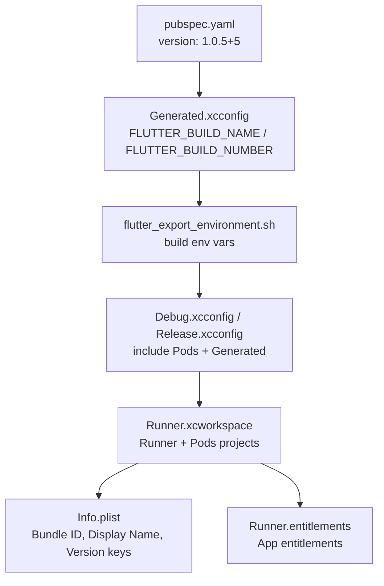
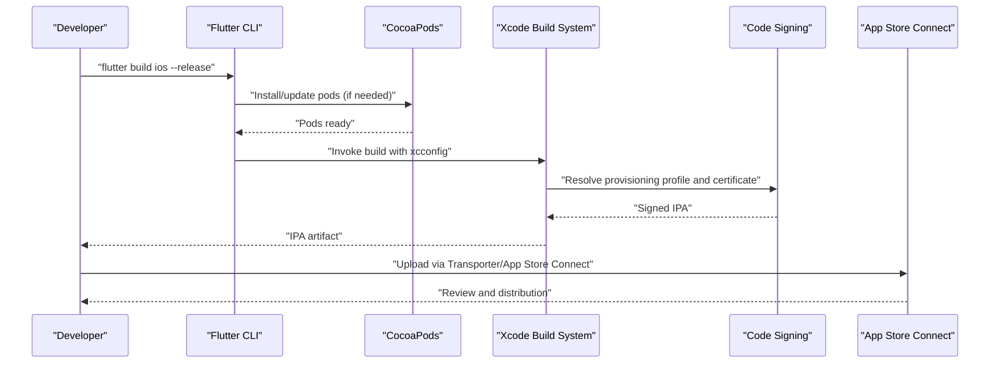
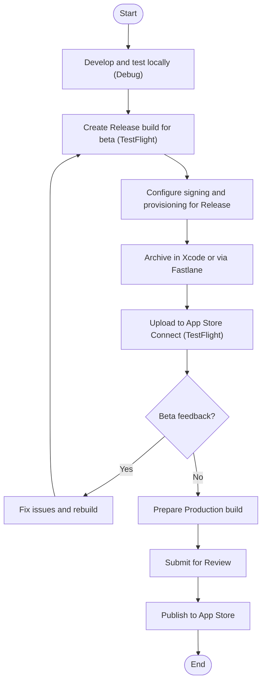
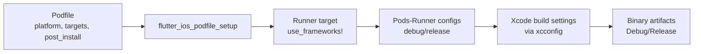

# Build & Deployment Process

<cite>
**Referenced Files in This Document**
- [pubspec.yaml](file://pubspec.yaml)
- [Info.plist](file://ios/Runner/Info.plist)
- [Podfile](file://ios/Podfile)
- [Generated.xcconfig](file://ios/Flutter/Generated.xcconfig)
- [Debug.xcconfig](file://ios/Flutter/Debug.xcconfig)
- [Release.xcconfig](file://ios/Flutter/Release.xcconfig)
- [flutter_export_environment.sh](file://ios/Flutter/flutter_export_environment.sh)
- [contents.xcworkspacedata](file://ios/Runner.xcworkspace/contents.xcworkspacedata)
- [Runner.entitlements](file://ios/Runner/Runner.entitlements)
</cite>

## Table of Contents
1. [Introduction](#introduction)
2. [Project Structure](#project-structure)
3. [Core Components](#core-components)
4. [Architecture Overview](#architecture-overview)
5. [Detailed Component Analysis](#detailed-component-analysis)
6. [Dependency Analysis](#dependency-analysis)
7. [Performance Considerations](#performance-considerations)
8. [Troubleshooting Guide](#troubleshooting-guide)
9. [Conclusion](#conclusion)
10. [Appendices](#appendices)

## Introduction
This document explains the iOS build and deployment process for Leadership Edge Live LMS, focusing on Xcode project configuration, build schemes, code signing with provisioning profiles, debug vs release builds, environment-specific configurations, App Store submission requirements, end-to-end deployment workflow (including TestFlight), crash reporting and performance monitoring setup, automation with Fastlane, handling different build configurations, and troubleshooting common issues.

## Project Structure
The iOS target is a Flutter-based app under ios/Runner. The workspace includes the Runner project and CocoaPods dependencies. Build settings are driven by Flutter’s generated xcconfig files and the Podfile. Versioning and metadata come from Flutter’s pubspec and Info.plist.

**Diagram sources**
- [pubspec.yaml:7-19](file://pubspec.yaml#L7-L19)
- [Generated.xcconfig:1-15](file://ios/Flutter/Generated.xcconfig#L1-L15)
- [flutter_export_environment.sh:1-14](file://ios/Flutter/flutter_export_environment.sh#L1-L14)
- [Debug.xcconfig:1-3](file://ios/Flutter/Debug.xcconfig#L1-L3)
- [Release.xcconfig:1-3](file://ios/Flutter/Release.xcconfig#L1-L3)
- [contents.xcworkspacedata:1-11](file://ios/Runner.xcworkspace/contents.xcworkspacedata#L1-L11)
- [Info.plist:1-78](file://ios/Runner/Info.plist#L1-L78)
- [Runner.entitlements:1-7](file://ios/Runner/Runner.entitlements#L1-L7)

**Section sources**
- [pubspec.yaml:7-19](file://pubspec.yaml#L7-L19)
- [Generated.xcconfig:1-15](file://ios/Flutter/Generated.xcconfig#L1-L15)
- [flutter_export_environment.sh:1-14](file://ios/Flutter/flutter_export_environment.sh#L1-L14)
- [Debug.xcconfig:1-3](file://ios/Flutter/Debug.xcconfig#L1-L3)
- [Release.xcconfig:1-3](file://ios/Flutter/Release.xcconfig#L1-L3)
- [contents.xcworkspacedata:1-11](file://ios/Runner.xcworkspace/contents.xcworkspacedata#L1-L11)
- [Info.plist:1-78](file://ios/Runner/Info.plist#L1-L78)
- [Runner.entitlements:1-7](file://ios/Runner/Runner.entitlements#L1-L7)

## Core Components
- Versioning and identifiers
  - Application version and build number originate from pubspec and propagate to iOS via Flutter-generated settings and Info.plist keys.
- Build configurations
  - Debug and Release configurations are defined by Flutter and CocoaPods through xcconfig files.
- Workspace and targets
  - The workspace aggregates the Runner and Pods projects; targets inherit settings from xcconfigs.
- App metadata and permissions
  - Info.plist defines display name, bundle identifier placeholder, supported orientations, and privacy-related keys.
- Entitlements
  - An empty entitlements file is present; add required entitlements as needed (e.g., push notifications).

Key responsibilities:
- pubspec.yaml sets semantic version and build number used across platforms.
- Generated.xcconfig and flutter_export_environment.sh carry Flutter build-time variables into Xcode.
- Debug.xcconfig and Release.xcconfig include Pods support and generated settings per configuration.
- Podfile configures minimum platform and installs Flutter-managed pods.
- Info.plist exposes runtime metadata and permission descriptions.
- Runner.entitlements is the place to declare capabilities like push or background modes.

**Section sources**
- [pubspec.yaml:7-19](file://pubspec.yaml#L7-L19)
- [Generated.xcconfig:1-15](file://ios/Flutter/Generated.xcconfig#L1-L15)
- [flutter_export_environment.sh:1-14](file://ios/Flutter/flutter_export_environment.sh#L1-L14)
- [Debug.xcconfig:1-3](file://ios/Flutter/Debug.xcconfig#L1-L3)
- [Release.xcconfig:1-3](file://ios/Flutter/Release.xcconfig#L1-L3)
- [Podfile:1-44](file://ios/Podfile#L1-L44)
- [Info.plist:1-78](file://ios/Runner/Info.plist#L1-L78)
- [Runner.entitlements:1-7](file://ios/Runner/Runner.entitlements#L1-L7)

## Architecture Overview
The iOS build pipeline integrates Flutter tooling, CocoaPods, and Xcode:

**Diagram sources**
- [Podfile:1-44](file://ios/Podfile#L1-L44)
- [Debug.xcconfig:1-3](file://ios/Flutter/Debug.xcconfig#L1-L3)
- [Release.xcconfig:1-3](file://ios/Flutter/Release.xcconfig#L1-L3)
- [Generated.xcconfig:1-15](file://ios/Flutter/Generated.xcconfig#L1-L15)
- [flutter_export_environment.sh:1-14](file://ios/Flutter/flutter_export_environment.sh#L1-L14)

## Detailed Component Analysis

### Xcode Project Configuration and Workspace
- Workspace composition
  - The workspace references both the Runner project and the Pods project, ensuring all targets are built together.
- Targets and schemes
  - Standard Flutter targets (Debug, Profile, Release) are available; use them to select build configuration and signing behavior.
- Build settings inheritance
  - Debug.xcconfig and Release.xcconfig include generated settings and Pods support, centralizing configuration.

Operational notes:
- Always open ios/Runner.xcworkspace in Xcode to ensure CocoaPods are included.
- Use Product > Scheme to switch between Debug/Profile/Release when building or archiving.

**Section sources**
- [contents.xcworkspacedata:1-11](file://ios/Runner.xcworkspace/contents.xcworkspacedata#L1-L11)
- [Debug.xcconfig:1-3](file://ios/Flutter/Debug.xcconfig#L1-L3)
- [Release.xcconfig:1-3](file://ios/Flutter/Release.xcconfig#L1-L3)

### Code Signing and Provisioning Profiles
- Bundle identifier
  - Defined via a placeholder in Info.plist that resolves at build time. Ensure it matches your Apple Developer account.
- Certificates and profiles
  - Create an App ID matching the bundle identifier, generate a Distribution certificate, and create a Distribution provisioning profile.
- Assigning profiles
  - In Xcode, set the correct Signing Certificate and Provisioning Profile per target and configuration (Debug/Release).
- Entitlements
  - Add required entitlements in Runner.entitlements (e.g., push notifications, background modes) if your features require them.

Best practices:
- Use automatic signing for development and manual signing for distribution builds to avoid drift.
- Keep certificates and profiles updated before each release cycle.

**Section sources**
- [Info.plist:1-78](file://ios/Runner/Info.plist#L1-L78)
- [Runner.entitlements:1-7](file://ios/Runner/Runner.entitlements#L1-L7)

### Debug vs Release Builds
- Debug
  - Faster iteration, symbols enabled, no obfuscation by default. Suitable for local testing and QA.
- Release
  - Optimized binary, suitable for TestFlight and App Store. Ensure code signing is configured correctly.
- Profile
  - Performance profiling configuration; useful for benchmarking before release.

Configuration highlights:
- Flutter generates build-name and build-number into xcconfig and environment scripts.
- Info.plist uses placeholders for version strings that resolve during build.

**Section sources**
- [Generated.xcconfig:1-15](file://ios/Flutter/Generated.xcconfig#L1-L15)
- [flutter_export_environment.sh:1-14](file://ios/Flutter/flutter_export_environment.sh#L1-L14)
- [Info.plist:1-78](file://ios/Runner/Info.plist#L1-L78)

### Environment-Specific Configurations
- Minimum platform
  - Set in Podfile to ensure compatibility with plugins and OS versions.
- CocoaPods integration
  - Flutter’s podhelper configures targets and additional build settings automatically.
- Environment variables
  - Build-time variables are exported via flutter_export_environment.sh and consumed by Xcode.

Recommendations:
- For environment-specific API endpoints or feature flags, use Flutter build flavors and define environment variables in Xcode schemes or Fastlane lanes.

**Section sources**
- [Podfile:1-44](file://ios/Podfile#L1-L44)
- [flutter_export_environment.sh:1-14](file://ios/Flutter/flutter_export_environment.sh#L1-L14)

### App Store Submission Requirements
- Metadata
  - Ensure CFBundleShortVersionString and CFBundleVersion map to your desired public version and internal build number.
- Privacy manifest
  - Include PrivacyInfo.xcprivacy if accessing sensitive APIs.
- Supported orientations and device capabilities
  - Verify Info.plist orientation arrays match your app design.
- Compliance
  - Provide required privacy URLs and descriptions as needed for App Store review.

**Section sources**
- [Info.plist:1-78](file://ios/Runner/Info.plist#L1-L78)

### Complete Deployment Workflow (Development to Production)

[No sources needed since this diagram shows conceptual workflow, not actual code structure]

### Crash Reporting and Performance Monitoring
- Crash reporting
  - Integrate a crash reporting SDK (e.g., Firebase Crashlytics) and initialize it in your app entry point. Configure symbol upload so crashes are readable.
- Performance monitoring
  - Add a performance monitoring SDK (e.g., Firebase Performance) and enable instrumentation for network requests and custom traces.
- Symbolication
  - Ensure dSYM generation and upload for Release builds to get meaningful stack traces.

Implementation tips:
- Initialize services conditionally in Release builds to avoid overhead in Debug.
- Use environment variables to toggle telemetry endpoints or sampling rates.

[No sources needed since this section provides general guidance]

### Automation with Fastlane
- Typical steps
  - Increment version/build numbers, run tests, build Release, sign with provisioning profile, upload to TestFlight, and optionally submit to App Store.
- Configuration
  - Define lanes for beta and production, store secrets securely, and reuse shared actions for consistency.
- Integration points
  - Use xcodeproj paths from the workspace and ensure CocoaPods are installed prior to building.

Example flow:
- Lane “beta”: build Release, archive, upload to TestFlight.
- Lane “production”: validate metadata, build Release, submit for review.

[No sources needed since this section provides general guidance]

### Handling Different Build Configurations
- Flavors and environments
  - Use Flutter build flavors to differentiate environments (dev/staging/prod). Map each flavor to an Xcode scheme and inject environment variables.
- Version management
  - Centralize version increments in CI/CD or Fastlane to keep pubspec and Info.plist consistent.
- Asset and feature toggles
  - Use compile-time constants or environment variables to enable/disable features per configuration.

**Section sources**
- [pubspec.yaml:7-19](file://pubspec.yaml#L7-L19)
- [Generated.xcconfig:1-15](file://ios/Flutter/Generated.xcconfig#L1-L15)

## Dependency Analysis
CocoaPods and Flutter tooling drive native dependencies and build settings:

**Diagram sources**
- [Podfile:1-44](file://ios/Podfile#L1-L44)
- [Debug.xcconfig:1-3](file://ios/Flutter/Debug.xcconfig#L1-L3)
- [Release.xcconfig:1-3](file://ios/Flutter/Release.xcconfig#L1-L3)

**Section sources**
- [Podfile:1-44](file://ios/Podfile#L1-L44)

## Performance Considerations
- Build times
  - Enable parallel code signing and caching; ensure pods are preinstalled in CI.
- Binary size
  - Use Release builds with appropriate optimization flags; consider tree shaking and asset trimming where applicable.
- Runtime performance
  - Profile using Xcode Instruments; capture metrics in Release builds to reflect real-world performance.

[No sources needed since this section provides general guidance]

## Troubleshooting Guide
Common issues and resolutions:
- CocoaPods not found or outdated
  - Run pod install inside ios/; ensure platform and Ruby environment match requirements.
- Missing or mismatched provisioning profiles
  - Verify App ID, certificate, and profile alignment; re-download profiles from Apple Developer portal.
- Code signing errors
  - Clean DerivedData, reset signing settings, and re-archive; check keychain access for certificates.
- Version mismatches
  - Confirm pubspec version propagates to Generated.xcconfig and Info.plist placeholders resolve correctly.
- Build failures due to architecture exclusions
  - Check EXCLUDED_ARCHS in generated settings for simulator vs device builds.

**Section sources**
- [Podfile:1-44](file://ios/Podfile#L1-L44)
- [Generated.xcconfig:1-15](file://ios/Flutter/Generated.xcconfig#L1-L15)
- [flutter_export_environment.sh:1-14](file://ios/Flutter/flutter_export_environment.sh#L1-L14)
- [Info.plist:1-78](file://ios/Runner/Info.plist#L1-L78)

## Conclusion
The iOS build and deployment process for Leadership Edge Live LMS relies on Flutter’s generated configuration, CocoaPods integration, and standard Xcode signing workflows. By aligning versioning, configuring proper build schemes, setting up code signing and entitlements, and automating releases with Fastlane, teams can reliably deliver stable builds to TestFlight and the App Store while maintaining clear separation between development and production environments.

## Appendices

### Quick Reference: Key Files and Roles
- pubspec.yaml: Defines app version and build number used across platforms.
- Info.plist: Holds app metadata, bundle identifier placeholder, and runtime keys.
- Podfile: Sets minimum iOS platform and configures CocoaPods targets.
- Generated.xcconfig and flutter_export_environment.sh: Carry Flutter build-time variables into Xcode.
- Debug.xcconfig and Release.xcconfig: Include Pods and generated settings per configuration.
- contents.xcworkspacedata: Aggregates Runner and Pods projects in the workspace.
- Runner.entitlements: Place to add app capabilities such as push notifications.

**Section sources**
- [pubspec.yaml:7-19](file://pubspec.yaml#L7-L19)
- [Info.plist:1-78](file://ios/Runner/Info.plist#L1-L78)
- [Podfile:1-44](file://ios/Podfile#L1-L44)
- [Generated.xcconfig:1-15](file://ios/Flutter/Generated.xcconfig#L1-L15)
- [flutter_export_environment.sh:1-14](file://ios/Flutter/flutter_export_environment.sh#L1-L14)
- [Debug.xcconfig:1-3](file://ios/Flutter/Debug.xcconfig#L1-L3)
- [Release.xcconfig:1-3](file://ios/Flutter/Release.xcconfig#L1-L3)
- [contents.xcworkspacedata:1-11](file://ios/Runner.xcworkspace/contents.xcworkspacedata#L1-L11)
- [Runner.entitlements:1-7](file://ios/Runner/Runner.entitlements#L1-L7)