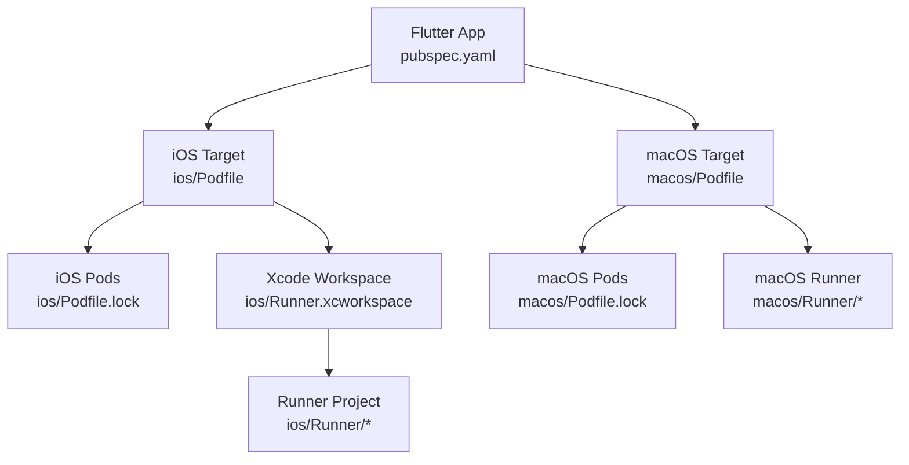
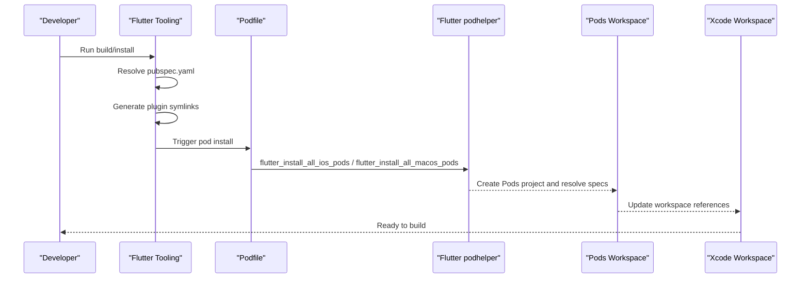
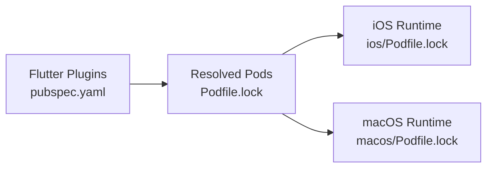

# CocoaPods Dependency Management

<cite>
**Referenced Files in This Document**
- [ios/Podfile](file://ios/Podfile)
- [ios/Podfile.lock](file://ios/Podfile.lock)
- [macos/Podfile](file://macos/Podfile)
- [macos/Podfile.lock](file://macos/Podfile.lock)
- [pubspec.yaml](file://pubspec.yaml)
- [ios/Runner.xcworkspace/contents.xcworkspacedata](file://ios/Runner.xcworkspace/contents.xcworkspacedata)
- [ios/Runner/Info.plist](file://ios/Runner/Info.plist)
- [macos/Runner/Info.plist](file://macos/Runner/Info.plist)
</cite>

## Table of Contents
1. Introduction
2. Project Structure
3. Core Components
4. Architecture Overview
5. Detailed Component Analysis
6. Dependency Analysis
7. Performance Considerations
8. Troubleshooting Guide
9. Conclusion
10. Appendices

## Introduction
This document explains how CocoaPods dependency management works in the Leadership Edge Live LMS for iOS and macOS. It covers Podfile configuration, platform constraints, how Flutter plugins are resolved into native pods, post-install hooks, and the relationship between Podfiles and the Xcode workspace. It also provides guidance on adding new dependencies, managing version conflicts, optimizing build times, integrating third-party libraries, creating private pods, and troubleshooting common issues. Security scanning recommendations are included to help keep dependencies safe and auditable.

## Project Structure
The project uses Flutter with separate iOS and macOS targets. Each target has its own Podfile and Podfile.lock that declare and pin native dependencies. The Flutter layer declares Dart packages in pubspec.yaml; when a plugin requires native code, Flutter generates symlinks and instructs CocoaPods to include the corresponding platform-specific pod sources.

**Diagram sources**
- [pubspec.yaml:1-171](file://pubspec.yaml#L1-L171)
- [ios/Podfile:1-44](file://ios/Podfile#L1-L44)
- [macos/Podfile:1-43](file://macos/Podfile#L1-L43)
- [ios/Podfile.lock:1-76](file://ios/Podfile.lock#L1-L76)
- [macos/Podfile.lock:1-76](file://macos/Podfile.lock#L1-L76)
- [ios/Runner.xcworkspace/contents.xcworkspacedata:1-11](file://ios/Runner.xcworkspace/contents.xcworkspacedata#L1-L11)

**Section sources**
- [pubspec.yaml:1-171](file://pubspec.yaml#L1-L171)
- [ios/Podfile:1-44](file://ios/Podfile#L1-L44)
- [macos/Podfile:1-43](file://macos/Podfile#L1-L43)
- [ios/Runner.xcworkspace/contents.xcworkspacedata:1-11](file://ios/Runner.xcworkspace/contents.xcworkspacedata#L1-L11)

## Core Components
- Platform declarations: Both iOS and macOS Podfiles declare minimum supported OS versions.
- Flutter integration helpers: The Podfiles require Flutter’s podhelper and call functions to install all Flutter-managed pods for each platform.
- Post-install hook: Build settings are applied to all pods via Flutter-provided helper methods to ensure consistent compilation flags.
- Lock files: Podfile.lock pins exact versions and checksums for reproducible builds.
- Info.plist permissions: iOS and macOS Info.plist files declare required capabilities (e.g., photo library access).

Key responsibilities:
- ios/Podfile: Declares iOS platform, sets environment variables, configures the Runner target, installs Flutter plugins, and applies post-install build settings.
- macos/Podfile: Mirrors iOS behavior for macOS with appropriate helpers and platform version.
- Podfile.lock files: Record resolved versions and checksums for deterministic builds.
- Info.plist files: Define runtime permissions and app metadata used by the app and plugins.

**Section sources**
- [ios/Podfile:1-44](file://ios/Podfile#L1-L44)
- [macos/Podfile:1-43](file://macos/Podfile#L1-L43)
- [ios/Podfile.lock:1-76](file://ios/Podfile.lock#L1-L76)
- [macos/Podfile.lock:1-76](file://macos/Podfile.lock#L1-L76)
- [ios/Runner/Info.plist:1-78](file://ios/Runner/Info.plist#L1-L78)
- [macos/Runner/Info.plist:1-37](file://macos/Runner/Info.plist#L1-L37)

## Architecture Overview
CocoaPods integrates with Flutter through generated helpers. When you run flutter commands, Flutter resolves Dart dependencies and creates symlinks to plugin source directories. The Podfiles then use these helpers to include only the relevant platform-specific pods. The resulting Pods workspace is consumed by the Xcode workspace.

**Diagram sources**
- [pubspec.yaml:1-171](file://pubspec.yaml#L1-L171)
- [ios/Podfile:13-37](file://ios/Podfile#L13-L37)
- [macos/Podfile:12-36](file://macos/Podfile#L12-L36)
- [ios/Runner.xcworkspace/contents.xcworkspacedata:1-11](file://ios/Runner.xcworkspace/contents.xcworkspacedata#L1-L11)

## Detailed Component Analysis

### iOS Podfile Configuration
- Minimum iOS version is declared at the top of the file.
- Analytics are disabled to reduce network calls during builds.
- The Runner target is mapped to Debug/Profile/Release configurations.
- Flutter root is discovered from generated xcconfig and Flutter’s podhelper is required.
- All Flutter plugins are installed for the Runner target using the helper function.
- A test target inherits search paths for tests.
- Post-install applies additional iOS build settings to all pods.

Operational notes:
- use_frameworks! enables building pods as frameworks.
- The post_install block ensures consistent compiler and linker flags across pods.

**Section sources**
- [ios/Podfile:1-44](file://ios/Podfile#L1-L44)

### macOS Podfile Configuration
- Minimum macOS version is declared at the top.
- Analytics are disabled similarly to iOS.
- Runner target maps to Debug/Profile/Release configurations.
- Flutter root discovery and podhelper usage mirror iOS behavior.
- All Flutter plugins are installed for macOS using the macOS-specific helper.
- Test target inherits search paths.
- Post-install applies macOS-specific build settings to all pods.

**Section sources**
- [macos/Podfile:1-43](file://macos/Podfile#L1-L43)

### Lock Files and Version Pinning
- Podfile.lock records exact versions and checksums for every pod, ensuring reproducible builds across environments.
- DEPENDENCIES section shows which plugins are resolved from Flutter plugin symlinks.
- EXTERNAL SOURCES indicates where each pod’s source is located relative to the project.
- SPEC CHECKSUMS provide integrity verification for each pod spec.

Implications:
- Commit lock files to version control to maintain consistency.
- Use “pod update” cautiously; it may change versions and checksums.

**Section sources**
- [ios/Podfile.lock:1-76](file://ios/Podfile.lock#L1-L76)
- [macos/Podfile.lock:1-76](file://macos/Podfile.lock#L1-L76)

### Relationship Between Podfile and Project.pbxproj
- The Xcode workspace includes both the main project and the generated Pods project.
- CocoaPods updates the workspace and project references during installation.
- While project.pbxproj is not present in this snapshot, the workspace file demonstrates the expected linkage to Pods/Pods.xcodeproj.

Best practices:
- Do not manually edit project.pbxproj; let CocoaPods manage it.
- Re-run pod install after changing Podfile or pubspec.yaml.

**Section sources**
- [ios/Runner.xcworkspace/contents.xcworkspacedata:1-11](file://ios/Runner.xcworkspace/contents.xcworkspacedata#L1-L11)

### Post-Install Hooks and Custom Configurations
- The post_install blocks apply Flutter-provided build settings to all pods, standardizing compiler flags and ensuring compatibility with Flutter’s toolchain.
- You can extend post_install to add custom build phases, modify header search paths, or inject build settings for specific pods.

Caution:
- Avoid overriding critical settings unless necessary.
- Keep changes minimal and well-documented.

**Section sources**
- [ios/Podfile:39-43](file://ios/Podfile#L39-L43)
- [macos/Podfile:38-42](file://macos/Podfile#L38-L42)

### Platform-Specific Dependencies and Permissions
- iOS Info.plist includes privacy descriptions and ATS settings relevant to media loading and photo library access.
- macOS Info.plist includes similar privacy descriptions and system version settings.

Guidance:
- Ensure any plugin requiring camera, photos, or network access has corresponding entries.
- Validate that Info.plist keys match plugin requirements.

**Section sources**
- [ios/Runner/Info.plist:1-78](file://ios/Runner/Info.plist#L1-L78)
- [macos/Runner/Info.plist:1-37](file://macos/Runner/Info.plist#L1-L37)

### Adding New Dependencies
Steps:
1. Add the Dart package to pubspec.yaml under dependencies or dev_dependencies.
2. Run flutter pub get to fetch the package and generate plugin symlinks.
3. Run pod install (or rely on Flutter’s build process) to integrate the native components.
4. Verify the Podfile.lock reflects the new dependency and checksums.
5. If the plugin requires platform permissions, update Info.plist accordingly.

Notes:
- Some plugins have no native component and will not appear in Podfile.lock.
- For third-party Objective-C/Swift libraries, add them directly to the Podfile if they are not Flutter plugins.

**Section sources**
- [pubspec.yaml:1-171](file://pubspec.yaml#L1-L171)
- [ios/Podfile:26-37](file://ios/Podfile#L26-L37)
- [macos/Podfile:25-36](file://macos/Podfile#L25-L36)

### Managing Version Conflicts
Common scenarios:
- Multiple plugins depend on different versions of the same pod.
- A direct pod addition conflicts with a transitive dependency.

Resolution strategies:
- Prefer updating Flutter plugins to compatible versions first.
- Use “pod outdated” to identify newer versions.
- If needed, specify a version constraint in the Podfile for the conflicting pod.
- Re-run pod install and verify checksums in Podfile.lock.

Prevention:
- Keep Flutter SDK and plugins updated regularly.
- Review changelogs before upgrading major versions.

**Section sources**
- [ios/Podfile.lock:1-76](file://ios/Podfile.lock#L1-L76)
- [macos/Podfile.lock:1-76](file://macos/Podfile.lock#L1-L76)

### Integrating Third-Party Libraries
If a library is not a Flutter plugin:
- Add it to the appropriate Podfile (iOS or macOS) with a version constraint.
- Ensure the library supports the declared minimum platform version.
- Re-run pod install to integrate.
- Confirm the workspace includes the new pod target.

Example pattern:
- Add a pod entry with a semantic version range.
- Optionally group related pods in a dedicated target if needed.

**Section sources**
- [ios/Podfile:1-44](file://ios/Podfile#L1-L44)
- [macos/Podfile:1-43](file://macos/Podfile#L1-L43)

### Creating Private Pods
To create and use a private pod:
- Host the podspec in a private repository.
- Configure a private pod repo in your environment or CI.
- Reference the private pod in the Podfile with the correct repo name and version.
- Run pod install to fetch and integrate.

Security considerations:
- Use authenticated access to private repos.
- Pin versions and checksums in Podfile.lock.

**Section sources**
- [ios/Podfile:1-44](file://ios/Podfile#L1-L44)
- [macos/Podfile:1-43](file://macos/Podfile#L1-L43)

### Dependency Security Scanning
Recommendations:
- Integrate a security scanner (e.g., Dependabot, Snyk, GitHub Advisory Database) to monitor known vulnerabilities in CocoaPods.
- Regularly review advisories and update affected pods promptly.
- Enforce pinned versions via Podfile.lock in CI to prevent drift.
- Audit third-party licenses and compliance requirements.

**Section sources**
- [ios/Podfile.lock:61-75](file://ios/Podfile.lock#L61-L75)
- [macos/Podfile.lock:61-75](file://macos/Podfile.lock#L61-L75)

## Dependency Analysis
The current dependency graph centers around Flutter plugins that map to native pods. The lock files show which plugins are active and their resolved versions.

Observations:
- Plugins like connectivity_plus, package_info_plus, path_provider_foundation, pdfrx, shared_preferences_foundation, sqflite_darwin, url_launcher, video_player_avfoundation, and wakelock_plus are present in both platforms’ lock files.
- Platform-specific variants exist (e.g., url_launcher_ios vs url_launcher_macos).

**Diagram sources**
- [pubspec.yaml:1-171](file://pubspec.yaml#L1-L171)
- [ios/Podfile.lock:1-76](file://ios/Podfile.lock#L1-L76)
- [macos/Podfile.lock:1-76](file://macos/Podfile.lock#L1-L76)

**Section sources**
- [ios/Podfile.lock:1-76](file://ios/Podfile.lock#L1-L76)
- [macos/Podfile.lock:1-76](file://macos/Podfile.lock#L1-L76)

## Performance Considerations
Optimization techniques:
- Disable analytics: Already enabled via environment variable to avoid synchronous network calls during builds.
- Use frameworks: use_frameworks! is set, which can improve build performance and compatibility.
- Minimize unnecessary pods: Only include plugins and libraries that are actively used.
- Leverage caching: Ensure CI caches CocoaPods artifacts and derived data.
- Parallelize builds: Use modern Xcode build settings to enable parallel compilation where possible.
- Reduce rebuilds: Keep Podfile.lock stable; avoid frequent major upgrades without necessity.

Build-time tips:
- Run “flutter clean” and “pod deintegrate” only when necessary.
- Prefer incremental updates to avoid full re-resolutions.

[No sources needed since this section provides general guidance]

## Troubleshooting Guide
Common issues and resolutions:
- Missing Generated.xcconfig: Ensure flutter pub get has been run before pod install.
- FLUTTER_ROOT not found: Delete generated xcconfig and re-run flutter pub get.
- Version conflicts: Check Podfile.lock for unexpected changes; revert or adjust constraints as needed.
- Permission errors: Verify Info.plist contains required privacy descriptions for plugins accessing sensitive resources.
- Workspace mismatches: Re-run pod install to regenerate workspace references.

Diagnostic steps:
- Inspect Podfile.lock for exact versions and checksums.
- Compare recent changes in Podfile and pubspec.yaml.
- Validate Info.plist keys against plugin documentation.

**Section sources**
- [ios/Podfile:13-24](file://ios/Podfile#L13-L24)
- [macos/Podfile:12-23](file://macos/Podfile#L12-L23)
- [ios/Podfile.lock:1-76](file://ios/Podfile.lock#L1-L76)
- [macos/Podfile.lock:1-76](file://macos/Podfile.lock#L1-L76)
- [ios/Runner/Info.plist:1-78](file://ios/Runner/Info.plist#L1-L78)
- [macos/Runner/Info.plist:1-37](file://macos/Runner/Info.plist#L1-L37)

## Conclusion
The Leadership Edge Live LMS uses Flutter’s integrated CocoaPods workflow to manage native dependencies for iOS and macOS. Podfiles configure platform targets, invoke Flutter helpers to install plugins, and apply consistent build settings via post-install hooks. Lock files ensure reproducible builds, while Info.plist files define required permissions. By following best practices for adding dependencies, resolving conflicts, optimizing builds, and scanning for security issues, teams can maintain a reliable and secure dependency pipeline.

[No sources needed since this section summarizes without analyzing specific files]

## Appendices

### Quick Reference: Workflow Checklist
- Update pubspec.yaml and run flutter pub get.
- Run pod install to sync native dependencies.
- Verify Podfile.lock changes and checksums.
- Update Info.plist if new permissions are required.
- Build and test on both iOS and macOS targets.

[No sources needed since this section provides general guidance]