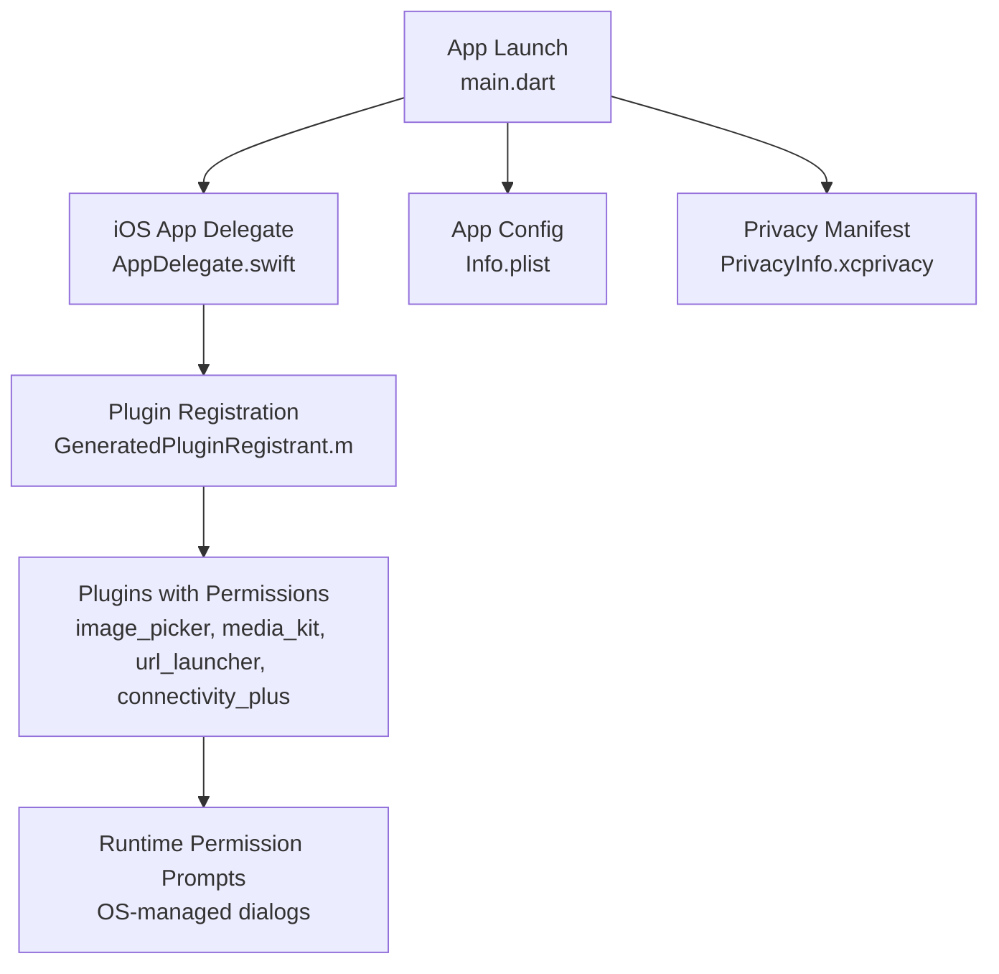
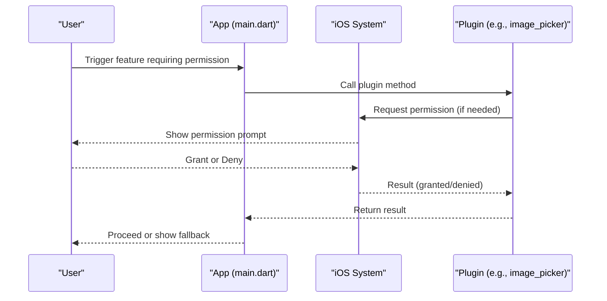
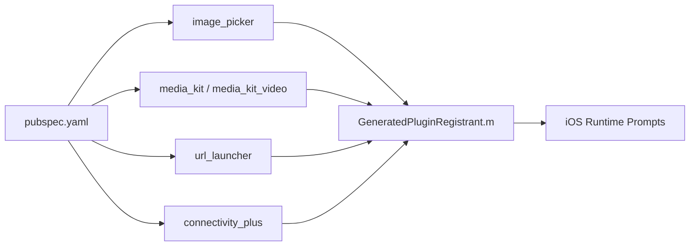

# Permissions & Privacy Configuration

<cite>
**Referenced Files in This Document**
- [Info.plist](file://ios/Runner/Info.plist)
- [PrivacyInfo.xcprivacy](file://ios/Runner/PrivacyInfo.xcprivacy)
- [AppDelegate.swift](file://ios/Runner/AppDelegate.swift)
- [GeneratedPluginRegistrant.m](file://ios/Runner/GeneratedPluginRegistrant.m)
- [Podfile.lock](file://ios/Podfile.lock)
- [pubspec.yaml](file://pubspec.yaml)
- [main.dart](file://lib/main.dart)
</cite>

## Table of Contents
1. [Introduction](#introduction)
2. [Project Structure](#project-structure)
3. [Core Components](#core-components)
4. [Architecture Overview](#architecture-overview)
5. [Detailed Component Analysis](#detailed-component-analysis)
6. [Dependency Analysis](#dependency-analysis)
7. [Performance Considerations](#performance-considerations)
8. [Troubleshooting Guide](#troubleshooting-guide)
9. [Conclusion](#conclusion)
10. [Appendices](#appendices)

## Introduction
This document explains how the Leadership Edge Live LMS app configures iOS permissions and privacy, focusing on Info.plist keys, privacy manifest declarations, plugin-driven capabilities (camera, microphone, photo library), network access, and runtime permission handling. It also provides guidance for App Store review requirements, user consent flows, fallback behaviors, and privacy-first design patterns.

## Project Structure
The iOS configuration relevant to permissions and privacy is primarily located under ios/Runner:
- Info.plist declares app-level settings and usage descriptions for sensitive data access.
- PrivacyInfo.xcprivacy documents APIs accessed by the app and whether tracking is used.
- AppDelegate.swift initializes the Flutter engine and registers plugins.
- GeneratedPluginRegistrant.m wires third-party plugins that may require permissions at runtime.
- Podfile.lock lists integrated plugins that influence required permissions.
- pubspec.yaml declares Dart dependencies that map to platform plugins.

**Diagram sources**
- [main.dart:16-38](file://lib/main.dart#L16-L38)
- [AppDelegate.swift:6-15](file://ios/Runner/AppDelegate.swift#L6-L15)
- [GeneratedPluginRegistrant.m:77-89](file://ios/Runner/GeneratedPluginRegistrant.m#L77-L89)
- [Info.plist:29-35](file://ios/Runner/Info.plist#L29-L35)
- [PrivacyInfo.xcprivacy:4-45](file://ios/Runner/PrivacyInfo.xcprivacy#L4-L45)

**Section sources**
- [Info.plist:29-35](file://ios/Runner/Info.plist#L29-L35)
- [PrivacyInfo.xcprivacy:4-45](file://ios/Runner/PrivacyInfo.xcprivacy#L4-L45)
- [AppDelegate.swift:6-15](file://ios/Runner/AppDelegate.swift#L6-L15)
- [GeneratedPluginRegistrant.m:77-89](file://ios/Runner/GeneratedPluginRegistrant.m#L77-L89)
- [Podfile.lock:1-42](file://ios/Podfile.lock#L1-L42)
- [pubspec.yaml:62-99](file://pubspec.yaml#L62-L99)
- [main.dart:16-38](file://lib/main.dart#L16-L38)

## Core Components
- Info.plist
  - Declares app metadata and security settings.
  - Includes NSAppTransportSecurity allowing arbitrary loads for media content.
  - Provides a usage description for photo library access via NSPhotoLibraryUsageDescription.
- PrivacyInfo.xcprivacy
  - States that the app does not perform tracking.
  - Lists accessed API categories and reasons required by Apple’s privacy manifest policy.
- Plugins and Dependencies
  - image_picker: triggers photo library access prompts when selecting images.
  - media_kit / media_kit_video: media playback; may interact with system media frameworks.
  - url_launcher: opens external URLs or apps.
  - connectivity_plus: checks network reachability.
- App Entry Point
  - main.dart initializes core services and UI; no explicit permission requests here.

**Section sources**
- [Info.plist:29-35](file://ios/Runner/Info.plist#L29-L35)
- [PrivacyInfo.xcprivacy:4-45](file://ios/Runner/PrivacyInfo.xcprivacy#L4-L45)
- [GeneratedPluginRegistrant.m:77-89](file://ios/Runner/GeneratedPluginRegistrant.m#L77-L89)
- [Podfile.lock:1-42](file://ios/Podfile.lock#L1-L42)
- [pubspec.yaml:62-99](file://pubspec.yaml#L62-L99)
- [main.dart:16-38](file://lib/main.dart#L16-L38)

## Architecture Overview
Permission flow overview:
- The app starts in main.dart and delegates to the iOS app delegate.
- Plugins are registered; features like image picking or media playback rely on OS permission prompts.
- Info.plist contains usage descriptions that appear in system prompts.
- Privacy manifest informs Apple about accessed APIs and confirms no tracking.

[No sources needed since this diagram shows conceptual workflow, not actual code structure]

## Detailed Component Analysis

### Info.plist Settings
- Network Access
  - NSAppTransportSecurity includes NSAllowsArbitraryLoadsForMedia to allow media loading without strict ATS restrictions.
- Photo Library
  - NSPhotoLibraryUsageDescription provides the rationale shown to users when requesting photo library access.
- Other Keys
  - Standard app metadata and scene configuration are present but do not directly affect permissions.

Recommendations
- Add usage descriptions for camera and microphone if those features are enabled later (NSCameraUsageDescription, NSMicrophoneUsageDescription).
- If location services are used, add NSLocationWhenInUseUsageDescription or NSLocationAlwaysUsageDescription as appropriate.

**Section sources**
- [Info.plist:29-35](file://ios/Runner/Info.plist#L29-L35)

### Privacy Manifest (PrivacyInfo.xcprivacy)
- Tracking
  - NSPrivacyTracking is set to false, indicating the app does not track users across apps or websites.
- Accessed APIs
  - Declares specific API categories (file timestamps, disk space, system boot time, user defaults) with reasons codes required by Apple.
- Collected Data Types
  - Empty array indicates no declared collected data types in this manifest.

Best Practices
- Keep NSPrivacyTrackingDomains empty unless you explicitly need to track through domains.
- Review and update NSPrivacyAccessedAPITypes whenever new APIs are used.

**Section sources**
- [PrivacyInfo.xcprivacy:4-45](file://ios/Runner/PrivacyInfo.xcprivacy#L4-L45)

### Runtime Permission Handling and Consent Management
- Current State
  - No explicit permission request code is present in the app entry point.
  - Permissions are typically requested by plugins at the moment they are needed (e.g., image picker).
- Expected Behavior
  - When a feature requiring camera, microphone, or photo library is invoked, iOS will display a system permission dialog using the usage description from Info.plist.
  - If denied, the plugin returns a denial result; the app should handle gracefully.

Implementation Guidance
- Place permission requests close to the user action that requires them.
- Before invoking a permission-sensitive plugin, check current authorization status where possible and guide users to Settings if previously denied.
- Provide clear in-app explanations before prompting to improve consent quality.

**Section sources**
- [Info.plist:29-35](file://ios/Runner/Info.plist#L29-L35)
- [GeneratedPluginRegistrant.m:77-89](file://ios/Runner/GeneratedPluginRegistrant.m#L77-L89)

### App Store Review Requirements for Sensitive Permissions
- Camera and Microphone
  - Must include corresponding usage descriptions in Info.plist.
  - Demonstrate real use cases during review; avoid generic prompts.
- Photo Library
  - Already has a usage description; ensure it matches actual behavior (e.g., avatar upload).
- Location Services
  - If used, provide precise usage descriptions and justify necessity.
- Network Access
  - ATS exceptions should be justified; prefer secure connections and limit exceptions.

Review Tips
- Ensure prompts appear only when necessary and explain why the permission is needed.
- Avoid requesting permissions at app launch; defer until just-in-time.

**Section sources**
- [Info.plist:29-35](file://ios/Runner/Info.plist#L29-L35)

### Examples of Requesting Permissions Programmatically
- Image Picker (Photo Library)
  - Use the image_picker plugin to open the gallery; iOS will prompt based on NSPhotoLibraryUsageDescription.
- Camera
  - If enabling camera capture, add NSCameraUsageDescription and invoke camera via image_picker or a dedicated plugin.
- Microphone
  - For audio recording or live sessions, add NSMicrophoneUsageDescription and use an audio plugin that handles prompts.
- Location Services
  - Add NSLocationWhenInUseUsageDescription or NSLocationAlwaysUsageDescription and call location APIs only when needed.

Note: These examples describe standard practices; implement calls within your feature modules rather than at app startup.

**Section sources**
- [pubspec.yaml:62-99](file://pubspec.yaml#L62-L99)
- [GeneratedPluginRegistrant.m:77-89](file://ios/Runner/GeneratedPluginRegistrant.m#L77-L89)

### Handling Permission Denials and Fallback Behaviors
- Detect Denial
  - Handle plugin results indicating denied or restricted status.
- Fallbacks
  - Disable the related feature in the UI.
  - Offer instructions to enable permissions in Settings.
  - Provide alternative workflows that do not require the permission.
- User Experience
  - Explain why the permission is important and what functionality is affected.

**Section sources**
- [Info.plist:29-35](file://ios/Runner/Info.plist#L29-L35)

### Privacy-First Design Patterns
- Just-in-Time Requests
  - Ask for permissions immediately before the feature is used.
- Minimal Data Collection
  - Only collect data necessary for the feature.
- Transparent Explanations
  - Show concise, contextual messages before prompts.
- Respect User Choices
  - Honor denials and persist user preferences.
- Secure Defaults
  - Prefer HTTPS and minimize ATS exceptions.

[No sources needed since this section provides general guidance]

## Dependency Analysis
Plugins and their likely permission implications:
- image_picker: photo library access; may trigger camera/microphone depending on usage.
- media_kit / media_kit_video: media playback; interacts with system media frameworks.
- url_launcher: opens external links/apps; no special permission but subject to URL schemes.
- connectivity_plus: network reachability checks; no user-facing permission.

**Diagram sources**
- [pubspec.yaml:62-99](file://pubspec.yaml#L62-L99)
- [GeneratedPluginRegistrant.m:77-89](file://ios/Runner/GeneratedPluginRegistrant.m#L77-L89)

**Section sources**
- [Podfile.lock:1-42](file://ios/Podfile.lock#L1-L42)
- [pubspec.yaml:62-99](file://pubspec.yaml#L62-L99)
- [GeneratedPluginRegistrant.m:77-89](file://ios/Runner/GeneratedPluginRegistrant.m#L77-L89)

## Performance Considerations
- Defer Permission Requests
  - Avoid blocking app startup; request permissions only when needed.
- Minimize Prompt Fatigue
  - Consolidate related actions to reduce repeated prompts.
- Efficient Media Handling
  - Use media_kit for cross-platform decoding; manage resources carefully to avoid memory pressure.
- Network Checks
  - Use connectivity_plus judiciously; cache results where appropriate to reduce overhead.

[No sources needed since this section provides general guidance]

## Troubleshooting Guide
Common Issues and Resolutions
- Missing Usage Description
  - Symptom: App crashes or store rejection due to missing NS*UsageDescription.
  - Resolution: Add the required key to Info.plist with a clear message.
- Permission Denied Flow
  - Symptom: Feature fails silently after user denies permission.
  - Resolution: Check plugin result, inform the user, and offer a path to Settings.
- ATS Restrictions
  - Symptom: Media or network requests fail due to ATS.
  - Resolution: Configure NSAppTransportSecurity appropriately; prefer secure endpoints and limit exceptions.
- Privacy Manifest Warnings
  - Symptom: Build warnings about undeclared API usage.
  - Resolution: Update PrivacyInfo.xcprivacy to reflect accessed APIs and reasons.

**Section sources**
- [Info.plist:29-35](file://ios/Runner/Info.plist#L29-L35)
- [PrivacyInfo.xcprivacy:4-45](file://ios/Runner/PrivacyInfo.xcprivacy#L4-L45)

## Conclusion
The Leadership Edge Live LMS currently configures photo library access and media-related network allowances, with a privacy manifest declaring accessed APIs and no tracking. To support additional features like camera, microphone, and location services, add corresponding usage descriptions and implement just-in-time permission requests with robust denial handling. Follow privacy-first principles and App Store guidelines to ensure a smooth review process and a respectful user experience.

[No sources needed since this section summarizes without analyzing specific files]

## Appendices

### Quick Reference: Required Info.plist Keys by Feature
- Photo Library: NSPhotoLibraryUsageDescription (already present)
- Camera: NSCameraUsageDescription (add if using camera)
- Microphone: NSMicrophoneUsageDescription (add if using audio capture)
- Location (When In Use): NSLocationWhenInUseUsageDescription (add if using location)
- Location (Always): NSLocationAlwaysUsageDescription (add if background location is required)
- Network: NSAppTransportSecurity (already configured for media loads)

**Section sources**
- [Info.plist:29-35](file://ios/Runner/Info.plist#L29-L35)