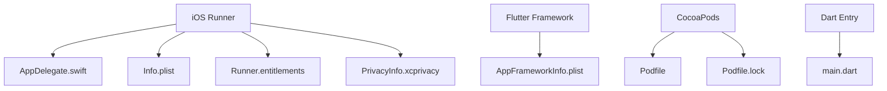
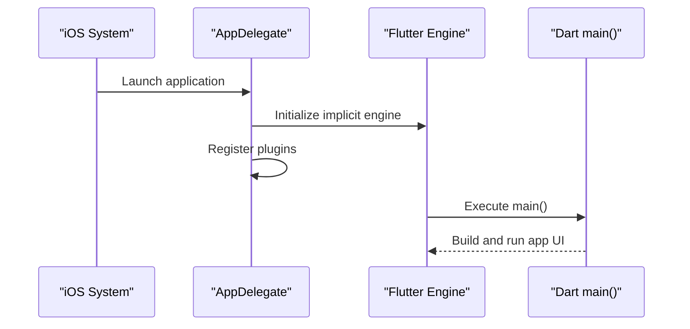
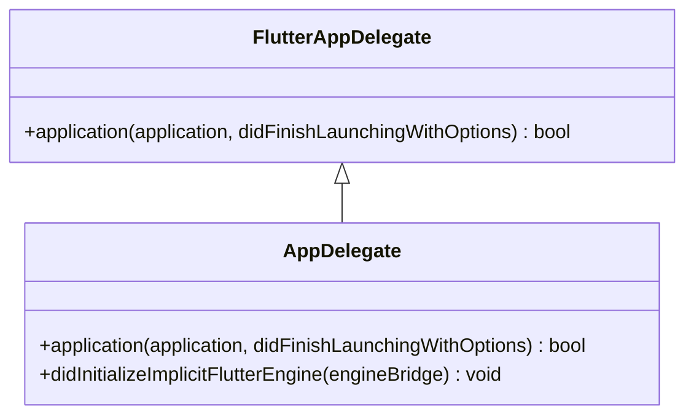
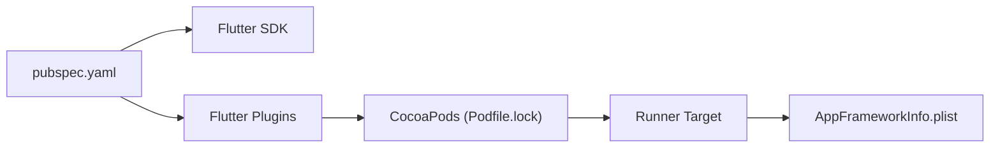

# iOS Integration

<cite>
**Referenced Files in This Document**
- [AppDelegate.swift](file://ios/Runner/AppDelegate.swift)
- [Info.plist](file://ios/Runner/Info.plist)
- [Podfile](file://ios/Podfile)
- [Podfile.lock](file://ios/Podfile.lock)
- [PrivacyInfo.xcprivacy](file://ios/Runner/PrivacyInfo.xcprivacy)
- [Runner.entitlements](file://ios/Runner/Runner.entitlements)
- [AppFrameworkInfo.plist](file://ios/Flutter/AppFrameworkInfo.plist)
- [main.dart](file://lib/main.dart)
- [pubspec.yaml](file://pubspec.yaml)
</cite>

## Table of Contents
1. [Introduction](#introduction)
2. [Project Structure](#project-structure)
3. [Core Components](#core-components)
4. [Architecture Overview](#architecture-overview)
5. [Detailed Component Analysis](#detailed-component-analysis)
6. [Dependency Analysis](#dependency-analysis)
7. [Performance Considerations](#performance-considerations)
8. [Troubleshooting Guide](#troubleshooting-guide)
9. [Conclusion](#conclusion)
10. [Appendices](#appendices)

## Introduction
This document explains the iOS platform integration for Leadership Edge Live LMS. It covers AppDelegate configuration, Info.plist settings (including privacy permissions and URL schemes), CocoaPods dependency management, and iOS-specific features such as push notifications, background tasks, keychain storage, and deep linking. It also outlines code signing with provisioning profiles, App Store submission requirements, iOS-specific optimizations, integrating Swift/Objective-C native code, handling iOS version compatibility, and debugging iOS-specific problems.

## Project Structure
The iOS project follows standard Flutter conventions:
- Runner target contains the app entry point, Info.plist, entitlements, and assets.
- Flutter framework bundle is configured via generated xcconfig files and AppFrameworkInfo.plist.
- CocoaPods manages native dependencies through Podfile and Podfile.lock.
- The Dart main initializes core services before launching the Flutter UI.

**Diagram sources**
- [AppDelegate.swift:1-17](file://ios/Runner/AppDelegate.swift#L1-L17)
- [Info.plist:1-78](file://ios/Runner/Info.plist#L1-L78)
- [Runner.entitlements:1-7](file://ios/Runner/Runner.entitlements#L1-L7)
- [PrivacyInfo.xcprivacy:1-48](file://ios/Runner/PrivacyInfo.xcprivacy#L1-L48)
- [AppFrameworkInfo.plist:1-25](file://ios/Flutter/AppFrameworkInfo.plist#L1-L25)
- [Podfile:1-44](file://ios/Podfile#L1-L44)
- [Podfile.lock:1-200](file://ios/Podfile.lock#L1-L200)
- [main.dart:16-38](file://lib/main.dart#L16-L38)

**Section sources**
- [AppDelegate.swift:1-17](file://ios/Runner/AppDelegate.swift#L1-L17)
- [Info.plist:1-78](file://ios/Runner/Info.plist#L1-L78)
- [Podfile:1-44](file://ios/Podfile#L1-L44)
- [PrivacyInfo.xcprivacy:1-48](file://ios/Runner/PrivacyInfo.xcprivacy#L1-L48)
- [AppFrameworkInfo.plist:1-25](file://ios/Flutter/AppFrameworkInfo.plist#L1-L25)
- [main.dart:16-38](file://lib/main.dart#L16-L38)

## Core Components
- AppDelegate: Initializes the implicit Flutter engine and registers plugins.
- Info.plist: Declares app identity, supported orientations, launch storyboard, ATS media loading, and photo library usage description.
- PrivacyInfo.xcprivacy: Declares accessed APIs and data collection posture required by modern App Store guidelines.
- Entitlements: Placeholder for future capabilities (e.g., push notifications).
- CocoaPods: Minimum iOS platform, plugin installation, and post-install build settings.
- Dart main: Initializes media, localization, and app module before rendering UI.

**Section sources**
- [AppDelegate.swift:1-17](file://ios/Runner/AppDelegate.swift#L1-L17)
- [Info.plist:1-78](file://ios/Runner/Info.plist#L1-L78)
- [PrivacyInfo.xcprivacy:1-48](file://ios/Runner/PrivacyInfo.xcprivacy#L1-L48)
- [Runner.entitlements:1-7](file://ios/Runner/Runner.entitlements#L1-L7)
- [Podfile:1-44](file://ios/Podfile#L1-L44)
- [main.dart:16-38](file://lib/main.dart#L16-L38)

## Architecture Overview
At runtime on iOS:
- The system launches the app via AppDelegate.
- AppDelegate defers to Flutter’s default lifecycle and registers plugins for the implicit engine.
- Flutter loads its framework bundle and executes Dart main to initialize services and render the UI.
- Native capabilities are provided by plugins managed via CocoaPods and declared in Info.plist/entitlements.

**Diagram sources**
- [AppDelegate.swift:1-17](file://ios/Runner/AppDelegate.swift#L1-L17)
- [main.dart:16-38](file://lib/main.dart#L16-L38)

## Detailed Component Analysis

### AppDelegate Configuration
- Implements FlutterAppDelegate and an implicit engine delegate to ensure plugins are registered when the implicit engine starts.
- Overrides application:didFinishLaunchingWithOptions to call super, preserving Flutter lifecycle behavior.

**Diagram sources**
- [AppDelegate.swift:1-17](file://ios/Runner/AppDelegate.swift#L1-L17)

**Section sources**
- [AppDelegate.swift:1-17](file://ios/Runner/AppDelegate.swift#L1-L17)

### Info.plist Settings
Key configurations present in Info.plist:
- App identity and display name.
- Minimum frame duration disabled on phone.
- ATS allows arbitrary loads for media.
- Photo library usage description for avatar upload.
- Scene manifest pointing to Main storyboard and Flutter scene delegate.
- Supported interface orientations for iPhone and iPad.
- Launch storyboard references.

Notes:
- No custom URL scheme is currently defined; add a URL type if deep linking is required.
- For push notifications, add required keys and configure entitlements.

**Section sources**
- [Info.plist:1-78](file://ios/Runner/Info.plist#L1-L78)

### CocoaPods Dependency Management
- Minimum iOS platform set to 13.0.
- Uses frameworks and installs all Flutter-managed iOS pods.
- Post-install hook applies additional Flutter build settings to targets.
- Podfile.lock pins exact versions for reproducible builds.

Recommendations:
- Keep Podfile.lock under version control.
- Run flutter pub get before pod install to regenerate Flutter-generated configs.

**Section sources**
- [Podfile:1-44](file://ios/Podfile#L1-L44)
- [Podfile.lock:1-200](file://ios/Podfile.lock#L1-L200)

### Privacy Declarations
- NSPrivacyTracking is disabled.
- NSPrivacyCollectedDataTypes is empty.
- NSPrivacyAccessedAPITypes declares file timestamps, disk space, system boot time, and user defaults access with reasons.

Guidance:
- Update NSPrivacyAccessedAPITypes whenever new APIs are used by your app or plugins.
- Ensure descriptions align with actual usage to pass App Store review.

**Section sources**
- [PrivacyInfo.xcprivacy:1-48](file://ios/Runner/PrivacyInfo.xcprivacy#L1-L48)

### Entitlements
- Current entitlements file is empty.
- Add capabilities as needed (e.g., push notifications, background modes, keychain sharing).

**Section sources**
- [Runner.entitlements:1-7](file://ios/Runner/Runner.entitlements#L1-L7)

### Dart Initialization on iOS
- Ensures Flutter binding and initializes MediaKit, localization, and cleans up temporary viewing files.
- Launches Modular-based app with theme and routing.

Implications:
- Any iOS-specific initialization should be performed here or via platform channels/plugins.
- MediaKit initialization ensures video playback works across platforms including iOS.

**Section sources**
- [main.dart:16-38](file://lib/main.dart#L16-L38)

## Dependency Analysis
- Flutter SDK and Dart packages define high-level functionality.
- iOS native dependencies are resolved via CocoaPods and pinned in Podfile.lock.
- AppFrameworkInfo.plist configures the Flutter framework bundle metadata.

**Diagram sources**
- [pubspec.yaml:1-171](file://pubspec.yaml#L1-L171)
- [Podfile:1-44](file://ios/Podfile#L1-L44)
- [Podfile.lock:1-200](file://ios/Podfile.lock#L1-L200)
- [AppFrameworkInfo.plist:1-25](file://ios/Flutter/AppFrameworkInfo.plist#L1-L25)

**Section sources**
- [pubspec.yaml:1-171](file://pubspec.yaml#L1-L171)
- [Podfile:1-44](file://ios/Podfile#L1-L44)
- [Podfile.lock:1-200](file://ios/Podfile.lock#L1-L200)
- [AppFrameworkInfo.plist:1-25](file://ios/Flutter/AppFrameworkInfo.plist#L1-L25)

## Performance Considerations
- Use Release builds for performance testing; Debug builds include extra logging and checks.
- Prefer efficient media handling; MediaKit is initialized at startup to avoid delays.
- Avoid heavy work in application:didFinishLaunchingWithOptions; defer to Flutter where possible.
- Minimize network calls during launch; cache essential data asynchronously.
- Keep third-party libraries updated to benefit from performance improvements.

[No sources needed since this section provides general guidance]

## Troubleshooting Guide
Common iOS issues and resolutions:
- Missing permission prompts: Verify Info.plist contains the correct usage descriptions for camera, photos, microphone, etc.
- ATS errors: Confirm NSAppTransportSecurity settings match server requirements; prefer HTTPS with valid certificates.
- Plugin not found: Ensure flutter pub get and pod install have been run; check Podfile.lock consistency.
- Push notifications not working: Add required entitlements and keys; verify APNs configuration and provisioning profile capabilities.
- Deep linking fails: Define URL schemes in Info.plist and handle incoming URLs in AppDelegate or via platform channel.
- Code signing errors: Validate provisioning profiles, team settings, and entitlements in Xcode workspace.

**Section sources**
- [Info.plist:1-78](file://ios/Runner/Info.plist#L1-L78)
- [Podfile:1-44](file://ios/Podfile#L1-L44)
- [Runner.entitlements:1-7](file://ios/Runner/Runner.entitlements#L1-L7)

## Conclusion
The iOS integration for Leadership Edge Live LMS is structured around a minimal AppDelegate, a well-configured Info.plist, and CocoaPods-managed dependencies. Privacy declarations are in place, and the Dart layer initializes core services before rendering the UI. To extend functionality, add appropriate Info.plist keys, entitlements, and CocoaPods dependencies while maintaining strict version pinning and code signing hygiene.

[No sources needed since this section summarizes without analyzing specific files]

## Appendices

### Adding Push Notifications on iOS
Steps:
- Enable Push Notifications capability in Xcode and add required entitlements.
- Configure APNs in Apple Developer portal and associate with your provisioning profile.
- Handle notification registration and delivery in AppDelegate or via a plugin.
- Update PrivacyInfo.xcprivacy if accessing new APIs related to notifications.

[No sources needed since this section provides general guidance]

### Implementing Deep Linking
Steps:
- Add URL types in Info.plist with a unique scheme.
- Handle incoming URLs in AppDelegate or route via Flutter platform channels.
- Test with universal links if supporting domain-associated deep links.

[No sources needed since this section provides general guidance]

### Integrating Swift/Objective-C Native Code
Steps:
- Place Swift files in the Runner target and import modules as needed.
- Use the bridging header for Objective-C interop if necessary.
- Expose functionality via platform channels from Dart to Swift/Objective-C.
- Rebuild and test thoroughly after changes.

[No sources needed since this section provides general guidance]

### Handling iOS Version Compatibility
- Set minimum deployment target in Podfile and ensure plugins support it.
- Guard feature usage with runtime checks for newer APIs.
- Test on multiple iOS versions using simulators and devices.

[No sources needed since this section provides general guidance]

### Keychain Storage Best Practices
- Use secure enclave-backed storage for sensitive tokens.
- Limit scope and lifetime of stored items.
- Provide fallbacks for migration and recovery scenarios.

[No sources needed since this section provides general guidance]

### Background Tasks
- Declare required background modes in entitlements if needed.
- Offload long-running tasks to background sessions or background fetch where applicable.
- Respect system constraints and provide user-visible progress.

[No sources needed since this section provides general guidance]

### App Store Submission Requirements
- Ensure all privacy declarations are accurate and complete.
- Validate that all permissions are justified and described.
- Test release builds end-to-end and capture logs for review.
- Submit with correct bundle identifiers and versioning.

[No sources needed since this section provides general guidance]