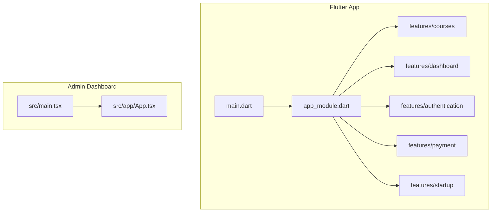
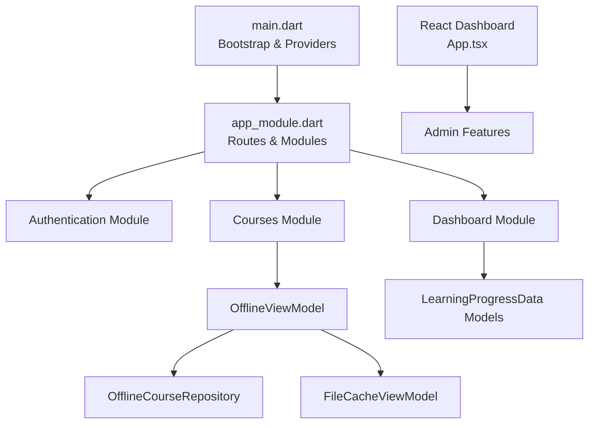
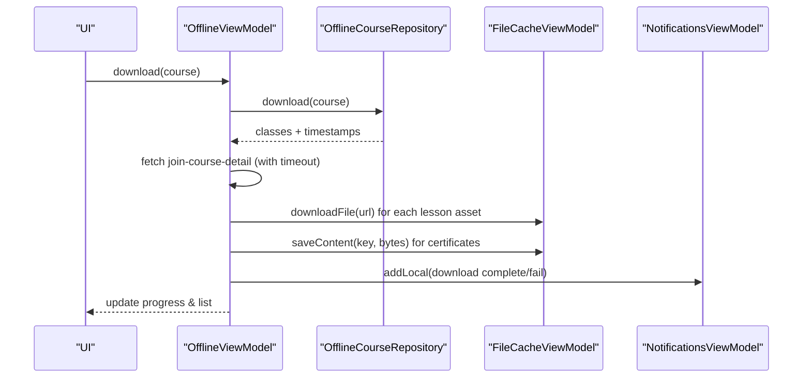
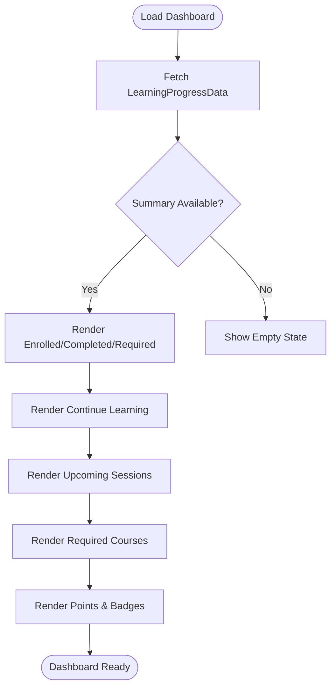
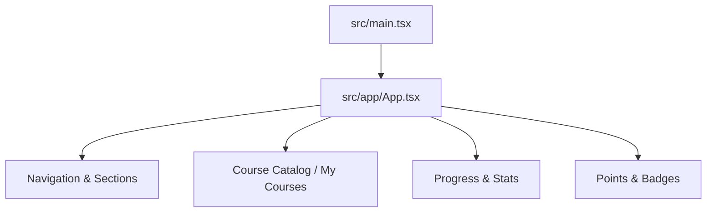
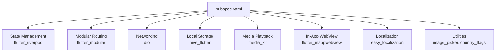

# Project Overview

<cite>
**Referenced Files in This Document**
- [README.md](file://README.md)
- [pubspec.yaml](file://pubspec.yaml)
- [main.dart](file://lib/main.dart)
- [app_module.dart](file://lib/app_module.dart)
- [offline_view_model.dart](file://lib/app/features/courses/viewmodel/offline_view_model.dart)
- [offline_course_repository.dart](file://lib/app/features/courses/repository/offline_course_repository.dart)
- [file_cache_view_model.dart](file://lib/app/features/courses/viewmodel/file_cache_view_model.dart)
- [learning_progress_model.dart](file://lib/app/features/dashboard/model/learning_progress_model.dart)
- [badges_page.dart](file://lib/app/features/dashboard/view/badges_page.dart)
- [item_inventory_page.dart](file://lib/app/features/dashboard/view/item_inventory_page.dart)
- [App.tsx](file://src/app/App.tsx)
- [main.tsx](file://src/main.tsx)
- [SUPPORT.md](file://SUPPORT.md)
</cite>

## Table of Contents
1. Introduction
2. Project Structure
3. Core Components
4. Architecture Overview
5. Detailed Component Analysis
6. Dependency Analysis
7. Performance Considerations
8. Troubleshooting Guide
9. Conclusion

## Introduction
Leadership Edge Live is a cross-platform Learning Management System (LMS) designed for educational institutions and learners who need reliable, engaging, and accessible learning experiences across mobile, desktop, and web. The application emphasizes:
- Multi-platform support via Flutter for native-like performance on iOS, Android, Windows, macOS, Linux, and Web
- Course management with rich media playback (video, PDFs), structured lessons, and progress tracking
- Offline learning capabilities to download courses and content for uninterrupted study
- Gamification features including points, badges, and rewards to motivate learners
- A modern admin dashboard built with React and TypeScript for course administration and insights

The project’s scope includes delivering a seamless learner experience, robust offline-first workflows, and scalable architecture suitable for institutional deployment. It targets organizations seeking an integrated platform that supports diverse content types, tracks progress, and encourages engagement through gamified elements.

**Section sources**
- [README.md:1-19](file://README.md#L1-L19)
- [pubspec.yaml:1-171](file://pubspec.yaml#L1-L171)
- [SUPPORT.md:1-29](file://SUPPORT.md#L1-L29)

## Project Structure
The repository is organized into two primary applications:
- Flutter application under lib/ for the cross-platform LMS client
- React/TypeScript admin dashboard under src/ for administrative interfaces

Key directories and responsibilities:
- lib/app_module.dart: Defines top-level routes and modules using Flutter Modular
- lib/main.dart: Application bootstrap, localization setup, provider scope, and modular routing integration
- lib/app/features: Feature-based modules (authentication, courses, dashboard, payment, startup)
- lib/app/core: Shared infrastructure (data state, providers, design tokens, utilities)
- src/app: Admin dashboard UI components and pages
- src/main.tsx: React entry point rendering the dashboard app

**Diagram sources**
- [main.dart:16-37](file://lib/main.dart#L16-L37)
- [app_module.dart:7-20](file://lib/app_module.dart#L7-L20)
- [App.tsx:132-767](file://src/app/App.tsx#L132-L767)
- [main.tsx:1-7](file://src/main.tsx#L1-L7)

**Section sources**
- [main.dart:16-37](file://lib/main.dart#L16-L37)
- [app_module.dart:7-20](file://lib/app_module.dart#L7-L20)
- [App.tsx:132-767](file://src/app/App.tsx#L132-L767)
- [main.tsx:1-7](file://src/main.tsx#L1-L7)

## Core Components
- Modular routing and dependency injection:
  - Flutter Modular organizes routes and modules for authentication and courses
  - ProviderScope from Riverpod manages global state and services
- Localization:
  - EasyLocalization configures supported locales and fallback language
- Media playback:
  - Media Kit ensures cross-platform video decoding and playback
- Offline learning:
  - OfflineViewModel orchestrates downloading and caching of course content
  - OfflineCourseRepository indexes and persists offline course metadata
  - FileCacheViewModel handles encrypted file storage and HLS manifest caching
- Dashboard and gamification:
  - LearningProgressData models summarize enrollment, progress, upcoming sessions, and required courses
  - Badges and points are surfaced in the dashboard with dedicated views

These components collectively enable a robust, feature-rich LMS that supports multi-platform delivery, offline access, and engaging learner experiences.

**Section sources**
- [main.dart:16-37](file://lib/main.dart#L16-L37)
- [app_module.dart:7-20](file://lib/app_module.dart#L7-L20)
- [offline_view_model.dart:28-175](file://lib/app/features/courses/viewmodel/offline_view_model.dart#L28-L175)
- [offline_course_repository.dart:34-192](file://lib/app/features/courses/repository/offline_course_repository.dart#L34-L192)
- [file_cache_view_model.dart:39-74](file://lib/app/features/courses/viewmodel/file_cache_view_model.dart#L39-L74)
- [learning_progress_model.dart:1-410](file://lib/app/features/dashboard/model/learning_progress_model.dart#L1-L410)
- [badges_page.dart:169-206](file://lib/app/features/dashboard/view/badges_page.dart#L169-L206)

## Architecture Overview
The system follows a modular architecture with clear separation between UI, state, data access, and domain logic:
- Entry point initializes core services and sets up localization, media, and providers
- Routing module wires top-level routes to feature modules
- Features encapsulate business logic, repositories, and viewmodels
- Data layer abstracts network calls and local storage
- Admin dashboard provides administrative capabilities separate from the Flutter client

**Diagram sources**
- [main.dart:16-37](file://lib/main.dart#L16-L37)
- [app_module.dart:7-20](file://lib/app_module.dart#L7-L20)
- [offline_view_model.dart:28-175](file://lib/app/features/courses/viewmodel/offline_view_model.dart#L28-L175)
- [offline_course_repository.dart:34-192](file://lib/app/features/courses/repository/offline_course_repository.dart#L34-L192)
- [file_cache_view_model.dart:39-74](file://lib/app/features/courses/viewmodel/file_cache_view_model.dart#L39-L74)
- [learning_progress_model.dart:1-410](file://lib/app/features/dashboard/model/learning_progress_model.dart#L1-L410)
- [App.tsx:132-767](file://src/app/App.tsx#L132-L767)

## Detailed Component Analysis

### Offline Learning Pipeline
The offline learning pipeline ensures learners can save courses and content for use without connectivity. It coordinates fetching metadata, downloading files, caching certificates, and updating notifications.

**Diagram sources**
- [offline_view_model.dart:61-175](file://lib/app/features/courses/viewmodel/offline_view_model.dart#L61-L175)
- [offline_course_repository.dart:34-192](file://lib/app/features/courses/repository/offline_course_repository.dart#L34-L192)
- [file_cache_view_model.dart:39-74](file://lib/app/features/courses/viewmodel/file_cache_view_model.dart#L39-L74)

**Section sources**
- [offline_view_model.dart:61-175](file://lib/app/features/courses/viewmodel/offline_view_model.dart#L61-L175)
- [offline_course_repository.dart:34-192](file://lib/app/features/courses/repository/offline_course_repository.dart#L34-L192)
- [file_cache_view_model.dart:39-74](file://lib/app/features/courses/viewmodel/file_cache_view_model.dart#L39-L74)

### Dashboard Progress and Gamification
The dashboard aggregates learner progress, upcoming sessions, required courses, and gamification elements like points and badges.

**Diagram sources**
- [learning_progress_model.dart:1-410](file://lib/app/features/dashboard/model/learning_progress_model.dart#L1-L410)
- [badges_page.dart:169-206](file://lib/app/features/dashboard/view/badges_page.dart#L169-L206)
- [item_inventory_page.dart:439-472](file://lib/app/features/dashboard/view/item_inventory_page.dart#L439-L472)

**Section sources**
- [learning_progress_model.dart:1-410](file://lib/app/features/dashboard/model/learning_progress_model.dart#L1-L410)
- [badges_page.dart:169-206](file://lib/app/features/dashboard/view/badges_page.dart#L169-L206)
- [item_inventory_page.dart:439-472](file://lib/app/features/dashboard/view/item_inventory_page.dart#L439-L472)

### Admin Dashboard (React/TypeScript)
The admin dashboard provides a web-based interface for managing courses, viewing progress, and interacting with learners. It uses React components and Tailwind CSS for styling.

**Diagram sources**
- [main.tsx:1-7](file://src/main.tsx#L1-L7)
- [App.tsx:132-767](file://src/app/App.tsx#L132-L767)

**Section sources**
- [main.tsx:1-7](file://src/main.tsx#L1-L7)
- [App.tsx:132-767](file://src/app/App.tsx#L132-L767)

## Dependency Analysis
The Flutter application declares dependencies for state management, networking, media playback, localization, and platform integrations. Key categories include:
- Core: flutter_riverpod, flutter_modular, dio, hive_flutter
- Design: cupertino_icons, google_fonts, hugeicons, lucide_icons
- Localization: easy_localization, internet_connection_checker_plus, flutter_styled_toast, table_calendar, form_validator
- WebView: flutter_inappwebview for in-app sessions
- Cache: flutter_cache_manager
- Content Viewer: media_kit, pdfrx, path_provider
- Utilities: image_picker, country_flags

**Diagram sources**
- [pubspec.yaml:30-121](file://pubspec.yaml#L30-L121)

**Section sources**
- [pubspec.yaml:30-121](file://pubspec.yaml#L30-L121)

## Performance Considerations
- Offline downloads should be bounded and resilient:
  - Use page limits and timeouts to prevent indefinite fetching
  - Prioritize essential assets and cache HLS manifests efficiently
- Media playback:
  - Prefer software decoding where platform support is limited (e.g., WebM/VP9 on iOS)
  - Reuse cached files to reduce bandwidth and improve load times
- State updates:
  - Minimize unnecessary rebuilds by leveraging Riverpod scopes and selective watchers
- Network efficiency:
  - Batch requests where possible and leverage caching strategies
- UI responsiveness:
  - Defer heavy operations off the main thread; provide progress indicators for long-running tasks

[No sources needed since this section provides general guidance]

## Troubleshooting Guide
Common issues and resolutions:
- Purchased courses not visible:
  - Restore purchases from settings; if unresolved, contact support
- Refund requests:
  - Handle via Apple’s Report a Problem page
- Beta vs live version:
  - Ensure you are using the production build from the App Store
- Offline download failures:
  - Check network connectivity and retry; verify permissions for file storage
  - Inspect notifications for detailed failure messages

Support channels:
- Email support with expected response time

**Section sources**
- [SUPPORT.md:7-24](file://SUPPORT.md#L7-L24)

## Conclusion
Leadership Edge Live delivers a comprehensive, cross-platform LMS tailored for educational institutions and learners. Its modular Flutter architecture, robust offline capabilities, and gamified dashboard create an engaging and reliable learning environment. The React/TypeScript admin dashboard complements the client with powerful administrative tools. Together, these components address the needs of modern e-learning markets, enabling scalable deployment, rich content consumption, and measurable learner outcomes.

[No sources needed since this section summarizes without analyzing specific files]