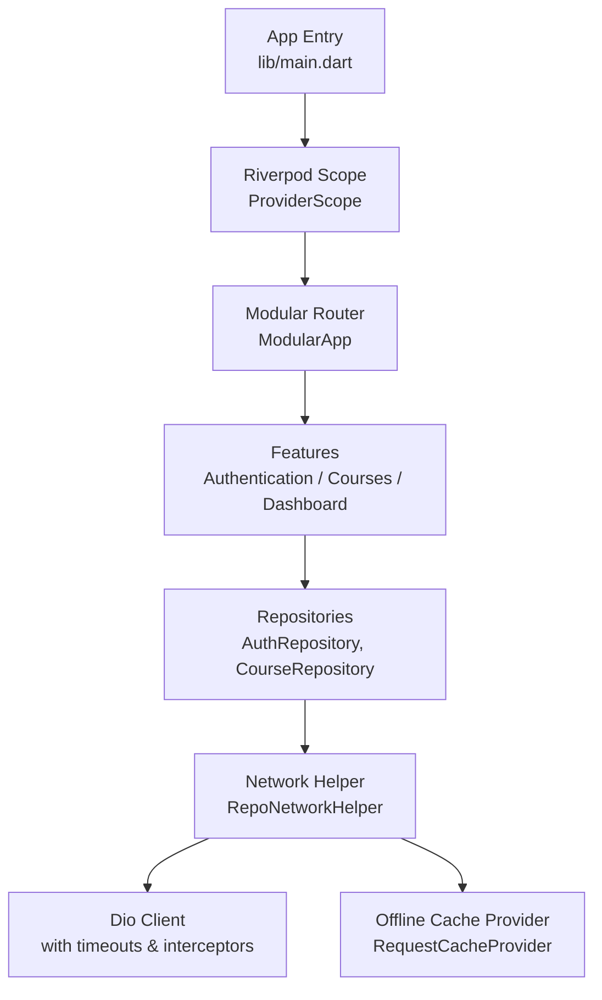
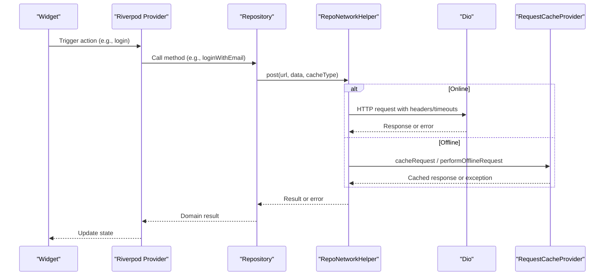
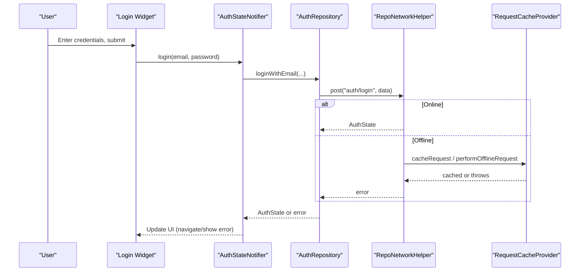
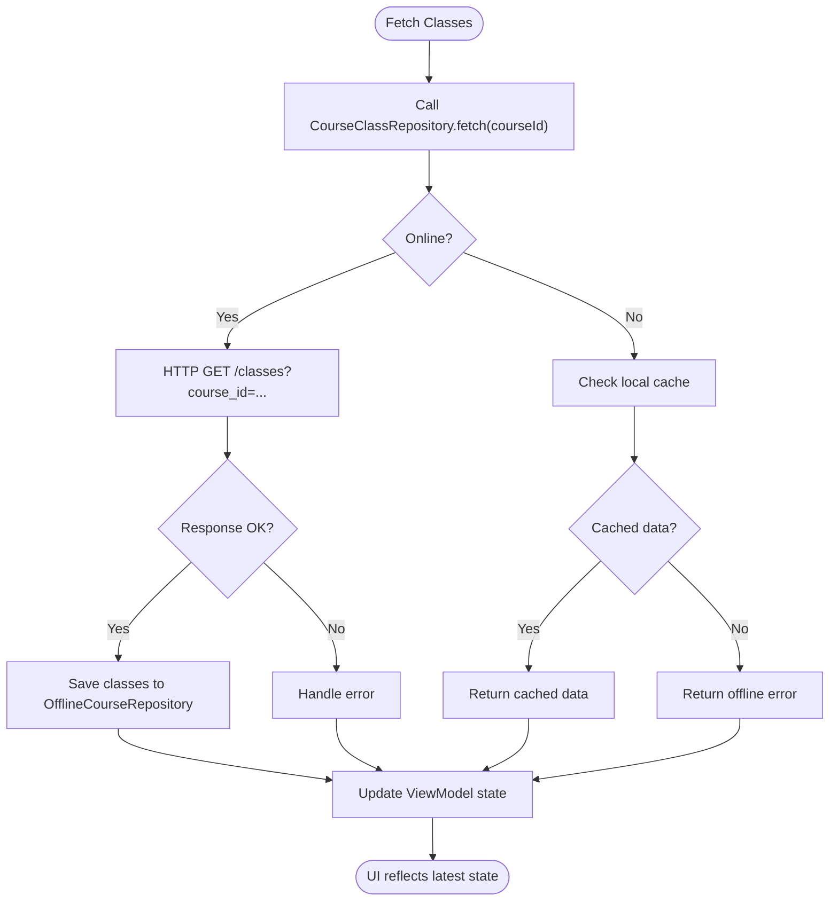
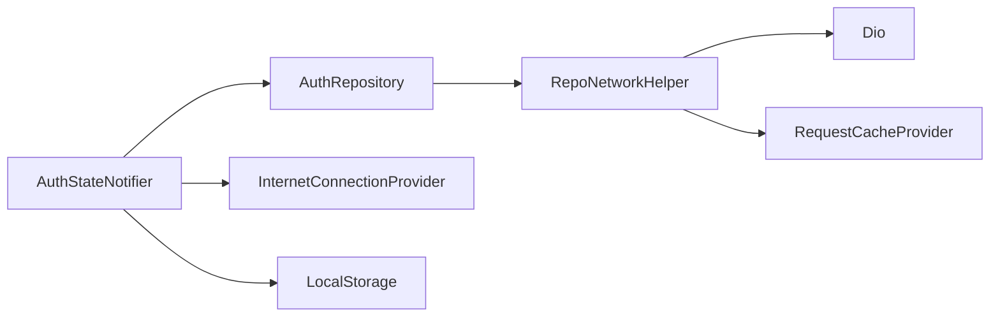

# Testing Strategy

<cite>
**Referenced Files in This Document**
- [pubspec.yaml](file://pubspec.yaml)
- [main.dart](file://lib/main.dart)
- [widget_test.dart](file://test/widget_test.dart)
- [purchase_record_test.dart](file://test/payment/purchase_record_test.dart)
- [auth_repository.dart](file://lib/app/features/authentication/repository/auth_repository.dart)
- [auth_state_provider.dart](file://lib/app/features/authentication/app_state/auth_state_provider.dart)
- [course_repository.dart](file://lib/app/features/courses/repository/course_repository.dart)
- [repo_network_helper.dart](file://lib/app/core/logic/repository/repo_network_helper.dart)
- [request_cache_provider.dart](file://lib/app/core/provider/request_cache_provider.dart)
- [offline_vm_helper.dart](file://lib/app/core/logic/vm_helper/offline_vm_helper.dart)
</cite>

## Table of Contents
1. Introduction
2. Project Structure
3. Core Components
4. Architecture Overview
5. Detailed Component Analysis
6. Dependency Analysis
7. Performance Considerations
8. Troubleshooting Guide
9. Conclusion

## Introduction
This document defines the testing strategy for Leadership Edge Live LMS using a testing pyramid: unit tests for business logic, widget tests for UI components, and integration-style tests for feature workflows. It explains best practices for Riverpod providers, repository mocking, asynchronous operations, test organization, naming conventions, assertion patterns, and CI setup guidance. Examples focus on authentication flows, course management features, and data layer components.

## Project Structure
The project uses a standard Flutter layout with tests under test/. The app initializes core services (localization, media, modular routing, Riverpod) at startup, which is important to consider when writing widget and integration tests that need a fully bootstrapped environment.

**Diagram sources**
- [main.dart:16-38](file://lib/main.dart#L16-L38)
- [repo_network_helper.dart:72-126](file://lib/app/core/logic/repository/repo_network_helper.dart#L72-L126)
- [request_cache_provider.dart:40-78](file://lib/app/core/provider/request_cache_provider.dart#L40-L78)

**Section sources**
- [main.dart:16-38](file://lib/main.dart#L16-L38)
- [pubspec.yaml:107-120](file://pubspec.yaml#L107-L120)

## Core Components
- Authentication flow: AuthRepository exposes login and auto-login; AuthStateNotifier manages session state, initialization, and offline reconnection behavior.
- Course features: CourseRepository and related view models fetch and cache course data; OfflineCourseRepository persists classes locally.
- Network layer: RepoNetworkHelper centralizes Dio configuration, timeouts, token refresh interception, offline detection, and request caching via RequestCacheProvider.

Testing implications:
- Unit tests should cover pure logic in repositories and models.
- Widget tests should verify UI behavior around providers and network states.
- Integration tests should validate end-to-end flows like login, course enrollment, and offline/online transitions.

**Section sources**
- [auth_repository.dart:7-39](file://lib/app/features/authentication/repository/auth_repository.dart#L7-L39)
- [auth_state_provider.dart:15-32](file://lib/app/features/authentication/app_state/auth_state_provider.dart#L15-L32)
- [course_repository.dart:7-21](file://lib/app/features/courses/repository/course_repository.dart#L7-L21)
- [repo_network_helper.dart:72-126](file://lib/app/core/logic/repository/repo_network_helper.dart#L72-L126)
- [request_cache_provider.dart:40-78](file://lib/app/core/provider/request_cache_provider.dart#L40-L78)

## Architecture Overview
The application follows a layered architecture:
- Presentation: Widgets consume Riverpod providers.
- State: ViewModels/Notifiers orchestrate business logic and call repositories.
- Data: Repositories implement domain-specific API calls using RepoNetworkHelper.
- Infrastructure: Dio client, caching, and connectivity are abstracted behind helpers/providers.

**Diagram sources**
- [auth_repository.dart:16-27](file://lib/app/features/authentication/repository/auth_repository.dart#L16-L27)
- [repo_network_helper.dart:286-312](file://lib/app/core/logic/repository/repo_network_helper.dart#L286-L312)
- [request_cache_provider.dart:40-78](file://lib/app/core/provider/request_cache_provider.dart#L40-L78)

## Detailed Component Analysis

### Authentication Flow Tests
Goals:
- Verify login workflow success and error paths.
- Validate token validation and offline reconnection behavior.
- Ensure provider state transitions are correct.

Recommended approach:
- Unit tests for AuthRepository methods by injecting a mock RepoNetworkConfig with a fake Dio or stubbed responses.
- Unit tests for AuthStateNotifier initialization and token validation using mocked LocalStorage and InternetConnectionProvider.
- Widget tests for login screens that pump widgets inside a ProviderScope and tap inputs, asserting UI updates.

Key behaviors to assert:
- Login endpoint called with correct payload.
- Auto-login path used on 401 with token refresh.
- Offline mode defers validation until connection restored.

**Diagram sources**
- [auth_repository.dart:16-27](file://lib/app/features/authentication/repository/auth_repository.dart#L16-L27)
- [repo_network_helper.dart:286-312](file://lib/app/core/logic/repository/repo_network_helper.dart#L286-L312)
- [request_cache_provider.dart:40-78](file://lib/app/core/provider/request_cache_provider.dart#L40-L78)

Best practices:
- Use flutter_riverpod’s overrideWith or overrideProviders to inject mocks for repositories and providers.
- For async flows, use expectLater or pumpAndSettle to ensure futures complete before assertions.
- Test both online and offline scenarios by toggling InternetConnectionProvider state.

**Section sources**
- [auth_repository.dart:7-39](file://lib/app/features/authentication/repository/auth_repository.dart#L7-L39)
- [auth_state_provider.dart:164-201](file://lib/app/features/authentication/app_state/auth_state_provider.dart#L164-L201)
- [offline_vm_helper.dart:5-34](file://lib/app/core/logic/vm_helper/offline_vm_helper.dart#L5-L34)

### Course Management Tests
Goals:
- Validate fetching, pagination, and offline persistence of courses/classes.
- Ensure view models update UI state correctly after network responses.

Recommended approach:
- Unit tests for CourseRepository endpoints and mapping functions.
- Unit tests for CourseClassViewModel.fetch to verify it triggers offline save when data arrives.
- Widget tests for course list/detail screens that depend on providers.

Key behaviors to assert:
- Correct query parameters (e.g., course_id).
- Offline persistence triggered after successful fetch.
- Error states surfaced appropriately.

**Diagram sources**
- [course_repository.dart:7-21](file://lib/app/features/courses/repository/course_repository.dart#L7-L21)
- [repo_network_helper.dart:286-312](file://lib/app/core/logic/repository/repo_network_helper.dart#L286-L312)

**Section sources**
- [course_repository.dart:7-21](file://lib/app/features/courses/repository/course_repository.dart#L7-L21)
- [repo_network_helper.dart:286-312](file://lib/app/core/logic/repository/repo_network_helper.dart#L286-L312)

### Data Layer and Model Tests
Goals:
- Ensure model serialization/deserialization is robust and round-trips correctly.
- Validate helper utilities for lists and string representations.

Existing example:
- purchase_record_test.dart demonstrates fixtures, group-based tests, toJson/fromJson verification, copyWith immutability checks, and list serialization round-trips.

Patterns to follow:
- Define fixtures once per test group.
- Group tests by method or behavior.
- Assert both structure (keys present) and values (types, equality).
- Include edge cases (empty lists, nulls if applicable).

**Section sources**
- [purchase_record_test.dart:11-141](file://test/payment/purchase_record_test.dart#L11-L141)

### Widget Tests
Goals:
- Verify UI interactions and rendering against providers.
- Ensure navigation and state changes reflect user actions.

Current baseline:
- A smoke test pumps the app and asserts counter behavior. Expand this pattern to feature-specific widgets by pumping them within ProviderScope and overriding providers where needed.

Recommendations:
- Use find.byType, find.byKey, and find.text to locate widgets.
- Use tester.tap and tester.pump to simulate interactions and rebuilds.
- For complex screens, isolate widgets and provide minimal ProviderScope with required dependencies.

**Section sources**
- [widget_test.dart:13-29](file://test/widget_test.dart#L13-L29)

## Dependency Analysis
Key runtime dependencies relevant to testing:
- Riverpod for state management (providers, notifiers).
- Dio for networking with timeouts and interceptors.
- Modular for routing (useful in widget/integration tests).
- RequestCacheProvider for offline caching.

**Diagram sources**
- [auth_state_provider.dart:15-32](file://lib/app/features/authentication/app_state/auth_state_provider.dart#L15-L32)
- [auth_repository.dart:7-15](file://lib/app/features/authentication/repository/auth_repository.dart#L7-L15)
- [repo_network_helper.dart:72-126](file://lib/app/core/logic/repository/repo_network_helper.dart#L72-L126)
- [request_cache_provider.dart:40-78](file://lib/app/core/provider/request_cache_provider.dart#L40-L78)

**Section sources**
- [pubspec.yaml:30-44](file://pubspec.yaml#L30-L44)
- [repo_network_helper.dart:72-126](file://lib/app/core/logic/repository/repo_network_helper.dart#L72-L126)

## Performance Considerations
- Keep unit tests fast and isolated; avoid real network calls.
- Use small fixtures and deterministic data.
- In widget tests, minimize tree size and only pump necessary frames.
- For integration tests, prefer mocking network and storage to reduce flakiness and speed up runs.
- Leverage Riverpod’s autoDispose to prevent unnecessary work during tests.

[No sources needed since this section provides general guidance]

## Troubleshooting Guide
Common issues and resolutions:
- Flaky async tests: Always await futures and use pump/pumpAndSettle to settle state before asserting.
- Provider overrides not applied: Ensure ProviderScope wraps tested widgets and overrides are set before pumping.
- Offline behavior not triggered: Confirm InternetConnectionProvider state is set correctly and that RepoNetworkHelper.isOffline evaluates as expected.
- Token refresh loops: Verify that RepoNetworkHelper’s interceptor retries only once per request and that mocked refreshToken returns appropriate tokens or errors.

**Section sources**
- [repo_network_helper.dart:72-126](file://lib/app/core/logic/repository/repo_network_helper.dart#L72-L126)
- [offline_vm_helper.dart:5-34](file://lib/app/core/logic/vm_helper/offline_vm_helper.dart#L5-L34)

## Conclusion
Adopt a clear testing pyramid:
- Unit tests for repositories, models, and view models to guarantee correctness of business logic.
- Widget tests for UI components to validate user interactions and provider-driven rendering.
- Integration tests for feature workflows such as authentication and course enrollment, focusing on end-to-end flows while still isolating external dependencies through mocks.

Follow consistent naming, grouping, and assertion patterns as demonstrated in existing tests. Use Riverpod overrides to inject mocks, handle asynchronous operations carefully, and keep tests fast and reliable. Integrate automated testing into CI to catch regressions early and maintain quality across the platform.

[No sources needed since this section summarizes without analyzing specific files]